- 源码相关
  - JDK常用类源码分析
    - 集合类
      - <details><summary>HashMap-JDK7</summary>
  
          #### 介绍
          实现原理是维护一个数组，存放元素时根据key的hash值获取数组位置并添加到该位置，如果发生冲突则用单链表解决默认大小为16，默认负载因子为0.75，发送扩容时容量扩大两倍
          
          #### 为什么HashMap-JDK7在并发下可能会死循环？
          由于rehash时是直接将元素放到新数组的元素头，这会使得rehash后链表元素顺序颠倒，并且如果两个线程同时rehash，可能会导致某个数组元素的链表存在环，使得get该位置的元素导致死循环
  
          源码分析：[HashMap-JDK7](Java/Java源码阅读/集合类/HashMap-JDK7.md)
        </details>
  
      - <details><summary>HashMap-JDK8</summary>
  
          #### 介绍
          和JDK7的HashMap不同之处是引入了红黑树，默认情况下，当Map的key数量超过64时，如果某个数组的链表元素大于等于8，则将该链表转为红黑树。红黑树的结点也是双向链表的结点，红黑树的根结点总是双向链表的头结点，用双向链表的目的是在每次将单链表转换为红黑树后，数组的链表头可能不是红黑树的根结点，而每次需要访问该红黑树的时候都找一次root效率很低，所以在每次单链表转换完红黑树后会运行moveRootToFront方法，该方法将红黑树的root移动到数组的
          链表头，以便直接就能访问到。注意双向链表的顺序和红黑树的结点大小没有关系，唯一的关系是双向链表头等于红黑树的root，可以看treeifyBin方法的实现。

          HashMap-JDK7的rehash在并发下可能会死循环，HashMap-JDK8的rehash过程和HashMap-JDK7的不一样，在一个数组元素上直接找到两条链表，这样不会出现HashMap-JDK7的问题，但是HashMap-JDK8仍然是线程不安全的，
          如多个线程put时找到了同一个数组元素，都想要将自己的值置于原数组元素的next指针位置，则可能某个线程执行next赋值时就将其他线程刚赋值的元素给覆盖了

          另外，HashMap-JDK8没有任何并发限制，所以在resize时由于数组的状态还不确定，此时get和put的结果都是不确定的，可能get操作时获取到的是null，实际上是有值的，只不过正在resize，值还未归位
  
          源码分析：[HashMap-JDK8](Java/Java源码阅读/集合类/HashMap-JDK8.md)
        </details>

      - <details><summary>HashSet</summary>
  
          #### 介绍
          HashSet的作用的保存一组没有重复的数据，HashSet内部维护一个HashMap，在add元素的时候只需要调用这个map的put方法并将新增元素作为key即可，这样保证了数据不会重复，而put的value是一个HashSet里定义的实例属性，所有
          的key共用这一个value，以减少内存占用HashSet不保证线程安全，可以有一个null值，也不保证元素的顺序。
  
          源码分析：[HashSet](Java/Java源码阅读/集合类/HashSet.md)
        </details>

      - <details><summary>Hashtable</summary>
  
          #### 介绍
          Hashtable底层是数组，数组的元素是单链表，和HashMap一样存在loadFactor和threshold，默认容量是11。Hashtable的实现方式和HashMap很像，不过实现过程很简单，比如求元素在数组中的位置直接使用key.hashCode() % table.length而不是HashMap中的位运算Hashtable是线程安全的，大部分方法都添加了synchronized
  
          源码分析：[Hashtable](Java/Java源码阅读/集合类/Hashtable.md)
        </details>

      - <details><summary>LinkedHashMap</summary>
  
          #### 介绍
          继承自HashMap，维护了一个双向链表，重写了HashMap中的若干方法在HashMap元素变化的时候改变双向链表，同时也保证HashMap的结点和双向链表的结点是同一个对象，这样能够直接通过HashMap的结点操作双向链表。默认访问是按照插入顺序访问，即直接遍历双向链表，可以设置accessOrder为true使得访问顺序变成越最近访问的数据越晚遍历到，LinkedHashMap的双向队列的对头元素为最老的元素。不保证线程安全。利用LinkedHashMap实现LRU缓存很简单，代码如下：
          ```java
          public LRUCache<K, V> extends LinkedHashMap<K, V> {
              // 缓存大小
              private int cacheSize;
              public LRUCache(int cacheSize) {
                  // 传入accessOrrder为true表示按照访问顺序实现LRU，如果传入false则表示按照插入顺序实现LRU
                  super(16, 0.75, true);
                  this.cacheSize = cacheSize;
              }
              // 该方法表示什么时候移除元素，每次向LinkedHashMap添加新元素时该方法都会被调用，如果该方法返回true，表示需要删除最老的元素
              protected boolean removeEldestEntry(Map.Entry<K, V> eldest) {
                  // 超过指定容量后移除最旧的元素
                  return size() >= cacheSize;
              }
          }
          ```

          如果不使用LinkedHashMap，实现LRU也很简单：
          ```java
          class LRUCache {
              private Node head;
              private Node tail;
              private Map<Integer, Node> map;
              private int cap;

              private LRUCache(int capacity) {
                  this.cap = capacity;
                  this.map = new HashMap<>();
              }

              private int get(int key) {
                  if (map.get(key) == null) {
                      return -1;
                  }

                  Node t = map.get(key);

                  removeNode(t);
                  offerNode(t);

                  return t.value;
              }

              private void put(int key, int value) {
                  if (map.containsKey(key)) {
                      Node t = map.get(key);
                      t.value = value;

                      //move to tail
                      removeNode(t);
                      offerNode(t);
                  } else {
                      if (map.size() >= cap) {
                          //delete head
                          map.remove(head.key);
                          removeNode(head);
                      }

                      //add to tail
                      Node node = new Node(key, value);
                      offerNode(node);
                      map.put(key, node);
                  }
              }

              private void removeNode(Node n) {
                  if (n.prev != null) {
                      n.prev.next = n.next;
                  } else {
                      head = n.next;
                  }

                  if (n.next != null) {
                      n.next.prev = n.prev;
                  } else {
                      tail = n.prev;
                  }
              }

              private void offerNode(Node n) {
                  if (tail != null) {
                      tail.next = n;
                  }

                  n.prev = tail;
                  n.next = null;
                  tail = n;

                  if (head == null) {
                      head = tail;
                  }
              }

              static class Node {
                  int key;
                  int value;
                  Node prev;
                  Node next;

                  private Node(int key, int value) {
                      this.key = key;
                      this.value = value;
                  }
              }

              public static void main(String[] args) {
                  LRUCache cache = new LRUCache(2);
                  cache.put(1, 1);
                  cache.put(2, 4);
                  cache.put(3, 9);
                  assertEquals(cache.get(1), -1);
                  assertEquals(cache.get(2), 4);
                  assertEquals(cache.get(3), 9);
              }
          }
          ```
  
          源码分析：[LinkedHashMap](Java/Java源码阅读/集合类/LinkedHashMap.md)
        </details>

      - <details><summary>LinkedHashSet</summary>
  
          #### 介绍
          LinkedHashSet能够在HashSet功能的基础上保证插入元素的顺序，可以用插入的顺序访问元素，不保证线程安全LinkedHashSet继承自HashSet，并且构造函数都是调用的父类构造函数即HashSet的构造函数:
          ```
          HashSet(int initialCapacity, float loadFactor, boolean dummy) {
              map = new LinkedHashMap<>(initialCapacity, loadFactor);    
          }
          ```

          这样底层就不像HashSet用的是HashMap，而是用的LinkedHashMap，利用LinkedHashMap实现按数据插入顺序访问
        </details>

      - <details><summary>LinkedList</summary>
  
          #### 介绍
          LinkedList实现了List接口，底层是一个双向链表，允许Null元素，LinkedList可以从头或尾，这些操作使得LinkedList可被用作堆栈（Stack）、队列（Queue）或双向队列（Deque）。LinkedList不是线程安全的。一种
          解决方法是在创建 List时构造一个同步的List，方法如Collections.synchronizedList方法

          LinkedList几个关键的方法：
          - peek：获取头结点的数据，但是不删除头结点
          - peekFirst：同peek
          - peekLast：获取尾结点的数据，但是不删除尾结点
          - element：获取头结点的数据，但是不删除头结点，如果是空队列则报NoSuchElementException
          - poll：获取头结点数据并删除头结点
          - pollFirst：同poll
          - pollLast：获取尾结点数据并删除尾结点
          - offer：添加数据到队尾
          - offerFirst：添加数据到队头
          - offerLast：同offer
          - push：添加数据到队头
          - pop：删除队头

          其中push和pop用来实现Stack的操作，offer和poll实现队列操作
        </details>

      - <details><summary>ArrayList</summary>
  
          #### 介绍
          底层是数组，默认初始容量10，扩容时每次默认原容量1.5倍（看grow方法的实现），如果需要的容量大于原容量则直接使用需要的容量作为新容量，元素的删除和扩容时底层数组的扩容都是利用的Arrays.copyOf方法实现的

          源码分析：[ArrayList](Java/Java源码阅读/集合类/ArrayList.md)
        </details>

      - <details><summary>Vector</summary>
  
          #### 介绍
          和ArrayList差别不大，大部分方法添加了`synchronized`关键字，所以是线程安全的。Vector默认扩容是容量增加2倍（ArrayList是1.5倍），Vector还提供了public synchronized int indexOf(Object o, int index)方法用于从index开始查找obj的下标

        </details>

      - <details><summary>Stack</summary>
  
          #### 介绍
          Stack继承Vector，所以底层也是数组，并且是线程安全的，所有实现的方法都是直接调用的Vector方法的实现

          源码分析：[Stack](Java/Java源码阅读/集合类/Stack.md)
        </details>

      - <details><summary>TreeMap</summary>
  
          #### 介绍
          TreeMap能够以有序的顺序遍历，如果不传入一个Compartor则在比较时强转key为Comparable，不保证线程安全。底层使用的红黑树，TreeMap提供了多种遍历方式，如descendingKeySet：从后往前遍历，navigableKeySet：从前往后遍历等TreeMap实现了NavigableMap接口，该接口在SortedMap接口的基础上定义了更丰富的访问可排序map的方法

          源码分析：[TreeMap](Java/Java源码阅读/集合类/TreeMap.md)
        </details>

      - <details><summary>TreeSet</summary>
  
          #### 介绍
          TreeSet底层用的是TreeMap，功能都是直接调用TreeMap的方法，和HashMap与HashSet的关系一样

        </details>

      - <details><summary>WeakHashMap</summary>
  
          #### 介绍
          和JDK7的HashMap差不多，底层是数组，数组元素是单链表，关键在于WeakHashMap的Entry继承WeakReference，Entry的构造函数中设置了key作为WeakReference的引用对象：
          ```
          // 构造函数传入引用队列，当key被回收时entry会被加入引用队列
          Entry(Object key, V value,
                ReferenceQueue<Object> queue,
                int hash, Entry<K,V> next) {
              super(key, queue);
              this.value = value;
              this.hash  = hash;
              this.next  = next;
          }
          ```

          在getTable、size、get和getEntry（间接调用getTable方法）、put等方法被调用时WeakHashMap会执行expungeStaleEntries方法，该方法获取引用队列中所有的Entry，这些Entry就是key已经被GC回收的Entry，expungeStaleEntries方法设置这些Entry的value为空并从map中删除这些Entry，从而实现了key被回收时回收Entry，达到了WeakHashMap想要达到的功能，WeakHashMap不是线程安全的。下面是个使用场景：
          ```
          package dhf;

          import java.util.Map;
          import java.util.WeakHashMap;
          import java.util.concurrent.ConcurrentHashMap;

          public final class ConcurrentCache<K,V> {

              private final int size;

              private final Map<K,V> eden;

              private final Map<K,V> longterm;

              public ConcurrentCache(int size) {
                  this.size = size;
                  this.eden = new ConcurrentHashMap<>(size);
                  this.longterm = new WeakHashMap<>(size);
              }

              public V get(K k) {
                  V v = this.eden.get(k);
                  if (v == null) {
                      synchronized (longterm) {
                          v = this.longterm.get(k);
                      }
                      if (v != null) {
                          this.eden.put(k, v);
                      }
                  }
                  return v;
              }

              public void put(K k, V v) {
                  if (this.eden.size() >= size) {
                      synchronized (longterm) {
                          this.longterm.putAll(this.eden);
                      }
                      this.eden.clear();
                  }
                  this.eden.put(k, v);
              }
          }
          ```

          上面的代码有eden和longterm的两个map，做了分代的缓存。在put方法里，在插入一个k-v时，先检查eden缓存的容量是不是超了。没有超就直接放入eden缓存，如果超了则锁定longterm将eden中所有的k-v都放入longterm。再将eden清空并插入k-v。在get方法中，也是优先从eden中找对应的v，如果没有则进入longterm缓存中查找，找到后就加入eden缓存并返回。 

          经过这样的设计，相对常用的对象都能在eden缓存中找到，不常用（有可能被销毁的对象）的则进入longterm缓存。而longterm的key的实际对象没有其他引用指向它时，gc就会自动回收heap中该弱引用指向的实际对象，弱引用进入引用队列。longterm在调用put、get等方法时会调用expungeStaleEntries()方法，遍历引用队列中的弱引用，并清除对应的Entry，不会造成内存空间的浪费。

          不过当使用Integer作为WeakHashMap的key时需要注意，Integer对-128到127做了缓存，使用Integer.valueOf(key)或者使用自动装箱机制获得的-128到127的Integer对象实际上都是Integer类内部的缓存，这些值作为WeakHashMap的key会导致始终有强引用指向key，这将导致WeakHashMap无法回收这些key，如下：

          ```java
          public static void main(String[] args) {
              Map<Integer, String> wmap = new WeakHashMap<>();
              for (int i = 0; i <= 160; i += 20) {
                  wmap.put(Integer.valueOf(i), "" + i);
              }

              System.out.println("Before GC1: ");
              System.out.println(wmap);
              System.gc();
              System.out.println("After GC1: ");
              System.out.println(wmap);

              wmap.clear();
              for (int i = 0; i <= 160; i += 20) {
                  wmap.put(new Integer(i), "" + i);
              }
              System.out.println("Before GC2: ");
              System.out.println(wmap);
              System.gc();
              System.out.println("After GC2: ");
              System.out.println(wmap); // WeakHashMap的toString方法也会触发expungeStaleEntries方法的执行

              wmap.clear();
              for (int i = 0; i <= 160; i += 20) {
                  wmap.put(i, "" + i);
              }
              System.out.println("Before GC3: ");
              System.out.println(wmap);
              System.gc();
              System.out.println("After GC3: ");
              System.out.println(wmap);
          }

          /*
          输出：
          Before GC1: 
          {120=120, 60=60, 160=160, 40=40, 140=140, 80=80, 20=20, 100=100, 0=0}
          After GC1: 
          {120=120, 60=60, 40=40, 80=80, 20=20, 100=100, 0=0}
          Before GC2: 
          {120=120, 60=60, 160=160, 40=40, 140=140, 80=80, 20=20, 100=100, 0=0}
          After GC2: 
          {}
          Before GC3: 
          {120=120, 60=60, 160=160, 40=40, 140=140, 80=80, 20=20, 100=100, 0=0}
          After GC3: 
          {120=120, 60=60, 40=40, 80=80, 20=20, 100=100, 0=0}
          */
          ```
          
          Long类型也有这个问题，避免这个问题的解决方案是使用new Integer(key)的方式获得key，或者不使用Integer作为key。

          另外一种情况是如果WeakHashMap中value对key存在引用，会导致key一直存在强引用，从而导致内存泄漏，如：
          ```java
          if (locker == null) {
            locker = new Locker(id);
            lockerMap.put(id, locker);  // value引用了key，entry.key == entry.value.id，导致内存泄漏
            //lockerMap.put(new String(id), locker);  // 这是一种修改方式，保证了WeakHashMap中的key，没有被value直接或间接所引用
          }
          ```

          源码分析：[WeakHashMap](Java/Java源码阅读/集合类/WeakHashMap.md)
        </details>

    - 并发类
      - <details><summary>ConcurrentHashMap-JDK7</summary>
  
          #### 介绍
          ```
          线程安全的，但是是弱一致的（体现在get、clear方法和迭代器的实现），实现逻辑是，维护一个Segment数组，该
          数组的大小在ConcurrentHashMap创建完后久不变了，Segment类继承自ReentrantLock，同时Segment类和
          HashMap实现又有点像，内部有一个HashEntry数组（默认大小是2），HashEntry是个单链表结点，ConcurrentHashMap
          在put时先获取key对应的Segment的锁，再用HashMap类似的操作逻辑操作Segment，把数据放到Segment的HashEntry
          中，即分段锁，如果多线程环境下多个线程执行的key在不同的Segment，则分别获取自己对应的key的锁，互不影
          响（除非调用了size等需要锁住所有Segment的方法，size也不总是获取所有的Segment锁，可以看size的实现）

          注意点：
          get、clear方法没有加锁，直接遍历所有的Segment，所以是弱一致的
          isEmpty方法中没有加锁，采用的是循环一次判断是否存在非空Segment，如果都为空则记住modCount，再循环一次，
          如果再次为空并且两次modCount相等，则返回true
          size方法也是循环多次（默认两次）计算modCount是否相等，不相等并超出循环次数则获取Segment锁并再次计算size
          containsValue的思路和size是一样的
          ```

          [ConcurrentHashMap-JDK7](Java/Java源码阅读/并发类/ConcurrentHashMap-JDK7.md)
        </details> 

      - <details><summary>ConcurrentHashMap-JDK8</summary>
  
          #### 介绍
          ```
          JDK8的ConcurrentHashMap和JDK7的完全不一样，摒弃了JDK7的segment，即不再使用分段锁，JDK8的
          ConcurrentHashMap底层维护一个Node数组，并发操作时锁的最大粒度只是一个数组元素而已，JDK8的
          ConcurrentHashMap和JDK8的HashMap很像，也是数组 + 单链表 + 红黑树的结构，实现细节有区别，同时JDK8的
          ConcurrentHashMap大量使用CAS操作，并有很多的变量起到了标志位的作用，最关键的就是sizeCtl，sizeCtl的
          数值含义：
          - 数组未初始化：
              - 大于0：表示根据initialCapacity调用tableSizeFor方法计算出来的初始容量
              - -1：正在初始化数组

          - 数组已初始化：
              - 大于0：即正常状态下的ConcurrentHashMap，表示阈值，即sizeCtl = 3/4 * table.length，JDK8的ConcurrentHashMap阈值恒等于0.75
              - 小于0：正在扩容
              - sizeCtl = (resizeStamp(n) << RESIZE_STAMP_SHIFT) + N，表示有N - 1个线程正在扩容

          上面的值说明sizeCtl在不同的时候有不同的用处，理解了sizeCtl的所有含义就差不多理解了JDK8的ConcurrentHashMap
          的工作原理，ConcurrentHashMap的Node数组的元素也有不同的类型：
          - Node：普通的单链表结点，和HashMap的单链表一样
          - ForwardingNode：数组中存在该结点说明ConcurrentHashMap正在执行扩容操作，同时新的数组会保存在ForwardingNode
          结点的nextTable属性，其他线程在遍历数组的时候发现该类型结点会参与扩容过程，而对于get操作，会将寻找key的过程交给
          ForwardingNode结点处理，ForwardingNode结点会在新数组中寻找key
          - TreeBin：红黑树结点，和HashMap的红黑树一样，只不过ConcurrentHashMap把红黑树结点和数组元素结点分开了，
          TreeBin用于维护红黑树的根结点，红黑树的内部结点都是TreeNode类型的，TreeNode不会出现在ConcurrentHashMap数组中

          还有一种特殊的结点：ReservationNode，用于computeIfAbsent方法在空数组元素上进行Function调用时锁住数
          组空元素，如果在Function中再次调用computeIfAbsent方法并且刚好又定位到了被锁住的空元素，此时代码会进入
          一个死循环，所以使用ConcurrentHashMap时，不要在computeIfAbsent的Function中再去执行更新其它节点value
          的操作。ConcurrentHashMap在只有在put和remove等操作时才会锁住需要操作的数组元素，把锁的范围最小化了，具体
          的put和remove等过程看源码的注释

          ### ConcurrentHashMap的key为什么不能是null？
          在ConcurrentMaps (ConcurrentHashMaps, ConcurrentSkipListMaps)这些考虑并发安全的容器中不允许null值的出现的主要原因是他可能会在并发的情况下带来难以容忍的二义性。而在非并发安全的容器中，这样的问题刚好是可以解决的。在map容器里面，调用map.get(key)方法得到的值是null，那你无法判断这个key是在map里面没有映射过，还是这个key在map里面根本就不存在。这种情况下，在非并发安全的map中，你可以通过map.contains(key)的方法来判断。但是在考虑并发安全的map中，在两次调用的过程中，这个值是有可能被改变的。

          注意点：
          ConcurrentHashMap通过大量的cas操作避免加锁，只有在更新某个数组元素时才在该数组元素加锁
          ConcurrentHashMap的size方法不再是遍历数组获取元素大小，而是用CounterCell数组和一个baseCount一块组
          成最后的结果，用分段锁提高了更新size时的并发级别
          扩容时思路是扩容过程中可以有其他线程加入扩容过程，每当某个线程在遍历数组时发现了正在进行扩容，就会加入扩容
          过程，每个线程都领取一定数量的数组元素并负责传输这些数组元素到新数组，同时用sizeCtl维护正在扩容的状态
          ConcurrentHashMap的key和value都不能为nul了，而HashMap是可以存放null的key或者value，原因是如果允许key或者value为
          null，则在并发的情况下会带来难以容忍的二义性。而在非并发安全的容器中（HashMap），这样的问题刚好是可以解决的。在map容器里面，
          调用map.get(key)方法得到的值是null，那你无法判断这个key是在map里面没有映射过，还是这个key在map里面根本就不存在。这种情况下，
          非并发安全的map中，可以通过map.contains(key)或map.containsKey(key)的方法来判断是不存在key还是value为null，以此来区分
          上面说的两重含义。但是在考虑并发安全的map中，在两次调用的过程中，这个值是有可能被改变的。
          ```

          [ConcurrentHashMap-JDK8](Java/Java源码阅读/并发类/ConcurrentHashMap-JDK8.md)
        </details> 

      - <details><summary>ConcurrentSkipListMap</summary>
  
          #### 介绍
          ```
          ConcurrentSkipListMap是线程安全的有序map，底层采用的是“跳表数据结构”
          实现原理简单来说就是利用跳表的元素有序性，在查找结点时找到前驱结点并判断前驱的后一个结点是不是要找的，插入
          时也是找到前驱结点，之后在前驱后面插入新结点，在插入结点时利用随机数判断是否需要添加该结点的Index（1/4的概率），
          如果需要则再根据随机数的二进制中1的个数（最低位的1不算）判断该结点的Index最高到第几层（最多32层），如果
          计算结果超过了当前最高层数则新增一层，否则在计算出来的每一层都新建一个Index。
          主要逻辑在doGet、doPut、doRemove
          ```

          [ConcurrentSkipListMap](Java/Java源码阅读/并发类/ConcurrentSkipListMap.md)
        </details> 
      
      - <details><summary>CopyOnWriteArrayList</summary>
  
          #### 介绍
          ```
          CopyOnWriteArrayList是使用空间换时间的方式进行工作，它主要适用于读多写少，并且数据内容变化比较少的场景
          （最好初始化时就加载数据到CopyOnWriteArrayList中）
          实现方式是使用ReentrantLock，任何会修改数组的操作都复制出一个新数组并在新数组上操作，之后更新CopyOnWriteArrayList
          的数组，这样在遍历期间即使发生了修改操作，遍历期间的数组还是没有变化的，所以任何遍历操作都不需要加锁
          ```

          [CopyOnWriteArrayList](Java/Java源码阅读/并发类/CopyOnWriteArrayList.md)
        </details> 

      - <details><summary>AbstractQueuedSynchronizer</summary>
  
          #### 介绍
          ```
          AbstractQueuedSynchronizer实现了JUC包下工具类的基础框架，是Java并发编程最重要的类之一，实现原理参
          考了CLH Lock。AbstractQueuedSynchronizer的实现原理是：
          维护一个双向队列，也就是Sync队列，初始情况下队列为空，每个线程在尝试获取锁之前都会创建一个代表自己的结点
          并入队，第一个结点入队时队列为空，此时会额外创建一个头结点，使得第一个入队的线程结点为头结点的后继，对于
          之后入队的结点，添加到队列尾。所有结点在无限循环中不断尝试获取锁，成功获取锁的条件是线程结点为头结点的后
          继并且tryAcquire方法返回true（由子类实现该方法），获取成功后会更新自己为头结点，所以除了初始化队列时创
          建的结点外，所有头结点都表示当前持有锁的线程结点，如果获取失败会更新自己的前驱状态为SIGNAL，表示前驱在释
          放锁的时候需要唤醒后继，之后调用LockSupport.park陷入阻塞。
          当持有锁的线程释放锁时，如果头结点的状态为SIGNAL或者PROPAGATE，会更新自己的状态为0（表示该结点已经没用了），
          并唤醒后继结点，后继结点从阻塞中被唤醒并重新开始循环尝试获取锁，成功后更新自己为头结点。

          PROPAGATE状态的作用见setHeadAndPropagate方法，用于共享锁的场景，如Semaphore就是基于共享锁实现的，
          在调用release方法新增信号量时，会唤醒头节点的next线程，该线程被唤醒后如果成功拿到了足够的信号量，会调
          用setHeadAndPropagate方法换新后面一个节点，后一个节点也会重复这个操作，所以在拥有足够信号量的情况下，
          所有阻塞的线程都会在调用一个release方法后拿到信号量并继续执行，可以发现共享锁的场景中不需要调用unlock，
          因为共享锁不是独占的，每个线程拿到需要的资源后会换新后面的线程并继续执行自己的逻辑。

          AQS还有Condition队列，一个AQS有一个Sync队列和若干个Condition队列（一个Condition队列对应一个Condition对象），
          Condition队列是个单链表，Condition用法如下：
          
          ReentrantLock lock = new ReentrantLock();
          Condition condition = lock.newCondition();

          new Thread(() -> {
              try {
                  lock.lock();
                  condition.await();
                  System.out.println(Thread.currentThread().getId());
              } catch (InterruptedException e) {
                  e.printStackTrace();
              } finally {
                  lock.unlock();
              }
          }).start();

          new Thread(() -> {
              try {
                  lock.lock();
                  condition.await();
                  System.out.println(Thread.currentThread().getId());
              } catch (InterruptedException e) {
                  e.printStackTrace();
              } finally {
                  lock.unlock();
              }
          }).start();

          Thread.sleep(1000L);
          try {
              lock.lock();
              System.out.println("release lock");
              condition.signalAll();
          } finally {
              lock.unlock();
          }

          上面从lock中创建了一个condition对象，thread1和thread2执行到await方法被阻塞等待其他线程唤醒，main thread
          在1秒后执行signalAll唤醒所有在condition上等待的线程，之后thread1和thread2就能继续执行了。这里的实现原理是
          Condition队列上保存了所有在该condition上等待的线程结点（这些结点只在Condition队列上，不在Sync队列上），在调用了
          condition对象的signalAll方法后，调用线程会将Condition队列上的所有结点都添加到Sync队列参与锁竞争，如果调用的
          是signal方法，则只添加Condition队列上的头结点到Sync队列参与锁竞争。
          上面是AQS的大致逻辑，涉及到的细节见下面的源码分析
          ```

          [AbstractQueuedSynchronizer](Java/Java源码阅读/并发类/AbstractQueuedSynchronizer.md)
        </details>

      - <details><summary>ReentrantLock</summary>
  
          #### 介绍
          ```
          ReentrantLock的实现原理很简单，利用AQS的独占锁和state字段，state字段表示加锁的次数，当线程获取锁是先
          判断state是否等于0，如果是则用cas设置state为1，成功后设置自己为exclusiveOwnerThread，获取锁的线程重
          复加锁时发现自己就是exclusiveOwnerThread，直接将state递增，释放时递减，释放到0时唤醒后继，同样有公平
          和非公平锁两种
          ```

          [ReentrantLock](Java/Java源码阅读/并发类/ReentrantLock.md)
        </details>

      - <details><summary>CountDownLatch</summary>
  
          #### 介绍
          ```
          闭锁可以初始化一个数量，所有在该闭锁上调用await方法的线程都会阻塞直到该闭锁上的countDown方法被调用指定
          次数，闭锁只能使用一次
          实现原理是构造函数中指定了需要的countDown的次数并设为闭锁的状态，线程在await方法中会调用tryAcquireShared
          方法，该方法判断当前闭锁的状态是否为0来判断是否能够获取锁，也就是是否需要等待，如果状态不为0则进入aqs的等
          待队列，countDown方法会在每次调用的时候执行releaseShared方法将闭锁状态减1，并在减到0时（releaseShared
          方法会首先调用tryReleaseShared方法判断是否真要执行释放锁操作，减到0使得tryReleaseShared方法返回true，
          则会执行doReleaseShared方法释放共享锁）调用doReleaseShared唤醒头结点的后继，被唤醒的线程还会调用
          setHeadAndPropagate方法唤醒其他线程
          ```

          [CountDownLatch](Java/Java源码阅读/并发类/CountDownLatch.md)
        </details>

      - <details><summary>CyclicBarrier</summary>
  
          #### 介绍
          ```
          CyclicBarrier用于线程等待其他线程，直到指定个数的线程调用了cyclicBarrier.await()方法，所有等待线程
          才会继续执行，实现原理是利用ReentrantLock，每当调用cyclicBarrier.await()方法时先获取独占锁，以此来
          线程安全的维护栅栏状态，每当一个线程调用cyclicBarrier.await()方法后都会将栅栏的count - 1，表示需要
          等待的线程数量减1，当某个线程发现需要等待的数量等于0时调用从ReentrantLock对象创建的Condition对象的signalAll
          方法唤醒所有Condition链表上被阻塞线程并重置count，之后该线程释放独占锁继续运行。被唤醒的线程都会被添加到
          AQS的Sync队列中尝试获取锁，每次只有一个线程能获取独占锁，在获取独占锁之后线程从之前阻塞的位置继续执行并释
          放独占锁，这样其他线程也陆续获取锁并释放，实现所有线程都继续运行。如果线程调用cyclicBarrier.await()方法
          时发现将等待的数量减1后不为0，调用Condition对象的await方法阻塞，Condition对象的await方法会释放线程的
          独占锁，将其放到Condition对象的等待队列并park线程。CyclicBarrier的主要逻辑是doAwait方法，下面是源码分析
          ```

          [CyclicBarrier](Java/Java源码阅读/并发类/CyclicBarrier.md)
        </details>

      - <details><summary>Semaphore</summary>
  
          #### 介绍
          ```
          Semaphore可以控制多线程环境下资源的访问数量，可以理解为定义了n个许可证，每个线程可以尝试获取若干个许可证，如下：

          public static void main(String[] args) {
              Semaphore semaphore = new Semaphore(-5);

              new Thread(() -> {
                  semaphore.acquireUninterruptibly();
                  System.out.println("get permit");
              }).start();

              System.out.println("release");
              semaphore.release();
              System.out.println("release");
              semaphore.release();
              System.out.println("release");
              semaphore.release();
              System.out.println("release");
              semaphore.release();
              System.out.println("release");
              semaphore.release();
              System.out.println("release");
              semaphore.release();
          }


          输出：
          release
          release
          release
          release
          release
          release
          get permit

          初始化为-5表示开始时有-5个许可证，每次调用release方法增加一个许可证，在第六次调用时子线程获得到许可证，
          打印了get permit。

          Semaphore有公平和非公平两种模式，和其他锁的公平非公平的定义一样，公平锁的情况下，每个线程尝试获取许可时
          先判断是否存在比他等待获取锁的时间更久的线程，如果存在则获取失败（tryAcquireShared方法返回-1），并被
          添加到Sync队列阻塞，如果不存在并且需要的许可数量小于剩余的许可数量，则利用cas更新剩余的许可数量并直接返
          回，表示获取锁成功；非公平锁的情况下，每个线程在尝试获取锁的时候不会考虑是否存在比他等待获取锁的时间更久
          的线程，tryAcquireShared方法直接判断剩余的许可数量是否大于需要的许可数量，如果是则利用cas更新剩余的许
          可数量并返回，表示获取锁成功，否则返回负数表示获取失败，加入Sync队列阻塞。

          Semaphore默认是非公平锁。

          每次线程调用acquire方法，都会调用Semaphore类的内部类Sync对象的acquireSharedInterruptibly方法，该
          方法会调用tryAcquireShared方法，这将使得线程判断当前许可是否满足自己的需要，如果满足则用cas更新许可数
          量，否则入队等待，注意入队等待时当前线程需要的许可数量也会传入入队方法，等待线程被唤醒时还可以继续获取需要
          的许可，这也是aqs中各个acquire方法的arg参数的意义，相当于表示线程请求锁的参数，在Semaphore的实现中就
          表示线程需要的许可数
          ```

          [Semaphore](Java/Java源码阅读/并发类/Semaphore.md)
      </details>

      - <details><summary>LockSupport</summary>

          #### 介绍
          LockSupport和CAS是Java并发包中很多并发工具控制机制的基础，它们底层依赖Unsafe实现。

          LockSupport是用来创建锁和其他同步类的基本线程阻塞原语。LockSupport提供park()和unpark()方法实现阻塞线程和解除线程阻塞，LockSupport和每个使用它的线程都与一个许可(permit)关联。permit相当于1，0的开关，默认是0，调用一次unpark就加1变成1，调用一次park会消费permit，也就是将1变成0，同时park立即返回。再次调用park会变成block（因为permit为0了，会阻塞在这里，直到permit变为1）, 这时调用unpark会把permit置为1，阻塞就结束了。每个线程都有一个相关的permit，permit最多只有一个，重复调用unpark也不会积累。

          [LockSupport](Java/Java源码阅读/并发类/LockSupport.md)
      </details>

      - <details><summary>ThreadPoolExecutor</summary>

          #### 介绍
          线程池的实现并不复杂，首先需要理解线程池的几个核心参数及线程池的状态。

          核心参数：
          - corePoolSize：核心线程数量，核心线程不会被回收（allowCoreThreadTimeOut参数为false的话，默认为false），即使没有任务执行，也会保持空闲状态（调用``workQueue.take()``方法阻塞等待新的任务）。如果线程池中的线程数量少于此数目，则在提交任务时被创建。
          - maximumPoolSize：允许最大的线程数，当线程数量达到corePoolSize，且workQueue队列塞满任务了之后，能够创建的线程数量最大值。
          - keepAliveTime：超过corePoolSize之后的线程允许的空闲时间，这个参数是通过调用阻塞队列的``workQueue.poll(keepAliveTime, TimeUnit.NANOSECONDS)``方法作用的，如果在``keepAliveTime``之后没有获取到新的任务，则多余corePoolSize的线程会被终止。另外如果allowCoreThreadTimeOut参数为true，则core线程也会受keepAliveTime参数控制（即调用的也是``workQueue.poll(keepAliveTime, TimeUnit.NANOSECONDS)``而不是``workQueue.take()``）。
          - workQueue：``BlockingQueue``类型，当线程数量达到corePoolSize时，新提交的任务会被放到该阻塞队列中。
          - threadFactory：创建线程的工厂，默认线程池创建的线程daemon为false，priority为Thread.NORM_PRIORITY，name为pool-poolNumber-thread-threadNumber
          - handler：线程池执行拒绝策略，当线数量达到maximumPoolSize大小，并且workQueue也已经塞满了任务的情况下，或者线程池终止中，则提交任务时会通过handler拒绝策略来处理请求。系统默认的拒绝策略有以下几种：
              - AbortPolicy：默认拒绝策略，直接抛RejectedExecutionException异常。
              - DiscardPolicy：直接抛弃不处理。
              - DiscardOldestPolicy：丢弃队列中最老的任务再提交被拒绝的任务。
              - CallerRunsPolicy：将任务分配给当前执行execute方法线程来处理。

          线程池状态：
          - RUNNING：运行中，默认就是该状态
          - SHUTDOWN：调用``shutdown``方法后处于该状态，该状态会中断所有空闲的线程（用户的任务代码不会接收到中断信号），不再接收新的任务，并继续处理队列中的任务
          - STOP：调用``shutdownNow``方法后处于该状态，该状态会中断所有的线程，包括正在执行任务的（用户的任务代码会接收到中断信号），不再接收新的任务，清空任务队列
          - TIDYING：当线程池中所有线程都终止了，并且任务队列为空则会处理该状态，当处于该状态后，线程池的``terminated``方法会被调用
          - TERMINATED：``terminated``方法执行结束后处于该状态

          线程池的实现简单来说就是通过核心参数控制线程池中线程的数量，每个线程在线程池中都是一个``Worker``对象，这些``Worker``对象继承自AQS（worker持有的线程执行任务时会先获取锁，通过worker锁是否被持有就能知道worker线程是否空闲），并被保存在线程池中。``Worker``类又实现了``Runnable``接口，其run方法执行一个无限循环，不断的调用``getTask``从队列中获取用户提交的``Runnable``对象并执行。``getTask``方法还会检查线程池状态，判断当前worker是否应该停止执行。

          [ThreadPoolExecutor](Java/Java源码阅读/并发类/ThreadPoolExecutor.md)
      </details>

      - <details><summary>ThreadLocal</summary>

          `ThreadLocal`的实现原理简单来说就是每个Thread对象都有一个Map：
          ```java
          ThreadLocal.ThreadLocalMap threadLocals = null;
          ```

          `ThreadLocal`对象执行set操作时，首先获取当前`ThreadLocalMap`，之后再将`ThreadLocal`对象自己作为key，set方法的参数作为值保存到`ThreadLocalMap`，由于每个Thread都有一个这样的Map，使得每个`ThreadLocal`对象都能够在执行set操作时所在的Thread的`ThreadLocalMap`中保存以自己为key的`Entry`，从而实现保存的值的线程间的隔离，`ThreadLocal`的set方法如下：
          ```java
          public void set(T value) {
              Thread t = Thread.currentThread();
              ThreadLocalMap map = getMap(t);
              if (map != null)
                  map.set(this, value);
              else
                  createMap(t, value);
          }

          void createMap(Thread t, T firstValue) {
              t.threadLocals = new ThreadLocalMap(this, firstValue);
          }
          ```

          对于`ThreadLocal.ThreadLocalMap`，需要注意的是其`Entry`类的定义：
          ```java
          static class Entry extends WeakReference<ThreadLocal<?>> {
              /** The value associated with this ThreadLocal. */
              Object value;

              Entry(ThreadLocal<?> k, Object v) {
                  super(k);
                  value = v;
              }
          }
          ```

          可以看到`Entry`的Key是弱引用，而`ThreadLocal`在set值时，Key就是`ThreadLocal`本身，当`ThreadLocal`不再使用时，也就是没有强引用指向`ThreadLocal`了，则该`ThreadLocal`对应的`Entry`的Key在gc后就是null，但是由于`Entry`对value是强引用，而Thread对象对`ThreadLocalMap`是强引用，`ThreadLocalMap`也强引用`Entry`，所以value不会被释放，所以在Thread一直不被释放的情况下，会存在内存泄漏，解决方案就是在不再使用`ThreadLocal`的时候执行`ThreadLocal`的`remove()`方法：
          ```java
          public void remove() {
              ThreadLocalMap m = getMap(Thread.currentThread());
              if (m != null)
                  m.remove(this);
          }

          private void remove(ThreadLocal<?> key) {
              Entry[] tab = table;
              int len = tab.length;
              int i = key.threadLocalHashCode & (len-1);
              for (Entry e = tab[i];
                  e != null;
                  e = tab[i = nextIndex(i, len)]) {
                  if (e.get() == key) {
                      e.clear();
                      expungeStaleEntry(i);
                      return;
                  }
              }
          }
          ```

          调用`remove()`方法的主要目的是能够触发`expungeStaleEntry()`方法的执行，调用get也能触发`expungeStaleEntry()`方法的执行，该方法主要执行Key为null的`Entry`的清理工作：
          ```java
          private int expungeStaleEntry(int staleSlot) {
              Entry[] tab = table;
              int len = tab.length;

              // expunge entry at staleSlot
              tab[staleSlot].value = null;
              tab[staleSlot] = null;
              size--;

              // Rehash until we encounter null
              Entry e;
              int i;
              for (i = nextIndex(staleSlot, len);
                  (e = tab[i]) != null;
                  i = nextIndex(i, len)) {
                  ThreadLocal<?> k = e.get();
                  if (k == null) {
                      e.value = null;
                      tab[i] = null;
                      size--;
                  } else {
                      int h = k.threadLocalHashCode & (len - 1);
                      if (h != i) {
                          tab[i] = null;

                          // Unlike Knuth 6.4 Algorithm R, we must scan until
                          // null because multiple entries could have been stale.
                          while (tab[h] != null)
                              h = nextIndex(h, len);
                          tab[h] = e;
                      }
                  }
              }
              return i;
          }
          ```

          从实现也能看出，`ThreadLocalMap`内部使用开放地址法解决hash冲突

          另外稍微提一下`InheritableThreadLocal`的实现，如果父进程的`ThreadLocal`为`InheritableThreadLocal`类型，则子进程能够继承父进程的`ThreadLocal`的数据，实现原理是Thread的构造函数会在创建子线程对象时判断当前进程，也就是正在创建子进程的进程是否存在`InheritableThreadLocal`，能够存在则将其作为参数创建子进程的`ThreadLocal`，代码如下：
          ```java
          Thread parent = currentThread();
          // 略
          // inheritThreadLocals默认为true
          if (inheritThreadLocals && parent.inheritableThreadLocals != null)
              this.inheritableThreadLocals =
                  ThreadLocal.createInheritedMap(parent.inheritableThreadLocals);

          static ThreadLocalMap createInheritedMap(ThreadLocalMap parentMap) {
              return new ThreadLocalMap(parentMap);
          }
          ```

          下面是`InheritableThreadLocal`的实现，可以看到，主要是用`inheritableThreadLocals`替换了原来的`threadLocals`变量，读写都是基于`inheritableThreadLocals`：
          ```java
          public class InheritableThreadLocal<T> extends ThreadLocal<T> {
              protected T childValue(T parentValue) {
                  return parentValue;
              }

              ThreadLocalMap getMap(Thread t) {
                return t.inheritableThreadLocals;
              }

              void createMap(Thread t, T firstValue) {
                  t.inheritableThreadLocals = new ThreadLocalMap(this, firstValue);
              }
          }
          ```

        </details>


- JAVA相关
  - <details><summary>synchronized原理</summary>

    synchronized依赖于JVM来实现同步，同步方法和同步代码块的原理有点区别

    ## 同步代码块
    在代码块加上synchronized关键字：
    ```
    public void synSay() {
        synchronized (object) {
            System.out.println("synSay----" + Thread.currentThread().getName());
        }
    }
    ```
    编译之后，利用反编译命令javap -v xxx.class查看对应的字节码，这里只粘贴对应的方法的字节码：
    ```
    public void synSay();
    descriptor: ()V
    flags: ACC_PUBLIC
    Code:
      stack=3, locals=3, args_size=1
         0: aload_0
         1: getfield      #2                  // Field object:Ljava/lang/String;
         4: dup
         5: astore_1
         6: monitorenter
         7: getstatic     #3                  // Field java/lang/System.out:Ljava/io/PrintStream;
        10: new           #4                  // class java/lang/StringBuilder
        13: dup
        14: invokespecial #5                  // Method java/lang/StringBuilder."<init>":()V
        17: ldc           #6                  // String synSay----
        19: invokevirtual #7                  // Method java/lang/StringBuilder.append:(Ljava/lang/String;)Ljava/lang/StringBuilder;
        22: invokestatic  #8                  // Method java/lang/Thread.currentThread:()Ljava/lang/Thread;
        25: invokevirtual #9                  // Method java/lang/Thread.getName:()Ljava/lang/String;
        28: invokevirtual #7                  // Method java/lang/StringBuilder.append:(Ljava/lang/String;)Ljava/lang/StringBuilder;
        31: invokevirtual #10                 // Method java/lang/StringBuilder.toString:()Ljava/lang/String;
        34: invokevirtual #11                 // Method java/io/PrintStream.println:(Ljava/lang/String;)V
        37: aload_1
        38: monitorexit
        39: goto          47
        42: astore_2
        43: aload_1
        44: monitorexit
        45: aload_2
        46: athrow
        47: return
      Exception table:
         from    to  target type
             7    39    42   any
            42    45    42   any
      LineNumberTable:
        line 21: 0
        line 22: 7
        line 23: 37
        line 24: 47
      LocalVariableTable:
        Start  Length  Slot  Name   Signature
            0      48     0  this   Lcn/T1;
      StackMapTable: number_of_entries = 2
        frame_type = 255 /* full_frame */
          offset_delta = 42
          locals = [ class cn/T1, class java/lang/Object ]
          stack = [ class java/lang/Throwable ]
        frame_type = 250 /* chop */
          offset_delta = 4
    ```
    可以发现synchronized同步代码块是通过加monitorenter和monitorexit指令实现的。

    每个对象都有个监视器锁（monitor），当monitor被占用的时候就代表对象处于锁定状态，而monitorenter指令的作用就是获取monitor的所有权，monitorexit的作用是释放monitor的所有权，这两者的工作流程如下：
    - monitorenter：
      1. 如果monitor的进入数为0，则线程进入到monitor，然后将进入数设置为1，该线程称为monitor的所有者。
      2. 如果是线程已经拥有此monitor，然后该线程又重新进入monitor，则将monitor的进入数+1，这个即为锁的重入。
      3. 如果其他线程已经占用了monitor，则该线程进入到阻塞状态，直到monitor的进入数为0，该线程再去重新尝试获取monitor的所有权。
    - monitorexit：执行该指令的线程必须是monitor的所有者，指令执行时，monitor进入数-1，如果-1后进入数为0，那么线程退出monitor，不再是这个monitor的所有者。这个时候其它阻塞的线程可以尝试获取monitor的所有权。 

    ## 同步方法
    在方法上加上synchronized关键字：
    ```
    synchronized public void synSay() {
        System.out.println("synSay----" + Thread.currentThread().getName());
    }
    ```
    利用反编译命令javap -v xxx.class查看对应的字节码，只粘贴对应的方法的字节码：
    ```
    public synchronized void synSay();
    descriptor: ()V
    flags: ACC_PUBLIC, ACC_SYNCHRONIZED
    Code:
      stack=3, locals=1, args_size=1
         0: getstatic     #2                  // Field java/lang/System.out:Ljava/io/PrintStream;
         3: new           #3                  // class java/lang/StringBuilder
         6: dup
         7: invokespecial #4                  // Method java/lang/StringBuilder."<init>":()V
        10: ldc           #5                  // String synSay----
        12: invokevirtual #6                  // Method java/lang/StringBuilder.append:(Ljava/lang/String;)Ljava/lang/StringBuilder;
        15: invokestatic  #7                  // Method java/lang/Thread.currentThread:()Ljava/lang/Thread;
        18: invokevirtual #8                  // Method java/lang/Thread.getName:()Ljava/lang/String;
        21: invokevirtual #6                  // Method java/lang/StringBuilder.append:(Ljava/lang/String;)Ljava/lang/StringBuilder;
        24: invokevirtual #9                  // Method java/lang/StringBuilder.toString:()Ljava/lang/String;
        27: invokevirtual #10                 // Method java/io/PrintStream.println:(Ljava/lang/String;)V
        30: return
      LineNumberTable:
        line 20: 0
        line 21: 30
      LocalVariableTable:
        Start  Length  Slot  Name   Signature
            0      31     0  this   Lcn/T1;
    ```
    从字节码上看，加有synchronized关键字的方法，常量池中比普通的方法多了个ACC_SYNCHRONIZED标识，JVM就是根据这个标识来实现方法的同步。

    当调用方法的时候，调用指令会检查方法是否有ACC_SYNCHRONIZED标识，有的话线程需要先获取monitor，获取成功才能继续执行方法，方法执行完毕之后，线程再释放monitor，同一个monitor同一时刻只能被一个线程拥有。

    ## 两种同步方式区别
    synchronized同步代码块的时候通过加入字节码monitorenter和monitorexit指令来实现monitor的获取和释放，也就是需要JVM通过字节码显式的去获取和释放monitor实现同步，而synchronized同步方法的时候，没有使用这两个指令，而是检查方法的ACC_SYNCHRONIZED标志是否被设置，如果设置了则线程需要先去获取monitor，执行完毕了线程再释放monitor，也就是不需要JVM去显式的实现。

    这两个同步方式实际都是通过获取monitor和释放monitor来实现同步的，而monitor的实现依赖于底层操作系统的mutex互斥原语，而操作系统实现线程之间的切换的时候需要从用户态转到内核态，这个转成过程开销比较大。

    线程获取、释放monitor的过程如下：
    
    

    线程尝试获取monitor的所有权，如果获取失败说明monitor被其他线程占用，则将线程加入到的同步队列中，等待其他线程释放monitor，当其他线程释放monitor后，有可能刚好有线程来获取monitor的所有权，那么系统会将monitor的所有权给这个线程，而不会去唤醒同步队列的第一个节点去获取，所以synchronized是**非公平锁**。如果线程获取monitor成功则进入到monitor中，并且将其进入数+1。

    对象的wait、notify、notifyAll方法也是通过monitor实现的，下面是一个monitor的几个关键属性：
    ```
    _owner：指向持有ObjectMonitor对象的线程
    _WaitSet：存放处于wait状态的线程
    _EntryList：存放等待锁的线程
    _recursions：锁的重入次数
    ```
    当某个线程获取到对象的monitor后把monitor中的_owner变量设置为当前线程，同时增加重入次数。如果锁被别的线程持有则当前线程会进入_EntryList队列中等待。

    若持有monitor的线程调用wait方法，则会释放当前持有的monitor，同时该线程进入_WaitSet集合中等待被唤醒。当另一个获的了锁的线程调用notify或notifyAll方法唤醒wait的线程时，会将_WaitSet集合中的一个或全部线程放到_EntryList集合使其参与锁竞争。

    ## synchronized、ReentrantLock的区别
    - synchronized 是关键字，ReentrantLock 是 API 接口
    - ReentrantLock 需要手动加锁，手动释放锁
    - synchronized 不可中断，ReentrantLock 可中断、可超时
    - synchronized 是非公平锁，ReentrantLock 公平、非公平皆可（默认非公平锁）。ReentrantLock 支持 多个Condition，也就是多个等待队列，而synchronized只有一个等待队列。

    ## synchronized锁升级过程
    Java对象在内存中的存储布局总体分为3块区域：对象头(object header)、实例数据（instance data）、和对齐填充（Padding）：
    
    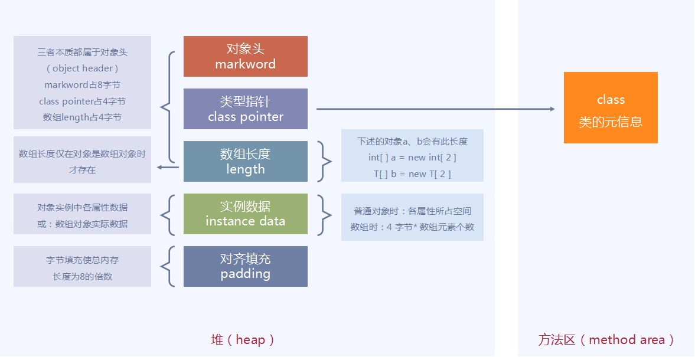

    当线程访问同步块时首先需要获得锁并把相关信息存储在对象头中。所以wait、notify、notifyAll这些方法被设计在Object中。Hotspot 有两种对象头：
    - 数组类型，使用 arrayOopDesc 来描述对象头
    - 其它，使用 instanceOopDesc 来描述对象头
    
    对象头由两部分组成：
    - Mark Word：存储自身的运行时数据，例如 HashCode、GC 年龄、锁相关信息等内容。
    - Klass Pointer：类型指针指向它的类元数据的指针，虚拟机通过这个指针来确定这个对象是哪个类的实例。
    
    64 位虚拟机 Mark Word 是 64bit 其结构如下：

    

    ### 偏向锁
    当线程访问同步块并获取锁时处理流程如下：
    1. 检查 mark word 的线程 id 。
    2. 如果为空则设置 CAS 替换当前线程 id。如果替换成功则获取锁成功，如果失败则撤销偏向锁。
    3. 如果不为空则检查 线程 id为是否为本线程。如果是则获取锁成功，如果失败则撤销偏向锁。
    
    持有偏向锁的线程以后每次进入这个锁相关的同步块时，只需比对一下 mark word 的线程 id 是否为本线程，如果是则获取锁成功。如果发生线程竞争发生 2、3 步失败的情况则需要撤销偏向锁。需要注意的是偏向锁只有遇到其他线程尝试竞争偏向锁时，持有偏向锁的线程才会释放锁，线程不会主动释放偏向锁。偏向锁的撤销，需要等待全局安全点（在这个时间点上没有字节码正在执行），它会首先暂停拥有偏向锁的线程，判断锁对象是否处于被锁定状态。撤销偏向锁后恢复到无锁（标志位为“01”）或轻量级锁（标志位为“00”）的状态。

    优点：只有一个线程执行同步块时进一步提高性能，适用于一个线程反复获得同一锁的情况。偏向锁可以提高带有同步但无竞争的程序性能。
    缺点：如果存在竞争会带来额外的锁撤销操作。

    ### 轻量级锁
    当锁是偏向锁的时候，被另外的线程所访问，偏向锁就会升级为轻量级锁，其他线程会通过自旋的形式尝试获取锁，不会阻塞，从而提高性能。
    加锁
    多个线程竞争偏向锁导致偏向锁升级为轻量级锁
    1. JVM 在当前线程的栈帧中创建 Lock Reocrd，并将对象头中的 Mark Word 复制到 Lock Reocrd 中。（Displaced Mark Word）
    2. 线程尝试使用 CAS 将对象头中的 Mark Word 替换为指向 Lock Reocrd 的指针。如果成功则获得锁，如果失败则先检查对象的 Mark Word 是否指向当前线程的栈帧如果是则说明已经获取锁，否则说明其它线程竞争锁则膨胀为重量级锁。

    解锁
    1. 使用 CAS 操作将 Mark Word 还原。
    2. 如果第 1 步执行成功则释放完成。
    3. 如果第 1 步执行失败则膨胀为重量级锁。

    若当前只有一个等待线程，则该线程通过自旋进行等待。但是当自旋超过一定的次数，或者一个线程在持有锁，一个在自旋，又有第三个来访时，轻量级锁升级为重量级锁。

    优点：其性能提升的依据是对于绝大部分的锁在整个生命周期内都是不会存在竞争。在多线程交替执行同步块的情况下，可以避免重量级锁引起的性能消耗。

    缺点：在有多线程竞争的情况下轻量级锁增加了额外开销。

    ### 自旋锁
    自旋是一种获取锁的机制并不是一个锁状态。在膨胀为重量级锁的过程中或重入时会多次尝试自旋获取锁以避免线程唤醒的开销，但是它会占用 CPU 的时间因此如果同步代码块执行时间很短自旋等待的效果就很好，反之则浪费了 CPU 资源。默认情况下自旋次数是 10 次用户可以使用参数 -XX : PreBlockSpin 来更改。

    JDK 6 引入了自适应自旋锁，意味着自旋的次数不在固定，而是由前一次在同一个锁上的自旋时间及锁的拥有者的状态来决定。如果对于某个锁很少自旋成功那么以后有可能省略掉自旋过程以避免资源浪费。有了自适应自旋随着程序运行和性能监控信息的不断完善，虚拟机对程序锁的状况预测就会越来越准确，虛拟机就会变得越来越“聪明”了。

    优点：竞争的线程不会阻塞挂起，提高了程序响应速度。避免重量级锁引起的性能消耗。

    缺点：如果线程始终无法获取锁，自旋消耗 CPU 最终会膨胀为重量级锁。

    ### 重量级锁
    在重量级锁中没有竞争到锁的对象会 park 被挂起，退出同步块时 unpark 唤醒后续线程。唤醒操作涉及到操作系统调度会有额外的开销。

    </details> 
  
  - <details><summary>Java内存模型</summary>

    在并发编程中，我们需要处理两个关键问题：线程之间如何通信及线程之间如何同步（这里的线程是指并发执行的活动实体）。通信是指线程之间以何种机制来交换信息。在命令式编程中，线程之间的通信机制有两种：共享内存和消息传递。

    Java 的并发采用的是共享内存模型，Java 线程之间的通信总是隐式进行，整个通信过程对程序员完全透明。如果编写多线程程序的 Java 程序员不理解隐式进行的线程之间通信的工作机制，很可能会遇到各种奇怪的内存可见性问题。

    在 java 中，所有实例域、静态域和数组元素存储在堆内存中，堆内存在线程之间共享（本文使用“共享变量”这个术语代指实例域，静态域和数组元素）。局部变量（Local variables），方法定义参数（java 语言规范称之为 formal method parameters）和异常处理器参数（exception handler parameters）不会在线程之间共享，它们不会有内存可见性问题，也不受内存模型的影响。 
    
    Java 线程之间的通信由 Java 内存模型（本文简称为 JMM）控制，JMM 决定一个线程对共享变量的写入何时对另一个线程可见。从抽象的角度来看，JMM 定义了线程和主内存之间的抽象关系：线程之间的共享变量存储在主内存（main memory）中，每个线程都有一个私有的本地内存（local memory），本地内存中存储了该线程以读 / 写共享变量的副本。本地内存是 JMM 的一个抽象概念，并不真实存在。它涵盖了缓存，写缓冲区，寄存器以及其他的硬件和编译器优化。Java 内存模型的抽象示意图如下：

    

    从上图来看，线程 A 与线程 B 之间如要通信的话，必须要经历下面 2 个步骤： 
    - 首先，线程 A 把本地内存 A 中更新过的共享变量刷新到主内存中去。 
    - 然后，线程 B 到主内存中去读取线程 A 之前已更新过的共享变量。

    这两个步骤实质上是线程 A 在向线程 B 发送消息，而且这个通信过程必须要经过主内存。JMM 通过控制主内存与每个线程的本地内存之间的交互，来为 java 程序员提供内存可见性保证。

    ### 重排序
    在执行程序时为了提高性能，编译器和处理器常常会对指令做重排序。重排序分三种类型： 
    - 编译器优化的重排序。编译器在不改变单线程程序语义的前提下，可以重新安排语句的执行顺序。 
    - 指令级并行的重排序。现代处理器采用了指令级并行技术（Instruction-Level Parallelism， ILP）来将多条指令重叠执行。如果不存在数据依赖性，处理器可以改变语句对应机器指令的执行顺序。 
    - 内存系统的重排序。由于处理器使用缓存和读 / 写缓冲区，这使得加载和存储操作看上去可能是在乱序执行。

    这些重排序都可能会导致多线程程序出现内存可见性问题。对于编译器，JMM 的编译器重排序规则会禁止特定类型的编译器重排序（不是所有的编译器重排序都要禁止）。对于处理器重排序，JMM 的处理器重排序规则会要求 java 编译器在生成指令序列时，插入特定类型的内存屏障（memory barriers，intel 称之为 memory fence）指令，通过内存屏障指令来禁止特定类型的处理器重排序（不是所有的处理器重排序都要禁止）。JMM 属于语言级的内存模型，它确保在不同的编译器和不同的处理器平台之上，通过禁止特定类型的编译器重排序和处理器重排序，为程序员提供一致的内存可见性保证。

    #### 数据依赖性
    如果两个操作访问同一个变量，且这两个操作中有一个为写操作，此时这两个操作之间就存在数据依赖性。数据依赖分下列三种类型：
    | 名称 | 代码示例   | 说明 |
    | ----- | --------- | ----------- | 
    | 写后读 | a = 1;b = a; | 写一个变量之后，再读这个位置。 |  
    | 写后写  | a = 1;a = 2; | 写一个变量之后，再写这个变量。 |      
    | 读后写  | a = b;b = 1; | 读一个变量之后，再写这个变量。 |      

    上面三种情况，只要重排序两个操作的执行顺序，程序的执行结果将会被改变。编译器和处理器可能会对操作做重排序。编译器和处理器在重排序时，会遵守数据依赖性，不会改变存在数据依赖关系的两个操作的执行顺序。

    注意，这里所说的数据依赖性仅针对单个处理器中执行的指令序列和单个线程中执行的操作，不同处理器之间和不同线程之间的数据依赖性不被编译器和处理器考虑。

    #### as-if-serial 语义
    as-if-serial 语义的意思指：不管怎么重排序（编译器和处理器为了提高并行度），（单线程）程序的执行结果不能被改变。编译器，runtime 和处理器都必须遵守 as-if-serial 语义。

    为了遵守 as-if-serial 语义，编译器和处理器不会对存在数据依赖关系的操作做重排序，因为这种重排序会改变执行结果。但是，如果操作之间不存在数据依赖关系，这些操作可能被编译器和处理器重排序。为了具体说明，请看下面计算圆面积的代码示例：
    ```
    double pi  = 3.14;    //A
    double r   = 1.0;     //B
    double area = pi * r * r; //C
    ```
    A 和 C 之间存在数据依赖关系，同时 B 和 C 之间也存在数据依赖关系。因此在最终执行的指令序列中，C 不能被重排序到 A 和 B 的前面（C 排到 A 和 B 的前面，程序的结果将会被改变）。但 A 和 B 之间没有数据依赖关系，编译器和处理器可以重排序 A 和 B 之间的执行顺序。

    as-if-serial 语义把单线程程序保护了起来，遵守 as-if-serial 语义的编译器，runtime 和处理器共同为编写单线程程序的程序员创建了一个幻觉：单线程程序是按程序的顺序来执行的。as-if-serial 语义使单线程程序员无需担心重排序会干扰他们，也无需担心内存可见性问题。 

    #### 重排序对多线程的影响
    请看下面的示例代码：
    ```
    class ReorderExample {
        int a = 0;
        boolean flag = false;

        public void writer() {
            a = 1;                   //1
            flag = true;             //2
        }

        Public void reader() {
            if (flag) {                //3
                int i =  a * a;        //4
                ……
            }
        }
    }
    ```
    flag 变量是个标记，用来标识变量 a 是否已被写入。这里假设有两个线程 A 和 B，A 首先执行 writer() 方法，随后 B 线程接着执行 reader() 方法。线程 B 在执行操作 4 时，能否看到线程 A 在操作 1 对共享变量 a 的写入? 答案是：不一定能看到。

    由于操作 1 和操作 2 没有数据依赖关系，编译器和处理器可以对这两个操作重排序；同样，操作 3 和操作 4 没有数据依赖关系，编译器和处理器也可以对这两个操作重排序。当操作 1 和操作 2 重排序时，可能会产生什么效果？
    
    假设操作 1 和操作 2 做了重排序。程序执行时，线程 A 首先写标记变量 flag，随后线程 B 读这个变量。由于条件判断为真，线程 B 将读取变量 a。此时，变量 a 还根本没有被线程 A 写入，在这里多线程程序的语义被重排序破坏了。

    当操作 3 和操作 4 重排序时会产生什么效果？操作 3 和操作 4 不存在数据依赖关系，但存在**控制依赖关系**。当代码中存在控制依赖性时，会影响指令序列执行的并行度。为此，编译器和处理器会采用猜测（Speculation）执行来克服控制相关性对并行度的影响。以处理器的猜测执行为例，执行线程 B 的处理器可以提前读取并计算 a*a，然后把计算结果临时保存到一个名为重排序缓冲（reorder buffer ROB）的硬件缓存中。当接下来操作 3 的条件判断为真时，就把该计算结果写入变量 i 中。 从图中我们可以看出，猜测执行实质上对操作 3 和 4 做了重排序。重排序在这里破坏了多线程程序的语义。在单线程程序中，对存在控制依赖的操作重排序，不会改变执行结果（这也是 as-if-serial 语义允许对存在控制依赖的操作做重排序的原因）；但在多线程程序中，对存在控制依赖的操作重排序，可能会改变程序的执行结果。 

    ### 处理器重排序与内存屏障指令
    现代的处理器使用写缓冲区来临时保存向内存写入的数据。写缓冲区可以保证指令流水线持续运行，它可以避免由于处理器停顿下来等待向内存写入数据而产生的延迟。同时，通过以批处理的方式刷新写缓冲区，以及合并写缓冲区中对同一内存地址的多次写，可以减少对内存总线的占用。虽然写缓冲区有这么多好处，但每个处理器上的写缓冲区，仅仅对它所在的处理器可见。这个特性会对内存操作的执行顺序产生重要的影响：处理器对内存的读 / 写操作的执行顺序，不一定与内存实际发生的读 / 写操作顺序一致！为了具体说明，请看下面示例：
    ```
    // Processor A
    a = 1; //A1  
    x = b; //A2

    // Processor B
    b = 2; //B1  
    y = a; //B2

    // 初始状态：a = b = 0；处理器允许执行后得到结果：x = y = 0
    ```
    假设处理器 A 和处理器 B 按程序的顺序并行执行内存访问，最终却可能得到 x = y = 0 的结果。具体的原因如下图所示：

    

    这里处理器 A 和处理器 B 可以同时把共享变量写入自己的写缓冲区（A1，B1），然后从内存中读取另一个共享变量（A2，B2），最后才把自己写缓存区中保存的脏数据刷新到内存中（A3，B3）。当以这种时序执行时，程序就可以得到 x = y = 0 的结果。

    从内存操作实际发生的顺序来看，直到处理器 A 执行 A3 来刷新自己的写缓存区，写操作 A1 才算真正执行了。虽然处理器 A 执行内存操作的顺序为：A1->A2，但内存操作实际发生的顺序却是：A2->A1。此时，处理器 A 的内存操作顺序被重排序了。

    为了保证内存可见性，java 编译器在生成指令序列的适当位置会插入内存屏障指令来禁止特定类型的处理器重排序。JMM 把内存屏障指令分为下列四类：
    | 屏障类型 | 指令示例   | 说明 |
    | ----- | --------- | ----------- | 
    | LoadLoad Barriers | Load1; LoadLoad; Load2 |   确保 Load1 数据的装载，之前于 Load2 及所有后续装载指令的装载。    |  
    | StoreStore Barriers  | Store1; StoreStore; Store2     | 确保 Store1 数据对其他处理器可见（刷新到内存），之前于 Store2 及所有后续存储指令的存储。    |      
    | LoadStore Barriers  | Load1; LoadStore; Store2     | 确保 Load1 数据装载，之前于 Store2 及所有后续的存储指令刷新到内存。   |      
    | StoreLoad Barriers  | Store1; StoreLoad; Load2     | 确保 Store1 数据对其他处理器变得可见（指刷新到内存），之前于 Load2 及所有后续装载指令的装载。 |      

    StoreLoad Barriers 会使该屏障之前的所有内存访问指令（存储和装载指令）完成之后，才执行该屏障之后的内存访问指令。 StoreLoad Barriers 是一个“全能型”的屏障，它同时具有其他三个屏障的效果。现代的多处理器大都支持该屏障（其他类型的屏障不一定被所有处理器支持）。执行该屏障开销会很昂贵，因为当前处理器通常要把写缓冲区中的数据全部刷新到内存中（buffer fully flush）。 ¶

    ### happens-before

    JSR-133 提出了 happens-before 的概念，通过这个概念来阐述操作之间的内存可见性。如果一个操作执行的结果需要对另一个操作可见，那么这两个操作之间必须存在 happens-before 关系。这里提到的两个操作既可以是在一个线程之内，也可以是在不同线程之间。 与程序员密切相关的 happens-before 规则如下：
    - 程序顺序规则：一个线程中的每个操作，happens- before 于该线程中的任意后续操作。 
    - 监视器锁规则：对一个监视器锁的解锁，happens- before 于随后对这个监视器锁的加锁。 
    - volatile 变量规则：对一个 volatile 域的写，happens- before 于任意后续对这个 volatile 域的读。 
    - 传递性：如果 A happens- before B，且 B happens- before C，那么 A happens- before C。

    一个 happens-before 规则通常对应于多个编译器重排序规则和处理器重排序规则。对于 java 程序员来说，happens-before 规则简单易懂，它避免程序员为了理解 JMM 提供的内存可见性保证而去学习复杂的重排序规则以及这些规则的具体实现。

    ### 顺序一致性
    顺序一致性内存模型是一个被计算机科学家理想化了的理论参考模型，它为程序员提供了极强的内存可见性保证。顺序一致性内存模型有两大特性：
    - 一个线程中的所有操作必须按照程序的顺序来执行。 
    - （不管程序是否同步）所有线程都只能看到一个单一的操作执行顺序。在顺序一致性内存模型中，每个操作都必须原子执行且立刻对所有线程可见。

    JMM 对正确同步的多线程程序的内存一致性做了如下保证：
    - 如果程序是正确同步的，程序的执行将具有顺序一致性（sequentially consistent）-- 即程序的执行结果与该程序在顺序一致性内存模型中的执行结果相同。这里的同步是指广义上的同步，包括对常用同步原语（lock，volatile 和 final）的正确使用。

    下面看看正确同步的程序如何具有顺序一致性：
    ```
    class SynchronizedExample {
        int a = 0;
        boolean flag = false;

        public synchronized void writer() {
            a = 1;
            flag = true;
        }

        public synchronized void reader() {
            if (flag) {
                int i = a;
                ……
            }
        }
    }
    ```
    上面示例代码中，假设 A 线程执行 writer() 方法后，B 线程执行 reader() 方法。这是一个正确同步的多线程程序。根据 JMM 规范，该程序的执行结果将与该程序在顺序一致性模型中的执行结果相同。下面是该程序在两个内存模型中的执行时序对比图：
    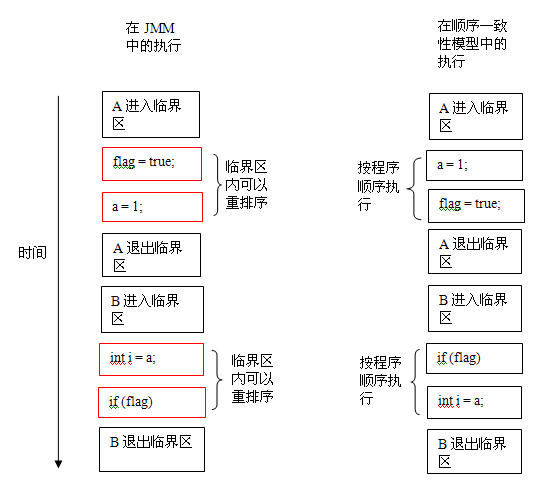

    在顺序一致性模型中，所有操作完全按程序的顺序串行执行。而在 JMM 中，临界区内的代码可以重排序（但 JMM 不允许临界区内的代码“逸出”到临界区之外，那样会破坏监视器的语义）。JMM 会在退出监视器和进入监视器这两个关键时间点做一些特别处理，使得线程在这两个时间点具有与顺序一致性模型相同的内存视图。虽然线程 A 在临界区内做了重排序，但由于监视器的互斥执行的特性，这里的线程 B 根本无法“观察”到线程 A 在临界区内的重排序。这种重排序既提高了执行效率，又没有改变程序的执行结果。

    #### 未同步程序的执行特性
    对于未同步或未正确同步的多线程程序，JMM 只提供最小安全性：线程执行时读取到的值，要么是之前某个线程写入的值，要么是默认值（0，null，false），JMM 保证线程读操作读取到的值不会无中生有（out of thin air）的冒出来。为了实现最小安全性，JVM 在堆上分配对象时，首先会清零内存空间，然后才会在上面分配对象（JVM 内部会同步这两个操作）。因此，在以清零的内存空间（pre-zeroed memory）分配对象时，域的默认初始化已经完成了。

    JMM 不保证未同步程序的执行结果与该程序在顺序一致性模型中的执行结果一致。因为未同步程序在顺序一致性模型中执行时，整体上是无序的，其执行结果无法预知。另外提一下，JMM 不保证对 64 位的 long 型和 double 型变量的读 / 写操作具有原子性。在一些 32 位的处理器上，如果要求对 64 位数据的读 / 写操作具有原子性，会有比较大的开销。为了照顾这种处理器，java 语言规范鼓励但不强求 JVM 对 64 位的 long 型变量和 double 型变量的读 / 写具有原子性。当 JVM 在这种处理器上运行时，会把一个 64 位 long/ double 型变量的读 / 写操作拆分为两个 32 位的读 / 写操作来执行。这两个 32 位的读 / 写操作可能会被分配到不同的总线事务中执行，此时对这个 64 位变量的读 / 写将不具有原子性。

    ### 总结
    越是追求性能的处理器，内存模型设计的会越弱。因为这些处理器希望内存模型对它们的束缚越少越好，这样它们就可以做尽可能多的优化来提高性能。 由于常见的处理器内存模型比 JMM 要弱，java 编译器在生成字节码时，会在执行指令序列的适当位置插入内存屏障来限制处理器的重排序。同时，由于各种处理器内存模型的强弱并不相同，为了在不同的处理器平台向程序员展示一个一致的内存模型，JMM 在不同的处理器中需要插入的内存屏障的数量和种类也不相同。下图展示了 JMM 在不同处理器内存模型中需要插入的内存屏障的示意图：

    

    如上图所示，JMM 屏蔽了不同处理器内存模型的差异，它在不同的处理器平台之上为 java 程序员呈现了一个一致的内存模型。

    #### JSR-133 对旧内存模型的修补
    JSR-133 对 JDK5 之前的旧内存模型的修补主要有两个：
    - 增强 volatile 的内存语义。旧内存模型允许 volatile 变量与普通变量重排序。JSR-133 严格限制 volatile 变量与普通变量的重排序，强制每次都直接读内存，阻止重排序，确保voltile类型的值一旦被写入缓存必定会被立即更新到主存。
    - 增强 final 的内存语义。在旧内存模型中，多次读取同一个 final 变量的值可能会不相同。为此，JSR-133 为 final 增加了两个重排序规则（https://blog.csdn.net/riemann_/article/details/96390511）：
      - 在构造函数内对一个 final 域的写入，与随后把这个被构造对象的引用赋值给一个引用变量，这两个操作之间不能重排序。
      - 初次读一个包含 final 域的对象的引用，与随后初次读这个 final 域，这两个操作之间不能重排序。

    以上摘自https://www.pdai.tech/md/java/jvm/java-jvm-jmm.html

    </details> 

  - <details><summary>ClassLoader</summary>

    - <details><summary>双亲委托机制</summary>

      Java中的类加载器大致可以分成两类，一类是系统提供的，另外一类则是由Java应用开发人员编写的。系统提供的类加载器主要有下面三个：
      1. 引导类加载器（bootstrap class loader）：它用来加载Java的核心库（<JAVA_HOME>\lib），是用原生代码来实现的，并不继承自java.lang.ClassLoader。
      2. 扩展类加载器（extensions class loader）：它用来加载Java的扩展库。Java虚拟机的实现会提供一个扩展库目录（<JAVA_HOME>\lib\ext），该类加载器在此目录里面查找并加载Java类。
      3. 系统类加载器（system class loader）：它根据Java应用的类路径（CLASSPATH）来加载Java类。一般来说，Java应用的类都是由它来完成加载的。可以通过ClassLoader.getSystemClassLoader()来获取它。
   
      除了系统提供的类加载器以外，开发人员可以通过继承java.lang.ClassLoader类的方式实现自己的类加载器，以满足一些特殊的需求。

      类加载器在尝试去查找某个类的字节代码并定义它时，会先代理给其父类加载器，由父类加载器先去尝试加载这个类，依次类推。类加载器还会影响类的唯一性，在判断两个类是否相同时，Java虚拟机不仅要看类的全名是否相同，还要看加载此类的类加载器是否一样，只有两者都相同的情况，才认为两个类是相同的。即便是同样的字节代码，被不同的类加载器加载之后所得到的类，也是不同的。

      双亲委托机制保证了Java核心库的类型安全。所有Java应用都至少需要引用java.lang.Object类，也就是说在运行的时候，java.lang.Object这个类需要被加载到Java虚拟机中。如果这个加载过程由Java应用自己的类加载器来完成的话，很可能就存在多个版本的java.lang.Object类，而且这些类之间是不兼容的。通过双亲委托机制，对于Java核心库的类的加载工作由引导类加载器来统一完成，保证了Java应用所使用的都是同一个版本的Java核心库的类，是互相兼容的。

      </details>

    - <details><summary>线程上下文类加载器</summary>

      Thread中的方法getContextClassLoader()和setContextClassLoader(ClassLoader cl)用来获取和设置线程的上下文类加载器。如果没有通过 setContextClassLoader(ClassLoader cl)方法进行设置的话，线程将继承其父线程的上下文类加载器。Java应用运行的初始线程的上下文类加载器是系统类加载器，在线程中运行的代码可以通过此类加载器来加载类和资源。

      线程上下文类加载器的意义：
      
      线程上下文类加载器存在的目的主要是为了解决双亲委托机制下存在的问题。假设有下述委派链：

      ClassLoader B -> ClassLoader A -> System class loader -> Extension class loader -> Bootstrap class loader

      那么委派链左边的ClassLoader B就可以很自然的使用右边的ClassLoader所加载的类。

      但如果情况要反过来，右边的ClassLoader需要委派链靠左边的ClassLoader加载的资源怎么办呢？由于双亲委托机制是单向的，所以没办法反过来从右边找左边。

      如果ClassLoader A想要获取ClassLoader B加载的资源，可以通过aThread.setContextClassLoader(ClassLoader B)将ClassLoader B设置到aThread，之后在ClassLoader A中使用同样的thread（或者由thread创建的线程）的getContextClassLoader()方法获取ClassLoader B。

      再具体一点的场景：

      Java提供了很多服务提供者接口（Service Provider Interface，SPI），允许第三方为这些接口提供实现。常见的SPI有JDBC、JCE、JNDI、JAXP 和JBI等。这些SPI的接口由Java核心库来提供，如JAXP的SPI接口定义包含在javax.xml.parsers包中。这些SPI的实现代码很可能是作为Java应用所依赖的jar包被包含进来，可以通过类路径（CLASSPATH）来找到，如实现了JAXP SPI的Apache Xerces所包含的jar包。SPI接口中的代码经常需要加载具体的实现类。如JAXP中的javax.xml.parsers.DocumentBuilderFactory类中的newInstance()方法用来生成一个新的DocumentBuilderFactory的实例。这里的实例的真正的类是继承自javax.xml.parsers.DocumentBuilderFactory，由SPI的实现所提供的。如在Apache Xerces中，实现的类是 org.apache.xerces.jaxp.DocumentBuilderFactoryImpl。而问题在于，SPI的接口是Java核心库的一部分，是由引导类加载器来加载的；SPI的实现类一般是由系统类加载器来加载的。引导类加载器是无法找到SPI的实现类的，因为它只加载Java的核心库，类加载器的双亲委托机制无法解决这个问题。

      线程上下文类加载器正好解决了这个问题。如果不做任何的设置，Java应用的线程的上下文类加载器默认就是系统上下文类加载器。在SPI接口的代码中使用线程上下文类加载器，就可以成功的加载到SPI实现的类，线程上下文类加载器在很多SPI的实现中都会用到。

      </details>

    </details>
  
  - <details><summary>反射的实现原理</summary>
    
    一个反射的例子：
    ```java
    Method method = Demo.class.getDeclaredMethod("test");
    method.invoke(new Demo());
    ```

    反射过程中首先调用的`Demo.class.getDeclaredMethod("test")`语句逻辑是，从`Class`对象的缓存中获取数据（`ReflectionData`对象，该对象代表`Class`对象对应的类的信息，如声明的属性、方法、构造函数等），如果没有则使用本地方法从JVM获取类的`Method`数组并保存在缓存再返回需要的`Method`对象。在获取到`Method`对象后，执行的`invoke()`方法本质上就是通过本地方法实现反射调用，如果调用次数超过了15次或者`ReflectionFactory`类的`noInflation`为true，则使用asm字节码动态加载技术生成一个类，通过该类实现直接的对象方法调用（就像`new Demo().test()`一样），而不通过本地方法，提交反射的效率。

    源码分析：[反射的实现原理（未分析JVM内部的实现，只是JDK中的代码）](Java/Java源码阅读/反射包/反射的实现原理.md)

    </details> 
  
  - <details><summary>异常</summary>

    - <details><summary>StackOverflowError</summary>

      Java在每个方法调用时都会在调用栈上分配一个栈帧，这个栈帧包含引用方法的参数和方法的返回地址。如果没有一个新的栈帧所需空间，JVM就会抛出StackOverflowError，最常见的例子就是递归调用：
      ```java
      public class StackOverflowErrorExample {
          public static void recursivePrint(int num) {
              System.out.println("Number: " + num);

              if(num == 0)
                  return;
              else
                  recursivePrint(++num);
          }
        
          public static void main(String[] args) {
              StackOverflowErrorExample.recursivePrint(1);
          }
      }
      ```

      还可以通过两个对象的方法互动调用来产生StackOverflowError，StackOverflowError的根本原因是栈的深度不够了，可以通过设置-Xss选项设置栈的最大大小

      </details>

    - <details><summary>OutOfMemoryError</summary>

      ### 堆内存
      最常见的就是堆内存溢出导致OutOfMemoryError（OOM），如下：
      ```java
      import java.util.List;
      import java.util.ArrayList;

      /**
      * VM Args：-Xms20m -Xmx20m -XX:+HeapDumpOnOutOfMemoryError
      */
      public class HeapOOM {
          public static void main(String[] args) {
              List<OOMObject> list = new ArrayList<OOMObject>();
              while(true) {
                  // list保留引用，避免Full GC 回收 
                  list.add(new OOMObject());
              }
          }

          static class OOMObject {
          }
      }

      /*
      java.lang.OutOfMemoryError: Java heap space
      Dumping heap to java_pid7768.hprof ...
      Heap dump file created [27987840 bytes in 0.142 secs]
      */
      ```

      通过-Xms和-Xmx选项设置堆的初识大小和最大大小，再不断申请对象并不释放引用就能导致堆内存溢出

      ### 方法区
      JDK8将方法区放到了直接内存中，对应的-XX:PermSize和XX:MaxPermSize选项也被移除了，其内存大小只受系统实际可用内存限制

      ### 直接内存
      Java虚拟机可以通过参数-XX:MaxDirectMemorySize设定直接内存可用大小，如果不指定，则默认与java堆内存大小相同，当无法申请到足够的直接内存时，也会导致OOM，如下：
      ```java
      public class DirectMemoryOOM {
          private static final int _1MB = 1024 * 1024 * 1024;

          public static void main(String[] args) throws Exception {
              Field unsafeField = Unsafe.class.getDeclaredFields()[0];
              unsafeField.setAccessible(true);
              Unsafe unsafe = (Unsafe) unsafeField.get(null);

              while (true) {
                  unsafe.allocateMemory(_1MB);
              }
          }
      }

      /*
      输出：
      Exception in thread "main" java.lang.OutOfMemoryError
      at sun.misc.Unsafe.allocateMemory(Native Method)
      at com.dhf.app.DirectMemoryOOM.main(DirectMemoryOOM.java:18)
      */
      ```
      这种异常的明显特征是在Heap Dump文件中看不见明显的异常。如果OOM之后Dump的文件比较小，程序中直接或间接用到了IO/NIO，可以考虑是否是直接内存溢出

      </details>

    </details>

- JVM相关
  - 运行时区域
    - <details><summary>程序计数器</summary>

      程序计数器是一块较小的内存空间，它可以看作是当前线程所执行的字节码的方位指示器，字节码指示器工作时是通过改变计数器的值来选取下一条需要执行的字节码指令，分支，循环，跳转，异常处理，线程恢复等线程的基础功能都需要依赖这个程序计数器。且由于java虚拟机的多线程是通过多个线程轮流切换并分配处理器执行时间的方式来实现的，在某一时间，一个处理器只会处理一条线程，为了就是执行时间到了之后恢复到正确的执行位置，每个线程都有独立的程序计数器，各线程间运行互不影响，独立存储，我们称之为线程独有的内存，这也是唯一不会OOM的区域。

      </details>
      
    - <details><summary>虚拟机栈</summary>

      虚拟机栈也是线程独有的空间，他的生命周期与线程相同。虚拟机栈描述的是java方法执行的内存模型：即是每个方法执行的时候都会创建一个栈帧用于存储方法相关的数据，如局部变量表，操作数栈，动态链接，方法出口等方法的相关信息。每一个方法执行开始到结束的过程，都对应者一个栈帧在虚拟机栈中入栈到出栈的过程。局部变量里存储java的各种基本类型，对象引用以及返回类型。该区域可能有两种异常，如果线程请求的栈深度大于虚拟机所允许的深度（通过-Xss设置虚拟机栈的内存大小限制，这里说的栈深度，实际上就是栈内存大小的意思），则抛出StackOverflowError，另一个异常是OutOfMemoryError：虚拟机栈占用的是物理内存（由操作系统管理），而不是堆内存，当栈深底变大时会向操作系统申请物理内存，其上限就是可用物理内存的上限，如果物理内存没有足够的可用内存分配给虚拟机栈，则抛出OutOfMemoryError

      </details>

    - <details><summary>本地方法栈</summary>

      本地方法栈与虚拟机栈作用相似。只不过虚拟机栈执行的是java方法，而本地方法栈执行的是Native方法，即本地方法，他也是线程独有的。

      </details>
      
    - <details><summary>堆</summary>

      堆是虚拟机中内存最大的一块，且是所有线程共享的区域，里面只存储对象实例，几乎所有的对象都是在该区域分配对象实例内存。该区域为每一个线程都创建了分配缓冲区（Thread Local Allocation Buffer，TLAB），多线程的情况下在堆中申请内存是不安全的，所以每个线程都单独分配一个内存块，线程申请内存时在自己的空间上分配，这样就不存在竞争的情况，TLAB用满，就新申请一个TLAB（利用cas申请）。配置java堆的大小命令由-Xmx（最大堆大小）和-Xms（初始堆大小）控制

      </details>

    - <details><summary>方法区</summary>

      方法区和堆一样是线程共享的内存，保存的数据有：类信息，常量，静态变量（JDK6时，String等字符串常量的信息是置于方法区中的，但是到了JDK7时，已经移动到了Java堆），即时编译器编译后的数据等。

      当方法区无法满足内存分配需求时，将抛出OutOfMemoryError

      #### 类信息
      1. 类型全限定名
      2. 类型的直接超类的全限定名（除非这个类型是java.lang.Object，它没有超类）
      3. 类型是类类型还是接口类型
      4. 类型的访问修饰符（public、abstract或final的某个子集）
      5. 任何直接超接口的全限定名的有序列表
      6. 类型的常量池
      7. 字段信息
      8. 方法信息
      9. 除了常量以外的所有类（静态）变量
      10. 一个到类ClassLoader的引用
      11. 一个到Class类的引用

      JDK8使用元空间替代方法区，元空间存储在物理内存，而不是堆中，类的元信息放在物理内存，字符串池和类的静态变量放在Java堆中，这么做减少了方法区出现内存溢出的可能性，元空间大小受物理内存及-XX:MaxMetaspaceSize选项（元空间最大大小）限制

      </details>

    - <details><summary>运行时常量池</summary>

      运行时常量池也是方法区的一部分，在class文件中有一项信息就是常量池表，里面存放编译器生成的 字面量(Literal)和符号引用(Symbolic References)，这部分内容在class文件被加载入内存后，存储在运行时常量池中；除此之外，常量池表中的符号引用被翻译成直接引用后也会存储于此，因为每一个类都有常量池表，所以每一个类型被加载入内存后，都有自己对应的运行时常量池。运行时常量池是在方法区(1.8之后跟随方法区一起移动到元空间), 可以在JVM运行期间动态向常量池写入数据。

      字面量：
      - 文本字符串
      - 基本类型的值
      - final 常量等

      符号引用:
      - 类和接口的全限定名
      - 字段的名称和描述
      - 方法的名称和描述

      字符串常量池：JVM为了提升性能和减少内存开销，避免字符串的重复创建，其维护了一块特殊的内存空间，储存不重复的字符串，字符串常量存在于堆中。

      </details>

    - <details><summary>直接内存</summary>

      NIO的Buffer提供了一个可以不经过JVM内存直接访问系统物理内存的类：DirectBuffer。DirectBuffer类继承自ByteBuffer，但和普通的ByteBuffer不同，普通的ByteBuffer仍在JVM堆上分配内存，其最大内存受到最大堆内存的限制；而DirectBuffer直接分配在物理内存中，并不占用堆空间，其可申请的最大内存受操作系统限制

      因此直接内存使用于需要大内存空间且频繁访问的场合，不适用于频繁申请释放内存的场合

      </details>

  - 垃圾回收算法
    - <details><summary>标记-清除</summary>

      #### 介绍
      算法分为“标记”和“清除“两个阶段：首先标记出所有需要回收的对象，在标记完成后统一回收所有被标记的对象。它的主要不足有两个：一个是效率问题，标记和清除两个过程的效率都不高；另一个是空间问题，标记清除之后会产生大量不连续的内存碎片，空间碎片太多可能会导致以后在程序运行过程中需要分配较大对象时，无法找到足够的连续内存而不得不提前触发另一次垃圾收集动作。 

      
    </details>

    - <details><summary>复制</summary>

      #### 介绍
      它将可用内存按容量划分为大小相等的两块，每次只使用其中的一块。当这一块的内存用完了，就将还存活着的对象复制到另外一块上面，然后再把已使用过的内存空间一次清理掉。这样使得每次都是对整个半区进行内存回收，内存分配时也就不用考虑内存碎片等复杂情况，只要移动堆顶指针，按顺序分配内存即可，实现简单，运行高效。只是这种算法的代价是将内存缩小为了原来的一半。 

      现在的商业虚拟机都采用这种收集算法来回收新生代，IBM公司的专门研究表明，新生代中的对象98%是“朝生夕死”的，所以并不需要按照1:1的比例来划分内存空间，而是将内存分为一块较大的Eden空间和两块较小的Survivor空间，每次使用Eden和其中一块Survivor。当回收时，将Eden和Survivor中还存活着的对象一次性地复制到另外一块Survivor空间上，最后清理掉Eden和刚才用过的Survivor空间。HotSpot虚拟机默认Eden和Survivor的大小比例是8:1，也就是每次新生代中可用内存空间为整个新生代容量的90%（80%+10%），只有10%的内存会被“浪费”。当然，98%的对象可回收只是一般场景下的数据，没有办法保证每次回收都只有不多于10%的对象存活，当Survivor空间不够用时，需要依赖其他内存（这里指老年代）进行分配担保（HandlePromotion）。如果另外一块Survivor空间没有足够空间存放上一次新生代收集下来的存活对象时，这些对象将直接通过分配担保机制进入老年代。

      
    </details>

    - <details><summary>标记-整理</summary>

      #### 介绍
      标记过程仍然与“标记-清除”算法一样，但后续步骤不是直接对可回收对象进行清理，而是让所有存活的对象都向一端移动，然后直接清理掉端边界以外的内存。 

      
    </details>

  - 安全点（SafePoint）
    - <details><summary>介绍</summary>

      程序并不是在所有的位置上都可以进行GC的，只有在达到这样的安全点才能暂停下来进行GC。
      一般会在如下几个位置选择安全点：
      - 循环的末尾 
      - 方法临返回前 / 调用方法的call指令后 
      - 可能抛异常的位置

      另外一个问题就是GC前需要让线程在安全点停下来，有两种方案：
      - 抢断式中断
      抢断式中断就是在GC的时候，让所有的线程都中断，如果这些线程中发现中断地方不在安全点上的，就恢复线程，让他们重新跑起来，直到跑到安全点上（现在几乎没有虚拟机采用这种方式）

      - 主动式中断
      主动式中断在GC的时候，不会主动去中断线程，仅仅是设置一个标志，当线程运行到安全点时就去轮训该位置，发现该位置被设置为真时就自己中断挂起。另外创建对象需要分配内存的地方也需要轮询该位置。
      安全点的使用似乎解决了OopMap计算的效率的问题，但是这里还有一个问题。安全点需要程序自己跑过去，那么对于那些已经停在路边休息或者看风景的程序（比如那些处在Sleep或者Blocked状态的线程），他们可能并不会在很短的时间内跑到安全点去。所以这里为了解决这个问题，又引入了安全区域的概念
        
      ### 安全区域（Safe Region）
      在程序的一段代码片段中并不会导致引用关系发生变化，也就不用去更新OopMap表了，那么在这段代码区域内任何地方进行GC都是没有问题的。这段区域就称之为安全区域。线程执行的过程中，如果进入到安全区域内，就会标志自己已经进行到安全区域了。那么虚拟机要进行GC的时候，发现该线程已经运行到安全区域，就不会管该线程的死活了。所以，该线程在脱离安全区域的时候，要自己检查系统是否已经完成了GC或者根节点枚举（这个跟GC的算法有关系），如果完成了就继续执行，如果未完成，它就必须等待收到可以安全离开安全区域的信号为止。

      </details>

  - 垃圾回收器
    - <details><summary>垃圾回收器之间的搭配</summary>

      下面展示了7种作用于不同分代的收集器，如果两个收集器之间存在连线，就说明它们可以搭配使用。虚拟机所处的区域，则表示它是属于新生代收集器还是老年代收集器。

      
      </details>

    - <details><summary>垃圾回收器</summary>
        
      - <details><summary>Serial收集器</summary>

        Serial收集器是最基本、发展历史最悠久的收集器，曾经（在JDK1.3.1之前）是虚拟机新生代收集的唯一选择。这个收集器是一个单线程的收集器，但它的“单线程”的意义并不仅仅说明它只会使用一个CPU或一条收集线程去完成垃圾收集工作，更重要的是在它进行垃圾收集时，必须暂停其他所有的工作线程，直到它收集结束。"Stop The World"这个名字也许听起来很酷，但这项工作实际上是由虚拟机在后台自动发起和自动完成的，在用户不可见的情况下把用户正常工作的线程全部停掉，这对很多应用来说都是难以接受的。

        虽然Serial收集器看上去很原始，但是Serial收集器是虚拟机运行在Client模式下的默认新生代收集器。它也有着优于其他收集器的地方：简单而高效（与其他收集器的单线程比），对于限定单个CPU的环境来说，Serial收集器由于没有线程交互的开销，专心做垃圾收集自然可以获得最高的单线程收集效率。在用户的桌面应用场景中，分配给虚拟机管理的内存一般来说不会很大，收集几十兆甚至一两百兆的新生代（仅仅是新生代使用的内存，桌面应用基本上不会再大了），停顿时间完全可以控制在几十毫秒最多一百多毫秒以内，只要不是频繁发生，这点停顿是可以接受的。所以，Serial收集器对于运行在Client模式下的虚拟机来说是一个很好的选择。

        新生代使用复制算法，老年代使用标记-整理算法

        
        </details>

      - <details><summary>ParNew收集器</summary>

        ParNew收集器其实就是Serial收集器的多线程版本（默认开启的收集线程数与CPU的数量相同，可以使用-XX:ParallelGCThreads参数来限制垃圾收集的线程数），除了使用多条线程进行垃圾收集之外，其余行为包括Serial收集器可用的所有控制参数（例如：-XX:SurvivorRatio、-XX:PretenureSizeThreshold、-XX:HandlePromotionFailure等）、收集算法、StopTheWorld、对象分配规则、回收策略等都与Serial收集器完全一样，它是许多运行在Server模式下的虚拟机中首选的新生代收集器，其中有一个与性能无关但很重要的原因是，除了Serial收集器外，目前只有它能与CMS收集器（老年代收集器，也是第一款真正意义上并发的收集器）配合工作。在JDK1.5中使用CMS来收集老年代的时候，新生代只能选择ParNew或者Serial收集器中的一个。

        ParNew收集器是并行的，但不是并发的，也就是说ParNew收集器GC时是多线程的，但是用户线程是暂停运行的

        新生代使用复制算法，老年代使用标记-整理算法

        
        </details>

      - <details><summary>Parallel Scavenge收集器</summary>

        Parallel Scavenge收集器是一个新生代收集器，它也是使用复制算法的收集器，又是并行的多线程收集器，Parallel Scavenge收集器不同之处在于，CMS等收集器的关注点是尽可能地缩短垃圾收集时用户线程的停顿时间，而Parallel Scavenge收集器的目标则是达到一个可控制的吞吐量（Throughput）。所谓吞吐量就是CPU用于运行用户代码的时间与CPU总消耗时间的比值，即吞吐量=运行用户代码时间/（运行用户代码时间+垃圾收集时间），虚拟机总共运行了100分钟，其中垃圾收集花掉1分钟，那吞吐量就是99%。

        Parallel Scavenge收集器提供了两个参数用于精确控制吞吐量，分别是控制最大垃圾收集停顿时间的-XX:MaxGCPauseMillis参数以及直接设置吞吐量大小的-XX:GCTimeRatio参数。

        MaxGCPauseMillis参数允许的值是一个大于0的毫秒数，收集器将尽可能地保证内存回收花费的时间不超过设定值。把这个参数的值设置得稍小一点就能使得系统的垃圾收集速度变得更快，GC停顿时间缩短是以牺牲吞吐量和新生代空间来换取的：系统把新生代调小一些，收集300MB新生代肯定比收集500MB快吧。

        GCTimeRatio参数的值应当是一个大于0且小于100的整数，也就是垃圾收集时间占总时间的比率，相当于是吞吐量的倒数。如果把此参数设置为19，那允许的最大GC时间就占总时间的5%（即1/（1+19）），默认值为99，就是允许最大1%（即1/（1+99））的垃圾收集时间。

        除上述两个参数之外，Parallel Scavenge收集器还有一个参数-XX:+UseAdaptiveSizePolicy值得关注。这是一个开关参数，当这个参数打开之后，就不需要手工指定新生代的大小（-Xmn）、Eden与Survivor区的比例（-XX:SurvivorRatio）、晋升老年代对象年龄（-XX:PretenureSizeThreshold）等细节参数了，虚拟机会根据当前系统的运行情况收集性能监控信息，动态调整这些参数以提供最合适的停顿时间或者最大的吞吐量，这种调节方式称为GC自适应的调节策略（GCErgonomics），手工优化存在困难的时候，使用Parallel Scavenge收集器配合自适应调节策略，把内存管理的调优任务交给虚拟机去完成将是一个不错的选择。只需要把基本的内存数据设置好（如-Xmx设置最大堆），然后使用MaxGCPauseMillis参数（更关注最大停顿时间）或GCTimeRatio（更关注吞吐量）参数给虚拟机设立一个优化目标，那具体细节参数的调节工作就由虚拟机完成了。

        新生代复制算法
        </details>

      - <details><summary>Serial Old收集器</summary>

        Serial Old是Serial收集器的老年代版本，它同样是一个单线程收集器，使用“标记-整理”算法。这个收集器的主要意义也是在于给Client模式下的虚拟机使用。如果在Server模式下，那么它主要还有两大用途：一种用途是在JDK1.5以及之前的版本中与ParallelScavenge收集器搭配使用，另一种用途就是作为CMS收集器和G1收集器的后备预案，在并发收集发生ConcurrentModeFailure时使用。

        老年代标记-整理算法
        </details>

      - <details><summary>Parallel Old收集器</summary>

        Parallel Old是Parallel Scavenge收集器的老年代版本，使用多线程和“标记-整理”算法。这个收集器是在JDK1.6中才开始提供的，在此之前，新生代的Parallel Scavenge收集器一直处于比较尴尬的状态。原因是，如果新生代选择了Parallel Scavenge收集器，老年代除了Serial Old收集器外别无选择（Parallel Scavenge收集器无法与CMS收集器配合工作）。由于老年代Serial Old收集器在服务端应用性能上的“拖累”，使用了Parallel Scavenge收集器也未必能在整体应用上获得吞吐量最大化的效果，由于单线程的老年代收集中无法充分利用服务器多CPU的处理能力，在老年代很大而且硬件比较高级的环境中，这种组合的吞吐量甚至还不一定有ParNew加CMS的组合“给力”。直到Parallel Old收集器出现后，“吞吐量优先”收集器终于有了比较名副其实的应用组合，在注重吞吐量以及CPU资源敏感的场合，都可以优先考虑Parallel Scavenge加Parallel Old收集器。

        老年代标记-整理算法
        </details>

      - <details><summary>CMS收集器</summary>

        CMS（Concurrent Mark Sweep）收集器是一种以获取最短回收停顿时间为目标的收集器。从名字（包含"Mark Sweep"）上就可以看出，CMS收集器是基于“标记—清除”算法实现的，它的运作过程相对于前面几种收集器来说更复杂一些，整个过程分为4个步骤，包括：
        1. 初始标记（STW initial mark），在这个阶段，需要虚拟机停顿正在执行的任务，官方的叫法STW（Stop The Word）。这个过程从垃圾回收的”根对象”开始，只扫描到能够和”根对象”直接关联的对象，并作标记。所以这个过程虽然暂停了整个JVM，但是很快就完成了。
        2. 并发标记（Concurrent marking），这个阶段紧随初始标记阶段，在初始标记的基础上继续向下追溯标记。并发标记阶段，应用程序的线程和并发标记的线程并发执行，所以用户不会感受到停顿。
        3. 并发预清理（Concurrent precleaning），并发预清理阶段仍然是并发的。在这个阶段，虚拟机查找在执行并发标记阶段新进入老年代的对象（可能会有一些对象从新生代晋升到老年代， 或者有一些对象被分配到老年代）。通过重新扫描，减少下一个阶段”重新标记”的工作，因为下一个阶段会Stop The World。
        4. 重新标记（STW remark），这个阶段会暂停虚拟机，收集器线程扫描在CMS堆中剩余的对象。扫描从”跟对象”开始向下追溯，并处理对象关联。
        5. 并发清理（Concurrent sweeping），清理垃圾对象，这个阶段收集器线程和应用程序线程并发执行。
        6. 并发重置（Concurrent reset），这个阶段，重置CMS收集器的数据结构，等待下一次垃圾回收。

        CMS缺点：
        1. CMS回收器采用的基础算法是Mark-Sweep，这样就会有一个问题：经过CMS收集的堆会产生空间碎片，CMS回收器不再采用简单的指针指向一块可用堆空间来为下次对象分配使用。而是把一些未分配的空间汇总成一个列表，当JVM分配对象空间的时候，会搜索这个列表找到足够大的空间来hold住这个对象。
        2. 需要更多的CPU资源。为了让应用程序不停顿，CMS线程和应用程序线程并发执行，这样就需要有更多的CPU，单纯靠线程切换是不靠谱的。并且，重新标记阶段，为空保证STW快速完成，也要用到更多的甚至所有的CPU资源。当然，多核多CPU也是未来的趋势！
        3. 需要更大的堆空间。因为CMS标记阶段应用程序的线程还是在执行的，那么就会有堆空间继续分配的情况，为了保证在CMS回收完堆之前还有空间分配给正在运行的应用程序，必须预留一部分空间。也就是说，CMS不会在老年代满的时候才开始收集。相反，它会尝试更早的开始收集，已避免上面提到的情况：在回收完成之前，堆没有足够空间分配！默认当老年代使用68%（JDK6调整到了92%）的时候，CMS就开始行动了。 – XX:CMSInitiatingOccupancyFraction =n 来设置这个阀值。要是CMS运行期间预留的内存无法满足程序需要，就会出现一次"Concurrent Mode Failure"失败，这时虚拟机将启动后备预案：临时启用Serial Old收集器来重新进行老年代的垃圾收集，这样停顿时间就很长了。所以说参数-XX:CMSInitiatingOccupancyFraction设置得太高很容易导致大量"Concurrent Mode Failure"失败，性能反而降低。

        由于CMS采用标记-清除算法，所以会产生很多空间碎片，为了解决这个问题，CMS收集器提供了一个-XX:+UseCMSCompactAtFullCollection开关参数（默认就是开启的），用于在CMS收集器顶不住要进行Full GC时开启内存碎片的合并整理过程，内存整理的过程是无法并发的，空间碎片问题没有了，但停顿时间不得不变长。虚拟机设计者还提供了另外一个参数-XX:CMSFullGCsBeforeCompaction，这个参数是用于设置执行多少次不压缩的Full GC后，跟着来一次带压缩的（默认值为0，表示每次进入Full GC时都进行碎片整理）。

        假设你的堆小于4G，而你又希望分配更多的CPU资源给垃圾回收器以避免应用暂停，那么这就是你要选择的回收器，如果堆大于4G的话，应该使用G1回收器
           
        老年代标记-清除算法

        </details>

      - <details><summary>G1收集器</summary>

        为解决CMS算法产生空间碎片和其它一系列的问题缺陷，HotSpot提供了另外一种垃圾回收策略，G1（Garbage First）算法，通过参数-XX:+UseG1GC来启用，该算法在JDK 7u4版本被正式推出，

        G1垃圾收集算法主要应用在多CPU大内存的服务中，在满足高吞吐量的同时，尽可能的满足垃圾回收时的暂停时间，该设计主要针对如下应用场景：
        - 垃圾收集线程和应用线程并发执行，和CMS一样
        - 空闲内存压缩时避免冗长的暂停时间
        - 应用需要更多可预测的GC暂停时间
        - 不希望牺牲太多的吞吐性能
        - 不需要很大的Java堆 

        以往的垃圾回收算法，如CMS，使用的堆内存结构如下：

        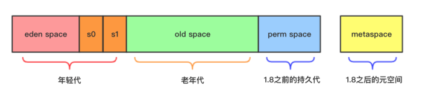

        1. 新生代：eden space + 2个survivor
        2. 老年代：old space
        3. 持久代：1.8之前的perm space
        4. 元空间：1.8之后的metaspace

        这些space必须是地址连续的空间
        在G1算法中，采用了另外一种完全不同的方式组织堆内存，堆内存被划分为多个大小相等的内存块（Region），每个Region是逻辑连续的一段内存，结构如下：

        

        每个Region被标记了E、S、O和H，说明每个Region在运行时都充当了一种角色，其中H是以往算法中没有的，它代表Humongous，这表示这些Region存储的是巨型对象（humongous object，H-obj），当新建对象大小超过Region大小一半时，直接在新的一个或多个连续Region中分配，并标记为H。

        堆内存中一个Region的大小可以通过-XX:G1HeapRegionSize参数指定，大小区间只能是1M、2M、4M、8M、16M和32M，总之是2的幂次方
        G1中提供了三种模式垃圾回收模式，young gc、mixed gc 和 full gc，在不同的条件下被触发：

        #### young gc
        发生在年轻代的GC算法，一般对象（除了巨型对象）都是在eden region中分配内存，当所有eden region被耗尽无法申请内存时，就会触发一次young gc，这种触发机制和之前的young gc差不多，执行完一次young gc，活跃对象会被拷贝到survivor region或者晋升到old region中，空闲的region会被放入空闲列表中，等待下次被使用

        |参数|含义|
        |-|-|
        |-XX:MaxGCPauseMillis|设置G1收集过程目标时间，默认值200ms|
        |-XX:G1NewSizePercent|新生代最小值，默认值5%|
        |-XX:G1MaxNewSizePercent|新生代最大值，默认值60%|
          
        #### mixed gc
        当越来越多的对象晋升到老年代old region时，为了避免堆内存被耗尽，虚拟机会触发一个混合的垃圾收集器，即mixed gc，该算法并不是一个old gc，除了回收整个young region，还会回收一部分的old region，这里需要注意：是一部分老年代，而不是全部老年代，可以选择哪些old region进行收集（G1会跟踪各个Region回收所需的空间大小和时间维护一个优先列表，在GC时先按列表优先顺序回收），从而可以对垃圾回收的耗时时间进行控制。那么mixed gc什么时候被触发？
        先回顾一下cms的触发机制，如果添加了以下参数：

        -XX:CMSInitiatingOccupancyFraction=80 -XX:+UseCMSInitiatingOccupancyOnly

        当老年代的使用率达到80%时，就会触发一次cms gc。相对的，mixed gc中也有一个阈值参数 -XX:InitiatingHeapOccupancyPercent，当老年代大小占整个堆大小百分比达到该阈值时，会触发一次mixed gc.

        mixed gc的执行过程有点类似cms，主要分为以下几个步骤：
        - initial mark: 初始标记过程，整个过程STW，标记了从GC Root可达的对象
        - concurrent marking: 并发标记过程，整个过程gc collector线程与应用线程可以并行执行，标记出GC - Root可达对象衍生出去的存活对象，并收集各个Region的存活对象信息
        - remark: 最终标记过程，整个过程STW，标记出那些在并发标记过程中遗漏的，或者内部引用发生变化的对象
        - clean up: 垃圾清除过程，如果发现一个Region中没有存活对象，则把该Region加入到空闲列表中

        #### full gc
        如果对象内存分配速度过快，mixed gc来不及回收，导致老年代被填满，就会触发一次full gc，G1的full gc算法就是单线程执行的serial old gc，会导致异常长时间的暂停时间，需要进行不断的调优，尽可能的避免full gc

        </details>

      </details>

  - 调优与故障排查
    - <details><summary>JVM的故障排查相关JVM选项</summary>

      可以使用以下参数打印GC日志：
      ```
      -XX:+PrintGCTimeStamps（打印GC停顿时间）
      -XX:+PrintGCDateStamps（输出GC的时间戳（以日期的形式，如2013-05-04T21:53:59.234+0800）
      -XX:+PrintGCDetails（打印GC详细信息）
      -verbose:gc（打印GC信息，输出内容已被前一个参数包括，可以不写）
      -Xloggc:gc.log（GC日志路径）
      -XX:+HeapDumpOnOutOfMemoryError（内存溢出时导出堆信息hprof文件）
      -XX:HeapDumpPath=路径（DUMP文件的路径，也可以指定文件名称，例如：XX:HeapDumpPath=${目录}/java_heapdump.hprof。如果不指定文件名，默认为：java_<pid>_<date>_<time>_heapDump.hprof）
      ```
      </details>

    - <details><summary>查看正在运行的Java进程GC状态</summary>

      ```
      通过top命令找到CPU消耗最高的Java进程，并记住进程ID
      运行jstat -gcutil [进程ID] 5，即每5秒打印一次指定Java进程的GC情况，显示的信息为：
      S0  — Heap上的 Survivor space 0 区已使用空间的百分比
      S1  — Heap上的 Survivor space 1 区已使用空间的百分比
      E   — Heap上的 Eden space 区已使用空间的百分比
      O   — Heap上的 Old space 区已使用空间的百分比
      P   — Perm space 区已使用空间的百分比
      YGC — 从应用程序启动到采样时发生 Young GC 的次数
      YGCT– 从应用程序启动到采样时 Young GC 所用的时间(单位秒)
      FGC — 从应用程序启动到采样时发生 Full GC 的次数
      FGCT– 从应用程序启动到采样时 Full GC 所用的时间(单位秒)
      GCT — 从应用程序启动到采样时用于垃圾回收的总时间(单位秒)

      或者用jstat -gc [进程ID] 5显示更多的列：
      S0C：年轻代中第一个survivor（幸存区）的容量（字节） 
      S1C：年轻代中第二个survivor（幸存区）的容量（字节） 
      S0U：年轻代中第一个survivor（幸存区）目前已使用空间（字节）
      S1U：年轻代中第二个survivor（幸存区）目前已使用空间（字节）
      EC：年轻代中Eden的容量（字节） 
      EU：年轻代中Eden目前已使用空间（字节） 
      OC：Old代的容量（字节）
      OU：Old代目前已使用空间（字节）
      PC：Perm（持久代）的容量（字节） 
      PU：Perm（持久代）目前已使用空间（字节） 
      YGC：从应用程序启动到采样时年轻代中gc次数 
      YGCT：从应用程序启动到采样时年轻代中gc所用时间（s） 
      FGC：从应用程序启动到采样时old代（全gc）gc次数 
      FGCT：从应用程序启动到采样时old代（全gc）gc所用时间（s） 
      GCT：从应用程序启动到采样时gc用的总时间（s） 
      NGCMN：年轻代（young）中初始化（最小）的大小（字节） 
      NGCMX：年轻代（young）的最大容量（字节） 
      NGC：年轻代（young）中当前的容量（字节） 
      OGCMN：old代中初始化（最小）的大小（字节） 
      OGCMX：old代的最大容量（字节） 
      OGC：old代当前新生成的容量（字节） 
      PGCMN：perm代中初始化（最小）的大小（字节） 
      PGCMX：perm代的最大容量（字节）  
      PGC：perm代当前新生成的容量（字节） 
      S0：年轻代中第一个survivor（幸存区）已使用的占当前容量百分比 
      S1：年轻代中第二个survivor（幸存区）已使用的占当前容量百分比 
      E：年轻代中Eden（伊甸园）已使用的占当前容量百分比 
      O：old代已使用的占当前容量百分比 
      P：perm代已使用的占当前容量百分比 
      S0CMX：年轻代中第一个survivor（幸存区）的最大容量（字节） 
      S1CMX ：年轻代中第二个survivor（幸存区）的最大容量（字节） 
      ECMX：年轻代中Eden（伊甸园）的最大容量（字节） 
      DSS：当前需要survivor（幸存区）的容量（字节）（Eden区已满） 
      TT： 持有次数限制 
      MTT ： 最大持有次数限制
      ```
      </details>
    
    - <details><summary>CPU飙高的基本操作</summary>

      1. 通过top命令找到CPU消耗最高的Java进程，并记住进程ID
      2. 再次通过top -Hp [进程 ID]找到CPU消耗最高的线程ID，并记住线程ID
      3. 通过JDK提供的jstack工具打印出线程堆栈信息到指定文件中，具体命令：jstack -l [进程 ID] > jstack.log
      4. 由于刚刚的线程ID是十进制的，而堆栈信息中的线程ID是16进制的，因此我们需要将10进制的转换成16进制的，并用这个线程ID在堆栈中查找。使用printf "%x\n" [十进制数字]，可以将10进制转换成16进制
      5. 通过刚刚转换的16进制数字从堆栈信息里找到对应的线程堆栈，就可以从该堆栈中看出端倪
         
      </details>

    - <details><summary>内存问题排查</summary>

      内存溢出的情况可以通过加上启动选项-XX:+HeapDumpOnOutOfMemoryError，在程序内存溢出时输出dump文件，有了dump文件，就可以通过dump分析工具进行分析了，比如常用的MAT，JProfile，JVisualVM等工具都可以分析，这些工具都能够看出到底是哪里溢出，哪里创建了大量的对象等等信息

      其他选项还有：
      ```
      -XX:+HeapDumpBeforeFullGC 当JVM执行FullGC前执行dump
      -XX:+HeapDumpAfterFullGC 当JVM执行FullGC后执行dump
      -XX:HeapDumpPath=path/to/heap.hprof 指定dump文件存储路径
      ```

      也可以用`jmap -dump:live,format=b,file=path/to/heap.hprof [进程ID]`打印正在运行的Java进程的Dump文件

      JVM生成Heap Dump的时候，虚拟机是暂停一切服务的。如果是线上系统执行Heap Dump时需要注意

      一般java启动命令里会设置``-Xlog:gc*=info,safepoint=info::time,tags,tid``，参数的意思是，打印tags包含gc且等级为info（gc*=info）的日志，和tags为safepoint并且等级为info（safepoint=info）日志；两冒号之间的路径为空，默认将日志输出到stdout；每条日志显示信息时间(time)、标签(tags)和线程id(tid)。参数被两个冒号分为三部分，分别表示输出哪些日志、日志输出到哪里以及日志额外信息显示。每个部分并列的条目用逗号隔开。

      日志默认输出到标准输出，也可以用``-Xloggc:filenanme``指定输出文件。排查内存问题时可以根据gc日志文件定位问题。文件内容例子：
      ```
      [gc,start ] GC(533239) Pause Young (Normal) (G1 Evacuation Pause)
      ```
      表示一次gc的开始，这是自JVM创建以来的第533239次GC，是一次普通的Young GC，Pause代表的是STW，在分析STW情况的时候可以直接搜索Pause。Pause Young表示的是GC类型，相对的还会有Pause Full表示Full GC。第一个小括号表示Young GC是否有特殊意义，例如Concurrent Start表示这次Young GC后就会开始并发标记，Mixed表示这是一次会回收Old区的混合回收。第二个小括号表示触发原因，一般Eden区填满进入的Young GC会显示G1 Evacuation Pause，常见的还有Humongous Allocation（排查问题总见到他），表示在一次大对象分配后，因为存活对象到达阈值而触发一次Young GC。

      ```
      [gc,task ] GC(533239) Using 8 workers of 8 for evacuation
      ```
      这次GC用8个workers来进行Evacuation（可以理解为对象拷贝），参数-XX:ParallelGCThreads可以控制参与Evacuation的线程数，提高这个值可以提高GC效率，减少STW时长，但不要忘记考虑CPU资源是否足够.

      ```
      [gc,phases ] GC(533239) Pre Evacuate Collection Set: 0.3ms
      [gc,phases ] GC(533239) Evacuate Collection Set: 52.8ms
      [gc,phases ] GC(533239) Post Evacuate Collection Set: 14.7ms
      [gc,phases ] GC(533239) Other: 1.6ms
      ```
      这次GC分别在各个阶段的时间，一般大部分时间都用在Evacuation上，但上述阶段的划分过于笼统，如果怀疑有异常，其实是没办法排查的。在这种情况下可以在Xlog里加上gc+phases=debug，会显示更细节的时间开销统计。

      ```
      [gc,heap ] GC(533239) Eden regions: 2160->0(2184)
      [gc,heap ] GC(533239) Survivor regions: 33->28(275)
      [gc,heap ] GC(533239) Old regions: 508->509
      [gc,heap ] GC(533239) Humongous regions: 88->56
      ```  
      这部分往往是GC分析的核心，显示了heap里面各代的内存变化情况，例如Eden区，GC前有2160个Regions有对象，GC后Eden区全空，并且JVM在GC后重新分配给Eden区2184个Regions。survivor区、Old、Humongous（大对象）的分析方法一致，不过大家可以发现，Old、humongous只显示了使用Region的变化，没有小括号来表示分配了多少，这是因为G1只给Young区做分配，其他内存可以理解为都给了Old区，也可以理解为Old区只需要考虑占用，未使用部分是Free Region。

      ```
      [gc,metaspace ] GC(533239) Metaspace: 473360K->473360K(952320K)
      ```
      显示Metaspace大小，括号内表示Metaspace容量为952320K，可以用于排查元数据oome

      ```
      [gc ] GC(533239) Pause Young (Normal) (G1 Evacuation Pause) 5576M->1184M(7374M) 69.378ms
      ```
      这次Young GC结束了，堆内存占用从 5576M变到1184M，堆内存大小（capacity）为7374M，这次GC用时69.378ms

      ```
      [gc,cpu ] GC(533239) User=0.30s Sys=0.20s Real=0.07s
      ```
      User表示各GC线程工作时间，Sys表示进入内核态时间，Real是真实度过的时间，和上面的69.378ms对应
        
      G1期望控制每次GC STW时间在一定范围内，但如果出现了Full GC，那么总是不可避免的迎来秒级STW，这对很多线上应用都是难以接受的。
      发生Full GC，日志里会出现Pause Full，首先我们可以看一下Full GC的回收效果，经过Full GC后内存是否得到了有效回收，如果大部分内存回收不掉，那么问题比较好定位，应该是哪里“漏”了，借助heapdump分析即可。
      如果内存都能够正常回收，就需要多问几个问题了：Full GC触发原因是什么？会不会是metaspace满了？是不是业务代码主动调用了Full GC之前是否有To-space exhausted现象？根据触发原因的不同，排查的方向也应该跟着触发原因走。

      也可以通过jstat -gcuitl pid [interval]来实时打印gc信息，如：
      ```
      jstat -gcutil 58 5000
      S0     S1     E      O      M     CCS    YGC     YGCT    FGC    FGCT    CGC    CGCT     GCT   
      0.00  45.67  31.67   4.84  97.17  91.83    100    1.829     0    0.000     0    0.000    1.829
      ```
      S0: 新生代中Survivor space 0区已使用空间的百分比
      S1: 新生代中Survivor space 1区已使用空间的百分比
      E: 新生代已使用空间的百分比
      O: 老年代已使用空间的百分比
      P/M: 永久带已使用空间的百分比
      YGC: 从应用程序启动到当前，发生Yang GC 的次数
      YGCT: 从应用程序启动到当前，Yang GC所用的时间【单位秒】
      FGC: 从应用程序启动到当前，发生Full GC的次数
      FGCT: 从应用程序启动到当前，Full GC所用的时间
      GCT: 从应用程序启动到当前，用于垃圾回收的总时间【单位秒】

      </details>

  - 如何实现方法调用
    - <details><summary>方法调用字节码指令</summary>

      - invokestatic 调用静态方法，解析时方法即可确定
      - invokespecial 调用实例构造器<init>方法、私有方法和父类方法，解析时方法即可确定
      - invokevirtual 调用所有虚方法（final修饰的方法也用该指令调用，但是final方法不是虚方法，虚方法可以理解为所有可以被重写的方法都是虚方法，虚方法的调用是在运行时确定的）
      - invokeinterface 调用接口方法，在运行时确定一个实现此接口的对象
      - invokedynamic 运行时解析限定符所引用的方法，再调用

      解析调用是一个静态过程，编译期就能完全确定，在类装载的解析阶段就会把涉及的符号引用全部转为可确定的直接引用
      </details>

    - <details><summary>分派</summary>

      代码：
      ```
      Human man = new Man（）;
      Human woman = new Woman（）;
      ```

      上面代码的Human称为变量的静态类型，后面的Man和Woman为实际类型，静态类型和实际类型在程序中都有可能发生一些变化，区别是，静态类型的变化仅在使用时发生，变量本身的静态类型不会，并且最终的静态类型是编译期可知的，而实际类型在运行期才能确定，编译器在编译期间并不知道一个对象的实际类型是什么，如：
      ```
      // 实际类型变化
      Human man = new Man（）;
      man = new Woman（）;
      // 静态类型变化
      sr.sayHello（（Man）man）;
      sr.sayHello（（Woman）man）;
      ```

    - <details><summary>静态分派</summary>

      重载时是通过参数的静态类型作为绑定依据，并且静态类型时编译期可知的。编译器根据参数的静态类型决定使用哪个重载版本，并将方法的符号引用写到invokevirtual指令中。

      依赖静态类型来定位方法的执行版本的分派动作称为静态分派
      </details>
        
    - <details><summary>动态分派</summary>

        动态分派和重写有很密切的关联。虚拟机通过对象的实际类型分派重写方法的执行版本，使用的是invokevirtual指令实现多态，
        invokevirtual指令的多态查找过程是：
        1. 找到操作数栈顶的第一个元素所指向的对象的实际类型，记做C
        2. 如果在类型C中找到了invokevirtual指令的参数描述符相符的方法，则进行权限校验，通过则返回方法引用，否则返回IllegalAccessError
        3. 否则按照继承关系从下往上依次对C的各个父类进行第2步的搜索的验证过程
        4. 如果始终没找到，则抛出AbstractMethodError

        第一步在运行期间确定对象的实例类型，从而实现了多态。动态分派是非常频繁的动作，而动态分派的方法版本选择过程需要运行时在类的
        方法元数据中搜索合适的方法，为了性能考虑，通常会使用虚方法表（于此对应，invokeinterface指令也用到了接口方法表）来提高性
        能。虚方法表中存放了各个方法的实际入口，如果子类没有重写父类方法，那么子类的虚方法表中地址入口和父类相同方法的地址入口是
        一致的，都指向父类的实现入口，如果子类重写了父类方法，子类方法表中的地址会被替换为子类的实现版本入口。

        方法表一般在类加载的连接阶段初始化。
      </details>

- 微服务
  - Spring Cloud
    - <details><summary>简介</summary>
     
      Spring Cloud的源码主要集中在各个组建依赖的第三方工具包中，Spring相关的代码只是对这些工具包中的类的配置，利用Spring Boot Starter方便继承到微服务项目中，而Spring Boot的实现原理在[Spring Boot的笔记](https://github.com/haifeng9414/spring-boot)中已经分析过了。对于Spring Cloud用到的那些组建的源码分析，太多了，有空或者需要的时候再看吧，这里只是对Spring Cloud里常用组建的简单介绍。

      </details> 

    - <details><summary>注册中心-Eureka</summary>
     
      Spring Cloud Eureka是基于Netflix Eureka的二次封装，提供服务治理功能，实现各个微服务实例的自动化注册与发现。

      Eureka通过心跳判断注册的微服务实例的可用性，不可用的服务将被剔除。Eureka有自我保护机制，如果15分钟内试跳失败的比例超过85%，则不再进行服务剔除。

      </details>

    - <details><summary>负载均衡-Ribbon</summary>
     
      Spring Cloud Ribbon是基于Netflix Ribbon的二次封装，提供REST服务调用请求的负载均衡。

      Ribbon通过拦截RestTemplate对象请求的执行实现负载均衡，客户端只需要在RestTemplate对象上加上`@LoadBalanced`注解即可打开负载均衡，调用时URL的Host写成被调用的服务名称即可。

      常用的负载均衡策略有：
      1. 随机，默认策略。
      2. 线性轮询。
      3. 基于权重的线性轮询，该类型的策略会启动一个定时任务计算每个服务实例的权重，权重计算基于服务的响应时间。
      4. 客户端自定义策略，自定义策略默认使用线性轮询，客户端可以继承该策略实现自己的策略。
      5. BestAvailable，该策略继承自自定义策略类，内部维护了一个LoadBalancerStats对象保存微服务实例的统计信息，统计信息中记录了微服务实例的请求数量。BestAvailable使用请求数量最少的微服务实例作为请求实例。

      </details>

    - <details><summary>服务容错保护-Hystrix</summary>
     
      Spring Cloud Hystrix是基于Netflix Hystrix的二次封装，实现了断路器、线程隔离等服务保护功能。

      使用Hystrix时在service的方法上加`@HystrixCommand`注解，注解的值设置为断路时的fallback方法名。

      Hystrix使用“舱壁模式”为每个微服务类型都分配了一个专属线程池，使得不会因为某个服务的问题影响到其他服务，如果某个服务类型的线程池满了，则会执行fallback方法，也叫服务降级。

      对于服务调用，Hystrix会讲调用的结果，如成功、失败、拒绝、超时等信息交由其断路器，断路器保存这些信息来决定针对某个服务，其对应的断路器是否打开，如果打开则进行服务降级。被降级后，指定时间内（默认5秒）相关请求都会被降级，指定时间后，请求将被允许执行，如果再次执行失败，则再次降级指定时间，否则关闭断路器。

      </details>

    - <details><summary>API网关-Zuul</summary>
     
      Spring Cloud Zuul是基于Netflix Zuul的二次封装，作为微服务系统的门面，实现了请求路由和请求过滤等功能。

      Zuul将自己注册到Eureka，获取微服务实例，从而能够进行请求的路由，Zuul还提供了一套过滤器机制，实现读请求的校验。

      </details>
    
- 设计模式
  - 平时碰到的设计模式
    - <details><summary>Spring中的设计模式</summary>

      #### 介绍
      ```
      看Spring源码时碰到的设计模式，由于Spring源码总结是很久之前写的，所以这里只能想到啥写啥，以后有啥想到的再补充
      ``` 

      #### 建造者模式
      BeanDefinitionBuilder类

      #### 适配器模式
      Spring AOP的代理需要MethodInterceptor类型的对象执行代理逻辑，而Spring AOP解析bean的代理配置时保存的时Advisor对象，此时就用到了适配器，在真正执行代理逻辑之前会为当前bean的所有Advisor中的Advice创建MethodInterceptor对象，而实现适配的类是AdvisorAdapter，默认实现有MethodBeforeAdviceAdapter、AfterReturningAdviceAdapter、ThrowsAdviceAdapter

      另一个适配器是Spring MVC中的DispatcherServlet对象在处理请求时用到的，Spring MVC会根据请求的路径获取handler，handler可能是任意类型的，如基于注解的实现则handler为HandleMethod类型，基于XML的实现可能是AbstractController类型，此时Spring MVC会通过HandlerAdapter执行请求的处理，也算是一种适配吧，这里和常见的适配器模式不同的地方在于这里没有通过HandlerAdapter对象返回不同于handler的另一个接口类型，而是直接由HandlerAdapter对象根据handler执行请求

      #### 代理模式
      Spring AOP

      #### 观察者模式
      ApplicationContext的事件，bean实现了ApplicationListener接口会到收到ApplicationContext的不同动作对应的事件，如ContextClosedEvent、ContextRefreshedEvent、ContextStartedEvent、ContextStoppedEvent

      #### 责任链模式
      Spring AOP在真正执行代理逻辑时，会创建由MethodInterceptor组成的链，由ReflectiveMethodInvocation执行链的调用

      #### 模版方法模式
      Spring AOP中AbstractAutoProxyCreator实现了BeanPostProcessor接口，以实现创建bean时返回代理bean，其在wrapIfNecessary方法中定义了获取bean代理的基本逻辑，抽象方法如getAdvicesAndAdvisorsForBean由子类实现

      Spring IOC中AbstractBeanFactory实现了创建bean的基本逻辑，子类实现containsBeanDefinition、createBean等抽象方法完成具体逻辑

      #### 策略模式
      Spring AOP中DefaultAopProxyFactory创建代理时会根据配置选择代理的实现，可选的有JdkDynamicAopProxy和ObjenesisCglibAopProxy、这两个类都实现了AopProxy接口

      </details>  


- 网络
  - HTTPS和HTTP
    - <details><summary>状态代码</summary>
      
      ```
      状态代码 状态信息 含义
      100 Continue 初始的请求已经接受，客户应当继续发送请求的其余部分。（HTTP 1.1新）
      101 Switching Protocols 服务器将遵从客户的请求转换到另外一种协议（HTTP 1.1新）
      200 OK 一切正常，对GET和POST请求的应答文档跟在后面。
      201 Created 服务器已经创建了文档，Location头给出了它的URL。
      202 Accepted 已经接受请求，但处理尚未完成。
      203 Non-Authoritative Information 文档已经正常地返回，但一些应答头可能不正确，因为使用的是文档的拷贝（HTTP 1.1新）。
      204 No Content 没有新文档，浏览器应该继续显示原来的文档。如果用户定期地刷新页面，而Servlet可以确定用户文档足够新，这个状态代码是很有用的。
      205 Reset Content 没有新的内容，但浏览器应该重置它所显示的内容。用来强制浏览器清除表单输入内容（HTTP 1.1新）。
      206 Partial Content 客户发送了一个带有Range头的GET请求，服务器完成了它（HTTP 1.1新）。
      300 Multiple Choices 客户请求的文档可以在多个位置找到，这些位置已经在返回的文档内列出。如果服务器要提出优先选择，则应该在Location应答头指明。
      301 Moved Permanently 客户请求的文档在其他地方，新的URL在Location头中给出，浏览器应该自动地访问新的URL。
      302 Found 类似于301，但新的URL应该被视为临时性的替代，而不是永久性的。注意，在HTTP1.0中对应的状态信息是“Moved Temporatily”。
      出现该状态代码时，浏览器能够自动访问新的URL，因此它是一个很有用的状态代码。
      注意这个状态代码有时候可以和301替换使用。例如，如果浏览器错误地请求http://host/~user（缺少了后面的斜杠），有的服务器返回301，有的则返回302。
      严格地说，我们只能假定只有当原来的请求是GET时浏览器才会自动重定向。请参见307。
      303 See Other 类似于301/302，不同之处在于，如果原来的请求是POST，Location头指定的重定向目标文档应该通过GET提取（HTTP 1.1新）。
      304 Not Modified 客户端有缓冲的文档并发出了一个条件性的请求（一般是提供If-Modified-Since头表示客户只想比指定日期更新的文档）。服务器告诉客户，原来缓冲的文档还可以继续使用。
      305 Use Proxy 客户请求的文档应该通过Location头所指明的代理服务器提取（HTTP 1.1新）。
      307 Temporary Redirect 和302（Found）相同。许多浏览器会错误地响应302应答进行重定向，即使原来的请求是POST，即使它实际上只能在POST请求的应答是303时 才能重定向。由于这个原因，HTTP 1.1新增了307，以便更加清除地区分几个状态代码：当出现303应答时，浏览器可以跟随重定向的GET和POST请求；如果是307应答，则浏览器只能跟随对GET请求的重定向。（HTTP 1.1新）
      400 Bad Request 请求出现语法错误。
      401 Unauthorized 客户试图未经授权访问受密码保护的页面。应答中会包含一个WWW-Authenticate头，浏览器据此显示用户名字/密码对话框，然后在填写合适的Authorization头后再次发出请求。
      403 Forbidden 资源不可用。服务器理解客户的请求，但拒绝处理它。通常由于服务器上文件或目录的权限设置导致。
      404 Not Found 无法找到指定位置的资源。这也是一个常用的应答。
      405 Method Not Allowed 请求方法（GET、POST、HEAD、DELETE、PUT、TRACE等）对指定的资源不适用。（HTTP 1.1新）
      406 Not Acceptable 指定的资源已经找到，但它的MIME类型和客户在Accpet头中所指定的不兼容（HTTP 1.1新）。
      407 Proxy Authentication Required 类似于401，表示客户必须先经过代理服务器的授权。（HTTP 1.1新）
      408 Request Timeout 在服务器许可的等待时间内，客户一直没有发出任何请求。客户可以在以后重复同一请求。（HTTP 1.1新）
      409 Conflict 通常和PUT请求有关。由于请求和资源的当前状态相冲突，因此请求不能成功。（HTTP 1.1新）
      410 Gone 所请求的文档已经不再可用，而且服务器不知道应该重定向到哪一个地址。它和404的不同在于，返回407表示文档永久地离开了指定的位置，而404表示由于未知的原因文档不可用。（HTTP 1.1新）
      411 Length Required 服务器不能处理请求，除非客户发送一个Content-Length头。（HTTP 1.1新）
      412 Precondition Failed 请求头中指定的一些前提条件失败（HTTP 1.1新）。
      413 Request Entity Too Large 目标文档的大小超过服务器当前愿意处理的大小。如果服务器认为自己能够稍后再处理该请求，则应该提供一个Retry-After头（HTTP 1.1新）。
      414 Request URI Too Long URI太长（HTTP 1.1新）。
      416 Requested Range Not Satisfiable 服务器不能满足客户在请求中指定的Range头。（HTTP 1.1新）
      500 Internal Server Error 服务器遇到了意料不到的情况，不能完成客户的请求。
      501 Not Implemented 服务器不支持实现请求所需要的功能。例如，客户发出了一个服务器不支持的PUT请求。
      502 Bad Gateway 服务器作为网关或者代理时，为了完成请求访问下一个服务器，但该服务器返回了非法的应答。
      503 Service Unavailable 服务器由于维护或者负载过重未能应答。例如，Servlet可能在数据库连接池已满的情况下返回503。服务器返回503时可以提供一个Retry-After头。
      504 Gateway Timeout 由作为代理或网关的服务器使用，表示不能及时地从远程服务器获得应答。（HTTP 1.1新）
      505 HTTP Version Not Supported 服务器不支持请求中所指明的HTTP版本。（HTTP 1.1新）
      ```

      常见的状态码：
      1. 2xx
         1. 200 OK 请求被正确处理
         2. 204 No Content 请求已成功处理，但是没有需要返回的内容
         3. 206 Partial Content 服务器完成了客户端发送的范围请求（带有Content-Range Header的请求）
      2. 3xx
         1. 301 Moved Permanently 永久重定向，表示请求的资源已经永久的搬到了其他位置，新的位置在响应报文的Location首部
         2. 302 Found 临时重定向，表示请求的资源临时搬到了其他位置，新的位置在响应报文的Location首部
         3. 304 Not Modified 客户端有缓冲的文档并发出了一个条件性的请求（一般是提供If-Modified-Since头表示客户只想比指定日期更新的文档）。服务器告诉客户，原来缓冲的文档还可以继续使用
         4. 303/307 Temporary Redirect 临时重定向，303、307的出现是为了解决302的歧义，302状态码在规范中的定义是原请求是post，则不能自动进行重定向；原请求是get，可以自动重定向浏览器和服务器的实现并没有严格遵守HTTP中302的规范，服务器不加遵守的返回302，浏览器即便原请求是post也会自动重定向，导致规范和实现出现了二义性。因此在HTTP 1.1中将302的规范细化成了303和307，希望以此来消除二义性，303继承了HTTP 1.0中302的实现（即原请求是post，也允许自动进行重定向，结果是无论原请求是get还是post，都可以自动进行重定向），而307则继承了HTTP 1.0中302的规范（即如果原请求是post，则不允许进行自动重定向，结果是post不重定向，get可以自动重定向）
      3. 4xx
         1. 400 Bad Request 表示请求报文存在语法错误或参数错误，服务器不理解
         2. 401 Unauthorized 表示发送的请求需要有认证信息或者是认证失败了
         3. 403 Forbidden 表示对请求资源的访问被服务器拒绝了，可能是没有访问某个资源的权限
         4. 404 Not Found
      4. 5xx
         1. 500 Internal Server Error 表示服务器执行请求的时候出错了
         2. 502 Bad Gateway 服务器作为网关或者代理时，为了完成请求访问下一个服务器，但该服务器返回了非法的应答
         3. 503 Service Unavailable 表示服务器超负载或正停机维护，无法处理请求

      </details>

    - <details><summary>HTTP1.0/1.1/2.0</summary>

      #### HTTP1.0
      HTTP协议老的标准是HTTP/1.0，HTTP 1.0规定浏览器与服务器只保持短暂的连接，浏览器的每次请求都需要与服务器建立一个TCP连接，服务器完成请求处理后立即断开TCP连接，服务器不跟踪每个客户也不记录过去的请求，连接无法复用会导致每次请求都经历三次握手和慢启动。三次握手在高延迟的场景下影响较明显，慢启动则对文件类大请求影响较大

      #### HTTP1.1
      为了克服HTTP 1.0的这个缺陷，HTTP 1.1支持持久连接，并且在一个TCP连接上可以传送多个HTTP请求和响应，减少了建立和关闭连接的消耗和延迟。一个包含有许多图像的网页文件的多个请求和应答可以在一个连接中传输。HTTP 1.1还允许客户端不用等待上一次请求结果返回，就可以发出下一次请求，但服务器端必须按照接收到客户端请求的先后顺序依次回送响应结果，以保证客户端能够区分出每次请求的响应内容

      在http1.1，request和reponse头中都有可能出现一个connection的头，此header的含义是当client和server通信时对于长链接如何进行处理。

      在http1.1中，client和server都是默认对方支持长链接的，如果client使用http1.1协议，但又不希望使用长链接，则需要在header中指明connection的值为close；如果server方也不想支持长链接，则在response中也需要明确说明connection的值为close。Connection请求头的值为Keep-Alive时，客户端通知服务器返回本次请求结果后保持连接

      HTTP/1.0不支持文件断点续传，RANGE:bytes是HTTP/1.1新增内容，HTTP/1.0每次传送文件都是从文件头开始，即0字节处开始。RANGE:bytes=XXXX表示要求服务器从文件XXXX字节处开始传送，这就是我们平时所说的断点续传

      在HTTP1.0中认为每台服务器都绑定一个唯一的IP地址，因此，请求消息中的URL并没有传递主机名（hostname）。但随着虚拟主机技术的发展，在一台物理服务器上可以存在多个虚拟主机，并且它们共享一个IP地址
      
      HTTP1.1的请求消息和响应消息都应支持Host头域，且请求消息中如果没有Host头域会报告一个错误，如：Host: www.w3.org

      由于HTTP 1.0不支持Host请求头字段，WEB浏览器无法使用主机头名来明确表示要访问服务器上的哪个WEB站点，这样就无法使用WEB服务器在同一个IP地址和端口号上配置多个虚拟WEB站点。在HTTP 1.1中增加Host请求头字段后，WEB浏览器可以使用主机头名来明确表示要访问服务器上的哪个WEB站点，这才实现了在一台WEB服务器上可以在同一个IP地址和端口号上使用不同的主机名来创建多个虚拟WEB站点

      HTTP1.1还有Entity Tags，即ETag，用于表示缓存版本号

      HTTP1.1增加了OPTIONS,PUT, DELETE, TRACE, CONNECT这些Request方法

      HTTP/1.0中，If-Modified-Since头域使用的是绝对时间戳，精确到秒，但使用绝对时间会带来不同机器上的时钟同步问题。而HTTP/1.1中引入了一个ETag头域用于重激活机制，它的值entity tag可以用来唯一的描述一个资源。请求消息中可以使用If-None-Match头域来匹配资源的entitytag是否有变化

      为了使caching机制更加灵活，HTTP/1.1增加了Cache-Control头域（请求消息和响应消息都可使用），它支持一个可扩展的指令子集：例如max-age指令支持相对时间戳；private和no-store指令禁止对象被缓存；no-transform阻止Proxy进行任何改变响应的行为

      Cache使用关键字索引在磁盘中缓存的对象，在HTTP/1.0中使用资源的URL作为关键字。但可能存在不同的资源基于同一个URL的情况，要区别它们还需要客户端提供更多的信息，如Accept-Language和Accept-Charset头域。为了支持这种内容协商机制(content negotiation mechanism)，HTTP/1.1在响应消息中引入了Vary头域，该头域列出了请求消息中需要包含哪些头域用于内容协商

      #### HTTP2.0
      HTTP1.x有以下几个主要缺点：
      1. HTTP/1.0一次只允许在一个TCP连接上发起一个请求，HTTP/1.1使用的流水线技术也只能部分处理请求并发，仍然会存在队列头阻塞问题，因此客户端在需要发起多次请求时，通常会采用建立多连接来减少延迟
      2. 单向请求，只能由客户端发起
      3. 请求报文与响应报文首部信息冗余量大
      4. 数据未压缩，导致数据的传输量大

      HTTP2.0特点
      1. 二进制传输：HTTP2.0中所有加强性能的核心是二进制传输，在HTTP1.x中，我们是通过文本的方式传输数据。基于文本的方式传输数据存在很多缺陷，文本的表现形式有多样性，因此要做到健壮性考虑的场景必然有很多，但是二进制则不同，只有0和1的组合，因此选择了二进制传输，实现方便且健壮。在HTTP2.0中引入了新的编码机制，所有传输的数据都会被分割，并采用二进制格式编码
      为了保证HTTP不受影响，那就需要在应用层（HTTP2.0）和传输层（TCP or UDP）之间增加一个二进制分帧层。在二进制分帧层上，HTTP2.0会将所有传输的信息分为更小的消息和帧，并采用二进制格式编码，其中HTTP1.x的首部信息会被封装到Headers帧，而Request Body则封装到Data帧
      1. 多路复用：HTTP2.0中，有两个概念非常重要：帧（frame）和流（stream）。帧是最小的数据单位，每个帧会标识出该帧属于哪个流，流是多个帧组成的数据流。所谓多路复用，即在一个TCP连接中存在多个流，即可以同时发送多个请求，对端可以通过帧中的表示知道该帧属于哪个请求。在客户端，这些帧乱序发送，到对端后再根据每个帧首部的流标识符重新组装。通过该技术，可以避免HTTP旧版本的队头阻塞问题，极大提高传输性能
      2. Header压缩：在HTTP1.0中，我们使用文本的形式传输header，在header中携带cookie的话，每次都需要重复传输几百到几千的字节，这着实是一笔不小的开销。在HTTP2.0中，使用了HPACK（HTTP2头部压缩算法）压缩格式对传输的header进行编码，减少了header的大小。并在两端维护了索引表，用于记录出现过的header，后面在传输过程中就可以传输已经记录过的header的键名，对端收到数据后就可以通过键名找到对应的值
      3. 服务器Push：在HTTP2.0中，服务端可以在客户端某个请求后，主动推送其他资源。可以想象一下，某些资源客户端是一定会请求的，这时就可以采取服务端push的技术，提前给客户端推送必要的资源，就可以相对减少一点延迟时间。在浏览器兼容的情况下也可以使用prefetch

    - <details><summary>QUIC</summary>

      Quic 相比现在广泛应用的 http2+tcp+tls协议有如下优势：
      1. 减少了TCP三次握手及TLS握手时间
      2. 改进的拥塞控制
      3. 避免队头阻塞的多路复用
      4. 连接迁移
      5. 前向冗余纠错

      为什么需要QUIC：
      1. 中间设备的僵化：TCP协议使用得太久，也非常可靠。所以很多中间设备，包括防火墙、NAT 网关，整流器等出现了一些约定俗成的动作。比如有些防火墙只允许通过80和443，不放通其他端口。NAT网关在转换网络地址时重写传输层的头部，有可能导致双方无法使用新的传输格式。整流器和中间代理有时候出于安全的需要，会删除一些它们不认识的选项字段。这些干扰，也导致很多在TCP协议上的优化变得小心谨慎，步履维艰
      2. 依赖于操作系统的实现导致协议僵化：TCP是由操作系统在内核西方栈层面实现的，应用程序只能使用，不能直接修改。虽然应用程序的更新迭代非常快速和简单。但是TCP的迭代却非常缓慢，原因就是操作系统升级很麻烦
      3. 建立连接的握手延迟大：不管是HTTP1.0/1.1还是HTTPS，HTTP2，都使用了TCP进行传输。HTTPS和HTTP2还需要使用TLS协议来进行安全传输。这就出现了两个握手延迟
      4. 队头阻塞：队头阻塞主要是TCP协议的可靠性机制引入的。TCP使用序列号来标识数据的顺序，数据必须按照顺序处理，如果前面的数据丢失，后面的数据就算到达了也不会通知应用层来处理

      所以QUIC协议选择了UDP，因为UDP本身没有连接的概念，不需要三次握手，优化了连接建立的握手延迟，同时在应用程序层面实现了TCP的可靠性，TLS的安全性和HTTP2的并发性，只需要用户端和服务端的应用程序支持QUIC协议，完全避开了操作系统和中间设备的限制
      
      其他优势：
      1. QUIC核心特性连接建立延时低，没有了三次握手的消耗
      2. 改进的拥塞控制：TCP的拥塞控制实际上包含了四个算法：慢启动，拥塞避免，快速重传，快速恢复，从拥塞算法本身来看，QUIC只是按照TCP协议重新实现了一遍，那么QUIC协议到底改进在哪些方面呢？主要有如下几点：
         1. 可插拔：能够非常灵活地生效，变更和停止，应用程序层面就能实现不同的拥塞控制算法，不需要操作系统，不需要内核支持
         2. 单调递增的Packet Number：TCP为了保证可靠性，使用了基于字节序号的Sequence Number及Ack来确认消息的有序到达。QUIC同样是一个可靠的协议，它使用Packet Number代替了TCP的sequence number，并且每个Packet Number都严格递增，也就是说就算Packet N丢失了，重传的 Packet N的Packet Number已经不是 N，而是一个比N大的值。而TCP呢，重传segment的sequence number和原始的segment的Sequence Number保持不变，也正是由于这个特性，引入了Tcp重传的歧义问题，超时事件RTO发生后，客户端发起重传，然后接收到了Ack数据。由于序列号一样，这个Ack数据到底是原始请求的响应还是重传请求的响应呢？不好判断。由于 Quic 重传的 Packet 和原始 Packet 的 Pakcet Number 是严格递增的，所以很容易就解决了这个问题。但是单纯依靠严格递增的 Packet Number 肯定是无法保证数据的顺序性和可靠性。QUIC 又引入了一个 Stream Offset 的概念。即一个 Stream 可以经过多个 Packet 传输，Packet Number 严格递增，没有依赖。但是 Packet 里的 Payload 如果是 Stream 的话，就需要依靠 Stream 的 Offset 来保证应用数据的顺序。如错误! 未找到引用源。所示，发送端先后发送了 Pakcet N 和 Pakcet N+1，Stream 的 Offset 分别是 x 和 x+y。假设 Packet N 丢失了，发起重传，重传的 Packet Number 是 N+2，但是它的 Stream 的 Offset 依然是 x，这样就算 Packet N + 2 是后到的，依然可以将 Stream x 和 Stream x+y 按照顺序组织起来，交给应用程序处理
      3. 没有队头阻塞的多路复用：QUIC的多路复用和HTTP2类似。在一条QUIC连接上可以并发发送多个HTTP请求 (stream)。但是QUIC的多路复用相比HTTP2有一个很大的优势，QUIC一个连接上的多个stream之间没有依赖。这样假如stream2丢了一个udp packet，也只会影响stream2的处理。不会影响stream2之前及之后的stream的处理，这也就在很大程度上缓解甚至消除了队头阻塞的影响。多路复用是HTTP2最强大的特性，能够将多条请求在一条TCP连接上同时发出去。但也恶化了TCP的一个问题，队头阻塞。HTTP2在一个 TCP 连接上同时发送 4 个 Stream。其中 Stream1 已经正确到达，并被应用层读取。但是 Stream2 的第三个 tcp segment 丢失了，TCP 为了保证数据的可靠性，需要发送端重传第 3 个 segment 才能通知应用层读取接下去的数据，虽然这个时候 Stream3 和 Stream4 的全部数据已经到达了接收端，但都被阻塞住了
      4. 连接迁移：任何一条QUIC连接不再以IP及端口四元组标识，而是以一个64位的随机数作为ID来标识，这样就算IP或者端口发生变化时，只要ID不变，这条连接依然维持着，上层业务逻辑感知不到变化，不会中断，也就不需要重连

      </details> 

    - <details><summary>HTTPS</summary>

      HTTPS相比HTTP多了一层SSL/TLS（安全套接字层/传输层安全）

      #### HTTPS的连接过程
      - 客户端发出握手请求（Client Hello），包含以下信息：
        - 支持的协议版本，比如TLS 1.0版。
        - 一个客户端生成的随机数（random_1），这个随机数既需要客户端保存又需要发送给服务器。
        - 支持的加密方法，比如RSA公钥加密。
        - 支持的压缩方法。
      - 服务器回复（Server Hello），包含以下信息：
        - 确认使用的加密通信协议版本，比如TLS 1.0版本。如果浏览器与服务器支持的版本不一致，服务器关闭加密通信。
        - 一个服务器生成的随机数（random_2）。
        - 确认使用的加密方法，比如RSA公钥加密。
        - 服务器证书。
        - 如果服务器需要确认客户端的身份，就会再包含一项请求，要求客户端提供”客户端证书”。比如，金融机构往往只允许认证客户连入自己的网络，就会向正式客户提供USB密钥，里面就包含了一张客户端证书。
      - 客户端回应，包含以下步骤：
        - 验证服务器证书的合法性，证书合法性包括：证书是否过期，发行服务器证书的 CA 是否可靠，发行者证书的公钥能否正确解开服务器证书的“发行者的数字签名”，服务器证书上的域名是否和服务器的实际域名相匹配。如果合法性验证没有通过，通讯将断开；
        - 客户端使用一些加密算法（例如：RSA、Diffie-Hellman）产生一个48个字节的Key，这个Key叫PreMaster Secret。该PreMaster Secret用服务器公钥加密传送，防止被窃听。
        - 编码改变通知，表示随后的信息都将用双方商定的加密方法和密钥发送。
        - 客户端握手结束通知，表示客户端的握手阶段已经结束。这一项同时也是前面发送的所有内容的hash值，用来供服务器校验。
        - 如果前一步，服务器要求客户端证书，客户端会在这一步发送证书及相关信息。
      - 服务器回应，服务器通过上面的三个随机数（random_1、random_2、PreMaster Secret），计算出本次会话的会话密钥（session secret），然后向客户端发送下面信息
        - 编码改变通知，表示随后的信息都将用双方商定的加密方法和密钥发送。
        - 服务器握手结束通知，表示服务器的握手阶段已经结束。这一项同时也是前面发送的所有内容的hash值，用来供客户端校验。

      至此，服务器和客户端的握手阶段全部结束，接下来，客户端与服务器进入加密通信，就完全是使用普通的HTTP协议，只不过用会话密钥（session secret）对内容做对称加密

      PreMaster secret是在客户端使用RSA或者Diffie-Hellman等加密算法生成的。它将用来跟服务端和客户端在Hello阶段产生的随机数结合在一起生成Master secret。在客户端使用服务端的公钥对PreMaster secret进行加密之后传送给服务端，服务端将使用私钥进行解密得到PreMaster secret。也就是说服务端和客户端都有一份相同的PreMaster secret和随机数。

      #### 为什么需要三个随机数？
      不管是客户端还是服务器，都需要随机数，这样生成的密钥才不会每次都一样。由于SSL协议中证书是静态的，因此十分有必要引入一种随机因素来保证协商出来的密钥的随机性。对于RSA密钥交换算法来说，pre-master-key本身就是一个随机数，再加上hello消息中的随机，三个随机数通过一个密钥导出器（Master Secret）最终导出一个对称密钥。premaster的存在在于SSL协议不信任每个主机都能产生完全随机的随机数（被认为是伪随机），如果随机数不随机，那么premaster secret就有可能被猜出来，那么仅适用pre master secret作为密钥就不合适了，因此必须引入新的随机因素，那么客户端和服务器加上premaster secret三个随机数一同生成的密钥就不容易被猜出了，一个伪随机可能完全不随机，可是是三个伪随机就十分接近随机了，每增加一个自由度，随机性增加的可不是一。
      
      </details>

  - TCP协议
    - <details><summary>三次握手，四次挥手的过程</summary>

      #### 三次握手
      1. 客户端发送连接请求，SYN标志位为1，seq = x
      2. 服务器回复，SYN，ACK标识位为1，seq = y，ack = x + 1
      3. 客户端回复，ACK标志位为1，seq = x + 1，ack = y + 1

      此后的数据传输过程ACK标志位都为1

      #### 数据传输
      1. 客户端发送数据包，seq = x + 1，ack = y + 1，len = m（数据长度）
      2. 服务器回复，seq = y + 1，ack = x + m + 1，len = n（数据长度）
      3. 客户端回复，seq = x + m + 1，ack = y + n + 1

      所以数据传输过程中，seq为x相当于表示这次发送的数据包最小序号是x，ack为y相等于表示已经确定序号y - 1及之前的包都以收到

      #### 四次挥手
      1. 客户端发送终止连接请求，FIN，ACK标志位为1，seq = x + m + 1， ack = y + n + 1，客户端发出后进入FIN_WAIT_1状态，服务器收到后进入CLOSE_WAIT状态
      2. 服务器回复，ACK标识位为1，seq = y + n + 1，ack = x + m + 1，客户端进收到后入FIN_WAIT_2状态
         1. 此时客户端到服务器方向的连接已断开，服务器还可以发送数据，服务器发送数据包，seq = y + n + 1，ack = x + m + 1，len = k
         2. 客户端回复，seq = x + m + 1，ack = y + n + 1 + k
      3. 服务器发送终止连接请求，FIN，ACK标志位为1，seq = y + n + 1 + k，ack = x + m + 1，服务器发出后进入LAST_ACK状态，客户端收到后进入TIME_WAIT状态
      4. 客户端回复，ACK标志位为1，seq = x + m + 1，ack = y + n + 1 + k，服务器收到后进入CLOSED状态
      5. 客户端发送最后一个ACK后等待2MSL后进入CLOSED状态，MSL是一个报文段最大生存时间，他是报文段被丢弃前在网络内的最长时间，RFC 793指出MSL为2分钟，但是一般实现中该时间为30秒或1分钟或2分钟

      
      </details>

    - <details><summary>为什么TIME_WAIT要等待2MSL才能结束</summary>

      1. 为了保证客户端发送的最后一个ACK报文段能够到达服务器。因为这个ACK有可能丢失，从而导致处在LAST-ACK状态的服务器收不到对FIN-ACK的确认报文。服务器会超时重传这个FIN-ACK，接着客户端再重传一次确认，重新启动时间等待计时器。最后客户端和服务器都能正常的关闭。假设客户端不等待2MSL，而是在发送完ACK之后直接释放关闭，一但这个ACK丢失的话，服务器就无法正常的进入关闭连接状态。

      2. 可以防止已失效的报文段。客户端在发送最后一个ACK之后，再经过经过2MSL，就可以使本链接持续时间内所产生的所有报文段都从网络中消失。从保证在关闭连接后不会有还在网络中滞留的报文段去骚扰服务器。
      </details>

    - <details><summary>如何尽量处理TIMEWAIT过多</summary>

      1. 服务器尽量不主动关闭连接
      2. 编辑内核文件/etc/sysctl.conf，加入以下内容：
      ```
      net.ipv4.tcp_syncookies = 1 表示开启SYN Cookies。当出现SYN等待队列溢出时，启用cookies来处理，可防范少量SYN攻击，默认为0，表示关闭；
      net.ipv4.tcp_tw_reuse = 1 表示开启重用。允许将TIME-WAIT sockets重新用于新的TCP连接，默认为0，表示关闭；
      net.ipv4.tcp_tw_recycle = 1 表示开启TCP连接中TIME-WAIT sockets的快速回收，默认为0，表示关闭。
      net.ipv4.tcp_fin_timeout 修改系默认的 TIMEOUT 时间

      执行 /sbin/sysctl -p 让参数生效
      ```
      </details>

    - <details><summary>为什么需要三次握手</summary>

      #### 三次握手的目的
      消除旧有连接请求的SYN消息对新连接的干扰，同步连接双方的序列号和确认号并交换TCP窗口大小信息

      设想：如果只有两次握手，那么第二次握手后服务器只向客户端发送ACK包，此时客户端与服务器端建立连接。在这种握手规则下：

      假设如果发送网络阻塞，由于TCP/IP协议定时重传机制，C向S发送了两次SYN请求，分别是x1和x2，且因为阻塞原因，导致x1连接请求和x2连接请求的TCP窗口大小和报文段长度不一致，如果最终x1达到S，x2丢失，此时S同C建立了x1的连接，这个时候，因为C和S已经连接，C无法知道是请求x1还是请求x2同S连接（因为是由重传机制发送的x2，所以x1和x2的序号是一样的），如果C默认是最近的请求x2同S建立了连接，此时C开始向S发送数据，报文段长度为x2定义的长度，窗口大小为x2定义的大小，而S建立的连接是x1，其数据包长度大小为x1，TCP窗口大小为x1定义，这就会导致S处理数据时出错。
      很显然，如果S接收到C的请求后，S向C发送SYN请求y3（y3的窗口大小和报文段长度等信息为x1所定义），确认了连接建立的窗口大小和报文段长度为x1所定义，然后开始相互传送数据，那么就不会导致数据处理出错了。

      </details>

    - <details><summary>为什么需要四次挥手</summary>

      由于TCP的半关闭特性，TCP连接时双全工（即数据在两个方向上能同时传递），因此，每个方向必须单独的进行关闭。这个原则就是：当一方完成它的数据发送任务后就能发送一个FIN来终止这个方向上的连接。当一端收到一个FIN后，它必须通知应用层另一端已经终止了那个方向的数据传送。即收到一个FIN意味着不会再接收到对端的数据了（不是说对端不会再发送数据了，当对端主动断开连接后，本端继续发送数据，对端还是可以发送ACK），但是还是可以发送数据。

      </details>

    - <details><summary>滑动窗口、流量控制、慢启动、拥塞避免、快速恢复和快速重传</summary>

      #### 滑动窗口与流量控制
      TCP通过滑动窗口的概念来进行流量控制。滑动窗口本质上是描述接受方的TCP报文段缓冲区大小的数据，发送方根据这个数据来计算自己最多能发送多长的数据。如果发送方收到接受方的窗口大小为0的TCP报文段，那么发送方将停止发送数据，等到接受方发送窗口大小不为0的报文段的到来（如果一直没有到来发送方也会定时发送询问包）。

      ACK包除了包含希望收到的下一个报文段的序号，还指定了接收方的窗口大小。发送方根据这两个信息结合自己的发送窗口，计算出还可以发送的字节数。

      对于TCP会话的发送方，任何时候在其发送缓存内的数据都可以分为4类，“已经发送并得到对端ACK的”，“已经发送但还未收到对端ACK的”，“未发送但对端允许发送的”，“未发送且对端不允许发送”。其中“已经发送但还未收到对端ACK的”和“未发送但对端允许发送的”这两部分数据称之为发送窗口。
      当收到接收方新的ACK对于发送窗口中后续字节的确认是，窗口向右滑动，如：

      
      
      对于TCP的接收方，在某一时刻在它的接收缓存内存在3种。“已接收”，“未接收准备接收”，“未接收并未准备接收”（由于ACK直接由TCP协议栈回复，默认无应用延迟，不存在“已接收未回复ACK”）。其中“未接收准备接收”称之为接收窗口。

      滑动窗口实现面向流的可靠性：
      1. 最基本的传输可靠性来源于“确认重传”机制。
      2. TCP的滑动窗口的可靠性也是建立在“确认重传”基础上的。
      3. 发送窗口只有收到对端对于本段发送窗口内字节的ACK确认，才会移动发送窗口的左边界。
      4. 接收窗口只有在前面所有的段都确认的情况下才会移动左边界。当在前面还有字节未接收但收到后面字节的情况下，窗口不会移动，并不对后续字节确认。以此确保对端会对这些数据重传

      #### 慢启动
      滑动窗口能够让协议栈同时发送多个报文段，这样可以提高网络通信的效率，对于一些处理能力不佳的中间路由器，很可能会导致存储被耗尽的状况，从而严重降低了TCP连接的吞吐量，不断的重传，非常的可怕，介于此，引入了慢启动这个算法。

      慢启动为发送方的TCP增加了一个窗口：拥塞窗口，记为cwnd，初始化之后慢慢增加这个cwnd的值来提升速度。同时也引入了ssthresh阈值（slow start thresh，慢启动阈值，默认为65535字节），如果cwnd达到这个值会让cwnd的增长变得平滑，算法如下：
      1. 连接建好的开始先初始化cwnd = 1，表明可以传一个MSS大小的数据，发送方发出的报文段长度不能超过cwnd和发送窗口
      2. 每当收到一个ACK，cwnd++，呈线性上升，这使得每当过了一个RTT，cwnd = cwnd * 2; 呈倍数上升，因为不考虑窗口大小的情况下，一个RTT理论上发送cwnd个字节，每个字节的ACK使cwnd + 1，所以一个RTT后cwnd翻倍
      3. 当cwnd >= ssthresh或发送超时或收到重复的ACK时，就会进入“拥塞避免算法”

      #### 拥塞避免
      从慢启动可以看到，cwnd可以比较快的增长，但是不能一直无限增长，需要某个限制，TCP使用了ssthresh的变量，当cwnd超过这个值或超时后，慢启动过程结束，进入拥塞避免阶段。拥塞避免的主要思想是加法增大，也就是让cwnd的值线性增加，此时当窗口中所有的报文段都被确认是，cwnd的大小才加1，cwnd的值随着RTT线性增加，这样就可以避免增长过快导致网络拥塞，慢慢的增加到网络的最佳值。算法：

      收到一个ACK时，cwnd = cwnd + 1/cwnd，这相当于每过一个RTT时，cwnd = cwnd + 1，因为不考虑窗口大小的情况下，一个RTT理论上发送cwnd个字节，每个字节的ACK使cwnd + 1/cwnd，所以一个RTT后cwnd + 1

      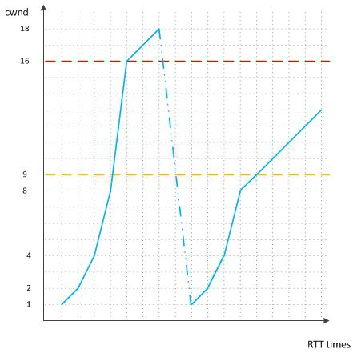

      #### 快速重传
      网络是一个很复杂的环境，如果有这么一种情况，网络发生了拥堵但是又没那么的拥堵，这种情况的表现是什么呢？按照前面介绍过的滑动窗口，TCP不是one by one的发送数据包的，如果发送的数据包是1,2,3，1和3已经到，但是2没有到，由于拥堵在网络中丢失了，那么接收端会不断告诉发送端下一个需要的报文是2号报文，即使后面的报文都到了，但在2号报文没有收到的情况下，会一直发送对1号报文的ACK，表示需要的是2号报文。如果连续收到三个连续的ACK，就认为网络发生了拥堵。

      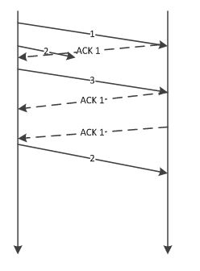

      这种情况说明了两种情况：网络确实发生了拥堵，但是又没有完全拥堵。因为如果完全拥堵了，那么发送端也不会受到三个ACK数据报文，所以这种情况没有必要从头再来。针对这种情况，提出了一个快速重传的方案，其思想如下：
      1. ssthresh设置为cwnd的一半
      2. cwnd设置为ssthresh的值
      3. 不需要重新进入慢启动阶段而是进入拥塞避免阶段

      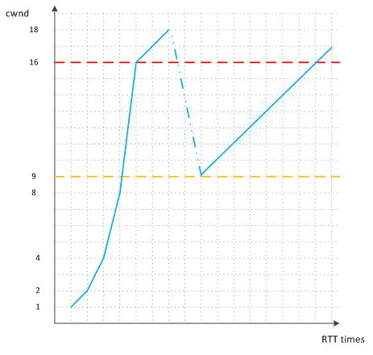

      #### 快速恢复
      快速重传算法已经尽力快的恢复对于网络的传送，但是设计们本着“面包里面抠面粉”的原则，在上面的快速重传算法中尝试想想有没有进步空间，在全面分析之后，提出了快速恢复的算法，其具体做法如下：
      1. 在收到3个重复的ACK之后，ssthresh设置为cwnd的一半，然后把cwnd设置为ssthresh加3个单位的大小，接着重传丢失的报文段，如果用前面的例子来举例就是重传2号报文。
      2. 如果这个时候再次收到重传的ACK，那么拥塞窗口增加1。
      4. 如果收到的是新的数据包的ACK，把cwnd设置为第一步的ssthresh的值。为什么这么做，因为如果收到的新的ACK，说明网络已经恢复了，可以进入拥塞避免的线性增长阶段了。
      
      第一个步里为什么加3呢，因为这个时候连续的收到3个ACK包，那么可以认为网络还有3个单位大小的余额，同时也可以这么想，说明有3个“老”的数据包已经从网络上离开了。
      </details>

- MySQL
  - 基础知识
    - 范式
      - <details><summary>三范式的定义</summary>

          ```
          第一范式：字段不可分割
          第二范式：非主属性必须完全依赖主属性，换句话说就是非主属性不能部分依赖主属性，如果主属性有多个列，每个非主属性必须有所有主属性的列来确定，而不是一部分主属性列，不满足第二范式会导致数据冗余
          第三范式：任何非主属性不依赖于其它非主属性，也就是非主属性不能推出另一个非主属性
          BCNF：主属性不能依赖非主属性
          ```

          [如何理解关系型数据库的常见设计范式？ - 刘慰的回答 - 知乎](https://www.zhihu.com/question/24696366/answer/29189700)
          </details>

    - 隔离级别
      - <details><summary>有哪些隔离级别</summary>

        ```
        读未提交：一个事务还没提交时，它做的变更就能被别的事务看到，这会带来脏读、幻读、不可重复读问题
        读已提交：一个事务提交之后，它做的变更才会被其他事务看到，其避免了脏读，但仍然存在不可重复读和幻读问题
        可重复读：一个事务执行过程中看到的数据，总是跟这个事务在启动时看到的数据是一致的。可重复读隔离级别下，未提交变更对其他事务也是不可见的，其避免了脏读和不可重复读问题，但幻读依然存在
        串行化：顾名思义是对于同一行记录，“写”会加“写锁”，“读”会加“读锁”。当出现读写锁冲突的时候，后访问的事务必须等前一个事务执行完成，才能继续执行。

        可重复读保证了事务期间的查询结果是一致的，但是存在幻读问题，即可能会读到其他事务提交的新增数据，InnoDB用间隙锁一定程度上解决了幻读的问题
        ```
        </details>

      - <details><summary>隔离级别的实现</summary>

        使用MVCC（多版本并发控制）实现隔离级别，在多版本存储上，MySQL采用从新到旧（Newest To Oldest）的版本链。B+Tree叶结点上，始终存储的是最新的数据（可能是还未提交的数据）。而旧版本数据，通过UNDO记录存储在回滚段（Rollback Segment）里。每一条记录都会维护一个ROW HEADER元信息，存储有创建这条记录的事务ID，一个指向UNDO记录的指针。通过最新记录和UNDO信息，可以还原出旧版本的记录。

        这样相当于每个数据上存在其多个快照版本，每个版本其实对应一个事务对其的修改，在一个事务中只要之前的查询和之后的查询使用一个版本的快照，作为事务视图，就实现了可重复读，这也是为什么尽量不要使用长事务的原因，长事务意味着系统里面会存在很老的事务视图。由于这些事务随时可能访问数据库里面的任何数据，所以这个事务提交之前，数据库里面它可能用到的回滚记录都必须保留，这就会导致大量占用存储空间。

        InnoDB的MVCC会为每行记录保存两个隐藏的列，一个表示行的创建时间，一个表示行的过期时间（删除时间），这里说的时间不是实际的系统时间，而是系统版本号，也就是事务号。每开始一个新的事务，系统版本号都会递增，而事务开始时的系统版本号就是事务号。

        操作数据时，InnoDB遵循下面的规则：
        - 查询时：只查找版本号早于（小于等于）当前事务版本的数据行，这使得读取到的行，要么是当前事务开始前已经提交的，要么是当前事务创建或修改的。行的删除版本号，要么未定义，要么大于当前版本号，这使得读到的行在事务开始之前未被删除
        - 插入时：为每行数据设置创建版本号为当前事务的版本号
        - 删除时：为删除的行设置删除版本号为当前事务的版本号
        - 更新时：InnoDB会插入一行新的数据，设置创建版本号为当前事务的版本号，同时为原来的行设置删除版本号为当前事务的版本号

        读已提交的实现就是读取已经提交的数据中的最新版本

        可重复读的实现是在事务开启的时候创建一个一致性视图（`begin/start transaction`命令启动的事务是事务执行第一个语句时创建的，`start transaction with consistent snapshot`命令启动的事务则是在启动事务时就创建），其他事务在更新数据时发现存在一致性视图则记录一个UNDO记录，该记录中有更新前数据的事务ID。当事务进行查询时以其事务ID为依据来判断某条数据是否对其可见，一直持续到事务提交。也就是说，如果一个数据版本是在当前事务启动之前生成的，就可见，如果是启动以后才生成的，就不可见，必须要找到它的上一个版本再次判断，一直到事务ID等于自己或比自己小才行。但是因为事务ID是递增的，启动事务的时候已经存在了一些还未提交的事务，这些事务的ID比当前事务小，所以InnoDB为每个事务构造了一个数组，用来保存这个事务启动瞬间，当前正在“活跃”的所有事务 ID。“活跃”指的就是，启动了但还没提交。数组里面事务ID的最小值记为低水位，当前系统里面已经创建过的事务 ID的最大值加1记为高水位。这个视图数组和高水位，就组成了当前事务的一致性视图（read-view），如：

        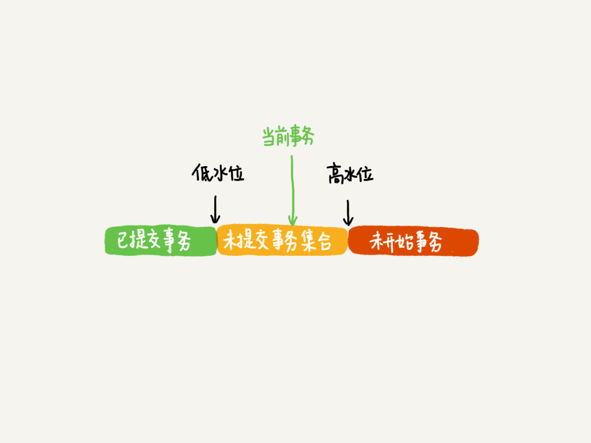

        对于当前事务的启动瞬间来说，一个数据版本的 row trx_id，有以下几种可能：
        1. 如果落在绿色部分，表示这个版本是已提交的事务或者是当前事务自己生成的，这个数据是可见的
        2. 如果落在红色部分，表示这个版本是由将来启动的事务生成的，是肯定不可见的
        3. 如果落在黄色部分，那就包括两种情况
          1. 若row trx_id在数组中，表示这个版本是由还没提交的事务生成的，不可见
          2. 若row trx_id不在数组中，表示这个版本是已经提交了的事务生成的，可见
        
        但是对于更新操作，不能使用一致性读，否则其他事务的更新就丢了，所以对于更新操作都是先读后写的，而这个读只能读当前的值，称为“当前读”（current read）。
        
        除了update语句外，select语句如果加锁（加上lock in share mode或for update），也是当前读。

        另外需要注意的是，update语句执行时看到的数据是最新的版本，这个最新的版本肯定是已经提交的事务更新的，因为update时还需要获取数据的行锁，并且事务在提交之前不会释放行锁，如果两个事务同时update一行，则后一个事务需要等待前一个事务提交后才能进行update，这就保证了update语句执行时看到的数据是已提交的事务更新的最新版本的数据。

        对于update时加的锁，可以看下面关于加锁规则的说明，这里只是强调下，update唯一索引时的等值查询，如果是存在记录，则锁的是行，如果不存在记录，则锁是间隙锁，而如果是非唯一索引的等值查询，锁是next-key lock或间隙锁。

        </details>

    - 锁
      - <details><summary>什么是幻读，如何解决</summary>

        #### 什么是幻读
        幻读，并不是说两次读取获取的结果集不同，幻读侧重的方面是某一次的select操作得到的结果所表征的数据状态无法支撑后续的业务操作。更为具体一些：select某记录是否存在，不存在，准备插入此记录，但执行insert时发现此记录已存在，无法插入，此时就发生了幻读

        #### 如何解决幻读
        产生幻读的原因是，即使使用行锁，行锁也只能锁住存在的行，新插入记录这个动作，加行锁时该行还不存在，更新操作更新的是记录之间的“间隙”。因此，为了解决幻读问题，InnoDB引入新的锁，也就是间隙锁（Gap Lock）。

        顾名思义，间隙锁，锁的就是两个值之间的空隙，假设存在下面的数据：
        ```
        CREATE TABLE `t` ( 
          `id` int(11) NOT NULL, 
          `c` int(11) DEFAULT NULL, 
          `d` int(11) DEFAULT NULL, 
          PRIMARY KEY (`id`), 
          KEY `c` (`c`)
        ) ENGINE=InnoDB;
        insert into t values(0,0,0),(5,5,5),(10,10,10),(15,15,15),(20,20,20),(25,25,25);
        ```

        

        执行`select * from t where d=5 for update`的时候，用到的查询条件d没有索引，所以该语句会导致全表扫描，从而导致执行时不止是给数据库中已有的6个记录加上了行锁，还同时加了7个间隙锁。这样就确保了无法再插入新的记录。间隙锁之间不冲突，只和插入操作有冲突。

        间隙锁和行锁合称next-key lock，每个next-key lock是前开后闭区间。也就是说，表t初始化以后，如果用`select * from t for update`要把整个表所有记录锁起来，就形成了7个 next-key lock，分别是(-∞,0]、(0,5]、(5,10]、(10,15]、(15,20]、(20, 25]、(25, +supremum]。

        </details>

      - <details><summary>加锁规则</summary>
       
        加锁还遵循一些规则，包含了两个“原则”、两个“优化”和一个bug：
        - 原则 1：加锁的基本单位是next-key lock。next-key lock是前开后闭区间
        - 原则 2：查找过程中访问到的对象才会加锁
        - 优化 1：索引上的等值查询，给唯一索引加锁的时候，next-key lock退化为行锁
        - 优化 2：索引上的等值查询，向右遍历时且最后一个值不满足等值条件的时候，next-key lock退化为间隙锁
        - 一个bug：唯一索引上的范围查询会访问到不满足条件的第一个值为止

        另外，在InnoDB事务中，行锁是在需要的时候才加上的，但并不是不需要了就立刻释放，而是要等到事务结束时才释放，这个就是两阶段锁协议。
        
        这里初始化一个表并用案例分析这些规则
        ```
        CREATE TABLE `t` (
          `id` int(11) NOT NULL,
          `c` int(11) DEFAULT NULL,
          `d` int(11) DEFAULT NULL,
          PRIMARY KEY (`id`),
          KEY `c` (`c`)
        ) ENGINE=InnoDB;

        insert into t values(0,0,0),(5,5,5),
        (10,10,10),(15,15,15),(20,20,20),(25,25,25);
        ```
        
        案例如下：

        #### 等值查询间隙锁
        

        由于表t中没有id=7的记录，所以用我们上面提到的加锁规则判断一下的话：
        根据原则 1，加锁单位是next-key lock，session A加锁范围就是 (5,10]
        根据优化 2，这是一个等值查询(id=7)，而id=10不满足查询条件，next-key lock退化成间隙锁，因此最终加锁的范围是(5,10)

        所以，session B要往这个间隙里面插入id=8的记录会被锁住，但是session C修改 id=10这行是可以的

        #### 非唯一索引等值锁
        

        这里session A要给索引c上c=5的这一行加上读锁。
        根据原则 1，加锁单位是next-key lock，因此会给(0,5]加上next-key lock，要注意c是普通索引，因此仅访问c=5这一条记录是不能马上停下来的，需要向右遍历，查到c=10才放弃
        根据原则 2，访问到的都要加锁，因此要给 (5,10]加next-key lock
        但是同时这个符合优化 2：等值判断，向右遍历，最后一个值不满足c=5这个等值条件，因此退化成间隙锁(5,10)
        根据原则 2 ，只有访问到的对象才会加锁，这个查询使用覆盖索引，并不需要访问主键索引，所以主键索引上没有加任何锁，这就是为什么session B的update语句可以执行完成

        在这个例子中，lock in share mode只锁覆盖索引，但是如果是for update就不一样了。执行for update时，系统会认为接下来要更新数据，因此会顺便给主键索引上满足条件的行加上行锁

        这个例子说明，锁是加在索引上的；同时，如果要用lock in share mode来给行加读锁避免数据被更新的话，就必须得绕过覆盖索引的优化，在查询字段中加入索引中不存在的字段。比如，将session A的查询语句改成select d from t where c=5 lock in share mode，这样会导致查询时进行一次回表，也就是查询主键索引上的行记录获取d值，使得主键索引也被锁了

        #### 主键索引范围锁
        下面两个语句
        ```
        mysql> select * from t where id=10 for update;
        mysql> select * from t where id>=10 and id<11 for update;
        ```

        在逻辑上，这两条查语句肯定是等价的，但是它们的加锁规则不太一样。现在，session A执行第二个查询语句，加锁效果：

        

        开始执行的时候，要找到第一个id=10的行，因此本该是next-key lock(5,10]。根据优化 1，主键id上的等值条件，退化成行锁，只加了id=10这一行的行锁
        范围查找就往后继续找，找到id=15这一行停下来，因此需要加next-key lock(10,15]。所以，session A这时候锁的范围就是主键索引上，行锁id=10和next-key lock(10,15]。这样，session B和session C就出现了上面的结果，而对于第一个语句，只锁住了id=10这一行

        #### 非唯一索引范围锁
        

        需要注意的是，与主键索引范围锁案例不同的是，这里查询语句的where部分用的是字段c，非唯一索引

        这次session A用字段c来判断，在第一次用c=10定位记录的时候，索引c上加了(5,10]这个next-key lock后，由于索引c是非唯一索引，没有优化规则，也就是说不会蜕变为行锁，因此最终sesion A加的锁是，索引c上的(5,10]和(10,15]这两个next-key lock

        这里需要扫描到c=15才停止扫描，是合理的，因为InnoDB要扫到c=15，才知道不需要继续往后找了

        #### 唯一索引范围锁bug
        

        session A是一个范围查询，按照原则 1 的话，应该是索引id上只加 (10,15]这个next-key lock，并且因为id是唯一键，所以循环判断到id=15这一行就应该停止了。但是实现上，InnoDB会往前扫描到第一个不满足条件的行为止，也就是id=20。而且由于这是个范围扫描，因此索引id上的(15,20]这个next-key lock也会被锁上。所以你看到了，session B要更新id=20这一行，是会被锁住的。同样地，session C要插入id=16的一行，也会被锁住。照理说，这里锁住 id=20这一行的行为，其实是没有必要的。因为扫描到id=15，就可以确定不用往后再找了。但实现上还是这么做了，官方bug系统上也有提到，但是并未被verified。

        #### 非唯一索引上存在"等值"的例子
        假设执行下面的语句
        ```
        mysql> insert into t values(30,10,30)
        ```

        新插入的这一行c=10，也就是说现在表里有两个c=10的行。由于非唯一索引上包含主键的值，所以索引结构如下：
        
        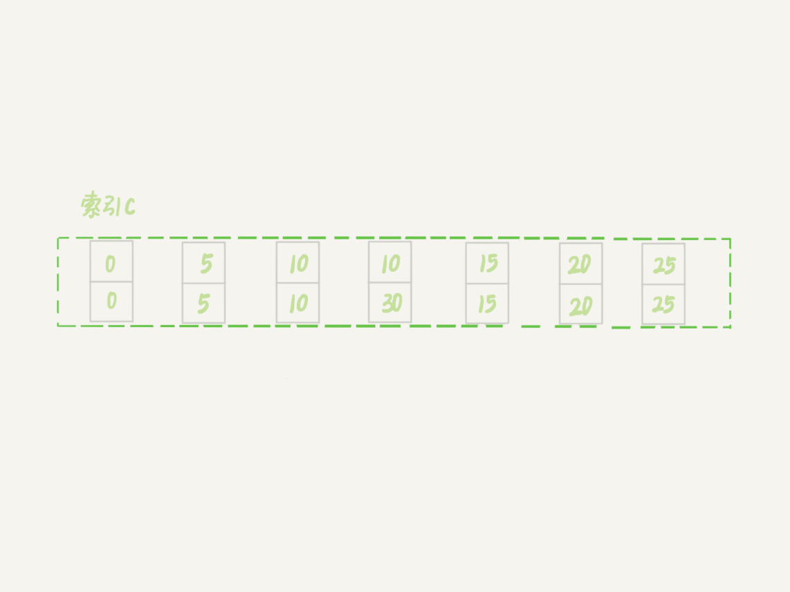

        虽然有两个c=10，但是它们的主键值id是不同的（分别是10和30），因此这两个c=10的记录之间，也是有间隙的。图中画出了索引c上的主键id。为了跟间隙锁的开区间形式进行区别，用 (c=10,id=30) 这样的形式，来表示索引上的一行。现在，来看一下非唯一索引上存在"等值"的例子。这次用delete语句来验证。注意，delete语句加锁的逻辑，其实跟select ... for update是类似的，也就是开始总结的两个“原则”、两个“优化”和一个“bug”。

        

        这时，session A在遍历的时候，先访问第一个c=10的记录。同样地，根据原则 1，这里加的是(c=5,id=5)到(c=10,id=10)这个 next-key lock。然后，session A向右查找，直到碰到(c=15,id=15)这一行，循环才结束。
        根据优化 2，这是一个等值查询，向右查找到了不满足条件的行，所以会退化成(c=10,id=10)到(c=15,id=15)的间隙锁。也就是说，这个delete语句在索引c上的加锁范围，就是下图中蓝色区域覆盖的部分。

        

        这个蓝色区域左右两边都是虚线，表示开区间，即(c=5,id=5)和(c=15,id=15)这两行上都没有锁

        #### limit语句加锁
        

        这个例子里，session A的delete语句加了limit 2。表t里c=10的记录其实只有两条，因此加不加limit 2，删除的效果都是一样的，但是加锁的效果却不同。可以看到，session B的insert语句执行通过了，跟非唯一索引上存在"等值"的结果不同。这是因为，这里的delete语句明确加了limit 2的限制，因此在遍历到(c=10, id=30)这一行之后，满足条件的语句已经有两条，循环就结束了。因此，索引c上的加锁范围就变成了从（c=5,id=5) 到（c=10,id=30) 这个前开后闭区间，如下图所示：

        

        可以看到，(c=10,id=30)之后的这个间隙并没有在加锁范围里，因此insert语句插入c=12是可以执行成功的。这个例子的指导意义就是，在删除数据的时候尽量加limit。这样不仅可以控制删除数据的条数，让操作更安全，还可以减小加锁的范围。

        #### 一个关于间隙锁的死锁例子
        

        session A启动事务后执行查询语句加lock in share mode，在索引c上加了next-key lock(5,10]和间隙锁(10,15)；
        session B的update语句也要在索引c上加next-key lock(5,10]，进入锁等待；
        然后session A要再插入(8,8,8)这一行，被session B的间隙锁锁住。

        由于出现了死锁，InnoDB让session B回滚。这里出现死锁是因为，session B的加next-key lock(5,10]操作，实际上分成了两步，先是加(5,10)的间隙锁，加锁成功；然后加c=10的行锁，这时候才被锁住的。也就是说，在分析加锁规则的时候可以用next-key lock来分析。但是具体执行的时候，是要分成间隙锁和行锁两段来执行的。

        </details>

    - <details><summary>锁的类型</summary>

      #### 记录锁（行锁）
      记录锁有两种：
      - 读锁，又称共享锁（Share locks，简称S锁），加了读锁的记录，所有的事务都可以读取，但是不能修改，并且可同时有多个事务对记录加读锁。
      - 写锁，又称排他锁（Exclusive locks，简称X锁），或独占锁，对记录加了排他锁之后，只有拥有该锁的事务可以读取和修改，其他事务都不可以读取和修改，并且同一时间只能有一个事务加写锁。

      当SQL语句无法使用索引时，会进行全表扫描，这个时候MySQL会给整张表的所有数据行加记录锁后再过滤，过滤时如果发现不满足WHERE条件，会释放对应记录的锁。这样做，保证了最后只会持有满足条件记录上的锁，但是每条记录的加锁操作还是不能省略的。所以更新操作必须要根据索引进行操作，没有索引时，不仅会消耗大量的锁资源，增加数据库的开销，还会极大的降低了数据库的并发性能。

      #### 间隙锁
      在加锁规则中介绍了，间隙锁是一种加在两个索引之间，或者加在第一个索引之前，或最后一个索引之后的锁。这个间隙可以跨一个索引记录，多个索引记录，甚至是空的。使用间隙锁可以防止其他事务在这个范围内插入或修改记录，保证两次读取这个范围内的记录不会变，从而不会出现幻读现象。间隙锁在RR的隔离级别下工作。

      #### Next-Key锁
      在加锁规则中介绍了，Next-Key锁是记录锁和间隙锁的组合，它指的是加在某条记录以及这条记录前面间隙上的锁。

      #### 表级意向锁
      MySQL本身支持表锁，行锁由存储引擎支持，如InnoDB，表锁和行锁虽然锁定范围不同，但是会相互冲突，所以加表锁时，需要先遍历该表的所有记录，判断是否加有排他锁。这种遍历检查的方式显然是一种低效的方式，MySQL引入了意向锁，来检测表锁和行锁的冲突从而避免遍历表记录实现表锁。
      
      意向锁也是表级锁，是一种不与行级锁冲突的表级锁，这一点非常重要，意向锁分两种：
      - 意向共享锁（intention shared lock, IS）：表示事务有意向对表中的某些行加共享锁（S锁）：
        ```sql
        -- 事务要获取某些行的S锁，必须先获得表的IS锁。
        SELECT column FROM table ... LOCK IN SHARE MODE;
        ``` 
      - 意向排他锁（intention exclusive lock, IX）：表示事务有意向对表中的某些行加排他锁（X锁）
        ```sql
        -- 事务要获取某些行的X锁，必须先获得表的IX锁。
        SELECT column FROM table ... FOR UPDATE;
        ``` 
      
      意向锁的引入目的是避免给表加表级锁时需要遍历表记录判断是否存在排他锁，即下面的情况：
      ```sql
      -- 事务A获取了某一行的排他锁，并未提交
      SELECT * FROM users WHERE id = 6 FOR UPDATE;

      -- 事务B想要获取users表的表锁（不是意向锁，就是普通的表锁）：
      LOCK TABLES users READ;
      ```
      事务B对users表加表锁的时候，必须保证：
      - 当前没有其他事务持有users表的排他锁
      - 当前没有其他事务持有users表中任意一行的排他锁

      为了检测是否满足第二个条件，事务B必须在确保users表不存在任何排他锁的前提下，去检测表中的每一行是否存在排他锁。很明显这是一个效率很差的做法，但是有了之后，情况就不一样了，下面分析意向锁是如何解决这个问题的，首先来看意向锁和其他锁的兼容性（即是否互斥）：
       
      ||意向共享锁（IS）|意向排他锁（IX）|
      |:-:|:-:|:-:|
      |意向共享锁（IS）|兼容|兼容|
      |意向排他锁（IX））|兼容|兼容|

      即意向锁之间是互相兼容的，那意向锁有啥用呢，再看看意向锁与普通的表级排他/共享锁的兼容性：

      ||意向共享锁（IS）|意向排他锁（IX）|
      |:-:|:-:|:-:|
      |表级共享锁（IS）|兼容|互斥|
      |表级排他锁（IX））|互斥|互斥|

      另外再强调一下，无论是读还是写意向锁，都不会与行级的共享/排他锁互斥。

      回到之前的例子，有了意向锁以后，事务A执行`SELECT * FROM users WHERE id = 6 FOR UPDATE;`语句时，会在users表上加意向排他锁（IX），事务B想要加表锁时会被事务A持有的users表的意向排他锁阻塞，无需去检测表中的每一行数据是否存在排他锁。

      所以有了意向锁以后，如果表上存在意向共享锁（IS），则其他事务可以获得表级共享锁，但是不能获取表级排他锁，而如果表上存在意向排他锁（IX），则其他事务不能获取表级共享锁和表级排他锁，对于这些互斥性，不需要遍历表中的数据。

      另外从意向锁的作用就能知道意向共享锁（IS）和意向排他锁（IX）之间不互斥是因为意向锁主要是用于限制表级锁的，事务在获取共享/排他的行锁时需要先获取意向共享锁（IS）/意向排他锁（IX），如果意向锁之间互斥，则所有更新数据的操作即使操作的不是一行记录，也会互斥了，这肯定是不行的，也是没必要的。

      #### 插入意向锁
      插入意向锁是一种特殊的间隙锁（简写成II GAP），表示插入的意向，只有在INSERT的时候才会有这个锁。这个锁虽然也叫意向锁，但是和上面介绍的表级意向锁是两个完全不同的概念。

      插入意向锁和插入意向锁之间互不冲突，所以可以在同一个间隙中有多个事务同时插入不同索引的记录。插入意向锁只会和间隙锁或Next-key锁冲突，正如上面所说，间隙锁唯一的作用就是防止其他事务插入记录造成幻读，正是由于在执行INSERT语句时需要加插入意向锁，而插入意向锁和间隙锁冲突，从而阻止了插入操作的执行。


      #### AUTOINC（自增锁）
      AUTOINC锁又叫自增锁（一般简写成 AI 锁），是一种表锁，当表中有自增列（AUTOINCREMENT）时出现。
      
      当插入表中有自增列时，数据库需要自动生成自增值，它会先为该表加AUTOINC表锁，阻塞其他事务的插入操作，这样保证生成的自增值肯定是唯一的。AUTOINC锁具有如下特点：
      - AUTOINC锁互不兼容，也就是说同一张表同时只允许有一个自增锁
      - 自增值一旦分配了就会+1，如果事务回滚，自增值也不会减回去，所以自增值可能会出现中断的情况

      </details>

    - <details><summary>死锁的例子</summary>

        #### 间隙锁的死锁例子，这个在上面的加锁规则中提到了
        

        session A启动事务后执行查询语句加lock in share mode，在索引c上加了next-key lock(5,10]和间隙锁(10,15)；
        session B的update语句也要在索引c上加next-key lock(5,10]，进入锁等待；
        然后session A要再插入(8,8,8)这一行，被session B的间隙锁锁住。

        由于出现了死锁，InnoDB让session B回滚。这里出现死锁是因为，session B的加next-key lock(5,10]操作，实际上分成了两步，先是加(5,10)的间隙锁，加锁成功；然后加c=10的行锁，这时候才被锁住的。也就是说，在分析加锁规则的时候可以用next-key lock来分析。但是具体执行的时候，是要分成间隙锁和行锁两段来执行的。

        #### 两条update语句的死锁
        - 例1
         
        两个事务分别执行如下语句：
        ```
        update StockPrice set close = 1 where stock_id = 4 and date = '2002-05-01';
        update StockPrice set close = 2 where stock_id = 3 and date = '2002-05-02';
        ```
        ```
        update StockPrice set close = 3 where stock_id = 3 and date = '2002-05-02';
        update StockPrice set close = 4 where stock_id = 4 and date = '2002-05-01';
        ```
        如果两个事务都执行了各自的第一条语句，更新了一行数据，更新前两个事务都获得了被更新行的锁，但是这个锁需要事务提交后才会释放，所以两个事务分别执行各自的第二个语句时会等待对方释放锁，从而导致死锁

        - 例2
        
        执行update语句时，如果where条件是主键，则需要获取主键上的行锁（也就是锁住主键索引上满足条件的节点）才能进行更新，而如果where条件是普通索引，则需要锁住普通索引的节点及对应的主键索引，这样两个update语句同时执行就有可能产生死锁，如：
        ```
        update user_item set status = 1 where user_id = ?
        ```

        user_id列有一个普通索引，上面的语句执行的时候加锁的步骤：
        1. 根据where条件在user_id的索引中找到满足条件的节点并锁住该节点
        2. 因为需要进行更新操作，所以需要根据普通索引上的主键值在主键索引找到对应的行并加上行锁

        如果在步骤1和2之间突然插入一条语句：`update user_item set status = 2 where id = ? and user_id = ?`，这条语句会先锁住主键索引，然后锁住user_id。这样就出现了一条语句获取了user_id的锁，等待主键索引上的锁，另一条语句获取了主键上的锁，等待user_id上的锁，出现了死锁


      </details>

    - 索引
      - <details><summary>聚集索引和非聚集索引</summary>

        #### 聚集索引
        该索引中键值的逻辑顺序决定了表中相应行的物理顺序，聚集索引规定数据在表中的物理存储顺序，因此一个表只能包含一个聚集索引。但该索引可以包含多个列（组合索引）

        Innodb存储引擎中行记录就是按照聚集索引维度顺序存储的，Innodb的表也称为索引表

        InnoDB使用主键作为聚集索引的列，如果不存在主键，则InnoDB会选择一个唯一非空索引作为聚集索引，如果没有这样的索引，则InnoDB会隐式的创建一个主键作为聚集索引

        优点：
        - 相关数据保存在一起，查询数据时能够减少磁盘I/O
        - 索引和数据行保存在一起，数据访问更快
        - 由于覆盖索引的机制，也算是有利于查询
        
        缺点：
        - 如果主键是递增的，则插入时是顺序的，这样能很快的插入数据，但是如果主键非递增，则插入代价较大（导致了随机I/O），也可能会导致页分裂，可以定期执行OPTIMIZE TABLE重组一下
        - 普通索引需要两次索引查找才能定位到数据行
        - 更新聚集索引的值成本很高，因为需要移动所有被更新的行到新的位置

        #### 非聚集索引
        非聚集索引指定了表中记录的逻辑顺序，但记录的物理顺序和索引的顺序不一致，Innodb中的普通索引就是非聚集索引，也叫二级索引，其普通索引的叶节点上除了包含索引值，还包含主键值，索引按照索引值顺序存储，而不是表记录

        优点：
        - 不依赖主键递增 

        #### 主要区别
        聚集索引和非聚集索引的根本区别是表记录的排列顺序和与索引的排列顺序是否一致

        如果语句是`select * from T where ID=500`，即按照主键查询方式，则只需要搜索ID索引
        如果语句是`select * from T where k=5`，即普通索引查询方式，为了获取到其他列的值，则需要先搜索k索引树，得到ID的值为500，再到ID索引树搜索一次。这个过程称为回表

        基于非主键索引的查询需要多扫描一棵索引树，因此应用中应该尽量使用主键查询

        </details>

      - <details><summary>覆盖索引、前缀索引</summary>

        #### 覆盖索引
        当查询的列在普通索引上有值，则执行查询时不需要回表，如执行的语句是select ID from T where k between 3 and 5，这时只需要查ID的值，而ID的值已经在k索引树上了，因此可以直接提供查询结果，不需要回表，这就被称为覆盖索引

        假设存在一个市民表：
        ```
        CREATE TABLE `tuser` (
          `id` int(11) NOT NULL,
          `id_card` varchar(32) DEFAULT NULL,
          `name` varchar(32) DEFAULT NULL,
          `age` int(11) DEFAULT NULL,
          `ismale` tinyint(1) DEFAULT NULL,
          PRIMARY KEY (`id`),
          KEY `id_card` (`id_card`),
          KEY `name_age` (`name`,`age`)
        ) ENGINE=InnoDB
        ```

        是否有必要将身份证号和名字建立联合索引？

        身份证号是市民的唯一标识。也就是说，如果有根据身份证号查询市民信息的需求，只要在身份证号字段上建立索引就够了。但是如果现在有一个高频请求，要根据市民的身份证号查询他的姓名，使用（身份证号、姓名）联合索引就有意义了。它可以在这个高频请求上用到覆盖索引，不再需要回表查整行记录，减少语句的执行时间。当然，索引字段的维护总是有代价的。因此，在建立冗余索引来支持覆盖索引时就需要权衡考虑

        #### 前缀索引
        当需要索引的列很长时，可以使用前缀索引，即只取列的前几个字符作为索引，应该使用几个字符取决于区分度，区分度和索引长度取一个折中值来创建索引。计算区分度的方法是首先计算列本身的区分度：
        ```sql
        SELECT COUNT(DISTINCT index_column)/COUNT(*) FROM table_name;
        ```

        再计算不同长度下索引的区分度：
        ```java
        SELECT
        COUNT(DISTINCT LEFT(index_column,1))/COUNT(*),
        COUNT(DISTINCT LEFT(index_column,2))/COUNT(*),
        COUNT(DISTINCT LEFT(index_column,3))/COUNT(*),
        ...
        FROM table_name;
        ```

        根据结果决定前缀索引的长度，创建前缀索引的语法：
        ```sql
        ALTER TABLE table_name ADD INDEX index_name (index_column(length));
        ```

        需要注意的是使用前缀索引后，就无法根据索引做ORDER BY和GROUP BY了
        </details>

      - <details><summary>最左前缀原则和索引下推</summary>

        #### 最左前缀原则
        假设存在下面的联合索引：

        

        索引项是按照索引定义里面出现的字段顺序排序的。当逻辑需求是查到所有名字是“张三”的人时，可以快速定位到ID4，然后向后遍历得到所有需要的结果。如果要查的是所有名字第一个字是“张”的人，SQL语句的条件是"where name like ‘张 %’"。这时，也能够用上这个索引，查找到第一个符合条件的记录是ID3，然后向后遍历，直到不满足条件为止。可以看到，不只是索引的全部定义，只要满足最左前缀，就可以利用索引来加速检索。这个最左前缀可以是联合索引的最左N个字段，也可以是字符串索引的最左M个字符。基于上面对最左前缀索引的说明，讨论一个问题：在建立联合索引的时候，如何安排索引内的字段顺序。这里评估标准是，索引的复用能力。因为可以支持最左前缀，所以当已经有了(a,b)这个联合索引后，一般就不需要单独在a上建立索引了。因此，第一原则是，如果通过调整顺序，可以少维护一个索引，那么这个顺序往往就是需要优先考虑采用的。

        #### 索引下推
        还是上面的联合索引，假设有个查询语句如下：
        ```
        mysql> select * from tuser where name like '张%' and age=10 and ismale=1
        ```

        这个语句在搜索索引树的时候，只能用“张”，找到第一个满足条件的记录ID3，在MySQL 5.6之前，只能从ID3开始一个个回表。到主键索引上找出数据行，再对比字段值。而MySQL 5.6引入的索引下推优化（index condition pushdown)，可以在索引遍历过程中，对索引中包含的字段先做判断，直接过滤掉不满足条件的记录，减少回表次数。InnoDB在(name,age)索引内部就判断了age是否等于10，对于不等于10的记录，直接判断并跳过，减少了回表的次数。
        </details>

      - <details><summary>使用索引排序</summary>

        MySQL可以使用order by语句实现排序，但是索引本身就是有序的，如果能够利用这一点就可以减少带有order by的sql语句的执行时间。

        假设存在下面的表：
        ```sql
        CREATE TABLE `t` (
          `id` int(11) NOT NULL,
          `city` varchar(16) NOT NULL,
          `name` varchar(16) NOT NULL,
          `age` int(11) NOT NULL,
          `addr` varchar(128) DEFAULT NULL,
          PRIMARY KEY (`id`),
          KEY `city` (`city`)
        ) ENGINE=InnoDB;
        ```

        city列上有一个普通索引，如果执行下面的语句：
        ```sql
        select city, name, age from t where city = '杭州' order by name limit 1000 ;
        ```

        即按照city查询，按照name排序，MySQL的排序有下面几种。
        
        #### 全字段排序
        每个线程都有一个sort_buffer用于排序，对于全字段排序，MySQL的执行流程是：
        1. 初始化sort_buffer，放入name、city、age这三个字段；
        2. 从索引city找到第一个满足city='杭州’条件的主键id；
        3. 到主键id索引取出整行，取name、city、age三个字段的值，存入sort_buffer中；
        4. 从索引city取下一个记录的主键id；
        5. 重复步骤3、4直到city的值不满足查询条件为止；
        6. 对sort_buffer中的数据按照字段name做快速排序；
        7. 按照排序结果取前1000行返回给客户端。

        如果排序数据量太大，sort_buffer放不下，MySQL会利用磁盘临时文件辅助排序

        #### rowId排序
        如果sort_buffer中需要存放的字段很多，导致一行数据量很大，需要非常多的临时文件，则MySQL会使用rowId排序，MySQL有一个参数用于判断行数据是否过大：
        ```
        SET max_length_for_sort_data = 16;
        ```

        max_length_for_sort_data，是MySQL中专门控制用于排序的行数据的长度的一个参数。它的意思是，如果单行的长度超过这个值，MySQL就认为单行太大，就要缓存rowId排序。

        对于rowId排序，执行流程是：
        1. 初始化sort_buffer，两个字段name和id；
        2. 从索引city找到第一个满足city='杭州’条件的主键id；
        3. 到主键id索引取出整行，取name、id这两个字段，存入sort_buffer中；
        4. 从索引city取下一个记录的主键id；
        5. 重复步骤3、4直到不满足city='杭州’条件为止；
        6. 对sort_buffer中的数据按照字段name进行排序；
        7. 遍历排序结果，取前1000行，并按照id的值回到原表中取出city、name和age三个字段返回给客户端。

        使用rowId排序算法会导致一行数据回表两次，但是使得排序时需要使用的临时文件数量变少了，因为sort_buffer中要存放的字段少了。

        如果是通过全字段排序或者rowId排序完成的排序，则通过explain语句可以看到Extra列有Using filesort。
        
        #### 索引排序
        如果索引自身就是有序的，就可以跳过排序过程，如针对表t，修改索引：
        ```sql
        alter table t add index city_user(city, name);
        ```

        将索引修改为联合索引，这样对于根据给定的city值找到的索引节点，name值肯定是有序的，那么最开始的select语句的执行流程将变为：
        1. 从索引(city, name)找到第一个满足city='杭州’条件的主键id；
        2. 到主键id索引取出整行，取name、city、age三个字段的值，作为结果集的一部分；
        3. 从索引(city,name)取下一个记录主键id；
        4. 重复步骤2、3，直到查到第1000条记录，或者是不满足city='杭州’条件时循环结束。

        这样就避免了排序，针对开始的select语句，实际上还可以利用覆盖索引避免回表过程，不过这样会导致索引进步一变大，需要权衡。

        索引排序也支持倒序排序，通过Explain能看到Extra中有Backward index scan。

        使用索引排序需要注意的是必须满足最左前缀原则（上面的例子由于city列的值固定了，所以也能够满足最左前缀）；对于多个列的排序，这些列必须在一个联合索引中，并且排序时顺序需要一致（正序或者倒序）；如果查询语句关联了多个表，则排序的列必须全部都在第一个表中。

        </details>

      - <details><summary>索引无效的情况</summary>

        1. 如何MySQL优化器认为全表扫描比使用索引更快，则不使用索引，如表数据很少，考虑到行数和回表的代价，MySQL可能不使用索引
        2. 用or分隔开的条件，如果or前的条件中的列有索引，而后面的列没有索引，那么涉及到的索引都不会被用到，例如：select * from table_name where key1='a' or key2='b'，如果在key1上有索引而在key2上没有索引，则该查询不会走索引
        3. 不符合最左前缀原则不使用索引
        4. 如果like是以'%'开始的，则该列上的索引不会被使用
        5. 如果列为字符串，则where条件中必须将字符常量值加引号，否则即使该列上存在索引，也不会被使用。例如：select * from table_name where key1 = 1，如果key1列保存的是字符串，即使key1上有索引，也不会被使用
        6. WHERE字句的查询条件里有不等于号（WHERE column != ...）或<>操作符，导致匹配的行数过多，如果select的列需要回表才能获取到，则优化器会考虑回表的时间，不使用索引，如果不需要回表，则会使用索引
        7. where语句的等号左边进行函数、算术运算或其他表达式运算时，索引无效
        8. 当使用联合索引时，如果对某个列使用了范围查找，则该列右边的索引都无法使用
        </details>

      - <details><summary>B树和B+树</summary>

        一个B树的特性：
        - 定义任意非叶子节点最多只有M个子节点，且M > 2
        - 根结点的子节点数为[2, M]
        - 除根节点以外的非叶子节点的儿子数为[M/2, M]，向上取整
        - 非叶子节点的关键字个数 = 子节点个数 - 1
        - 所有叶子节点位于同一层；
        - k个关键字把节点拆成k+1段，分别指向k+1个子节点，同时满足查找树的大小关系

        一个B+树的特性：
        - 从根节点到叶节点的所有路径都具有相同的长度
        - 所有数据信息都存储在叶子节点，非叶子节点仅作为叶节点的索引存在
        - 根节点至少拥有两个子树
        - 每个树节点最多拥有M个子树
        - 每个树节点(除了根节点)拥有至少M/2个子树

        B树和B+树的主要区别：
        - B+树非叶子节点的关键字只起到索引作用，实际的数据存储在叶子节点，B树的非叶子节点也存储数据
        - B树在找到具体的数值以后，则结束，而B+树则需要通过索引找到叶子结点中的数据才结束，也就是说B+树的搜索过程中走了一条从根结点到叶子结点的路径，查询过程是稳定的

        为什么使用B+树而不是B树：
        - B+树的磁盘读取代价低：B+树的内部节点没有指向关键字具体信息的指针，换句话说，即分支节点没有存储数据，因此其内部节点相对B树更小。如果把所有同一内部节点的关键字存放在同一盘块中，那么盘块所能容纳的关键字数量也越多，一次性读内存中的需要查找的关键字也就越多，相对来说IO读写次数也就降低了
        - B+树的查询效率更加稳定：在B+树中，由于分支节点并不是最终指向文件内容的节点，分支节点只是叶子节点的索引，所以对于任意关键字的查找都必须从根节点走到分支节点，所有关键字查询路径长度相同，每个数据查询效率相当。而对于B树而言，其分支节点上也保存有数据，对于每一个数据的查询所走的路径长度是不一样的，效率也不一样
        - B+树便于范围查找：由于B+树的数据都存储在叶子节点上，分支节点均为索引，方便扫库，只需扫一遍叶子即可。但是B树在分支节点上都保存着数据，要找到具体的顺序数据，需要执行一次中序遍历来查找。所以B+树更加适合范围查询的情况，在解决磁盘IO性能的同时解决了B树元素遍历效率低下的问题

        </details>

    - <details><summary>执行计划</summary>

        通过`explain [sql语句]`查询sql的执行计划，该命令的输出为：
        ```
        mysql> explain select * from (select * from ( select * from t3 where id=3952602) a) b;
        +----+-------------+------------+--------+-------------------+---------+---------+------+------+-------+
        | id | select_type | table      | type   | possible_keys     | key     | key_len | ref  | rows | Extra |
        +----+-------------+------------+--------+-------------------+---------+---------+------+------+-------+
        |  1 | PRIMARY     | <derived2> | system | NULL              | NULL    | NULL    | NULL |    1 |       |
        |  2 | DERIVED     | <derived3> | system | NULL              | NULL    | NULL    | NULL |    1 |       |
        |  3 | DERIVED     | t3         | const  | PRIMARY,idx_t3_id | PRIMARY | 4       |      |    1 |       |
        +----+-------------+------------+--------+-------------------+---------+---------+------+------+-------+
        ```

        列含义：
        1. id：select查询的标识符。 每个select都会自动分配一个唯一的标识符，id数值越大的优先执行，id相同的从上往下顺序执行。
        2. select_type：select查询的类型
           1. SIMPLE：不包含任何子查询或union的查询
           2. PRIMARY：包含子查询时最外层查询就是PRIMARY
           3. SUBQUERY：在select或 where字句中包含的查询
           4. DERIVED：from字句中包含的查询
           5. UNION：出现在union后的查询语句中
           6. UNION RESULT：从UNION中获取结果集
        3. table：标识查询的是哪个表，显示这一行的数据是关于哪张表的，有时不是真实的表名字，看到的是derived（n是个数字，为id字段），如一开始的输出例子
        4. type：数据访问、读取操作类型，性能调优时需要重点关注这一列
        5. possible_keys：此次查询中可能选用的索引，查询涉及到的字段上若存在索引，则该索引将被列出，但不一定被查询使用
        6. key：此次查询中确切使用到的索引，如果没有选择索引，键是NULL
        7. key_len：表示索引中使用的字节数，可通过该列计算查询中使用的索引的长度
        8. ref: 哪个字段或常数与key一起被使用
        9. rows: 此查询一共扫描了多少行，这个是一个估计值
        10. filtered: 表示此查询条件所过滤的数据的百分比
        11. extra: 额外的信息，后面会详细介绍

        ### select_type字段
        #### SIMPLE
        简单select，不使用union或子查询等
        ```
        select * from employee where id =1
        ```

        #### PRIMARY
        如果是复杂查询，表示是最外层的select
        ```
        mysql> explain select * from (select * from employee where id =1) a;
        +----+-------------+------------+--------+---------------+---------+---------+-------+------+-------+
        | id | select_type | table      | type   | possible_keys | key     | key_len | ref   | rows | Extra |
        +----+-------------+------------+--------+---------------+---------+---------+-------+------+-------+
        |  1 | PRIMARY     | <derived2> | system | NULL          | NULL    | NULL    | NULL  |    1 | NULL  |
        |  2 | DERIVED     | employee | const  | PRIMARY       | PRIMARY | 8       | const |    1 | NULL  |
        +----+-------------+------------+--------+---------------+---------+---------+-------+------+-------+
        ```

        #### UNION & UNION RESULT
        UNION中的第二个或后面的SELECT语句，UNION RESULT为UNION的结果（union和union all的区别是union会去重，union all不会，所以union all更快）
        ```
        mysql> explain select * from employee where id =1 union all select * from employee where id=2;
        +----+--------------+------------+-------+---------------+---------+---------+-------+------+-----------------+
        | id | select_type  | table      | type  | possible_keys | key     | key_len | ref   | rows | Extra           |
        +----+--------------+------------+-------+---------------+---------+---------+-------+------+-----------------+
        |  1 | PRIMARY      | employee | const | PRIMARY       | PRIMARY | 8       | const |    1 | NULL            |
        |  2 | UNION        | employee | const | PRIMARY       | PRIMARY | 8       | const |    1 | NULL            |
        | NULL | UNION RESULT | <union1,2> | ALL   | NULL          | NULL    | NULL    | NULL  | NULL | Using temporary |
        +----+--------------+------------+-------+---------------+---------+---------+-------+------+-----------------+
        ```

        #### SUBQUERY
        子查询中的第一个SELECT
        ```
        mysql> explain select * from employee where id = (select id from employee where id =1);
        +----+-------------+------------+-------+---------------+---------+---------+-------+------+-------------+
        | id | select_type | table      | type  | possible_keys | key     | key_len | ref   | rows | Extra       |
        +----+-------------+------------+-------+---------------+---------+---------+-------+------+-------------+
        |  1 | PRIMARY     | employee | const | PRIMARY       | PRIMARY | 8       | const |    1 | NULL        |
        |  2 | SUBQUERY    | employee | const | PRIMARY       | PRIMARY | 8       | const |    1 | Using index |
        +----+-------------+------------+-------+---------------+---------+---------+-------+------+-------------+
        ```

        #### DEPENDENT UNION & DEPENDENT SUBQUERY
        DEPENDENT UNION，UNION中的第二个或后面的SELECT语句，但结果取决于外面的查询；DEPENDENT SUBQUERY，关联子查询
        ```
        mysql> explain select * from employee where id in (select id from employee where id = 1 union all select id from employee where id = 2);
        +----+--------------------+------------+-------+---------------+---------+---------+-------+------+-----------------+
        | id | select_type        | table      | type  | possible_keys | key     | key_len | ref   | rows | Extra           |
        +----+--------------------+------------+-------+---------------+---------+---------+-------+------+-----------------+
        |  1 | PRIMARY            | employee | ALL   | NULL          | NULL    | NULL    | NULL  |   26 | Using where     |
        |  2 | DEPENDENT SUBQUERY | employee | const | PRIMARY       | PRIMARY | 8       | const |    1 | Using index     |
        |  3 | DEPENDENT UNION    | employee | const | PRIMARY       | PRIMARY | 8       | const |    1 | Using index     |
        | NULL | UNION RESULT       | <union2,3> | ALL   | NULL          | NULL    | NULL    | NULL  | NULL | Using temporary |
        +----+--------------------+------------+-------+---------------+---------+---------+-------+------+-----------------+
        ```

        #### DERIVED
        派生表的SELECT，FROM子句的子查询
        ```
        mysql> explain select * from (select * from employee where id = 1) a ;
        +----+-------------+------------+--------+---------------+---------+---------+-------+------+-------+
        | id | select_type | table      | type   | possible_keys | key     | key_len | ref   | rows | Extra |
        +----+-------------+------------+--------+---------------+---------+---------+-------+------+-------+
        |  1 | PRIMARY     | <derived2> | system | NULL          | NULL    | NULL    | NULL  |    1 | NULL  |
        |  2 | DERIVED     | employee | const  | PRIMARY       | PRIMARY | 8       | const |    1 | NULL  |
        +----+-------------+------------+--------+---------------+---------+---------+-------+------+-------+
        ```

        ### type字段
        type表示数据访问/读取的操作类型，显示了连接使用了哪种类别，有无使用索引，它提供了判断查询是否高效的重要依据依据
        
        性能从差到好排序：ALL, index, range, ref, eq_ref, const, system, NULL

        #### NULL
        不用访问表或者索引就可以直接得到结果
        ```
        mysql> explain select sysdate();
        +----+-------------+-------+------+---------------+------+---------+------+------+----------------+
        | id | select_type | table | type | possible_keys | key  | key_len | ref  | rows | Extra          |
        +----+-------------+-------+------+---------------+------+---------+------+------+----------------+
        |  1 | SIMPLE      | NULL  | NULL | NULL          | NULL | NULL    | NULL | NULL | No tables used |
        +----+-------------+-------+------+---------------+------+---------+------+------+----------------+
        ```
        
        #### const、system
        主键或者唯一索引的常量查询，匹配的结果最多只会有一条记录，system是const的一种特殊情况，既表本身只有一行数据的情况
        ```
        mysql> explain select * from (select id from mcc_inform where id = 1) a;
        +----+-------------+------------+--------+---------------+---------+---------+-------+------+-------------+
        | id | select_type | table      | type   | possible_keys | key     | key_len | ref   | rows | Extra       |
        +----+-------------+------------+--------+---------------+---------+---------+-------+------+-------------+
        |  1 | PRIMARY     | <derived2> | system | NULL          | NULL    | NULL    | NULL  |    1 | NULL        |
        |  2 | DERIVED     | employee | const  | PRIMARY       | PRIMARY | 8       | const |    1 | Using index |
        +----+-------------+------------+--------+---------------+---------+---------+-------+------+-------------+
        ```

        #### eq_ref
        多表的join查询时，对于前表的每一个结果，都用后面一个表的唯一非空索引进行查询
        ```
        mysql> explain select * from t3, t4 where t3.id = t4.accountId;
        +----+-------------+-------+--------+-------------------+-----------+---------+----------------------+------+-------+
        | id | select_type | table | type   | possible_keys     | key       | key_len | ref                  | rows | Extra |
        +----+-------------+-------+--------+-------------------+-----------+---------+----------------------+------+-------+
        |  1 | SIMPLE      | t4    | ALL    | NULL              | NULL      | NULL    | NULL                 | 1000 |       |
        |  1 | SIMPLE      | t3    | eq_ref | PRIMARY,idx_t3_id | idx_t3_id | 4       | dbatest.t4.accountId |    1 |       |
        +----+-------------+-------+--------+-------------------+-----------+---------+----------------------+------+-------+
        ```

        #### ref
        满足最左前缀原则，或用到了非唯一索引，或多表的join查询的查询条件用到了非唯一索引，可以用于使用=或<=>操作符的带索引的列
        ```
        mysql> explain select * from t3, t4 where t3.id = t4.accountId;
        +----+-------------+-------+------+-------------------+-----------+---------+----------------------+------+-------+
        | id | select_type | table | type | possible_keys     | key       | key_len | ref                  | rows | Extra |
        +----+-------------+-------+------+-------------------+-----------+---------+----------------------+------+-------+
        |  1 | SIMPLE      | t4    | ALL  | NULL              | NULL      | NULL    | NULL                 | 1000 |       |
        |  1 | SIMPLE      | t3    | ref  | PRIMARY,idx_t3_id | idx_t3_id | 4       | dbatest.t4.accountId |    1 |       |
        +----+-------------+-------+------+-------------------+-----------+---------+----------------------+------+-------+
        ```

        #### index_merge
        该联接类型表示使用了索引合并优化方法，where中可能有多个条件(或者join)涉及到多个字段，它们之间进行AND或者OR，那么此时就有可能会使用到index merge技术，简单来说就是，where语句对多个索引分别进行条件扫描，然后将它们各自的结果进行合并(intersect/union)，intersect表示多个条件之间是AND操作，所以取交集，union表示多个条件之间是OR操作，所以取并集
        ```
        mysql> explain select * from t4 where id = 3952602 or accountId = 31754306;
        +----+-------------+-------+-------------+----------------------------+----------------------------+---------+------+------+------------------------------------------------------+
        | id | select_type | table | type        | possible_keys              | key                        | key_len | ref  | rows | Extra                                                |
        +----+-------------+-------+-------------+----------------------------+----------------------------+---------+------+------+------------------------------------------------------+
        |  1 | SIMPLE      | t4    | index_merge | idx_t4_id,idx_t4_accountid | idx_t4_id,idx_t4_accountid | 4,4     | NULL |    2 | Using union(idx_t4_id,idx_t4_accountid); Using where |
        +----+-------------+-------+-------------+----------------------------+----------------------------+---------+------+------+------------------------------------------------------+
        ```

        #### range
        表示使用索引范围查询，通过索引字段范围获取表中部分数据记录，这个类型通常出现在=, <>, >, >=, <, <=, IS NULL, <=>, BETWEEN, IN()操作中
        ```
        mysql> explain select * from t3 where id = 3952602 or id = 3952603;
        +----+-------------+-------+-------+-------------------+-----------+---------+------+------+-------------+
        | id | select_type | table | type  | possible_keys     | key       | key_len | ref  | rows | Extra       |
        +----+-------------+-------+-------+-------------------+-----------+---------+------+------+-------------+
        |  1 | SIMPLE      | t3    | range | PRIMARY,idx_t3_id | idx_t3_id | 4       | NULL |    2 | Using where |
        +----+-------------+-------+-------+-------------------+-----------+---------+------+------+-------------+
        ```

        #### index
        表示全索引扫描(full index scan)，和ALL类型类似，只不过ALL类型是全表扫描，而index类型则仅仅扫描所有的索引，而不扫描数据

        #### ALL
        表示全表扫描，这个类型的查询是性能最差的查询

        ### extra字段
        很多额外的信息会在Extra字段显示，此字段能够给出让我们深入理解执行计划进一步的细节信息
        #### Using where
        表示MySQL需要筛选存储引擎返回的行。一般发生在不能走索引扫描或者走索引扫描，但是有些查询条件不在索引当中的情况

        #### Using index
        表示查询在索引树中就可查找所需数据，不用扫描表数据文件

        #### Using filesort
        当SQL中包含ORDER BY操作，而且无法利用索引完成排序操作的时候，查询优化器不得不选择相应的排序算法来实现
        
        filesort主要用于查询数据结果集的排序操作，首先MySQL会使用sort_buffer_size大小的内存进行排序，如果结果集超过了sort_buffer_size大小，会把这一个排序后的chunk转移到file上，最后使用多路归并排序完成所有数据的排序操作。
        
        filesort只能应用在单个表上，如果有多个表的数据需要排序，那么MySQL会先使用using temporary保存临时数据，然后再在临时表上使用filesort进行排序，最后输出结果

        #### Using temporary
        查询有使用临时表，一般出现于排序，分组和多表join的情况，查询效率不高，建议优化

      </details>

    - <details><summary>慢SQL分析</summary>

      设置`slow_query_log = 1`开启慢查询，设置`long_query_time = n`（默认10s）选项定义慢SQL的阈值

      或者设置`profiling = 1`开启`show profile`功能（需要注意MYSQL版本是否支持`show profile`，MYSQL5.7支持该命令但是不推荐使用，推荐的是使用`performance_schema`，不过和`show profile`做的是类似的事），通过`SHOW VARIABLES LIKE 'profiling'`可以查看`show profile`是否开启，开启后执行SQL则SQL的相关信息会被记录在`INFORMATION_SCHEMA.PROFILING`这个系统表，可以直接使用`show profiles`查看已经记录的SQL分析，如：
      ```
      # SHOW PROFILE命令格式
      SHOW PROFILE [type [, type] ... ]
          [FOR QUERY n]
          [LIMIT row_count [OFFSET offset]]

      type: {
          ALL
        | BLOCK IO
        | CONTEXT SWITCHES
        | CPU
        | IPC
        | MEMORY
        | PAGE FAULTS
        | SOURCE
        | SWAPS
      }

      mysql> SHOW PROFILES;
      +----------+----------+--------------------------+
      | Query_ID | Duration | Query                    |
      +----------+----------+--------------------------+
      |        0 | 0.000088 | SET PROFILING = 1        |
      |        1 | 0.000136 | DROP TABLE IF EXISTS t1  |
      |        2 | 0.011947 | CREATE TABLE t1 (id INT) |
      +----------+----------+--------------------------+
      ```

      再根据`Query_ID`查看具体SQL的分析：
      ```
      mysql> SHOW PROFILE FOR QUERY 1;
      +--------------------+----------+
      | Status             | Duration |
      +--------------------+----------+
      | query end          | 0.000107 |
      | freeing items      | 0.000008 |
      | logging slow query | 0.000015 |
      | cleaning up        | 0.000006 |
      +--------------------+----------+

      mysql> SHOW PROFILE CPU FOR QUERY 2;
      +----------------------+----------+----------+------------+
      | Status               | Duration | CPU_user | CPU_system |
      +----------------------+----------+----------+------------+
      | checking permissions | 0.000040 | 0.000038 |   0.000002 |
      | creating table       | 0.000056 | 0.000028 |   0.000028 |
      | After create         | 0.011363 | 0.000217 |   0.001571 |
      | query end            | 0.000375 | 0.000013 |   0.000028 |
      | freeing items        | 0.000089 | 0.000010 |   0.000014 |
      | logging slow query   | 0.000019 | 0.000009 |   0.000010 |
      | cleaning up          | 0.000005 | 0.000003 |   0.000002 |
      +----------------------+----------+----------+------------+
      ```

      `show profile`命令的type含义：
      1. ALL displays all information
      2. BLOCK IO displays counts for block input and output operations
      3. CONTEXT SWITCHES displays counts for voluntary and involuntary context switches
      4. CPU displays user and system CPU usage times
      5. IPC displays counts for messages sent and received
      6. MEMORY is not currently implemented
      7. PAGE FAULTS displays counts for major and minor page faults
      8. SOURCE displays the names of functions from the source code, together with the name and line number of the file in which the function occurs
      9. SWAPS displays swap counts

      或者直接打开`INFORMATION_SCHEMA.PROFILING`表查看SQL信息

      `show profile`命令不建议使用，推荐的是[Performance Schema](https://dev.mysql.com/doc/refman/8.0/en/performance-schema-query-profiling.html)，具体的看官方文档吧

      找到慢SQL后，如果`show profile`的信息不能解决问题，则使用`explain [SQL]`查看慢SQL的执行计划

      </details>

    - <details><summary>查询优化</summary>

      - 尽量使用覆盖索引，减少索引树的搜索次数
      - 使用order by语句时需要考虑使用可以通过索引直接实现排序
      - 避免使用select *，只select需要的列
      - 小表驱动大表查询（极客时间-MySQL实战45讲-第34篇）
      - 可以用子查询代替join，因为使用join时MySQL不会创建临时表
      - 对于分页查询，如果直接使用limit M, N，并且无法使用覆盖索引，则MySQL会查询扫描所有的M行和M行之后的N行，每一行都会回表，针对这种查询，可以先查询到需要的行的id，再根据id获得结果，避免不必要的回表，如：
      ```
      select film_id, description
      from film
      inner join (
          select film_id
          from film
          order by title
          limit 1000000, 20
      ) as lim using (film_id)
      ```
      limit M, N本质上是指定offset，如果M比较大，会导致MySQL扫描大量不需要的数据行后再丢弃，还有一种优化方案是，可以记录某次查询到的数据的位置，之后再从指定位置开始扫描，避免使用offset，如需要根据租借记录做翻页，那么可以根据最新的记录的主键向后追溯，因为主键是单调递增的：
      ```
      select * from rental
      order by rental_id desc limit 20
      ```
      上面的SQL如果返回的记录的主键是16049到16030，则下一页的查询可以使用下面的语句：
      ```
      select * from rental
      where rental_id < 16030
      order by rental_id desc limit 20
      ```
      这样直接通过主键索引就找到了需要的记录的起始位置，无论翻多少页，只要是一页一页的翻，或者知道`rental_id`的范围，就能够避免使用offset
      - and关键字两边的列如果各自有一个单列索引，MySQL会分别使用两个列的索引并进行合并，但是更好的方案是为and两边的列创建联合索引，这样就不用单独查询两个列的索引并合并了
      - 对于组合索引，前面的列使用范围查找时无法满足最左前缀原则，导致后面的列的索引失效（因为在索引上进行范围查找会先查找当前列所有满足条件的索引值，这样会导致索引上后续的列的值不能直接读取到了），所以设计索引时需要范围查找的列应该放到组合索引的后面，或者查询时不使用范围查找而使用IN()做为查询条件（如果可以的话），这样就能满足最左前缀原则
      - 一些复杂的关联查询可以考虑改成多个多次单独的查询，这样的好处是能够减少锁竞争，应用层能够很方便的缓存数据
      - 正常情况下MySQL优化器会自己选择关联查询时的驱动表，通常是选择扫描行数少的作为驱动表（当然MySQL不可能这么简单的实现，而且innodb也不知道表的确切的行数），但是有的时候这种优化反而比直接使用sql语句中第一个表作为关联表进行查询要慢，如需要对结果进行排序，但是排序的列不在驱动表中，这就导致了查询完后需要额外的排序过程，反而慢了，如：
      ```sql
      SELECT post.*
      FROM post
      INNER JOIN post_tag ON post.id = post_tag.post_id
      WHERE post.status = 1 AND post_tag.tag_id = 123
      ORDER BY post.created DESC
      LIMIT 100
      ```

      用EXPLAIN查询一下SQL执行计划：
      ```
      +----------+---------+-------+-----------------------------+
      | table    | key     | rows  | Extra                       |
      +----------+---------+-------+-----------------------------+
      | post_tag | tag_id  | 71220 | Using where; Using filesort |
      | post     | PRIMARY |     1 | Using where                 |
      +----------+---------+-------+-----------------------------+
      ```

      可以看到，MySQL选择使用post_tag作为驱动表，同时由于使用post表的created列作为排序列，所以存在Using filesort。为了避免这种情况，可以使用STRAIGHT_JOIN：
      ```sql
      SELECT post.*
      FROM post
      STRAIGHT_JOIN post_tag ON post.id = post_tag.post_id
      WHERE post.status = 1 AND post_tag.tag_id = 123
      ORDER BY post.created DESC
      LIMIT 100
      ```

      执行计划：
      ```
      +----------+----------------+--------+-------------+
      | table    | key            | rows   | Extra       |
      +----------+----------------+--------+-------------+
      | post     | status_created | 119340 | Using where |
      | post_tag | post_id        |      1 | Using where |
      +----------+----------------+--------+-------------+
      ```

      尽管post作为驱动表扫描的行数更多了，不过少了排序的过程，所有查询代价可能更小。当然，绝大数情况下还是不要使用STRAIGHT_JOIN，由优化器决定顺序比较靠谱
      - MySQL的min和max函数存在优化的空间，如下SQL：
      ```
      mysql> explain select min(actor_id) from actor where first_name = 'PENELOPE';
      +----+-------------+-------+------------+------+---------------+------+---------+------+------+----------+-------------+
      | id | select_type | table | partitions | type | possible_keys | key  | key_len | ref  | rows | filtered | Extra       |
      +----+-------------+-------+------------+------+---------------+------+---------+------+------+----------+-------------+
      |  1 | SIMPLE      | actor | NULL       | ALL  | NULL          | NULL | NULL    | NULL |  200 |    10.00 | Using where |
      +----+-------------+-------+------------+------+---------------+------+---------+------+------+----------+-------------+
      ``` 

      `actor_id`是主键，`first_name`列没有索引，上面的查询会导致MySQL做全表扫描，理论上MySQL只需要找到第一个`first_name`等于`PENELOPE`的行就可以返回了，因为数据行就是通过主键升序排序的，第一个满足条件的行的`actor_id`值就是最小的值。这个问题可以通过下面的SQL解决：
      ```
      select actor_id from actor where first_name = 'PENELOPE' limit 1;
      ```
      - 除非必须要去重，否则最好使用union all而不要用union，如果没有all，则MySQL会添加distinct，导致需要对临时表做唯一性检查，代价很高

      </details>

    - <details><summary>MySQL常见问题</summary>

      - Datetime和Timestamp的区别
       
        Datetime插入数据时格式为YYYY-MM-DD HH:MM:SS（年月日时分秒），与时区无关，存入的是什么值就是什么值，如`insert into demo values('2020-03-02 16:34');`，Timestamp也可以按照Datetime的插入数据方式插入数据，但是Timestamp与时区有关，比如存储的是1970-01-01 00:00:00，客户端是北京，那么就加8个小时1970-01-01 08:00:00

      - Spring中事务失效的情况
        1. 如果是动态代理实现的事务，当不存在事务注解的方法A调用了存在事务注解的方法B时，B的事务不会生效，同样的原因，即使方法A上带有事务注解，如果方法B声明的是`REQUIRES_NEW`，方法B使用的也还是方法A的事务而不是重新开一个事务，这两个问题和动态代理的实现方式有关，如果是cglib不存在这个问题
        2. 如果方法是private的，则Spring AOP不会对其进行代理，此时事务不会生效
              
      - 什么是binlog、redo log、undo log：
        - binlog全称binary log，是一组日志文件，主要是用来记录对mysql数据更新或潜在发生更新的SQL语句，并以“事件”的形式保存在磁盘中。还可以用来做主从复制，增量备份。

        - redo log通常是物理日志，记录的是数据页的物理修改，当发生crash时，它用来恢复正确的物理数据（只能恢复到最后一次提交的位置）。redo log并没有记录数据页的完整数据。它并没有能力自己去更新磁盘的数据页。那它在系统崩溃时是如何恢复正确的物理数据呢？在崩溃恢复场景中，innoDB如果判断到一个数据页在崩溃的时候丢失了更新，这时会将老的数据页读到内存，然后让redo log更新内存内容，更新完成后，内存页变为脏页（和磁盘中的数据不一致），最终会把脏页落盘。这就恢复了正确的数据。下图，演示了redo log是如何恢复数据的：
          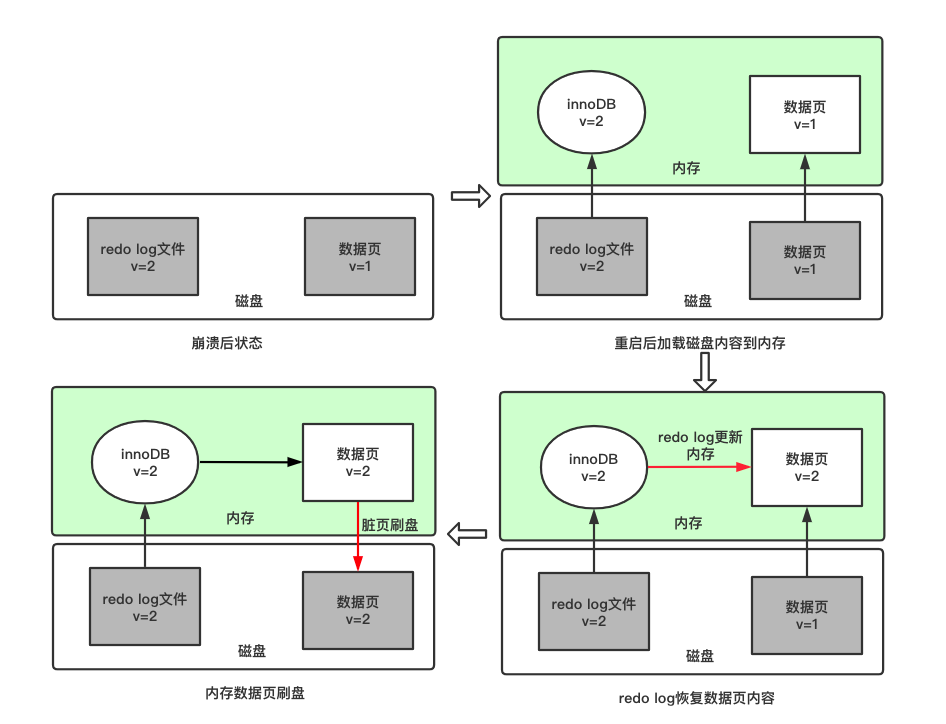 

        - undo log是mysql的回滚日志，当发生回滚时，InnoDB会根据undo log的内容做与之前相反的工作。

        |  | 日志类型           | 层次方式  | 文件内容方式 | 作用 |
        | ------------- |:-------------:| -----:| --:| --:|
        | binlog      | 逻辑日志，记录的是sql语句的原始逻辑 | binlog是Mysql的Server层实现的，所有引擎都可以使用 | binlog是可以追加写的，binlog文件写到一定大小会切换到下一个，不会覆盖以前的日志 | 主从复制、增量备份 |
        | redo log    | 物理日志，记录的是在某个数据页上做了什么修改      |   innoDB引擎特有 | redo log是循环写的，空间固定会用完，用完会覆盖老的数据 | 保证数据页数据正确 |
        | undo log    | 逻辑日志，记录的是sql语句的相反操作逻辑 | innoDB引擎特有 | 存储在回滚段(Rollback Segment)中，保存在ibdata系统表空间中 | 回滚事务、MVCC |

        - MyISAM 与 InnoDB 的区别
          1. InnoDB支持事务，MyISAM不支持。
          2. InnoDB支持外键，MyISAM不支持。
          3. MyISAM是默认引擎，InnoDB需要指定。
          4. InnoDB不支持FULLTEXT类型的索引。
          5. InnoDB中不保存表的行数，MyISAM会保存，当计算count(*)时MyISAM只要简单的读出保存好的行数即可。注意的是，当count(*)语句包含where条件时MyISAM也需要扫描整个表。
          6. 对于自增长的字段，InnoDB中必须包含只有该字段的索引，但是在MyISAM表中可以和其他字段一起建立联合索引。
          7. 清空整个表时，InnoDB是一行一行的删除，效率非常慢。MyISAM则会重建表。
          8. InnoDB支持行锁。
      </details>  

  - MySQL高可用
    - <details><summary>MySQL复制的工作原理</summary>
      
      复制分为3个步骤：
      - 主库将数据更改记录写到binlog
      - 备库启动一个I/O线程，与主库建立一个普通的客户端连接，然后在主库上启动一个binlog dump线程，这个线程会将主库上的binlog复制给备库，备库将收到的数据保存到自己的relay log（中继日志）
      - 备库启动一个SQL线程，读取中继日志中的事件，将其重放到自己的库上

      复制的方式：
      - 基于语句的复制，实际上就是将主库上执行过的SQL在备库上执行一遍
      - 基于行的复制，这种方式会将实际的数据记录在二进制日志中

      </details>

  - 其它
    - 通用
      - <details><summary>一些小点</summary>

        - 创建列时选择满足条件的最小数据类型
        - 尽量避免NULL，允许NULL的列会导致MySQL需要做一些特殊处理，同时占用的空间也可能更大
        - 可以为整数类型设置宽度，如int(11)，但是这只是能够帮助一些MySQL工具显示，对于真正的存储和计算过程，int(1)和int(20)是一样的
        - decimal不仅可以带有小数部分，也可以存储比bigint还大的整数，decimal类型支持精确计算
        - float和double类型通过cpu实现浮点运行，这种计算是近似计算，cpu不支持decimal的直接计算，MySQL自身实现了decimal的高精度计算，所以float和double类型的计算比decimal类型更快
        - varchar比char更省空间，因为varchar仅使用必要的空间（字符串越短使用的空间越短）。varchar需要额外的字节保存长度，当列的最大长度小于等于255时，只需要一个额外字节表示长度，否则2个字节，如varchar(10)需要11个字节的存储空间，varchar(1000)需要1002个字节
        - char类型是定长的，存储char类型的值时，MySQL会删除数据末尾的空格，同时会使用空格填充数据到指定长度
        - varchar类型在更新时可能会导致分裂页，因为更新的时候可能会改变数据的长度，而char是定长的，所以频繁更新数据、值是定长或者都接近一个长度时可以考虑使用char
        - 最好不要为varchar设置不需要的长度，虽然varchar(5)和varchar(200)在保存同一个字符串如'hello'时空间开销是一样的，但是更长的列会消耗更多的内存，如使用内存临时表进行排序的时候
        - datetime把日期封装到YYYYMMDDHHMMSS的整数中，与时区无关，使用8个字节存储，显示的时候会转换为"YYYY-MM-DD HH:MM:SS"的格式，而timestamp保存从1970.1.1午夜以来的秒数（UTC），使用4个字节存储，timestamp的值和时区相关，所以当值为0时，在美国东部时区会显示为"1969-12-31 19:00:00"，timestamp默认not null，插入时默认值为当前时间。处于空间效率的考虑，优先使用timestamp而不是datetime
        - MySQL使用二分查找法处理in()的查询条件，时间复杂度为O(logn)
        - MySQL执行查询的时候，会使用嵌套循环的方式来完成，如下面的语句：
          ```
          select tbl1.col1,tbl2.col2  
          from tbl1 inner join tbl2 using(col3) 
          where tbl1.col1 in(3,4);
          ``` 

          MySQL执行时的伪代码：
          ```
          outer_iter = iterator_over tbl1 where col1 in(3,4)
          outer_row = outer_iter.next
              while outer_row
              inner_iter = iterator over tbl2 where col3=outer_row.col3
              inner_row = inner_iter.next
              while inner_row
              output[outer_row.col1,inner_row.col2]
                  inner_row = inner_iter.next
              end
              out_row = outer_iter.next
          end
          ```

          如果改成左外连接，也是类似的：
          ```
          select tbl1.col1 ,tbl2.col2 
          from tbl1 left outer join tbl2 using (col3) 
          where tbl1.col1 in (3,4)
          ```

          伪代码：
          ```
          outer_iter = iterator over tbl1 where col1 in(3,4)
          outer row = outer_iter.next
          while outer_row
              inner_iter = iterator over tbl2 where col3 = outer_row.col3
              inner_row = inner_iter.next
              if inner_row
                  while inner_row
                      out_put [outer_row.col1,inner_row.col2]
                      inner_row = inner_iter.next
                  end
              else
                  out_put[outer_row.col1,NULL]        
              end
              outer_row = outer_iter.next
          end
          ```
        - MySQL缓存中的数据页是通过LRU算法管理的，但是MySQL的LRU实现和普通的LRU算法不同，MySQL的LRU定义了一个midpoint，默认指向LRU链表的5/8处。这个算法的运行过程时，以midpoint为界，midpoint之前的元素处于young区，midpoint及其后的位置为old区，当访问young区的数据页时，和普通LRU算法一样，将数据页放到链表头；当要新增一个数据页到链表时，淘汰掉链表的最后一个元素，并将新的数据页放到midpoint处，即新的数据页放到old区；当访问old区的数据页时，判断该数据页存在时间是否超过了阈值（默认1秒），超过则保存到链表头，否则位置不变。采用这个算法可以避免进行全表扫描时，访问到的数据页将LRU链表中的热数据淘汰，全表扫描期间很多数据页只会被访问一次，通过这种LRU算法使得全表扫描不会影响young区的缓存。
        - InnoDB的redo log是物理日志，记录的是在某个数据页上做了什么修改，由一组固定大小的文件组成，如每个文件1G，一共4个文件，则redo log大小为4G。由于redo log的大小有限，所以redo log的数据是从头开始写，写到末尾就又回到开头循环写。redo log文件的写入是只写数据到内存，每隔一秒刷新数据到数据文件或者当redo log空间不足时或者事务提交时刷新到数据文件，如下：
        

        图中的write pos是最新的写入位置，一边写一边后移，写到第3号文件末尾后就回到0号文件开头。checkpoint是要擦除的位置，也是往后推移并且循环的，擦除记录就是把内存中的记录刷新到数据文件并推进checkpoint的位置。write pos和checkpoint之间的绿色区域可以用来记录新的操作。如果write pos追上checkpoint，表示没有空间可写了，得停下来先擦掉一些记录，把checkpoint推进一下。
        - MySQL的binlog是逻辑日志，记录的是语句的原始逻辑，比如给id=2这一行的c字段加1。binlog是可以追加写入的，binlog文件写到一定大小后会切换到下一个，并不会覆盖以前的binlog日志。
        - 一条更新语句更新的是id=2这一行，其执行过程是：
          - 执行器先找引擎取id=2这一行。id是主键，引擎直接用树搜索找到这一行。如果id=2这一行所在的数据页本来就在内存中，就直接返回给执行器；否则，需要先从磁盘读入内存，然后再返回。
          - 执行器拿到引擎给的行数据，把这个值加上1，比如原来是N，现在就是N+1，得到新的一行数据，再调用存储引擎接口写入这行新数据。
          - 存储引擎将这行新数据更新到内存中，同时将这个更新操作记录到redo log，此时redo log处于prepare状态。然后告知执行器执行完成了，随时可以提交事务。
          - 执行器生成这个操作的binlog，并把binlog写入磁盘。执行器调用引擎的提交事务接口，引擎把刚刚写入的redo log改成提交（commit）状态，更新完成。

          上面将redo log的写入拆成了两个步骤：prepare和commit，这就是两阶段提交。两阶段提交是为了让两份日志之间的逻辑一致。如果没有两阶段提交，要么就是先写完redo log再写binlog，或者采用反过来的顺序。仍然用更新id=2的行举例，假设更新的字段c的值是0，再假设执行update语句过程中在写完第一个日志后，第二个日志还没有写完期间发生了crash，会出现什么情况呢？
          - 先写redo log后写binlog。假设在redo log写完，binlog还没有写完的时候，MySQL进程异常重启。redo log写完之后，系统即使崩溃，仍然能够把数据恢复回来，所以恢复后这一行c的值是1。但是由于binlog没写完就crash了，这时候binlog里面就没有记录这个语句。因此，之后备份日志的时候，存起来的binlog里面就没有这条语句。如果需要用这个binlog来恢复临时库或者配置主从的话，由于这个语句的binlog丢失，这个临时库就会少了这一次更新，恢复出来的这一行c的值就是0，与原库的值不同。
          - 先写binlog后写redo log。如果在binlog写完之后crash，由于redo log还没写，崩溃恢复以后这个事务无效，所以这一行c的值是0。但是binlog里面已经记录了c从0改成1这个日志。所以在之后用binlog来恢复的时候就多了一个事务出来，恢复出来的这一行c的值就是1，与原库的值不同。

          有了两阶段提交后是如何解决上面的问题呢？还是上面的例子，一条更新语句的执行过程如下：
           

          - 如果在图中时刻A，也就是写入redo log处于prepare阶段之后,写binlog之前，发生了崩溃，由于此时binlog还没写，redo log也还没提交，所以崩溃恢复的时候，这个事务会回滚。这时候，binlog还没写，所以也不会传到备库。
          - 如果奔溃发生在时刻B，也就是binlog写完，redo log还没commit前发生crash，那么会如下处理：
            - 如果redo log里面的事务是完整的，也就是已经有了commit标识，则直接提交；
            - 如果redo log里面的事务只有完整的prepare，则判断对应的事务binlog是否存在并完整，如果是，则提交事务，否则回滚事务。
          - MySQL的undo log和redo log一样，作用都是恢复数据，只不过针对的数据不一样。undo log能够回滚行记录到某个特定版本，redo log恢复提交的事务修改的页的操作。undo log记录的是逻辑日志，一个事务中每个insert操作，都会有一个对应的delete记录，每个delete操作，都会有一个对应的insert记录，每个update操作，都会有一个相反的update记录，事务的回滚就是通过undo log完成的。undo log的另一个用处的支持MVCC  
      </details>

- 缓存
  - 基础知识
    - <details><summary>缓存和数据库一致性</summary>

      #### 使用较短的过期时间
       
      缓存时间适当调短，让缓存数据及早过期后，然后从DB重新加载，确保数据的最终一致性

      #### 写操作时先更新数据库，再删除缓存，读操作时先读缓存，miss时读数据库并更新到缓存
     
      在这种策略下，出现数据库与缓存数据不一致的概率很低，需要出现如下情况：
      1. 读请求到来时缓存刚好失效
      2. 执行读请求的线程A查询数据库，得一个旧值
      3. 线程B将新值写入数据库
      4. 线程B删除缓存
      5. 线程A将查到的旧值写入缓存

      这个条件需要发生在读缓存时缓存失效，而且并发着有一个写操作。而实际上数据库的写操作会比读操作慢得多，而且还要锁表，而读操作必需在写操作前进入数据库操作，而又要晚于写操作更新缓存，所有的这些条件都具备的概率基本并不大，这种策略也叫`Cache Aside Pattern`

      另外需要注意的是更新数据库后的删除操作是有可能失败的，当失败时，可以将需要删除的key发送到消息队列中异步删除

      #### 将删除缓存、修改数据库、读取缓存等的操作积压到队列里边，实现串行化
      这种方案实时性可能没那么高了 

      #### 异步更新缓存（基于订阅binlog的同步机制）
       
      MySQL binlog增量订阅消费+消息队列+增量数据更新到redis
    
      读Redis：热数据基本都在Redis

      写MySQL：增删改都是操作MySQL

      更新Redis数据：MySQ的数据操作binlog，来更新到Redis
      
      使用canal（阿里的一款开源框架），通过该框架可以对MySQL的binlog进行订阅，再将数据发送到MQ或者Redis
      </details>  

    - <details><summary>缓存穿透，缓存击穿，缓存雪崩</summary>

      #### 缓存穿透
      缓存穿透是指查询一个一定不存在的数据，由于缓存是不命中时被动写的，并且出于容错考虑，如果从存储层查不到数据则不写入缓存，这将导致这个不存在的数据每次请求都要到存储层去查询，失去了缓存的意义。在流量大时，可能DB就挂掉了

      解决方案：
      1. 采用布隆过滤器，将所有可能存在的数据哈希到一个足够大的bitmap中，一个一定不存在的数据会被这个bitmap拦截掉，从而避免了对底层存储系统的查询压力。
      2. 完全以缓存为准，使用延迟异步加载的策略(异步线程负责维护缓存的数据，定期或根据条件触发更新)，这样就减少了查询数据库的次数。
      3. 另外也有一个更为简单粗暴的方法，如果一个查询返回的数据为空（不管是数据不存在，还是系统故障），仍然把这个空结果进行缓存，或者设置结果为一个特殊值，并为这个结果设置一个较短的超时时间，防止这种不存在的key占用太久的缓存空间导致正常key的命中率下降，或者直接将这些不存在的key放到一个独立的公共缓存作为非法key缓存，从缓存查找时，先查正常的缓存组件，如果miss，则查一下公共的非法key的缓存，如果后者命中，直接返回，否则到DB进行查询，如果查出来是空，则保存到非法key缓存，否则保存到正常缓存

      #### 缓存雪崩
      缓存雪崩是指设置缓存时采用了相同的过期时间，导致缓存在某一时刻同时失效，请求全部转发到DB，DB瞬时压力过重雪崩

      解决方案：
      1. 设置随机缓存过期时间
      2. 设置热点数据永远不过期，有更新操作就更新缓存就好了（比如运维更新了首页商品，那刷下缓存就完事了，不要设置过期时间），电商首页的数据也可以用这个操作，保险       。

      缓存雪崩的另一个场景是缓存节点不可用了导致缓存雪崩，包括：
      1. 多个缓存节点挂了，请求穿透导致DB也过载不可用，最终整个系统雪崩不可用的
      2. 对于采用一致性Hash策略的缓存集群，突发洪水流量来临时，部分缓存节点过载Crash甚至宕机，然后根据一致性Hash策略，这些异常节点的请求转到其他缓存节点，又导致其他缓存节点过载异常，最终整个缓存池过载

      针对上面的两个问题，解决方案是：
      1. 对业务DB的访问增加读写开关，当发现DB请求变慢、阻塞，慢请求超过阀值时，就会关闭读开关，部分或所有读DB的请求进行failfast立即返回，待DB恢复后再打开读开关
      2. 对缓存单个节点增加多个副本，缓存异常或请求miss后，再读取其他缓存副本，而且多个缓存副本尽量部署在不同机架，从而确保在任何情况下，缓存系统都会正常对外提供服务
      3. 对缓存体系进行实时监控，当请求访问的慢速比超过阀值时，及时报警，通过机器替换、服务替换进行及时恢复；也可以通过各种自动故障转移策略，自动关闭异常接口、停止边缘服务、停止部分非核心功能等措施减少集群压力，确保在极端场景下，核心功能的正常运行

      #### 缓存击穿
      缓存在某个时间点过期的时候，恰好在这个时间点对这个Key有大量的并发请求过来，这些请求发现缓存过期一般都会从后端DB加载数据并回设到缓存，这个时候大并发的请求可能会瞬间把后端DB压垮

      解决方案：
      1. 在应用中使用本地锁限制只能由一个线程查询数据库并更新缓存，这种实现简单，但是在应用的副本数较多的情况下还是会对数据库造成较大的压力。
      2. 完全以缓存为准，使用延迟异步加载的策略(异步线程负责维护缓存的数据，定期或根据条件触发更新)，这样就减少了查询数据库的次数。
      3. 使用互斥锁
      在缓存失效的时候（判断拿出来的值为空），不是立即去load db，而是先使用缓存工具的某些带成功操作返回值的操作（比如Redis的SETNX）去set一个mutex key，当操作返回成功时，再进行load db的操作并回设缓存；否则，就重试整个get缓存的方法：
      ```
      public String get(key) {
          String value = redis.get(key);
          if (value == null) { //代表缓存值过期
              // 设置3min的超时，防止del操作失败的时候，下次缓存过期一直不能load db
            if (redis.setnx(key_mutex, 1, 3 * 60) == 1) {  // 代表设置成功
              value = db.get(key);
              redis.set(key, value, expire_secs);
              redis.del(key_mutex);
            } else {  // 这个时候代表同时候的其他线程已经load db并回设到缓存了，这时候重试获取缓存值即可
              sleep(50);
              get(key);  // 重试
            }
          } else {
              return value;      
          }
       }
      ```

      </details>

    - <details><summary>Hot key和Big key</summary>

      #### Hot key
      Hot key引发缓存系统异常，主要是因为突发热门事件发生时，超大量的请求访问热点事件对应的key，流量集中打在一个缓存节点机器，这个缓存机器很容易被打到物理网卡、带宽、CPU 的极限，从而导致缓存访问变慢、卡顿

      要解决这种极热key的问题，首先要找出这些Hot key来：
      1. 对于重要节假日、线上促销活动、集中推送这些提前已知的事情，可以提前评估出可能的热key来。
      2. 对于突发事件，无法提前评估，可以通过Spark，对应流任务进行实时分析，及时发现新发布的热点key。
      3. 对于之前已发出的事情，逐步发酵成为热key的，则可以通过Hadoop对批处理任务离线计算，找出最近历史数据中的高频热key

      找到热key后，就有很多解决办法了。首先可以将这些热key进行分散处理，比如一个热key名字叫hotkey，可以被分散为hotkey#1、hotkey#2、hotkey#3，……hotkey#n，这n个key分散存在多个缓存节点，然后client端请求时，随机访问其中某个后缀的hotkey，这样就可以把热key的请求打散，避免一个缓存节点过载

      业务端还可以使用本地缓存，将这些热key记录在本地缓存，来减少对远程缓存的冲击

      #### Big key
      指在缓存访问时，部分Key的Value 过大，读写、加载易超时的现象

      解决方案：
      1. 如果数据存在Redis中，比如业务数据存set格式，大key对应的set结构有几千几万个元素，这种写入Redis时会消耗很长的时间，导致Redis卡顿。此时，可以扩展新的数据结构，同时让client在这些大key写缓存之前，进行序列化构建，然后通过restore一次性写入
      2. 将大key分拆为多个 key，尽量减少大key的存在。同时由于大key一旦穿透到DB，加载耗时很大，所以可以对这些大key进行特殊照顾，比如设置较长的过期时间，比如缓存内部在淘汰key时，同等条件下，尽量不淘汰这些大key
      3. 每次只存取部分数据，将大key存储为hash，每个field代表具体属性，使用hget，hmget来获取部分value，使用hset，hmset来更新部分属性
          
      </details>  

  - Redis
    - <details><summary>Redis数据结构</summary>
     
        #### SDS
        Redis是用C语言开发完成的，但在Redis字符串中，并没有使用C语言中的字符串，而是用一种称为SDS（Simple Dynamic String）的结构体来保存字符串，Sds 在 Redis 中的主要作用有以下两个：
        - 实现字符串对象（StringObject）；
        - 在 Redis 程序内部用作 char* 类型的替代品，因为 char* 类型的功能单一，抽象层次低， 并且不能高效地支持一些 Redis 常用的操作（比如追加操作和长度计算操作）， 所以在 Redis 程序内部，绝大部分情况下都会使用 sds 而不是 char* 来表示字符串。

        SDS 的结构：
        1. len：用于记录 buf 中已使用空间的长度
        2. free：buf 中空闲空间的长度
        3. buf[]：存储实际内容

        SDS与C字符串的区别：
        1. 常数时间内获得字符串长度
        2. 避免缓冲区溢出：SDS的API修改时首先会检查空间是否足够，若不充足则会分配新空间，避免了缓冲区溢出问题
        3. 减少字符串修改时带来的内存重新分配的次数：当SDS的API对一个SDS修改后，并且对SDS空间扩充时，程序不仅会为SDS分配所需要的必须空间，还会分配额外的未使用空间，并且，当对SDS进行缩短操作时，程序并不会回收多余的内存空间，而是使用free字段将这些字节数量记录下来不释放，后面如果需要append操作，则直接使用free中未使用的空间，减少了内存的分配
        4. 二进制安全：二进制数据并不是规则的字符串格式，其中会包含一些特殊的字符如'\0'，在C语言中遇到'\0'则表示字符串的结束，但在SDS中，标志字符串结束的是len属性
        
        #### 双端链表
        双端链表还是 Redis 列表类型的底层实现之一，当对列表类型的键进行操作，比如执行 RPUSH 、LPOP 或 LLEN 等命令时，程序在底层操作的可能就是双端链表。
        
        Redis 列表使用两种数据结构作为底层实现：
        - 双端链表
        - 压缩列表
        因为双端链表占用的内存比压缩列表要多，所以当创建新的列表键时，列表会优先考虑使用压缩列表作为底层实现，并且在有需要的时候，才从压缩列表实现转换到双端链表实现。

        双端链表的实现由 listNode 和 list 两个数据结构构成：
        ```
        // 双端链表的节点
        typedef struct listNode {
            // 前驱节点
            struct listNode *prev;
            // 后继节点
            struct listNode *next;
            // 值
            void *value;

        } listNode;

        // 双端链表
        typedef struct list {
            // 表头指针
            listNode *head;
            // 表尾指针
            listNode *tail;
            // 节点数量
            unsigned long len;
            // 复制函数
            void *(*dup)(void *ptr);
            // 释放函数
            void (*free)(void *ptr);
            // 比对函数
            int (*match)(void *ptr, void *key);
        } list;
        ```

        #### 字典
        字典的主要用途有以下两个：
        - 实现数据库键空间（key space）；
        - 用作 Hash 类型键的底层实现之一；

        Redis以哈希表作为字典的底层实现，通过链表解决hash冲突。 
        ```
        // 字典
        typedef struct dict{
            // 特定于类型的处理函数
            dictType *type;
            // 类型处理函数的私有数据
            void *privdata;
            // 使用两个哈希表，用于实现渐进式 rehash
            dictht ht[2];
            // 记录 rehash 进度的标志，值为 -1 表示 rehash 未进行
            int trehashidx;
            // 当前正在运作的安全迭代器数量
            int iterators;
        }

        // 哈希表
        typedef struct dictht {
            // 哈希表节点指针数组（俗称桶，bucket）
            dectEntrt **table;
            // 指针数组的大小
            unsigned long size;
            // 指针数组的长度掩码，用于计算索引值
            unsigned long sizemask;
            // 哈希表已有节点数量
            unsigned long used;
        }

        // 哈希表节点
        typedef struct dictEntry {
            // 键
            void *key;
            // 值
            union {
                void *val;
                uint64_t u64;
                int64_t s64;
            } v;
            // 链往后继节点
            struct dictEntry *next;
        }
        ```
        dict中存储了一个dictht的数组，长度为2，表明这个数据结构中实际存储着两个哈希表ht[0]和ht[1]，为什么要存储两张hash表呢？

        是为了Rehash，Rehash的过程如下：
        1. 为ht[1]分配空间。如果是扩容操作，ht[1]的大小为第一个大于等于ht[0].used*2的2^n；如果是缩容操作，ht[1]的大小为第一个大于等于ht[0].used的2^n。
        2. 将ht[0]中的键值Rehash到ht[1]中。
        3. 当ht[0]全部迁移到ht[1]中后，释放ht[0]，将ht[1]置为ht[0]，并为ht[1]创建一张新表，为下次Rehash做准备

        由于Redis的Rehash操作是将ht[0]中的键值全部迁移到ht[1]，如果数据量小，则迁移过程很快。但如果数据量很大，一个Hash表中存储了几万甚至几百万几千万的键值时，迁移过程很慢并会影响到其他用户的使用。

        为了避免Rehash对服务器性能造成影响，Redis采用了一种渐进式Rehash的策略，分多次、渐进的将ht[0]中的数据迁移到 ht[1] 中。过程如下：
        1. 为ht[1]分配空间，让字典同时拥有ht[0]和ht[1]两个哈希表。
        2. 字典中维护一个rehashidx，并将它置为0，表示Rehash开始。
        3. 在Rehash期间，每次对字典操作时，程序还顺便将ht[0]在rehashidx索引上的所有键值对rehash到ht[1]中，当Rehash完成后，将rehashidx属性+1。当全部rehash完成后，将rehashidx置为-1，表示rehash完成。redis也会定时的对数据库字典进行主动rehash。
        4. 由于维护了两张Hash表，所以在Rehash的过程中内存会增长。另外，在Rehash过程中，字典会同时使用ht[0]和ht[1]。在删除、查找、更新时会在两张表中操作，在查询时会现在第一张表中查询，如果第一张表中没有，则会在第二张表中查询。但新增时一律会在ht[1]中进行，确保ht[0]中的数据只会减少不会增加。
        
        #### 压缩列表
        压缩列表ziplist是为Redis节约内存而开发的，是列表键和字典键的底层实现之一。

        当元素个数较少时，Redis用ziplist来存储数据，当元素个数超过某个值时，链表键中会把ziplist转化为linkedlist，字典键中会把ziplist转化为hash。ziplist由一系列特殊编码的连续内存块组成的顺序型数据结构，一个压缩列表可以包含任意多个节点（entry），每个节点可以保存一个字节数组或者一个整数值。

        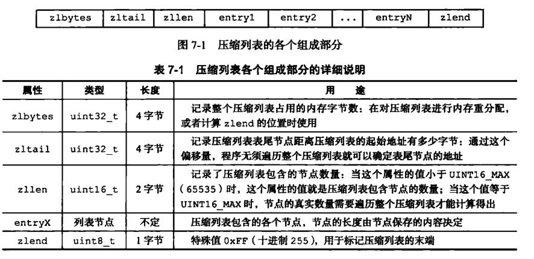 

        每个entry组成如下图。previous_entry_length保存前一个节点的长度，遍历时可根据定位到前一个节点。encoding存储content的类型和长度，content保存节点的内容。

        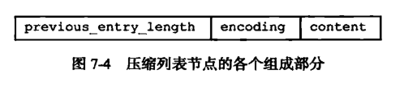 

        #### zset
        zset底层使用压缩列表（ziplist）或跳表+字典实现，使用压缩列表的前提是zset保存的元素数量小于128，并且每个元素长度小于64字节（这两个参数可以通过zset-max-ziplist-entries 选项和 zset-max-ziplist-value 进行修改）。

        字典和跳跃表：
        ```
        typedef struct zset{
             //跳跃表
             zskiplist *zsl;
             //字典
             dict *dice;
        } zset;

        // 跳跃表
        typedef struct zskiplist {
            // 头节点，尾节点
            struct zskiplistNode *header, *tail;
            // 节点数量
            unsigned long length;
            // 目前表内节点的最大层数
            int level;

        } zskiplist;

        // 跳跃表的节点
        typedef struct zskiplistNode {
            // member 对象
            robj *obj;
            // 分值
            double score;
            // 后退指针
            struct zskiplistNode *backward;
            // 层
            struct zskiplistLevel {
                // 前进指针
                struct zskiplistNode *forward;
                // 这个层跨越的节点数量
                unsigned int span;
            } level[];
        } zskiplistNode;
        ```
        字典的键保存元素的值，字典的值则保存元素的分值；跳跃表节点的 obj 属性保存元素的值，跳跃表节点的 score 属性保存元素的分值。

        ##### 为什么不直接用跳跃表?
        假如我们单独使用 字典，虽然能以 O(1) 的时间复杂度查找成员的分值，但是因为字典是以无序的方式来保存集合元素，所以每次进行范围操作的时候都要进行排序；假如我们单独使用跳跃表来实现，虽然能执行范围操作，但是查找操作有 O(1)的复杂度变为了O(logN)。因此Redis使用了两种数据结构来共同实现有序集合。

        </details> 

    - <details><summary>Redis为什么那么快</summary>
     
      1. 完全基于内存，绝大部分请求是纯粹的内存操作，非常快速
      2. 优化的数据结构：Redis有诸多可以直接应用的优化数据结构的实现，应用层可以直接使用原生的数据结构提升性能
      3. 采用单线程，避免了不必要的上下文切换和竞争条件，也不存在多进程或者多线程导致的切换而消耗CPU，不用去考虑各种锁的问题，不存在加锁释放锁操作，没有因为可能出现死锁而导致的性能消耗
      4. 使用多路I/O复用模型，非阻塞IO

      </details> 

    - <details><summary>内存淘汰机制</summary>

      #### Redis内存不足时的淘汰策略
      1. noeviction: 当内存不足以容纳新写入数据时，新写入操作会报错。
      2. allkeys-lru：当内存不足以容纳新写入数据时，在键空间中，移除最近最少使用的key。
      3. allkeys-random：当内存不足以容纳新写入数据时，在键空间中，随机移除某个key，这个一般没人用。
      4. volatile-lru：当内存不足以容纳新写入数据时，在设置了过期时间的键空间中，移除最近最少使用的key（这个一般不太合适）。
      5. volatile-random：当内存不足以容纳新写入数据时，在设置了过期时间的键空间中，随机移除某个key。
      6. volatile-ttl：当内存不足以容纳新写入数据时，在设置了过期时间的键空间中，有更早过期时间的key优先移除。

      </details>

    - <details><summary>为什么Redis的集群槽数等于16384</summary>

      首先16384等于2^14，取模的时候很方便
      
      Redis客户端请求集群key时公式是
      ```
      HASH_SLOT=CRC16(key) mod 16384
      ```

      CRC16算法产生的hash值有16bit，该算法可以产生2^16=65536个值。换句话说，值是分布在0~65535之间，Redis不使用65536而用16384是因为：
      1. 集群的节点之间需要知道对方的存在，初始情况下两个redis节点想要感知对方，需要在其中一个节点运行`cluster meet 另一个节点IP:端口`，在感知之后，每个节点会定期发送ping/pong消息维护集群状态并交换集群信息，redis的集群模式可能存在的消息有：
         1. MEET消息：当发送者接收到客户端发送的cluster meet命令时，发送者会向接收者发送meet消息，请求接收加入到发送者所在的集群里
         2、PING消息：集群里用来检测相应节点是否在线的消息，每个节点默认每隔一秒从节点列表随机选5个节点，然后对最长时间没有收到PONG回复的节点发送PING消息。此外，如果上次收到某个节点的PONG消息回复的时间，距离当前时间超过了cluster-node-time选项设置的一半，那么会对此节点发送PING消息，这样可以防止节点长期没被随机到，而导致长期没有发送PING检测是否存活
         3、PONG消息：当接收者收到发送者发来的meet消息或者ping消息时，为了向发送者确认这条meet消息或者ping消息已到达，接收者向发送者返回一条pong消息。另外，一个节点也可以通过向集群广播自己的pong消息来让集群中的其他节点立即刷新关于这个节点的认识，例如当一次故障转移操作成功执行之后，新的主节点会向集群广播一条pong消息，以此来让集群中的其他节点立即知道这个节点已经变成了主节点，并且接管了已下线节点负责的槽
         4、FAIL消息：当一个主节点a判断另外一个主节点b已经进入fail状态时，节点a向集群广播一条关于节点b的fail消息，所有收到这条消息的节点都会立即将节点b标记为已下线
         5、PUBLISH消息：当节点接收到一个PUBLISH命令时，节点会执行这个命令，并向集群广播一条PUBLISH消息，所有接收到PUBLISH消息的节点都会执行相同的PUBLISH命令
      这里需要关注三个重点：
        1. 交换什么数据信息
        2. 数据信息究竟多大
        3. 定期的频率什么样
      交换的数据信息，由消息体和消息头组成。消息体无外乎是一些节点标识、IP、端口号、发送时间等，重点在消息头，结构如下：
      ```
      typedef struct {
          char sig[4]; /* 信号标示 */
          uint32_t totlen; /* 消息总长度 */
          uint16_t ver; /* 协议版本 */
          uint16_t type; /* 消息类型，用于区分meet，ping，ping等消息 */
          uint16_t count; /* 消息体包含的节点数量，仅用于meet，ping，pong消息类型 */
          uint64_t currentEpoch; /* 当前发送节点的配置纪元 */
          uint64_t configEpoch; /* 主节点/从节点的主节点配置纪元 */
          uint64_t offset; /* 复制偏移量 */
          char sender[CLUSTER_NAMELEN]; /* 发送节点的nodeId */
          unsigned char myslots[CLUSTER_SLOTS/8]; /* 发送节点负责的槽信息 */
          char slaveof[CLUSTER_NAMELEN]; /* 如果发送节点是从节点，记录对应主节点的nodeId */
          uint16_t port; /* 端口号 */
          uint16_t flags; /* 发送节点标识，区分主从角色，是否下线等 */
          unsigned char state; /* 发送节点所处的集群状态 */
          unsigned char mflags[3]; /* 消息标识 */
          union clusterMsgData data; /* 消息正文 */
      } clusterMsg;
      ```
      消息头里面有个myslots的char数组，长度为16383/8，这其实是一个bitmap，每一个位代表一个槽，如果该位为1，表示这个槽是属于这个节点的，数组元素是unsigned char，占用1个字节，这块的大小是: 16384/8=2kb，如果用65536而不是16384，则块大小是8kb，由于需要频繁发送消息，8kb会占用相当大的带宽。
      1. 消息体中也会携带一定数量的其他节点信息用于交换，节点数量约为集群总节点数量的1/10，至少携带3个节点的信息。消息体大小是10个节点的状态信息约占1kb，所以集群节点越多，心跳包的消息体内携带的数据越多。如果节点过1000个，也会导致网络拥堵。因此redis作者，不建议redis cluster节点数量超过1000个。那么，对于节点数在1000以内的redis cluster集群，16384个槽位够用了。没有必要拓展到65536个，redis的集群主节点数量基本不可能超过1000个
      2. 槽位越小，节点少的情况下，压缩比高
      3. redis主节点的配置信息中，它所负责的哈希槽是通过一张bitmap的形式来保存的，在传输过程中，会对bitmap进行压缩，但是如果bitmap的填充率slots/N很高的话(N表示节点数)，bitmap的压缩率就很低。如果节点数很少，而哈希槽数量很多的话，bitmap的压缩率就很低

      </details>

    - <details><summary>Redis持久化</summary>
      Redis的持久化有两个方式：

      - 快照：将存在于某一时刻的所有数据都写入硬盘里面
       
        发起快照的方式：
        - 向Redis发送BGSAVE命令，Redis将开启子线程创建快照
        - 向Redis发送SAVE命令，Redis在快照创建完成前不会响应其他命令
        - 如果用户设置了save配置选项，比如save 60 10000，那么从Redis最近一次创建快照之后开始算起，当“60秒之内有10000次写入”这个条件被满足时，Redis就会自动触发BGSAVE命令。
        - 当Redis通过SHUTDOWN命令接收到关闭服务器的请求时，或者接收到标准TERM信号时，会执行一个SAVE命令，并在执行完毕后关闭服务器
        - 当一个Redis服务器连接另一个Redis服务器，并向对方发送SYNC命令来开始一次复制操作的时候，如果主服务器目前没有在执行BGSAVE操作，或者主服务器并非刚刚执行完BGSAVE操作，那么主服务器就会执行BGSAVE命令

        快照的持久化方式缺点是最后一次快照后到系统奔溃时之间的数据将会丢失，而且如果Redis的数据库很大，则BGSAVE命令会执行很长时间，可能也会导致Redis停顿

      - 只追加文件（AOF）：在执行写命令时，将被执行的写命令复制到硬盘里面

        AOF相关选项：
        - appendonly：是否开启AOF
        - appendfsync：影响AOF文件的同步频率，由于AOF是将命令写入文件，而写入文件操作再调用file.write()方法时，写入的内容首先会被存储到缓冲区，然后操作系统会在将来的某个时候将缓冲区存储的内容写入硬盘，而数据只有在被写入硬盘之后，才算是真正地保存到了硬盘里面，用户可以通过调用file.flush()方法来请求操作系统尽快地将缓冲区存储的数据写入硬盘里，但具体何时执行写入操作仍然由操作系统决定。除此之外，用户还可以命令操作系统将文件同步（sync）到硬盘，同步操作会一直阻塞直到指定的文件被写入硬盘为止，appendfsync选项可以控制合适执行sync
          - always：每个Redis写命令都要同步写入硬盘。这样做会严重降低Redis的速度
          - everysec：每秒执行一次同步，显式地将多个写命令同步到硬盘
          - no：让操作系统来决定应该何时进行同步，这个选项在一般情况下不会对Redis的性能带来影响，但系统崩溃将导致使用这种选项的Redis服务器丢失不定数量的数据。另外，如果用户的硬盘处理写入操作的速度不够快的话，那么当缓冲区被等待写入硬盘的
          数据填满时，Redis的写入操作将被阻塞，并导致Redis处理命令请求的速度变慢。因为这个原因，一般来说并不推荐使用appendfsync no选项
        - auto-aof-rewrite-percentage：配置执行BGREWRITEAOF的时机
        - auto-aof-rewrite-min-size：配置执行BGREWRITEAOF的时机

        随着Redis的运行，AOF文件的体积也会越来越大，为了解决AOF文件体积不断增大的问题，用户可以向Redis发送BGREWRITEAOF命令，这个命令会通过移除AOF文件中的冗余命令来重写（rewrite）AOF文件，使AOF文件的体积变得尽可能地小。BGREWRITEAOF的工作原理和BGSAVE创建快照的工作原理非常相似：Redis 会创建一个子进程，然后由子进程负责对 AOF 文件进行重写。

        跟快照持久化可以通过设置save选项来自动执行BGSAVE一样，AOF持久化也可以通过设置auto-aof-rewrite-percentage选项和auto-aof-rewrite-min-size选项来自动执行BGREWRITEAOF。假设用户对Redis设置了配置选项auto-aof-rewrite-percentage
        100和auto-aof-rewrite-min-size 64mb，并且启用了AOF持久化，那么当AOF文件的体积大于64 MB，并且AOF文件的体积比上一次重写之后的体积大了至少一倍（100%）的时候，Redis将执行BGREWRITEAOF命令。

        当对AOF进行rewrite时，首先会fork一个子进程。子进程轮询所有RedisDB快照，将所有内存数据转为cmd，并写入临时文件。比如如果服务器对键 list 执行了以下四条命令：
        ```
        RPUSH list 1 2 3 4      // [1, 2, 3, 4]
        RPOP list               // [1, 2, 3]
        LPOP list               // [2, 3]
        LPUSH list 1            // [1, 2, 3]
        ```
        那么当前列表键 list 在数据库中的值就为 [1, 2, 3] 。AOF在rewrite时不是去AOF文件上分析前面执行的四条命令，而是直接读取list键在数据库的当前值，然后用一条RPUSH 1 2 3命令来代替前面的四条命令。根据键的类型，使用适当的写入命令来重现键的当前值，这就是AOF重写的实现原理。整个重写过程可以用伪代码表示如下：
        ```
        def AOF_REWRITE(tmp_tile_name):

        f = create(tmp_tile_name)

        # 遍历所有数据库
        for db in redisServer.db:

          # 如果数据库为空，那么跳过这个数据库
          if db.is_empty(): continue

          # 写入 SELECT 命令，用于切换数据库
          f.write_command("SELECT " + db.number)

          # 遍历所有键
          for key in db:

            # 如果键带有过期时间，并且已经过期，那么跳过这个键
            if key.have_expire_time() and key.is_expired(): continue

            if key.type == String:

              # 用 SET key value 命令来保存字符串键

              value = get_value_from_string(key)

              f.write_command("SET " + key + value)

            elif key.type == List:

              # 用 RPUSH key item1 item2 ... itemN 命令来保存列表键

              item1, item2, ..., itemN = get_item_from_list(key)

              f.write_command("RPUSH " + key + item1 + item2 + ... + itemN)

            elif key.type == Set:

              # 用 SADD key member1 member2 ... memberN 命令来保存集合键

              member1, member2, ..., memberN = get_member_from_set(key)

              f.write_command("SADD " + key + member1 + member2 + ... + memberN)

            elif key.type == Hash:

              # 用 HMSET key field1 value1 field2 value2 ... fieldN valueN 命令来保存哈希键

              field1, value1, field2, value2, ..., fieldN, valueN =\
              get_field_and_value_from_hash(key)

              f.write_command("HMSET " + key + field1 + value1 + field2 + value2 +\
                              ... + fieldN + valueN)

            elif key.type == SortedSet:

              # 用 ZADD key score1 member1 score2 member2 ... scoreN memberN
              # 命令来保存有序集键

              score1, member1, score2, member2, ..., scoreN, memberN = \
              get_score_and_member_from_sorted_set(key)

              f.write_command("ZADD " + key + score1 + member1 + score2 + member2 +\
                              ... + scoreN + memberN)

            else:

              raise_type_error()

            # 如果键带有过期时间，那么用 EXPIREAT key time 命令来保存键的过期时间
            if key.have_expire_time():
              f.write_command("EXPIREAT " + key + key.expire_time_in_unix_timestamp())

          # 关闭文件
          f.close()
        ```
        
        在子进程rewriteaof时，主进程可以继续执行用户请求，执行完毕后将写指令写入旧的AOF文件和rewrite缓冲。子进程将RedisDB中数据落地完毕后，通知主进程。主进程从而将AOF rewrite缓冲数据写入AOF临时文件，然后用新的AOF文件替换旧的AOF文件，最后通过BIO线程异步关闭旧的AOF文件。至此，AOF的rewrite过程就全部完成了

      - 混合持久化

        Redis在4.0版本之后，引入了混合持久化方式，而且在5.0版本后默认开启。RDB加载速度快，但构建慢，缺少最新数据。AOF持续追加最新写记录，可以包含所有数据，但冗余大，加载速度慢。混合模式一体化使用RDB和AOF，综合RDB和AOF的好处。即可包含全量数据，加载速度也比较快。可以使用aof-use-rdb-preamble配置来明确打开混合持久化模式

        混合持久化也是通过bgrewriteaof来实现的。当启用混合存储后，进行bgrewriteaof时，主进程首先依然是fork一个子进程，子进程首先将内存数据以RDB的二进制格式写入AOF临时文件中。然后，再将落地期间缓冲的新增写指令，以命令的方式追加到临时文件。然后再通知主进程落地完毕。主进程将临时文件修改为AOF文件，并关闭旧的AOF文件。这样主体数据以RDB格式存储，新增指令以命令方式追加的混合存储方式进行持久化。后续执行的任务，以正常的命令方式追加到新的AOF文件即可

      </details>
    
    - <details><summary>Redis高可用</summary>
      
      #### 复制
      使用slaveof选项或执行SLAVEOF命令让一个服务器去复制另一个服务器，这是最简单的Redis高可用部署

      在设置好主从后，需要同步主从服务器的数据，从服务器对主服务的同步操作在旧版（Redis2.8之前）的Redis中需要通过sync命令来实现，以下是sync命令的执行步骤：
      1. 从服务器向主服务器发送sync命令
      2. 收到sync命令后，主服务器执行bgsave命令，用来生成rdb文件，并在一个缓冲区中记录从现在开始执行的写命令
      3. bgsave执行完成后，将生成的rdb文件发送给从服务器，用来给从服务器更新数据
      4. 主服务器再将缓冲区记录的写命令发送给从服务器，从服务器执行完这些写命令后，此时的数据库状态便和主服务器一致了

      在完成同步之后，也许主服务器马上就接受到了新的写命令，执行完该命令后，主从的数据库状态又不一致。

      为了再次让主从数据库状态一致，主服务器就需要向从服务器执行命令传播操作 ，即把刚才造成不一致的写命令，发送给从服务器去执行。从服务器执行完成之后，主从数据库状态就又恢复一致了，这一过程叫命令传播

      这种同步方式的缺陷是，主从同步实际分2种情况：
      1. 初次复制：从服务器第一次执行SLAVEOF命令复制当前主服务器
      2. 断线后重复制：处于命令传播阶段的主从服务器，因为网络问题而中断复制，从服务器通过自动重连，重新连接上主服务器并继续复制

      在断线后重复制的情况下，在2.8版本之前，会再次执行同步（sync 命令）和命令传播。

      如果说，在断线期间，主服务器（已有上万键值对）只执行了几个写命令，为了让从服务器弥补这几个命令，却要重新执行sync来生成新的rdb文件，这是非常低效的

      为了解决这个问题，2.8开始就使用psync命令来代替sync命令去执行同步操作，psync具有完整重同步和部分重同步两种模式：
      1. 完整重同步：用于初次复制情况，执行过程同sync，在这不赘述了。
      2. 部分重同步：用于断线后重复制情况，如果满足一定条件，主服务器只需要将断线期间执行的写命令发送给从服务器即可

      上面说到的满足一定条件就是psync实现部分重同步功能时涉及到的条件，部分重同步功能由以下 3 部分组成：
      1. 主从服务器的复制偏移量
      2. 主服务器的复制积压缓冲区
      3. 服务器的运行id（run id）

      ##### 复制偏移量
      执行复制的主从服务器都会分别维护各自的复制偏移量：
      1. 主服务器每次向从服务器传播n个字节数据时，都会将自己的复制偏移量加n。
      2. 从服务器接受主服务器传来的数据时，也会将自己的复制偏移量加n
      
      正常情况下主从服务器的复制偏移量应该是相等的（不考虑命令正在传播的过程），如果从服务器挂了一段时间后启动了，他的复制偏移量和主服务器就有差距，那么主服务器应该对从服务器执行完整重同步还是部分重同步呢？如果执行部分重同步的话，主服务器又如何知道同步哪些数据给从服务器呢？答案和复制积压缓冲区有关

      ##### 复制积压缓冲区
      复制积压缓冲区是一个固定长度，先进先出的队列，默认1MB

      当主服务器进行命令传播时，不仅会将命令发送给从服务器，还会发送给这个缓冲区，发送的命令和缓存区里的值都有命令内容和命令的复制偏移量

      当从服务器向主服务器发送psync命令时，还需要将自己的复制偏移量带上，主服务器就可以通过这个复制偏移量和复制积压缓冲区的偏移量进行对比

      若复制积压缓冲区存在从服务器的复制偏移量 + 1后的数据，则进行部分重同步，否则进行完整重同步

      ##### 运行id（run id）
      在进行初次复制时，主服务器将会将自己的运行id发送给从服务器，让其保存起来

      当从服务器断线重连后，从服务器会将这个运行id发送给刚连接上的主服务器

      若当前服务器的运行id与之相同，说明从服务器断线前复制的服务器就是当前服务器，主服务器可以尝试执行部分同步

      若不同则说明从服务器断线前复制的服务器不是当前服务器，主服务器直接执行完整重同步

      ##### 心跳检测
      主从同步有同步和命令传播2个步骤。

      当完成了同步之后，主从服务器就会进入命令传播阶段，此时从服务器会以每秒1次的频率，向主服务器发送命令：`REPLCONF ACK <replication_offset>` ，其中replication_offset是从服务器当前的复制偏移量，发送这个命令主要有三个作用：
      1. 检测主从服务器的网络状态，主服务器超过1秒没有收到从服务器的REPLCONF ACK命令，就会认为这个从服务器失联了，主服务器会记录每个从服务器最近一次发送REPLCONF ACK到主服务器的时间，通过这个时间，主服务器可以计算出从服务器和主服务器之间的lag，正常情况下的从服务器lag在0到1秒时间，如果是失联的从服务器，则大于1秒
      2. 辅助实现min-slaves选项，可以通过`min-slaves-to-write`和`min-slaves-max-lag`选项防止主服务器在不安全的情况下执行写命令，如设置`min-slaves-to-write 3`和`min-slaves-max-lag 10`，则在从服务器数量少于3个，或者3个或3个以上的从服务器lag大于或等于10秒，则主服务器拒绝写操作
      3. 检测命令丢失（若丢失，主服务器会将丢失的写命令重新发给从服务器）

      #### Sentinel（哨兵模式）
      Sentinel是Redis的高可用解决方案：由一个或多个Sentinel实例组成的Sentinel系统可以监视任意多个主服务器，以及这些主服务器属下的所有从服务器，并在被监视的主服务器进入下线状态时，自动将下线主服务器属下的某个从服务器升级为新的主服务器，然后由新的主服务器代替已下线的主服务器继续处理命令请求

      当主服务器进入下线状态，那么三个从服务器复制操作被中止，由Sentinel系统监视到了主服务器已下线，当下线时长超过用户设定的下线时长时，Sentinel系统就会对主服务器执行自动故障迁移：
      1. 首先Sentinel系统会挑选一个从服务器，并将这个选中的从服务器升级为新的主服务器
      2. 之后Sentinel系统会让所有从服务器都开始复制新的主服务器，故障转移操作执行完毕
      3. Sentinel系统还会继续监视已下线的主服务器，并在它重新上线时，将它设置为从服务器

      ##### Sentinel获取主服务器信息
      Sentinel默认会以每10秒一次的频率，通过命令连接向主服务器发送info命令，通过分析info命令的回复来获取主服务器的当前信息，Sentinel可以获取以下两方面的信息：
      1. 关于主服务器本身的信息，包括服务器run id，role的服务器角色
      2. 关于所有从服务器的信息，每个从服务器都由一个slave字符串开头的行记录，记录了从服务器IP和端口（主服务器中有从库的配置信息）

      ##### Sentinel获取从服务器信息
      当Sentinel发现主服务器有新的从服务器出现时，Sentinel除了会为这个新的从服务器创建相应的实例结构之外，Sentinel还会创建连接到从服务器的命令连接和订阅连接。Sentinel默认会以每10秒一次的频率通过命令连接向从服务器发送info命令，通过分析info命令的回复来获取从服务器的当前信息。包括：1. 从服务器运行run_id、role
      1. 主服务器的ip及端口
      2. 主从服务器的连接状态master_link_status、从服务器的优先级slave_priority

      ##### Sentinel向主从服务器发送信息
      在默认情况下, Sentinel会以每2秒一次的频率，通过命令连接向所有被监视的主服务器和从服务器发送以下格式的命令
      ```
      PUBLISH _sentinel_:hello [信息内容]
      ```

      这条命令向服务器的_sentinel_:hello频道发送了一条信息，信息的内容由多个参数组成：
      (1) 以s_开头的参数记录的是sentinel本身的信息
      (2) 而m_开头的参数记录的则是主服务器的信息，如果sentinel正在监视的是主服务器，那么这些参数就是主服务器的信息，如果Sentinel正在监视的是从服务器，那么这些参数记录就是从服务器正在复制的主服务器的信息

      ##### 检测主观下线
      在默认情况下，Sentinel会以每秒一次的频率向所有与它创建了命令连接的实例（主服务器、从服务器、其它Sentinel）发送ping命令，并通过相应的回复判断实例是否在线，如果实例的响应时间超过Sentinel的配置文件的down-after-milliseconds选项设置的时间（毫秒），或者响应无效，那么Sentinel会标识这个实例已经进入主观下线状态

      ##### 检测客观下线
      当Sentinel将一个Master判断为主观下线之后，为了确定这个Master是否真的下线了，它会向同样监视这个Master的其它Sentinel进行询问，看它们是否也认为Master已经进入下线状态（可以是主观下线也可以是客观下线）。当Sentinel从其它Sentinel那里接收到足够数量的已下线判断之后，Sentinel就会将主服务器判断为客观下线，并对主服务器执行故障转移

      ##### 选举领头Sentinel
      当一个Master服务器客观下线后，监控这个Master服务器的所有Sentinel将会选举出一个领头Sentinel，并由领头Sentinel对客观下线的Master进行故障转移，Redis选择领头Sentinel基于Raft算法，选举过程如下：
      1. 所有Sentinel都有资格作为领头，换句话说，监控同一个Master的多个在线Sentinel中的任意一个都有可能成为领头Sentinel
      2. 每次进行领头Sentinel选举之后，不论是否选举成功，所有Sentinel的配置纪元（Raft的任期）的值都会自动增加一次
      3. 在一个配置纪元里面，所有Sentinel都有一次将某个Sentinel设置为局部领头Sentinel的机会，并且局部领头Sentinel一旦设置，在这个配置纪元里面将不能再更改
      4. 所有监视到Master客观下线的所有在线Sentinel都会要求其它Sentinel将自己设置为局部领头Sentinel
      5. 当一个Sentinel（源Sentinel）向另一个Sentinel（目标Sentinel）发送`SENTINEL is-master-down-by-addr`命令，并且命令中的run id参数是当前Sentinel的run id时，表示当前Sentinel要求目标Sentinel将自己设置为领头Sentinel
      6. Sentinel设置局部领头Sentinel的规则是先到先得。即最先向目标Sentinel发送设置要求的Sentinel将会成为局部领头Sentinel，之后接受到的请求都会被拒绝
      7. 目标Sentinel接收到`SENTINEL is-master-down-by-addr`命令后，将向源Sentinel返回一条命令回复，回复中的leader_run id参数和leader_epoch参数分别记录了目标Sentinel的局部领头Sentinel的运行ID和配置纪元
      8. 源Sentinel在接收到目标Sentinel返回的命令回复之后，会检查回复中leader_epoch参数的值和自己的配置纪元是否相同，如果相同的话，那么源Sentinel继续取出回复中的leader_run id参数，如果leader_run id参数的值和源Sentinel的运行ID一致，那么表示目标Sentinel将源Sentinel设置成了局部领头Sentinel
      9. 如果有某个Sentinel被半数以上的Sentinel设置成了局部领头Sentinel，那么这个Sentinel称为领头Sentinel
      10. 领头Sentinel的产生需要半数以上的Sentinel支持，并且每个Sentinel在每个配置纪元里面只能设置一次局部Sentinel，所以在一个配置纪元里面，只会出现一个领头Sentinel
      11. 如果在给定时限内，没有一个Sentinel被选举为领头Sentinel，那么各个Sentinel将在一段时间之后再次进行选举，直到选出领头Sentinel为止

      以上是《Redis设计与实现》中介绍的选举过程，很多细节没有说到，这里放一个网上的博客，比较详细的讲了Sentinel的选举过程：
      
      [Sentinel选举](https://www.cnblogs.com/ivictor/p/9755065.html)

      ##### 故障转移
      选出领头Sentinel后，领头Sentinel将执行故障转移操作，故障转移包括以下三步：
      1. 在已下线的从服务器的从服务器中一个转换为主服务器（发送SLAVEOF no one命令）
      2. 让其余所有从服务器复制新的主服务器
      3. 让已下线的主服务器变成新的主服务器的从服务器，当已下线的服务器再次上线后他会成为新的主服务器的从服务器

      ##### 选举新的主服务器
      领头Sentinel会将已下线主服务器的所有从服务器保存在一个列表中，按照规则进行挑选：
      1. 删除列表中所有处于下线或者断线状态的从服务器
      2. 删除列表中所有最近5s内没有回复过领头Sentinel的INFO命令的从服务器
      3. 删除所有与下线主服务器连接断开超过down-after-milliseconds * 10毫秒的从服务器
      4. 领头Sentinel将根据从服务器优先级，对列表中剩余的从服务器进行排序，并选出其中优先级最高的从服务器。如果有多个具有相同优先级的从服务器，那么领头Sentinel将按照从服务器复制偏移量，选出其中偏移量最大的从服务器。如果有多个优先级最高，偏移量最大的从服务器，那么根据运行ID最小原则选出新的主服务器
      5. 确定新的主服务器之后，领头Sentinel会发送SLAVEOF no one命令，并在发送之后，以每秒一次的频率向新的主服务器发送INFO命令获取服务器信息，当发现服务器的role由slave变为master之后，该服务器顺利升级为主服务器

      #### 集群模式
      集群是Redis提供的分布式数据库方案，集群通过分片来进行数据共享，并提供复制和故障转移功能。一个Redis集群通常由多个节点组成；最初，每个节点都是独立的，需要将独立的节点连接起来才能形成可工作的集群

      连接各个节点的工作可以使用CLUSTER MEET命令来完成

      ##### 槽指派
      Redis集群通过分片的方式来保存数据库中的键值对：集群的整个数据库被分为16384个槽（slot），数据库中的每个健都属于这16384个槽的其中一个，集群中的每个节点可以处理0个或最多16384个槽

      当数据库中的16384个槽都有节点在处理，集群处于上线状态（ok）；相反，如果，数据库中有任何一个槽没有得到处理，那么集群处于下线状态（fail）

      通过向节点发送CLUSTER ADDSLOTS命令，可以将一个或多个槽指派（assign）给节点负责

      ##### 在集群中执行命令
      所有的redis节点彼此互联(PING-PONG机制)，内部使用二进制协议优化传输速度和带宽

      客户端与redis节点直连，不需要中间proxy层。客户端不需要连接集群所有节点，连接集群中任何一个可用节点即可

      当客户端向节点发送与数据库健有关的命令时，接受命令的节点会计算出命令要处理的数据库健属于哪个槽，并检查这个槽是否指派给了自己：
      1. 如果健所在的槽正好就指派给了当前节点，那么节点直接执行这个命令
      2. 如果健所在的槽并没有指派给当前节点，那么节点会向客户端返回一个MOVED错误，指引客户端转向（redirect）至正确的节点，并再次发送之前想要执行的命令

      ##### 主从复制
      Redis集群中主节点可以有从节点，其中主节点用于处理槽，而从节点则用于复制某个主节点，并在被复制的主节点下线时，代替下线主节点继续处理命令请求

      ##### 故障检测
      集群中每个节点都会定期地向集群中的其他节点发送PING消息，以此来检测对方是否在线，如果接受PING消息的节点没有在规定的时间内，向发送PING消息的节点返回PONG消息，那么发送PING消息的节点就会将接受PING消息的节点标记为疑似下线

      如果在一个集群里面，半数以上负责处理槽的主节点都将某个主节点x报告为疑似下线，那么这个主节点x将被标记为已下线，将主节点x标记为已下线的节点会向集群广播一条关于主节点x的FALL消息（包括下线的主节点的所有从节点也会被广播），所有收到这条FALL消息的节点都会立即将主节点x标记为已下线

      当一个从节点发现自己正在复制的主节点进入了已下线状态时，从节点将开始对下线主节点进行故障转移，以下是故障转移的执行步骤:
      1. 从节点开始进行新的主节点的选举，最终复制下线主节点的所有从节点里面，会有一个从节点被选中
      2. 被选中的从节点会执行SLAVEOF no one命令，成为新的主节点
      3. 新的主节点会撤销所有对已下线主节点的槽指派，并将这些槽全部指派给自己
      4. 新的主节点向集群广播一条PONG消息，这条PONG消息可以让集群中的其他节点立即知道这个节点已经由从节点变成了主节点，并且这个主节点已经接管了原本由已下线节点负责处理的槽
      5. 新的主节点开始接收和自己负责处理的槽有关的命令请求，故障转移完成

      ##### 选举新的主节点
      新的主节点是通过选举产生的，以下是集群选举新的主节点的方法:
      1. 集群的配置纪元是一个自增计数器，它的初始值为0
      2. 当集群里的某个节点开始一次故障转移操作时，集群配置纪元的值会被增一
      3. 对于每个配置纪元，集群里每个负责处理槽的主节点都有一次投票的机会，而第一个向主节点要求投票的从节点将获得主节点的投票
      4. 当从节点发现自己正在复制的主节点进入已下线状态时，从节点会向集群广播一条`CLUSTERMSG_TYPE_
      FAILOVER_AUTH_REQUEST`消息，要求所有收到这条消息、并且具有投票权的主节点向这个从节点投票
      1. 如果一个主节点具有投票权（它正在负责处理槽），并且这个主节点尚未投票给其他从节点，那么主节点将同要求投票的从节点返回一条`CLUSTERMSG_TYPE_FAILOVER_AUTH_ACK`消息，表示这个主节点支持从节点成为新的主节点
      2. 每个参与选举的从节点都会接收`CLUSTERMSG_TYPE_FAILOVER_AUTH_ACK`消息，并根据目己收到了多少条这种消息来统计自己获得了多少主节点的支持
      3. 如果集群里有N个具有投票权的主节点，那么当一个从节点收集到大于等于N/2+1张支持票时，这个从节点就会当选为新的主节点
      4. 因为在每一个配置纪元里面，每个具有投票权的主节点只能投一次票，所以如果有N个主节点进行投票，那么具有大于等于N/2+1张支持票的从节点只会有一个，这确保了新的主节点只会有一个
      5. 如果在一个配置纪元里面没有从节点能收集到足够多的支持票，那么集群进入一个新的配置纪元，开再次进行选举，直到选出新的主节点为止

      以上同样是《Redis设计与实现》中介绍的选举过程，很多细节没有说到，如果想要知道细节，可以参考Raft算法的实现来思考选举过程，或者直接看选举过程的Redis源码

      </details>

    - <details><summary>Redis需要关注的指标</summary>

      ```
      connected_clients:68  #连接的客户端数量
      used_memory_rss_human:847.62M #Redis进程占据操作系统的内存
      used_memory_peak_human:794.42M #Redis的内存消耗峰值
      total_connections_received:619104 #服务器已接受的连接请求数量
      instantaneous_ops_per_sec:1159 #服务器每秒钟执行的命令数量
      instantaneous_input_kbps:55.85 #Redis网络入口kps
      instantaneous_output_kbps:3553.89 #Redis网络出口kps
      rejected_connections:0 #因为最大客户端数量限制而被拒绝的连接请求数量
      expired_keys:0 #因为过期而被自动删除的数据库键数量
      evicted_keys:0 #因为最大内存容量限制而被驱逐（evict）的键数量
      keyspace_hits:0 #查找数据库键成功的次数
      keyspace_misses:0 #查找数据库键失败的次数
      ```

      </details>

    - <details><summary>Redis和一致性哈希</summary>

      Redis能够存放的数据不是无限的，当需要保存的数据量很大时，就需要类似数据库一样进行分库分表了，也就是启用多个Redis集群，每个集群保存一部分数据，当Redis集群的数量不变的情况下，使用hash(key) % 集群数来定位存放数据的Redis集群是可以的，但是很明显Redis集群的数量是可变的，可能某个集群挂了或需要被移除，或者需要添加集群的数量，这都会导致集群数变化从而影响哈希的结果，一致性哈希就是为了解决这个问题。

      一致性哈希也是使用取模的方法，只是，刚才描述的取模法是对集群数量进行取模，而一致性Hash算法是对2^32取模，一致性哈希算法将整个哈希值空间组织成一个虚拟的圆环，如假设某哈希函数H的值空间为0-2^32-1（即哈希值是一个32位无符号整形），整个空间按顺时针方向组织，圆环的正上方的点代表0，0点右侧的第一个点代表1，以此类推，2、3、4、5、6……直到2^32-1，也就是说0点左侧的第一个点代表2^32-1， 0和2^32-1在零点中方向重合，我们把这个由2^32个点组成的圆环称为哈希环。

      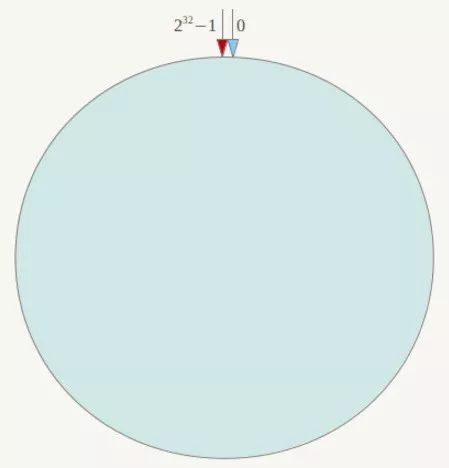

      下一步将各个服务器使用哈希函数进行一个哈希，具体可以选择服务器的IP或主机名作为关键字进行哈希，这样每台机器就能确定其在哈希环上的位置，如下：

      

      接下来使用如下算法定位数据访问到相应服务器：将数据key使用相同的哈希函数计算出哈希值，并确定此数据在环上的位置，从此位置沿环顺时针“行走”，第一台遇到的服务器就是其应该定位到的服务器，例如Object A、Object B、Object C、Object D四个数据对象，经过哈希计算后，在环空间上的位置如下：

      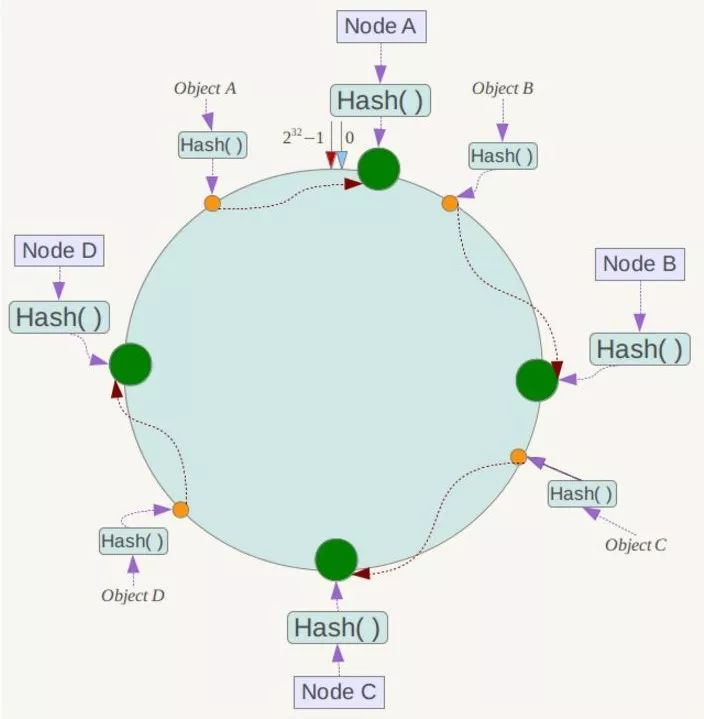

      根据一致性Hash算法，数据A会被定为到Node A上，B被定为到Node B上，C被定为到Node C上，D被定为到Node D上。

      现假设Node C不幸宕机，可以看到此时对象A、B、D不会受到影响，只有C对象被重定位到Node D。一般的，在一致性Hash算法中，如果一台服务器不可用，则受影响的数据仅仅是此服务器到其环空间中前一台服务器（即沿着逆时针方向行走遇到的第一台服务器）之间数据，其它不会受到影响，如下所示：

      

      下面考虑另外一种情况，如果在系统中增加一台服务器Node X，如下图所示：

      

      此时对象Object A、B、D不受影响，只有对象C需要重定位到新的Node X。一般的，在一致性哈希算法中，如果增加一台服务器，则受影响的数据仅仅是新服务器到其环空间中前一台服务器（即沿着逆时针方向行走遇到的第一台服务器）之间数据，其它数据也不会受到影响。

      综上所述，一致性哈希算法对于节点的增减都只需重定位环空间中的一小部分数据，具有较好的容错性和可扩展性。

      [一致性hash](https://mp.weixin.qq.com/s/cekUmNmH-UYfsITb7hxWOQ)

      ### Hash环的数据倾斜问题
        
      一致性Hash算法在服务节点太少时，容易因为节点分部不均匀而造成数据倾斜（被缓存的对象大部分集中缓存在某一台服务器上）问题，例如系统中只有两台服务器，其环分布如下：

      

      此时必然造成大量数据集中到Node A上，而只有极少量会定位到Node B上。为了解决这种数据倾斜问题，一致性Hash算法引入了虚拟节点机制，即对每一个服务节点计算多个哈希，每个计算结果位置都放置一个此服务节点，称为虚拟节点。具体做法可以在服务器IP或主机名的后面增加编号来实现。

      例如上面的情况，可以为每台服务器计算三个虚拟节点，于是可以分别计算 “Node A#1”、“Node A#2”、“Node A#3”、“Node B#1”、“Node B#2”、“Node B#3”的哈希值，于是形成六个虚拟节点：

      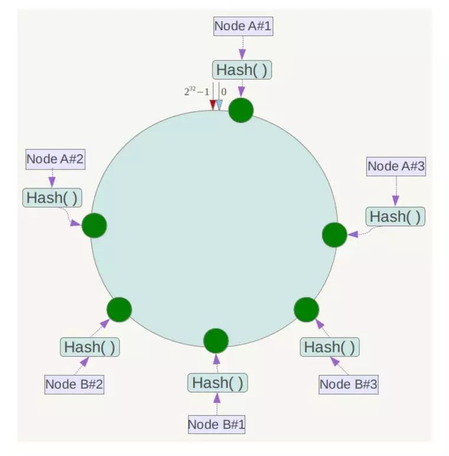

      同时数据定位算法不变，只是多了一步虚拟节点到实际节点的映射，例如定位到“Node A#1”、“Node A#2”、“Node A#3”三个虚拟节点的数据均定位到Node A上。这样就解决了服务节点少时数据倾斜的问题。

      </details>

    - <details><summary>Redis慢查询分析</summary>

      Redis慢查询有两个参数需要配置：
      - slowlog-log-slower-than：设置慢查询预设的超时阈值，单位是微秒（默认10毫秒）。它所阐述的意思是如果某条命令（如key*）执行很慢，执行时间超过了设置的阈值，那么这条命令将会被记录到慢查询日志中。当slowlog-log-slower-than = 0时慢查询日志会记录所有命令，slowlog-log-slower-than < 0时相当于关闭慢查询日志
      - slowlog-max-len：表示慢查询日志存储的条数。Redis会使用一个列表来存储慢查询日志， slowlog-max-len就是该列表的最大长度。一个命令如果满足慢查询阈值条件则会加入到该列表来，但是如果该列表已经处于最大长度时，那么会删除最开始的一条记录，然后将最新的命令插入到末尾。

      查看慢查询日志使用`slowlog get [n]`命令，其中n表示展示的条数，如下：
      ```java
      redis 127.0.0.1:6379> slowlog get 2
      1) 1) (integer) 14
         1) (integer) 1309448221
         2) (integer) 15
         3) 1) "ping"
      2) 1) (integer) 13
         1) (integer) 1309448128
         2) (integer) 30
         3) 1) "slowlog"
            1) "get"
            2) "100"
      ```
      可以看出返回的慢查询日志由4个属性组成：
      1. 日志的id
      2. 发生的时间戳
      3. 命令耗时
      4. 执行的命令和参数

      其他相关命令：
      - slowlog len：获取慢查询列表长度
      - slowlog reset：清空日志列表

      需要注意的是，慢查询只记录命令的执行时间，并不包括命令排队和网络传输时间。因此客户端执行命令的时间会大于命令的实际执行时间。因为命令执行排队机制，慢查询会导致其他命令级联阻塞，因此客户端出现请求超时时，需要检查该时间点是否有对应的慢查询，从而分析是否为慢查询导致的命令级联阻塞。

      </details>

    - <details><summary>Redis常见问题</summary>

      - 什么是Redis的事务

        Redis中的事务是一组命令的集合，事务同命令一样都是Redis的最小执行单位，一个事务中的命令要么都执行，要么都不执行，Redis保证了事务执行期间的隔离性和一致性。Redis的事务不支持回滚，原子性要求要么全部成功要么全都不成功，Redis的事务不能保证这个，事务执行期间如果某个命令执行失败了，不会影响其他命令的执行。Redis不支持事务回滚是因为Redis操作失败的原因只可能是语法错误或者错误的数据库类型操作，这些都是在开发层面能发现的问题不会进入到生产环境，因此不需要回滚，而且Redis内部设计推崇简单和高性能，因此不需要回滚能力，事务执行过程：
        ```
        MULTI # 开启事务，该语句之后的命令都是事务内的命令，在EXEC之前不会被执行
        SET a valuea
        SET b valueb
        EXEC # 执行事务
        ```

        事务可以配合`watch`命令使用，在执行`EXEC`之前如果被watch的key被其他客户端操作了，则事务不会执行：
        ```
        WATCH mykey # watch以保证其他客户端在EXEC之前没有修改mykey，否则下面的命令无法保证原子性
        val = GET mykey
        val = val + 1
        MULTI
        SET mykey $val
        EXEC
        ```

        上面的代码可以保证在执行`EXEC`之前，如果当前连接获取的mykey的值被其它连接的客户端修改，那么当前连接的`EXEC`命令将执行失败。

        执行`EXEC`命令后会取消对所有键的监控，如果不想执行事务中的命令也可以使用`UNWATCH`命令来取消监控。如下：
        ```
        WATCH key  
        isFieldExists = HEXISTS key, field  
        if isFieldExists is 1 # key存在的时候才执行事务
        MULTI  
        HSET key, field, value  
        EXEC  
        else # 否则取消watch
        UNWATCH  
        return isFieldExists
        ```

        或者使用`DISCARD`命令也可以，该命令会取消事务，如果正在使用`WATCH`命令监视某个（或某些）key，那么`DISCARD`命令会取消所有监视，等同于执行了`UNWATCH`。

      - 一个字符串类型的值能存储最大容量是多少

        512M

      - Redis对过期key的处理

        当访问一个key时发现该key过期了，直接删除，这是Redis的惰性删除机制，Redis还有定期删除机制：
        1. 默认情况下CPU空闲时每秒执行十次定期删除操作
        2. 每次清理过期key的时间默认不能超过25ms
        3. 依次遍历所有的DB
        4. 从db的过期列表中随机取20个key，判断是否过期，如果过期，则清理
        5. 如果有5个以上的key过期，则重复步骤5，否则继续处理下一个db
        6. 在清理过程中，如果到了时间限制，退出清理过程

      - Redis的集群模式采用分区实现有什么缺点

        1. 涉及多个key的操作通常不会被支持。例如不能对两个集合求交集，因为他们可能被存储到不同的Redis实例（或者使用{same}keyxxx的形式作为key，redis只会计算{}里的内容的hash作为分区依据，保证key在同一个分区就能使用交集）
        2. 同时操作多个key，则不能使用Redis事务
        3. 因为数据分布在各个分区，所以备份恢复也很麻烦

      - Redis的缓冲区

        redis key被逐出是由于内存使用超过了设置的maxmemory，即used_memory > maxmemory，used_memory包括redis的自身内存、对象内存和redis的缓冲区大小。

        需要注意的是Redis的缓冲区的大小，缓冲区的功能很简单，主要用于暂时存放命令数据，以免出现因为数据和命令的处理速度慢于客户端发送命令的速度而导致的命令数据的丢失和性能问题。但因为缓冲区的内存空间有限，如果往里面写入数据的速度持续地大于从里面读取数据的速度，就会导致缓冲区需要越来越多的内存来暂存数据。当缓冲区占用的内存超出了设定的上限阈值时，就会出现缓冲区溢出。如果有大量命令发往redis，就可能导致缓冲区的使用持续增大，最终导致Redis执行内存清除，淘汰部分key。

        通常一个机器很难使缓冲区持续增大，但是如果一个服务部署了多个副本，某一个时刻所有副本执行定时任务，向redis发送大量的命令，即使只是读取数据的操作，也可能导致Redis的缓冲区空间持续增大从而触发key的淘汰。

      - 待补充

      </details>

- 分布式
  - 分布式基础
    - <details><summary>ACID</summary>

      #### 原子性（A）
      所谓的原子性就是说，在整个事务中的所有操作，要么全部完成，要么全部不做，没有中间状态。对于事务在执行中发生错误，所有的操作都会被回滚，整个事务就像从没被执行过一样。

      #### 一致性（C）
      事务的执行必须保证系统的一致性，不能破坏关系数据的完整性以及业务逻辑上的一致性。就拿转账为例，A有500元，B有300元，如果在一个事务里A成功转给B50元，那么不管并发多少，不管发生什么，只要事务执行成功了，那么最后A账户一定是450元，B账户一定是350元，如果事务执行失败，则A应该还是500元，B是300元。

      #### 隔离性（I）
      所谓的隔离性就是说，事务与事务之间不会互相影响，一个事务的中间状态不会被其他事务感知。

      #### 持久性（D）
      所谓的持久性，就是说一单事务完成了，那么事务对数据所做的变更就完全保存在了数据库中，即使发生停电，系统宕机也是如此。

      </details>

    - <details><summary>CAP、BASE</summary>
      
      分布式事务想要实现ACID，系统的可用性和严格一致性之间会存在冲突，在不能牺牲系统可用性的情况下，为了实现分布式事务，又有CAP理论和BASE理论。

      ### CAP理论
      CAP理论告诉我们，一个分布式系统不可能同时满足一致性（C：Consistency）、可用性（A：Availability）和分区容错性（P：Partition tolerance）这三个基本需求，最多只能满足两个。
      
      #### 一致性
      分布式环境下，对于客户端的每次读操作，要么读到的是最新的数据，要么读取失败。换句话说，一致性是站在分布式系统的角度，对访问本系统的客户端的一种承诺：要么返回一个错误，要么返回最新数据，其强调的是数据正确。等同于要求所有节点能够访问同一份最新的数据副本

      #### 可用性
      任何时候客户端的请求都能在有限的时间内得到响应数据，不会出现响应错误。换句话说，可用性是站在分布式系统的角度，对访问本系统的客户的另一种承诺：一定会返回数据，不会返回错误，但不保证数据最新，强调的是不出错。同时可用性保证的是在有限时间内返回数据，这个有限时间在不同的分布式系统中是不一样的，如搜索引擎可能要求是0.5s，而HIVE等海量数据查询平台可能是几十秒。等同于每次请求都能获取到非错的响应，但是不保证获取的数据为最新数据

      #### 分区容错性
      由于分布式系统通过网络进行通信，网络是不可靠的。当分布式系统内部任意数量的通信消息丢失或延迟到达时，系统仍会继续提供服务，不会挂掉。换句话说，分区容忍性是站在分布式系统的角度，对访问本系统的客户端的一种承诺：我会一直运行，不管我的内部出现何种数据同步问题，强调的是不挂掉。以实际效果而言，分区容错性相当于对通信的时限要求。系统如果不能在时限内达成数据一致性，就意味着发生了分区的情况，必须就当前操作在C和A之间做出选择。

      之前提到，CAP理论说一个分布式系统最多同时只能满足两个特性，但并不是说在所有时候都只能选择两个特性。在不存在网络失败的情况下（分布式系统正常运行时），C和A能够同时保证。只有当网络发生分区或失败时，才会在C和A之间做出选择。

      对于一个分布式系统而言，P是前提，必须保证，因为只要有网络交互就一定会有延迟和数据丢失，这种状况我们必须接受，必须保证系统不能挂掉。所以只剩下C、A可以选择。要么保证数据一致性（保证数据绝对正确），要么保证可用性（保证系统一定会返回数据）。当选择了C（一致性）时，如果由于网络分区而无法保证特定信息是最新的，则系统将返回错误或超时。当选择了A（可用性）时，系统将始终处理客户端的查询并尝试返回最新的可用的信息版本，即使由于网络分区而无法保证其是最新的。

      ### BASE理论
      BASE是Basically Available（基本可用）、Soft state（软状态）、Eventually consistent（最终一致性）三个短语的缩写。BASE是对CAP中一致性和可用性权衡的结果，其来源于对大规模互联网分布式系统实践的总结，是基于CAP定律逐步演化而来。其核心思想是即使无法做到强一致性，但每个应用都可以根据自身业务特点，采用适当的方式来使系统打到最终一致性。

      #### 基本可用
      假设系统，出现了不可预知的故障，允许损失部分可用性，以下是基本可用的典型例子：
      - 响应时间上的损失：正常情况下的搜索引擎0.5秒即返回给用户结果，而基本可用的搜索引擎可以在2秒作用返回结果。
      - 功能上的损失：在一个电商网站上，正常情况下，用户可以顺利完成每一笔订单。但是到了大促期间，为了保护购物系统的稳定性，部分消费者可能会被引导到一个降级页面。

      #### 软状态
      对于原子性而言，要求多个节点的数据副本都是一致的，这是一种“硬状态”。软状态指的是：允许系统中的数据存在中间状态，并认为该状态不影响系统的整体可用性，即允许系统在多个不同节点的数据副本存在数据延时。

      #### 最终一致性
      最终一致性强调的是系统中所有的数据副本，在经过一段时间的同步后，最终能达到一个一致的状态。这个时间期限取决于网络延时、系统负载、数据复制方案设计等等因素。最终一致性的本质是需要系统保证最终数据能够保持一致，而不需要实时保证系统数据的一致性。而在实际工程实践中，最终一致性存在以下5种变种：
      - 因果一致性：如果节点A在更新完某个数据后通知了节点B，那么节点B之后对该数据的访问和修改都是基于A更新后的值。于此同时，和节点A无因果关系的节点C的数据访问则没有这样的限制。
      - 读已之所写：节点A更新一个数据后，它自身总是能访问到自身更新过的最新值，而不会看到旧值。
      - 会话一致性：系统能保证在同一个有效的会话中实现 “读己之所写” 的一致性，也就是说，执行更新操作之后，客户端能够在同一个会话中始终读取到该数据项的最新值。
      - 单调读一致性：如果一个进程从系统中读取出一个数据项的某个值后，那么系统对于该进程后续的任何数据访问都不应该返回更旧的值。
      - 单调写一致性：一个系统要能够保证来自同一个节点的写操作被顺序的执行。

      在实际的实践中，这5种系统往往会结合使用，以构建一个具有最终一致性的分布式系统。实际上，不只是分布式系统使用最终一致性，关系型数据库在某个功能上，也是使用最终一致性的。比如备份，数据库的复制过程是需要时间的，这个复制过程中，业务读取到的值就是旧的。当然，最终还是达成了数据一致性。这也算是一个最终一致性的经典案例。
    
      </details>

    - <details><summary>拜占庭将军问题</summary>

      在分布式计算中，不同的计算机通过通讯交换信息达成共识而按照同一套协作策略行动。但有时候，系统中的成员计算机可能出错而发送错误的信息，用于传递信息的通讯网络也可能导致信息损坏，使得网络中不同的成员关于全体协作的策略得出不同结论，从而破坏系统一致性。拜占庭将军问题被认为是容错性问题中最难的问题类型之一。

      拜占庭将军问题的描述：
      一组拜占庭将军分别各率领一支军队共同围困一座城市。为了简化问题，将各支军队的行动策略限定为进攻或撤离两种。因为部分军队进攻部分军队撤离可能会造成灾难性后果，因此各位将军必须通过投票来达成一致策略，即所有军队一起进攻或所有军队一起撤离。因为各位将军分处城市不同方向，他们只能通过信使互相联系。在投票过程中每位将军都将自己投票给进攻还是撤退的信息通过信使分别通知其他所有将军，这样一来每位将军根据自己的投票和其他所有将军送来的信息就可以知道共同的投票结果而决定行动策略。

      系统的问题在于，可能将军中出现叛徒，他们不仅可能向较为糟糕的策略投票，还可能选择性地发送投票信息。假设有9位将军投票，其中1名叛徒。8名忠诚的将军中出现了4人投进攻，4人投撤离的情况。这时候叛徒可能故意给4名投进攻的将领送信表示投票进攻，而给4名投撤离的将领送信表示投撤离。这样一来在4名投进攻的将领看来，投票结果是5人投进攻，从而发起进攻；而在4名投撤离的将军看来则是5人投撤离。这样各支军队的一致协同就遭到了破坏。

      理论上在分布式领域，试图在异步系统和不可靠的通道上达到一致性是不可能的，因此对于一致性的研究过程中，都假设信道是可靠的，即数据不会被篡改，而实际上，大部分系统部署在局域网内，同时底层数据链路也有校验算法保证数据是完整的，没有被篡改。

      </details> 

  - 分布式锁
    - <details><summary>摘要</summary>

      #### 使用场景
      使用分布式锁之前，要先思考一下：出现并发访问同一个资源的情况时，希望排队等待还是快速返回失败？如果希望快速失败，则不需要锁。

      #### 分布式锁与本地锁的区别
      除了分布式锁是跨进程以外，最大的区别在于：分布式锁有可能意外丢失。因为分布式锁有一个活性要求：一旦持有锁的进程挂掉了，即使它没有主动释放，也应当保证在有限的时间内自动帮其释放锁。否则一旦持有锁的进程意外挂掉，会导致全局所有进程都无法持有这把锁。那么一个关键的问题是：如何判定持有锁的进程还活着。方案有以下几种：
      - 需要持有锁的进程定期上报心跳（zk 锁的实现）
      - 定期刷新锁的租约（etcd 锁的实现）
      - 维持 tcp 连接的状态（mysql 的行锁可以归为这类，如果主调进程彻底挂了，操作系统会关闭其 tcp 连接，从而触发 mysql 释放这把锁）
        
      所以，如果这个进程还活着，但是它有一些问题（比如长时间的 GC 停顿）导致不能按时上报心跳 or 不能及时刷新租约，都会导致锁的异常丢失。那应该如何应对呢，一般在分布式锁中，通常会有一个异常丢失的通知机制。一旦发现自己锁丢了，要尽快调整自己执行的逻辑，避免出现严重的后果。比如下面的选主逻辑可以这样利用分布式锁：
      ```
      public class LeaderSelector {
          private final ExecutorService executor = xxx;
          private final Object blocker = new Object();
          private AtomicBoolean start = new AtomicBoolean(false);
          private volatile boolean isLeader = false;
          private final CacheLockFactory lockFactory = xxx;
          private final CacheLock lock = lockFactory.newCacheLock("xxx", () -> {
              synchronized (blocker) {
                  // 唤醒阻塞的选主线程
                  blocker.notifyAll();
              }
          })

          public void start() {
              if (start.compareAndSet(false, true)) {
                  executor.execute(() -> {
                      while (start.get()) {
                          if (lock.tryLock(5000, 100)) {
                              try {
                                  // 抢到主了
                                  isLeader = true;
                                  synchronized (blocker) {
                                      // 抢到锁就不用跑了，阻塞在这就好了
                                      blocker.wait();
                                  }
                              } finally {
                                  // 丢失主 or 主动释放
                                  isLeader = false;
                                  lock.release();
                              }
                          }
                          // backoff 一段时间，避免大量对缓存的轮询
                          sleep(1, SECONDS);
                      }
                  });
              }

          }

          public void stop() {
              start.set(false);
              synchronized (blocker) {
                  // 唤醒选主线程
                  blocker.notifyAll();
              }
              // 没考虑 stop 以后再次 start 的情况
              executor.shutdown();
          }

          public boolean isLeader() {
              return isLeader;
          }
      }
      ```

      上面的代码通过``isLeader()``方法判断是否为leader，同时线程池里的线程会循环获取锁，获取锁之后通过wait进行等待，直到被唤醒后再次尝试获取锁，业务逻辑可以在每次执行之前调用isLeader()方法判断是否为主。

      redis有自己的通知机制，但是redis的通知机制采取的是发送即忘（fire and forget）策略，并不是可靠的消息机制，redis不会做消息的存储，只是在线转发，也没有ack确认机制，另外只有订阅段监听时才会转发，所以通过redis的通知机制实现分布式锁的异常丢失通知是不行的，一般的实现是在获得锁以后后台线程会定时刷新锁的ttl（需要通过cas进行刷新保证线程安全，cas可以写一个lua脚本实现，在脚本中判断currentValue和expectValue是否相等），刷新的时候如果失败则认为锁丢失了，执行丢失后的处理逻辑。lua脚本的一个例子：
      ```
      local key = KEYS[1]
      local expectValue = ARGV[1]
      local pttl = tonumber(ARGV[2])
      local newValue = ARGV[3]
      local onlyRefreshTTL = ("true" == ARGV[4])
      local setnx = ("true" == ARGV[5])
      if setnx then -- setnx 直接短路掉
          return redis.call("SET", key, newValue, "PX", pttl, "NX")
      end
      if pttl < 0 then -- 如果需要读 ttl 的话, 先读老 key 的 ttl
          pttl = redis.call("PTTL", key)
      end
      -- 再读老 key 的值; 否则有可能出现先读到老值, 读 ttl 时 key 已过期, 造成新写入的值不会过期
      local currentValue = redis.call("GET", key)
      if onlyRefreshTTL then
          newValue = currentValue
      end
      if currentValue == expectValue then
          if pttl < 0 then
              redis.call("SET", key, newValue)
          elseif pttl == 0 then
              redis.call("DEL", key)
          else
              redis.call("SET", key, newValue, "PX", pttl)
          end
          return true
      else
          return false
      end
      ```

      这个脚本的调用方式：
      如果想 check and delete，可以将 ttl 传入0
      如果想 check and refresh ttl，可以将 newValue 传入 null
      如果想仅变更值，保持原有的 ttl，可以将 ttl 传入负值
      如果想setnx，可以将 expectedValue 传入 null
      ```
      redis.evalsha(CHECK_AND_SWAP_SCRIPT_DIGEST, ScriptOutputType.BOOLEAN, new String[] {key}, expectValue,
        String.valueOf(pttl).getBytes(), newValue, String.valueOf(onlyRefreshTTL).getBytes(),
        String.valueOf(setnx).getBytes())
      ```
        
      </details>

    - <details><summary>Mysql分布式锁</summary>

      #### 建表
      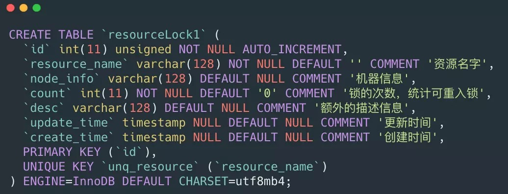

      #### lock
      lock一般是阻塞式的获取锁，意思就是不获取到锁誓不罢休，可以写一个死循环来执行其操作
      为了达到可重入锁的效果那么应该先进行查询，如果有值，那么需要比较node_info是否一致，这里的node_info可以用机器IP和线程名字来表示，如果一致那么就加可重入锁count的值，如果不一致那么就返回false。如果没有值那么直接插入一条数据，并且这一段代码需要加事务，必须要保证这一系列操作的原子性

      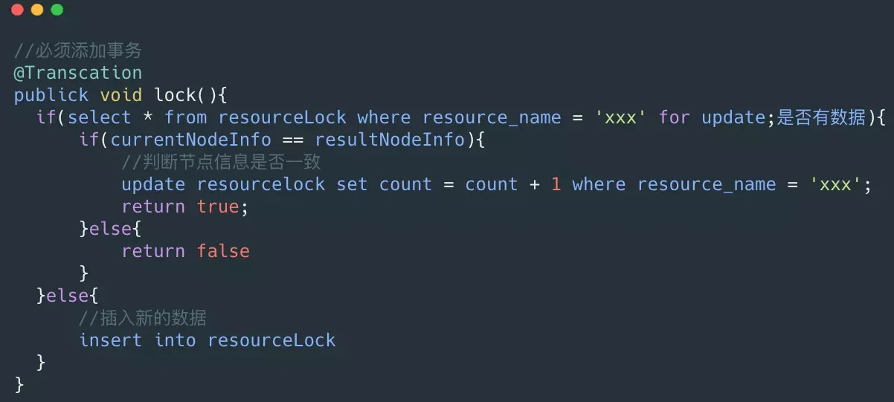


      #### unlock
      count为1那么可以删除，如果大于1那么需要减去1
      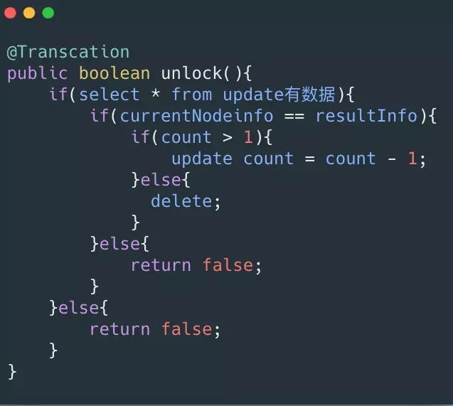

      #### 锁超时
      有可能会遇到获取到锁的节点挂了，那么这个锁就不会得到释放，可以启动一个定时任务，通过计算一般处理任务的一般的时间，比如是5ms，那么可以稍微扩大一点，当这个锁超过20ms没有被释放就可以认定是节点挂了然后将其直接释放

      #### 小结
      适用场景：Mysql分布式锁一般适用于资源不存在数据库，如果数据库存在比如订单，那么可以直接对这条数据加行锁，不需要上面那么多的繁琐的步骤，比如一个订单，那么可以用select * from order_table where id = 'xxx' for update进行加行锁，那么其他的事务就不能对其进行修改。

      优点:理解起来简单，不需要维护额外的第三方中间件(比如Redis,Zk)。

      缺点:虽然容易理解但是实现起来较为繁琐，需要自己考虑锁超时，加事务等等。性能局限于数据库，一般对比缓存来说性能较低。对于高并发的场景并不是很适合
      
      </details>

    - <details><summary>乐观锁</summary>
      前面介绍的都是悲观锁，这里想额外提一下乐观锁，在实际项目中也是经常实现乐观锁，因为加行锁的性能消耗比较大，通常会对于一些竞争不是那么激烈，但是其又需要保证并发的顺序执行使用乐观锁进行处理，可以对表加一个版本号字段，那么查询出来一个版本号之后，update或者delete的时候需要依赖查询出来的版本号，判断当前数据库和查询出来的版本号是否相等，如果相等那么就可以执行，如果不等那么就不能执行。这样的一个策略很像CAS(Compare And Swap)

      </details>

    - <details><summary>Redis分布式锁</summary>

      要满足以下几个条件：
      1. 命令必须保证互斥
      2. 设置的key必须要有过期时间，防止崩溃时锁无法释放
      3. value使用唯一id标志每个客户端，保证只有锁的持有者才可以释放锁（可以用主机名+IP+UUID+线程ID+线程hashCode）

      最简单的版本
      ```
      public class RedisDistributedLock {
          private static final String LOCK_SUCCESS = "OK";
          private static final Long RELEASE_SUCCESS = 1L;
          private static final String SET_IF_NOT_EXIST = "NX";
          private static final String SET_WITH_EXPIRE_TIME = "PX";
          // 锁的超时时间
          private static int EXPIRE_TIME = 5 * 1000;
          // 锁等待时间
          private static int WAIT_TIME = 1 * 1000;

          private Jedis jedis;
          private String key;

          public RedisDistributedLock(Jedis jedis, String key) {
              this.jedis = jedis;
              this.key = key;
          }

          // 不断尝试加锁
          public String lock() {
              try {
                  // 超过等待时间，加锁失败
                  long waitEnd = System.currentTimeMillis() + WAIT_TIME;
                  // 唯一标识，用于识别谁的锁
                  String value = UUID.randomUUID().toString();
                  while (System.currentTimeMillis() < waitEnd) {
                      // 使用nx同时设置过去时间
                      String result = jedis.set(key, value, SET_IF_NOT_EXIST, SET_WITH_EXPIRE_TIME, EXPIRE_TIME);
                      if (LOCK_SUCCESS.equals(result)) {
                          return value;
                      }
                      try {
                          Thread.sleep(10);
                      } catch (InterruptedException e) {
                          Thread.currentThread().interrupt();
                      }
                  }
              } catch (Exception ex) {
                  log.error("lock error", ex);
              }
              return null;
          }

          // 参数是锁的唯一标识
          public boolean release(String value) {
              if (value == null) {
                  return false;
              }
              // 判断key存在并且删除key必须是一个原子操作
              // 且谁拥有锁，谁释放
              String script = "if redis.call('get', KEYS[1]) == ARGV[1] then return redis.call('del', KEYS[1]) else return 0 end";
              Object result = new Object();
              try {
                  result = jedis.eval(script, Collections.singletonList(key),
                          Collections.singletonList(value));
                  if (RELEASE_SUCCESS.equals(result)) {
                      log.info("release lock success, value:{}", value);
                      return true;
                  }
              } catch (Exception e) {
                  log.error("release lock error", e);
              } finally {
                  if (jedis != null) {
                      jedis.close();
                  }
              }
              log.info("release lock failed, value:{}, result:{}", value, result);
              return false;
          }
      }
      ```

      #### Redission
      Redission也是Redis的客户端，相比于Jedis功能简单。Jedis简单使用阻塞的I/O和redis交互，Redission通过Netty支持非阻塞I/O

      Redission封装了锁的实现，其继承了java.util.concurrent.locks.Lock的接口，让我们像操作我们的本地Lock一样去操作Redission的Lock，下面介绍一下其如何实现分布式锁
      
      实现原理：
      
      可以看见他并没有使用sexNx来进行操作，而是使用的hash结构，每一个需要锁定的资源都可以看做是一个HashMap，锁定资源的节点信息是Key,锁定次数是value。通过这种方式可以很好的实现可重入的效果，只需要对value进行加1操作，就能进行可重入锁。
      
      如果尝试加锁失败，判断是否超时，如果超时则返回false。

      如果加锁失败之后，没有超时，那么需要在名字为redisson_lock__channel+lockName的channel上进行订阅，用于订阅解锁消息，然后一直阻塞直到超时，或者有解锁消息。

      重试步骤1，2，3，直到最后获取到锁，或者某一步获取锁超时

      unlock方法比较简单也是通过lua脚本进行解锁，如果是可重入锁，只是减1。如果是非加锁线程解锁，那么解锁失败
      

      想象一个这样的场景当机器A申请到一把锁之后，如果Redis主宕机了，这个时候从机并没有同步到这一把锁，那么机器B再次申请的时候就会再次申请到这把锁，为了解决这个问题Redis作者提出了RedLock红锁的算法,在Redission中也对RedLock进行了实现
      

      通过上面的代码，我们需要实现多个Redis集群，然后进行红锁的加锁，解锁。具体的步骤如下:
      1. 首先生成多个Redis集群的Rlock，并将其构造成RedLock。
      2. 依次循环对三个集群进行加锁，加锁的过程和Redission一致。
      3. 如果循环加锁的过程中加锁失败，那么需要判断加锁失败的次数是否超出了最大值，这里的最大值是根据集群的个数，比如三个那么只允许失败一个，五个的话只允许失败两个，要保证多数成功。
      4. 加锁的过程中需要判断是否加锁超时，有可能我们设置加锁只能用3ms，第一个集群加锁已经消耗了3ms了。那么也算加锁失败。
      5. 3，4步里面加锁失败的话，那么就会进行解锁操作，解锁会对所有的集群在请求一次解锁。

      可以看见RedLock基本原理是利用多个Redis集群，用多数的集群加锁成功，减少Redis某个集群出故障，造成分布式锁出现问题的概率。

      </details>

    - <details><summary>分布式锁的安全问题</summary>

      上面我们介绍过红锁，但是Martin Kleppmann认为其依然不安全。有关于Martin反驳的几点，我认为其实不仅仅局限于RedLock,前面说的算法基本都有这个问题，下面我们来讨论一下这些问题：
      1. 长时间的GC pause：client1获取了锁并且设置了锁的超时时间，但是client1之后出现了STW，这个STW时间比较长，导致分布式锁进行了释放，client2获取到了锁，这个时候client1恢复了锁，那么就会出现client1，2同时获取到锁，这个时候分布式锁不安全问题就出现了
      2. 时钟发生跳跃：对于Redis服务器如果其时间发生了跳跃，那么肯定会影响我们锁的过期时间，那么我们的锁过期时间就不是我们预期的了，也会出现client1和client2获取到同一把锁，那么也会出现不安全，这个对于Mysql也会出现，可以用NTP服务器解决
      3. 长时间的网络I/O：这个问题和我们的GC的STW很像，也就是我们这个获取了锁之后我们进行网络调用，其调用时间由可能比我们锁的过期时间都还长，那么也会出现不安全的问题，这个Mysql也会有，ZK也会出现这个问题

      </details>

  - 分布式事务
    - <details><summary>两阶段提交</summary>
     
      #### 概括
      参与者将操作成败通知协调者，再由协调者根据所有参与者的反馈情报决定各参与者是否要提交操作还是中止操作

      #### 准备阶段
      1. 协调者节点向所有参与者节点询问是否可以执行提交操作，并开始等待各参与者节点的响应。
      2. 参与者节点执行询问发起为止的所有事务操作，并将Undo信息和Redo信息写入日志。（注意：若成功这里其实每个参与者已经执行了事务操作）
      3. 各参与者节点响应协调者节点发起的询问。如果参与者节点的事务操作实际执行成功，则它返回一个”同意”消息；如果参与者节点的事务操作实际执行失败，则它返回一个”中止”消息

      #### 提交阶段
      如果所有参与者准备阶段回复成功：
      1. 协调者节点向所有参与者节点发出”正式提交(commit)”的请求
      2. 参与者节点正式完成操作，并释放在整个事务期间内占用的资源
      3. 参与者节点向协调者节点发送”完成”消息。
      4. 协调者节点受到所有参与者节点反馈的”完成”消息后，完成事务

      如果某一个参与者准备阶段回复中止，或者协调者节点准备阶段的询问超时之前无法获取所有参与者节点的响应消息时：
      1. 协调者节点向所有参与者节点发出”回滚操作(rollback)”的请求
      2. 参与者节点利用之前写入的Undo信息执行回滚，并释放在整个事务期间内占用的资源
      3. 参与者节点向协调者节点发送”回滚完成”消息
      4. 协调者节点受到所有参与者节点反馈的”回滚完成”消息后，取消事务

      #### 存在的问题
      1. 同步阻塞问题：执行过程中，所有参与节点都是事务阻塞型的。当参与者占有公共资源时，其他第三方节点访问公共资源不得不处于阻塞状态
      2. 单点故障：由于协调者的重要性，一旦协调者发生故障。参与者会一直阻塞下去
      3. 数据不一致：在二阶段提交的阶段二中，当协调者向参与者发送commit请求之后，发生了局部网络异常或者在发送commit请求过程中协调者发生了故障，这回导致只有一部分参与者接受到了commit请求。而在这部分参与者接到commit请求之后就会执行commit操作，但是其他部分未接到commit请求的机器则无法执行事务提交。于是整个分布式系统便出现了数据不一致性的现象
      4. 太过保守：两阶段提交过程中任何一个节点故障都会导致整个事务失败
      5. 二阶段无法解决的问题：协调者在发出commit消息之后宕机，而唯一接收到这条消息的参与者同时也宕机了。那么即使协调者通过选举协议产生了新的协调者，这条事务的状态也是不确定的，没人知道事务是否被已经提交

      </details> 

    - <details><summary>三阶段提交</summary>

      #### 概括
      三阶段提交是两阶段提交的改进版，三阶段提交有两个改动点：
      1. 引入超时机制。同时在协调者和参与者中都引入超时机制
      2. 在第一阶段和第二阶段中插入一个准备阶段。保证了在最后提交阶段之前各参与节点的状态是一致的，也就是说，3PC把2PC的准备阶段一分为二，这样三阶段提交就有CanCommit、PreCommit、DoCommit三个阶段

      #### CanCommit阶段
      3PC的CanCommit阶段其实和2PC的准备阶段很像。协调者向参与者发送commit请求，参与者如果可以提交就返回Yes响应，否则返回No响应
      1. 事务询问：协调者向参与者发送CanCommit请求。询问是否可以执行事务提交操作。然后开始等待参与者的响应
      2. 响应反馈：参与者接到CanCommit请求之后，正常情况下，如果其自身认为可以顺利执行事务，则返回Yes响应，并进入预备状态。否则反馈No

      #### PreCommit阶段
      协调者根据参与者的反应情况来决定是否可以进行事务的PreCommit操作。根据响应情况，有以下两种可能：
      假如协调者从所有的参与者获得的反馈都是Yes响应，那么就会执行事务的预执行
      1. 发送预提交请求：协调者向参与者发送PreCommit请求，并进入Prepared阶段
      2. 事务预提交：参与者接收到PreCommit请求后，会执行事务操作，并将undo和redo信息记录到事务日志中
      3. 响应反馈：如果参与者成功的执行了事务操作，则返回ACK响应，同时开始等待最终指令

      假如有任何一个参与者向协调者发送了No响应，或者等待超时之后，协调者都没有接到参与者的响应，那么就执行事务的中断
      1. 发送中断请求：协调者向所有参与者发送abort请求。
      2. 中断事务：参与者收到来自协调者的abort请求之后（或超时之后，仍未收到协调者的请求），执行事务的中断

      #### doCommit阶段
      执行提交
      1. 发送提交请求：协调接收到参与者发送的ACK响应，那么他将从预提交状态进入到提交状态。并向所有参与者发送doCommit请求
      2. 事务提交：参与者接收到doCommit请求之后，执行正式的事务提交。并在完成事务提交之后释放所有事务资源
      3. 响应反馈：事务提交完之后，向协调者发送Ack响应
      4. 完成事务：协调者接收到所有参与者的ack响应之后，完成事务

      中断事务
      1. 发送中断请求：协调者向所有参与者发送abort请求
      2. 事务回滚：参与者接收到abort请求之后，利用其在阶段二记录的undo信息来执行事务的回滚操作，并在完成回滚之后释放所有的事务资源
      3. 反馈结果：参与者完成事务回滚之后，向协调者发送ACK消息
      4. 中断事务：协调者接收到参与者反馈的ACK消息之后，执行事务的中断

      在doCommit阶段，如果参与者无法及时接收到来自协调者的doCommit或者rebort请求时，会在等待超时之后，会继续进行事务的提交。（其实这个应该是基于概率来决定的，当进入第三阶段时，说明参与者在第二阶段已经收到了PreCommit请求，协调者产生PreCommit请求的前提条件是他在第二阶段开始之前，收到所有参与者的CanCommit响应都是Yes（一旦参与者收到了PreCommit，意味他知道大家其实都同意修改了）。所以，一句话概括就是，当进入第三阶段时，由于网络超时等原因，虽然参与者没有收到commit或者abort响应，但是他有理由相信：成功提交的几率很大。）

      #### 存在的问题
      相对于2PC，3PC主要解决的单点故障问题，并减少阻塞，因为一旦参与者无法及时收到来自协调者的信息之后，他会默认执行commit，而不会一直持有事务资源并处于阻塞状态。但是这种机制也会导致数据一致性问题，因为，由于网络原因，协调者发送的abort响应没有及时被参与者接收到，那么参与者在等待超时之后执行了commit操作。这样就和其他接到abort命令并执行回滚的参与者之间存在数据不一致的情况

      #### 和两阶段提交的比较
      除了数据不一致外，两阶段提交的主要问题是阻塞，在协调者和参与者网络出现异常的情况下，参与者的事务会一直悬挂在那（即使有超时机制，也不知道应该回滚还是提交）。三阶段提交主要解决了两阶段提交的阻塞问题。参与者返回CanCommit请求的响应后，等待第二阶段指令，若等待超时，则自动abort，降低了阻塞；参与者返回PreCommit请求的响应后，等待第三阶段指令，若等待超时，则自动commit事务（也因此可能导致数据不一致），也降低了阻塞。即三阶段提交在CanCommit和PreCommit这两个阶段超时的情况下分别执行abort和commit操作，而两阶段提交在第一阶段返回响应后超时的情况下不能决定应该abort还是commit。
      
      </details> 
    
    - <details><summary>TCC</summary>

      #### TCC阶段一：Try
      执行锁定资源操作，如一个下单过程：
      1. 先在订单服务先把订单状态修改为：OrderStatus.UPDATING，别直接把订单状态修改为已支付，先把订单状态修改为UPDATING，也就是修改中的意思
      2. 减库存操作：把可销售的库存：100 - 2 = 98，设置为98没问题，然后在一个单独的冻结库存的字段里，设置一个2。也就是说，有2个库存是给冻结了
      3. 积分服务：保持积分为1190不变，在一个预增加字段里，比如说prepare_add_credit字段，设置一个10，表示有10个积分准备增加
      4. 仓储服务：先创建一个销售出库单，但是这个销售出库单的状态是“UNKNOWN”

      也就是设置一个预备类的状态，冻结部分数据，等等

      #### TCC阶段二：Confirm
      1. 订单服务里：正式把订单的状态设置为“已支付”
      2. 库存服务：将之前冻结库存字段的2个库存扣掉变为0
      3. 积分服务：将预增加字段的10个积分扣掉，然后加入实际的会员积分字段中，从1190变为1120
      4. 仓储服务：将销售出库单的状态正式修改为“已创建”，可以供仓储管理人员查看和使用，而不是停留在之前的中间状态“UNKNOWN”

      #### TCC阶段三：Cancel
      1. 在Try阶段，比如积分服务，执行出错了，回滚整个事务
      2. 订单服务：将订单的状态设置为“CANCELED”，也就是这个订单的状态是已取消
      3. 库存服务：将冻结库存扣减掉2，加回到可销售库存里去，98 + 2 = 100
      4. 积分服务：将预增加积分字段的10个积分扣减掉
      5. 仓储服务：将销售出库单的状态修改为“CANCELED”设置为已取消

      #### 最后
      Try阶段对资源进行预备，保证了事务的资源是够的，所以Confirm阶段是大概率能够成功的，即使Confirm失败了，也要不断重试直到成功，因为资源已经预备了，对于Cancel阶段也是一样，重试保证成功

      如果有一些意外的情况发生了，比如说订单服务突然挂了，然后再次重启，TCC事务框架要记录一些分布式事务的活动日志的，可以在磁盘上的日志文件里记录，也可以在数据库里记录。保存下来分布式事务运行的各个阶段和状态，服务需要根据日志执行他需要执行的操作


      </details> 

    - <details><summary>消息事务+最终一致性</summary>
     
      #### 介绍
      基于消息中间件的两阶段提交，本质上是对消息中间件的一种特殊利用，它是将本地事务和发消息放在了一个分布式事务里，保证要么本地操作成功成功并且对外发消息成功，要么两者都失败，开源的RocketMQ就支持这一特性

      #### 步骤
      1. A系统向消息中间件发送一条预备消息
      2. 消息中间件保存预备消息并返回成功
      3. A执行本地事务
      4. A发送提交消息给消息中间件

      通过以上4步完成了一个消息事务。对于以上的4个步骤，每个步骤都可能产生错误，下面一一分析：
      - 步骤一出错，则整个事务失败，不会执行A的本地操作
      - 步骤二出错，则整个事务失败，不会执行A的本地操作
      - 步骤三出错，这时候需要回滚预备消息，怎么回滚？答案是A系统实现一个消息中间件的回调接口，消息中间件会去不断执行回调接口，检查A事务执行是否执行成功，如果失败则回滚预备消息
      - 步骤四出错，这时候A的本地事务是成功的，那么消息中间件要回滚A吗？答案是不需要，通过回调接口，消息中间件能够检查到A执行成功了，这时候其实不需要A发提交消息了，消息中间件可以自己对消息进行提交，从而完成整个消息事务 

      A系统和消息实现了消息事务，此时B系统订阅消息，只要消息事务成功，那么A操作一定成功，消息也一定发出来了，这时候B会收到消息去执行本地操作，如果本地操作失败，消息会重投，直到B操作成功，这样就变相地实现了A与B的分布式事务

      </details>
  
  - <details><summary>Paxos算法</summary>

    Paxos算法用于解决这样的问题，假设有一组可以提出提案的进程集合，那么需要保证以下几点:
    - 在这些被提出的提案中，只有一个会被选定。
    - 如果没有提案被提出，那么就不会有被选定的提案。
    - 当一个提案被选定后，进程应该可以获取被选定的提案信息。
    - 要求只有被提出的提案才能被选定。
    - 只能有一个提案被选定。
    - 如果某个进程认为某个提案被选定了，那么这个提案必须是真的被选定的那个。

    Paxos算法是基于消息传递且具有高度容错特性的一致性算法，是目前公认的解决分布式一致性问题最有效的算法之一。Paxos常被误称为“一致性算法”。但是“一致性（consistency）”和“共识（consensus）”并不是同一个概念。Paxos是一个共识（consensus）算法，其解决的问题就是在分布式系统中如何就某个值（决议）达成一致。

    #### Basic Paxos
    Basic Paxos中所有的副本是平等的，大家都同时具备Proposer、Acceptor、Learner角色，Basic Paxos的流程是：
    1. Prepare阶段：某一时刻一个副本想要提议一个值，那么它作为Proposer向所有副本广播Prepare请求，请求中只有提案编号（Proposal ID），Proposal ID是全局唯一且递增的（可使用时间戳加Server ID生成），其他副本作为Acceptor接收到Prepare请求后做出两个承诺和一个应答，分别是：
        - 不再接受Proposal ID小于等于（这里是<=，个人认为是为了避免潜在的根据时间戳生成Proposal ID导致Proposal ID不唯一的可能性）当前请求的Prepare请求
        - 不再接受Proposal ID小于（注意：这里是<）当前请求的Propose请求
        - 不违背上面承诺的基础上，回复已经接受过的提案中Proposal ID最大的那个提案的Value和Proposal ID，没有则返回空值
    发出Prepare请求的Proposer在收到超过半数的Acceptor的应答后，从应答中选择Proposal ID最大的提案的Value，作为本次要发起的提案的Value，这是因为应答里的这个Value已经被大多数副本接受了（Basic Paxos有个严谨的证明过程，证明了在Proposer收到的超过半数的Acceptor的应答集合中被接受的那个提案的Value，和所有这个集合的应答中Proposal ID大于等于被接受的那个提案的Proposal ID的那些提案的Value相等，所以只需要取Proposal ID最大的Value就能获取到被大多数Acceptor接受的Value），Proposer为了一致性只能接受这个Value并放弃自己想要提议的Value。如果所有应答的提案Value均为空值，则可以自己随意决定提案Value，也就是可以以自己想要提议的值为Value。在决定了Value后，Proposer携带自己的Proposal ID和决定好的Value，向所有Acceptors发送Propose请求
    1. Accept阶段：Acceptor收到Propose请求后，在不违背自己之前作出的承诺下，接受并持久化当前Proposal ID和提案Value
    2. Learn阶段：Proposer收到多数Acceptor的Accept后，决议形成，这个时候已经实现了一致性，超过半数的副本接受的同一个Value，此时Proposer将形成的决议发送给所有Learners，也就是非Acceptor的其他副本，让他们也接受这个Value

    更详细的过程描述是：
    1. 获取一个Proposal ID n，为了保证Proposal ID唯一，可采用时间戳+Server ID生成；
    2. Proposer向所有Acceptors广播Prepare(n)请求；
    3. Acceptor比较n和minProposal，如果n>minProposal，minProposal=n，并且将acceptedProposal和acceptedValue返回；
    4. Proposer接收到过半数回复后，如果发现有acceptedValue返回，将所有回复中acceptedProposal最大的acceptedValue作为本次提案的value，否则可以任意决定本次提案的value；
    5. 到这里可以进入第二阶段，广播Accept(n,value) 到所有节点；
    6. Acceptor比较n和minProposal，如果n>=minProposal，则acceptedProposal=minProposal=n，acceptedValue=value，本地持久化后返回；否则，返回minProposal（第二阶段时可能有一个Proposer发送了一个Proposal ID更大的Prepare请求给Acceptor，此时Acceptor拒绝之前Proposer的提案，这里返回minProposal实际上就是那个更大的Proposal ID，这相当于告诉了最开始的Proposer现在有一个更大的Proposal ID了）；
    7. 提议者接收到过半数请求后，如果发现有返回值result > n，表示有更新的提案（也就是Proposal ID更大的提案，此时跳转到第一步，再次尝试让其它副本接受自己的Value或获取已经被提交的Value）；否则value达成一致；
    8. 最后就是Learn阶段；

    从上面的第7步可以看出，Basic Paxos可能存在活锁的问题，也就是不断的有Proposal ID更大的Prepare请求发送到Acceptor，导致一直无法确定Value

    下面用图例分析Basic Paxos：
    ##### 例1
    
    上图的横坐标是时间，纵坐标为值X到Y被提议的过程，S1到S5表示一共5个副本，运行过程如下：
    1. 刚开始S1广播了Proposal ID为3.1的Prepare请求
    2. 只有S2和S3收到了，Basic Paxos只要求超过半数的副本收到，所以S4、S5没收到没关系，S2个S3保存Proposal ID 3.1为自己的minProposal，由于S2和S3之前没有接受过值，所以返回空的acceptedProposal和acceptedValue给S1
    3. S1收到S2和S3的回复后，发现没有acceptedValue，S1就以自己的Value X为提案的Value，再次广播Accept(3.1, X)到所有节点，S2和S3接受了这个值，保存Proposal ID 3.1和Value X为自己的acceptedProposal和acceptedValue
    4. S5想要提议Value Y，所以先广播了Proposal ID为4.5的Prepare请求，只要求超过半数副本收到这个请求，上面假设了S3、S4收到了，S3已经接受过Value，这次Proposal ID大于其acceptedProposal，所以S3回应(3.1, X)给S1，S4回应空的acceptedProposal和acceptedValue
    5. S5收到回应后发现最大的acceptedProposal存在Value，则以该Value也就是X为提案的Value而不是Y，再以自己的Proposal ID为提案的编号，广播Accept(4.5, X)到所有节点，实现了S1到S5的一致性
    6. 从该例子也可以发现，Basic Paxos的一个重要理论基础是，对于一个全集，也就是上面的S1到S5，无论怎么划分子集，只要子集元素的数量超过全集的一半，那么任意两个满足条件的子集A和B，A和B的交集一定不为空。Basic Paxos在这个理论的基础上，添加了广播提案时的限制，需要Proposer先发送Prepare请求，Acceptor根据自己的minProposal、acceptedProposal、acceptedValue和当前的Prepare请求的Proposal ID做出响应，Proposer再根据超过半数的Acceptor的回应决定Value，从而实现一致性，而为什么这样能保证一致性，可以看Basic Paxos相关的论文，或者看[如何浅显易懂地解说 Paxos 的算法？ - 朱一聪的回答 - 知乎](https://www.zhihu.com/question/19787937/answer/82340987)

    ##### 例2
    
    该例子和例1差不多，只不过是假设了S1发送了Prepare请求并收到S2和S3的回应后，S1发送的Accept(3.1, X)只到了S3，还没到S2，由于还没收到Accept(3.1, X)被超过半数的副本接受的回应（这里的回应可以理解为TCP的ACK，也就是S1还不知道S2收没收到Accept(3.1, X)），所以S1此时也不能认为自己接受了Accept(3.1, X)，这个时候S5发出了Prepare请求，学习到了Value X，也能实现一致性

    ##### 例3
    
    该例子假设S1发送Accept(3.1, X)后S3还没有接受，此时S5发出Prepare请求，发现S3的acceptedValue为空，所以决定Value为自己的Y并广播Accept(4.5, Y)给其他副本，S3收到Accept(4.5, Y)后发现Proposal ID 4.5大于自己的minProposal 3.1，则更新acceptedProposal=minProposal=4.5，acceptedValue=Y，使得半数以上的副本接受了Value Y，对于S1和S2，还有最后的Learn阶段，S5在获知S3和S4也就是半数以上的副本接受了Value Y后，会发送最终的决议给S1和S2（获知广播决议也可以），使得S1和S2最终也接受Value Y

    ##### 例4
    
    该例子说明的是Basic Paxos的活锁的问题，S1和S5交替发出Prepare请求，每次Prepare请求的Proposal ID都是递增的，使得S1和S5交替Prepare成功，而Accept失败，形成活锁，对于这个问题，在实现Basic Paxos协议时可以用一些工程手段避免或者减少这种问题的发送，Basic Paxos算法本身无法避免这种情况

    #### Multi Paxos
    Basic Paxos存在活锁问题，而且Basic Paxos只能对一个值进行决议，形成决议至少需要两次网络交互，这些问题使得Basic Paxos只能作为理论基础，实际工程使用的是Multi Paxos算法，Multi Paxos算法能够连续决议多个值，而且有更高的效率，Multi Paxos基于Basic Paxos做了两点改进：
    1. 针对每一个要决议的值，运行一次Paxos算法实例（Instance），形成决议。每一个Paxos实例使用唯一的Instance ID标识，也就是每次决议值的时候，这次决议过程本身有一个Instance ID进行标识
    2. 在所有Proposers中选举一个Leader，由Leader唯一地提交Proposal给Acceptors进行表决。这样没有Proposer竞争，解决了活锁问题。在系统中仅有一个Leader进行Value提交的情况下，Prepare阶段就可以跳过，从而将两阶段变为一阶段，提高效率

    Multi Paxos首先需要选举Leader，Leader的确定也是一次决议的形成，所以可执行一次Basic Paxos实例来选举出一个Leader。选出Leader之后只能由Leader提交Proposal，在Leader宕机之后服务临时不可用，需要重新选举Leader继续服务。在系统中仅有一个Leader进行Proposal提交的情况下，Prepare阶段可以跳过
    Multi Paxos通过改变Prepare阶段的作用范围至后面Leader提交的所有实例（实例的意思是决议一个值的过程），也就是Leader提交的所有实例默认已经执行了Prepare阶段，从而使得连续提交只需要执行一次Prepare阶段确定Leader，后续只需要执行Accept阶段，将两阶段变为一阶段，提高了效率。为了区分连续提交的多个实例，每个实例使用一个Instance ID标识，Instance ID由Leader本地递增生成即可
    </details>
  
  - <details><summary>Raft算法</summary>
   
    Raft算法将一致性分解为多个子问题：
    1. Leader选举（Leader election）
    2. 日志同步（Log replication）
    3. 安全性（Safety）
    4. 日志压缩（Log compaction）
    5. 成员变更（Membership change）

    Raft将系统中的角色分为领导者（Leader）、跟从者（Follower）和候选人（Candidate）：
    Leader：接受客户端请求，并向Follower同步请求日志，当日志同步到大多数节点上后告诉Follower提交日志
    Follower：接受并持久化Leader同步的日志，在Leader告之日志可以提交之后，提交日志
    Candidate：Leader选举过程中的临时角色

    Raft要求系统在任意时刻最多只有一个Leader，正常工作期间只有Leader和Followers，Follower只响应其他服务器的请求。如果Follower超时没有收到Leader的消息，它会成为一个Candidate并且开始一次Leader选举。收到大多数服务器投票的Candidate会成为新的Leader。Leader在宕机之前会一直保持Leader的状态。Raft算法将时间分为一个个的任期（term），每一个term的开始都是Leader选举。在成功选举Leader之后，Leader会在整个term内管理整个集群。如果Leader选举失败，该term就会因为没有Leader而结束

    首先放出Raft论文中对于每个角色状态及请求的描述：

    |状态|所有服务器上持久存在的|
    |-------|------|
    |currentTerm | 服务器最后一次知道的任期号（初始化为 0，持续递增）|
    |votedFor | 在当前获得选票的候选人的 Id|
    | log[] | 日志条目集；每一个条目包含一个用户状态机执行的指令，和收到时的任期号 |

    |状态|所有服务器上经常变的|
    |-------|------|
    | commitIndex| 已知的最大的已经被提交的日志条目的索引值|
    | lastApplied| 最后被应用到状态机的日志条目索引值（初始化为 0，持续递增）|

    | 状态 | 在领导人里经常改变的 （选举后重新初始化）|
    |----|--------|
    | nextIndex[] | 对于每一个服务器，需要发送给他的下一个日志条目的索引值（初始化为领导人最后索引值加一）|
    | matchIndex[] | 对于每一个服务器，已经复制给他的日志的最高索引值|


    **附加日志 RPC**：

    由领导人负责调用来复制日志指令；也会用作heartbeat

    | 参数 | 解释 |
    |----|----|
    |term| 领导人的任期号|
    |leaderId| 领导人的 Id，以便于跟随者重定向请求|
    |prevLogIndex|新的日志条目紧随之前的索引值|
    |prevLogTerm|prevLogIndex 条目的任期号|
    |entries[]|准备存储的日志条目（表示心跳时为空；一次性发送多个是为了提高效率）|
    |leaderCommit|领导人已经提交的日志的索引值|

    | 返回值| 解释|
    |---|---|
    |term|当前的任期号，用于领导人去更新自己|
    |success|跟随者包含了匹配上 prevLogIndex 和 prevLogTerm 的日志时为真|

    接收者实现：

    1. 如果 `term < currentTerm` 就返回 false
    2. 如果日志在 prevLogIndex 位置处的日志条目的任期号和 prevLogTerm 不匹配，则返回 false
    3. 如果已经存在的日志条目和新的产生冲突（索引值相同但是任期号不同），删除这一条和之后所有的
    4. 附加日志中尚未存在的任何新条目
    5. 如果 `leaderCommit > commitIndex`，令 commitIndex 等于 leaderCommit 和 新日志条目索引值中较小的一个

    **请求投票 RPC**：

    由候选人负责调用用来征集选票

    | 参数 | 解释|
    |---|---|
    |term| 候选人的任期号|
    |candidateId| 请求选票的候选人的 Id |
    |lastLogIndex| 候选人的最后日志条目的索引值|
    |lastLogTerm| 候选人最后日志条目的任期号|

    | 返回值| 解释|
    |---|---|
    |term| 当前任期号，以便于候选人去更新自己的任期号|
    |voteGranted| 候选人赢得了此张选票时为真|

    接收者实现：

    1. 如果`term < currentTerm`返回 false
    2. 如果 votedFor 为空或者为 candidateId，并且候选人的日志至少和自己一样新，那么就投票给他

    **所有服务器需遵守的规则**：

    所有服务器：

    * 如果`commitIndex > lastApplied`，那么就 lastApplied 加一，并把`log[lastApplied]`应用到状态机中
    * 如果接收到的 RPC 请求或响应中，任期号`T > currentTerm`，那么就令 currentTerm 等于 T，并切换状态为跟随者

    跟随者：

    * 响应来自候选人和领导者的请求
    * 如果在超过选举超时时间的情况之前都没有收到领导人的心跳，或者是候选人请求投票的，就自己变成候选人

    候选人：

    * 在转变成候选人后就立即开始选举过程
      * 自增当前的任期号（currentTerm）
      * 给自己投票
      * 重置选举超时计时器
      * 发送请求投票的 RPC 给其他所有服务器
    * 如果接收到大多数服务器的选票，那么就变成领导人
    * 如果接收到来自新的领导人的附加日志 RPC，转变成跟随者
    * 如果选举过程超时，再次发起一轮选举

    领导人：

    * 一旦成为领导人：发送空的附加日志 RPC（心跳）给其他所有的服务器；在一定的空余时间之后不停的重复发送，以阻止跟随者超时
    *  如果接收到来自客户端的请求：附加条目到本地日志中，在条目被应用到状态机后响应客户端
    *  如果对于一个跟随者，最后日志条目的索引值大于等于 nextIndex，那么：发送从 nextIndex 开始的所有日志条目：
      * 如果成功：更新相应跟随者的 nextIndex 和 matchIndex
      * 如果因为日志不一致而失败，减少 nextIndex 重试
    * 如果存在一个满足`N > commitIndex`的 N，并且大多数的`matchIndex[i] ≥ N`成立，并且`log[N].term == currentTerm`成立，那么令 commitIndex 等于这个 N

    #### Leader选举
    Raft使用心跳（heartbeat）触发Leader选举。当服务器启动时，所有的副本都初始化为Follower。如果存在Leader，则Leader会向所有Followers周期性发送heartbeat保持其Leader身份。每个Follower都有自己的选举超时时间，Follower在选举超时时间内没有收到Leader的heartbeat，就会发起Leader选举，每个Follower的选举超时时间都是随机的，这样保证了大家不会在同一时间，特别是系统刚启动的时候同时发起Leader选举。发起Leader选举时，Follower将其当前term + 1作为新的term（初始term为0），然后转换为Candidate。它首先给自己投票并且给集群中的其他服务器发送RequestVote RPC，此时对于每个Candidate，结果有以下三种情况：
    1. 赢得了多数的选票（超过半数），成功选举为Leader
    2. 收到了Leader的消息，表示有其它服务器已经抢先当选了Leader
    3. 没有服务器赢得多数的选票，Leader选举失败，等待选举时间超时后发起下一次选举

    选举期间，每一个服务器最多会对一个任期号投出一张选票，按照先来先服务的原则，也就是如果服务器已经投给了自己或别人，就不会再接受其他人作为Leader，如果自己成功选举为Leader，立刻广播心跳消息来建立自己的权威并且阻止新的领导人的产生
    
    在等待投票的时候，Candidate可能会从其他的服务器接收到声明它是领导人的附加日志项RPC（也就是已经有个服务器被选出为Leader了，该Leader被选出后会广播附加日志项RPC）。如果这个领导人的任期号（包含在此次的 RPC中）不小于候选人当前的任期号，那么候选人会承认领导人合法并回到跟随者状态。如果此次RPC中的任期号比自己小，那么候选人就会拒绝这次的RPC并且继续保持候选人状态

    如果在这次选举期间Candidate既没有赢得选举也没有输（也就是没有收到附加日志项RPC或拒绝了新的Leader的附加日志项RPC），那么候选人会Candidate超时，然后通过增加当前term来开始一轮新的选举。由于只能有一次投票的机会，所以Raft引入了每个服务器自己生成随机选举超时时间来尽量避免同时出现多个Candidate，使得选举重试次数尽量减少，而随机选举超时时间能有效减少Candidate是因为对于所有服务器，无论是Candidate还是Leader还是Follower，如果收到了请求或响应中的term大于自己的term，则更新自己的term为收到的term并将自己切换为Follower，针对Candidate既没有赢得选举也没有输的情况，随机选举超时后，假设只有一个Candidate先超时，由于其增加了term，所以其他的Candidate和Follower会接受它成为Leader

    #### 日志同步
    Leader选出后，就开始接收客户端的请求。Leader把请求作为日志条目（Log entries）加入到它的日志中，然后并行的向其他服务器发起AppendEntries RPC复制日志条目。当这条日志被复制到大多数服务器上，Leader将这条日志应用到它的状态机并向客户端返回执行结果，某些Followers可能没有成功的复制日志，Leader会无限的重试AppendEntries RPC直到所有的Followers最终存储了所有的日志条目

    日志由有序编号（log index）的日志条目组成。每个日志条目包含它被创建时的term（下图框中的数字），和用于状态机执行的命令（下图框中的数字下的表达式）。如果一个日志条目被复制到大多数服务器上，就被认为可以提交（commit）了，Raft算法保证所有已提交的日志条目都是持久化的并且最终会被所有可用的状态机执行（通过安全性和不断重试发送AppendEntries RPC来保证的，安全性下面会说）。在领导人将创建的日志条目复制到大多数的服务器上的时候，日志条目就会被提交（例如下图的条目 7）。同时，领导人的日志中之前的所有日志条目也都会被提交，包括由其他领导人创建的条目。领导人跟踪了最大的将会被提交的日志项的索引，并且索引值会被包含在未来的所有附加日志RPC（包括心跳包），这样其他的服务器才能最终知道领导人的提交位置。一旦跟随者知道一条日志条目已经被提交，那么他也会将这个日志条目应用到本地的状态机中（按照日志的顺序）
    

    Raft日志同步保证如下两点：
    1. 如果不同日志中的两个条目有着相同的索引和任期号，则它们所存储的命令是相同的
    2. 如果不同日志中的两个条目有着相同的索引和任期号，则它们之前的所有条目都是完全一样的

    第一条特性源于Leader在一个term内在给定的一个log index最多创建一条日志条目，同时该条目在日志中的位置也从来不会改变

    第二条特性源于AppendEntries的一个简单的一致性检查。当发送一个AppendEntries RPC时，Leader会把新日志条目紧接着之前的条目的log index和term都包含在里面。如果Follower没有在它的日志中找到log index和term都相同的日志，它就会拒绝新的日志条目。一般情况下，Leader和Followers的日志保持一致，因此AppendEntries一致性检查通常不会失败。然而，Leader崩溃可能会导致日志不一致：旧的Leader可能没有完全复制完日志中的所有条目，跟随者可能会丢失一些在新的领导人中有的日志条目，他也可能拥有一些领导人没有的日志条目，或者两者都发生。丢失或者多出日志条目可能会持续多个任期
    

    当一个领导人成功当选时，跟随者可能是任何情况（a-f）。每一个盒子表示是一个日志条目；里面的数字表示任期号。跟随者可能会缺少一些日志条目（a-b），可能会有一些未被提交的日志条目（c-d），或者两种情况都存在（e-f）。例如，场景 f 可能会这样发生，某服务器在任期 2 的时候是领导人，已附加了一些日志条目到自己的日志中，但在提交之前就崩溃了；很快这个机器就被重启了，在任期 3 重新被选为领导人，并且又增加了一些日志条目到自己的日志中；在任期 2 和任期 3 的日志被提交之前，这个服务器又宕机了，并且在接下来的几个任期里一直处于宕机状态

    领导人处理不一致是通过强制跟随者直接复制自己的日志来解决了。这意味着在跟随者中的冲突的日志条目会被领导人的日志覆盖。后面的安全性会阐述如何通过增加一些限制来使得这样的操作是安全的。

    要使得跟随者的日志进入和自己一致的状态，领导人必须找到最后两者达成一致的地方，然后删除从那个点之后的所有日志条目，发送自己的日志给跟随者。所有的这些操作都在进行附加日志RPCs 的一致性检查时完成。领导人针对每一个跟随者维护了一个nextIndex，这表示下一个需要发送给跟随者的日志条目的索引地址。当一个领导人刚获得权力的时候，他初始化所有的nextIndex值为自己的最后一条日志的index加1。如果一个跟随者的日志和领导人不一致，那么在下一次的附加日志RPC时的一致性检查就会失败。在被跟随者拒绝之后，领导人就会减小nextIndex值并进行重试。最终nextIndex会在某个位置使得领导人和跟随者的日志达成一致。当这种情况发生，附加日志RPC 就会成功，这时就会把跟随者冲突的日志条目全部删除并且加上领导人的日志。一旦附加日志RPC成功，那么跟随者的日志就会和领导人保持一致，并且在接下来的任期里一直继续保持

    通过这种机制，领导人在获得权力的时候就不需要任何特殊的操作来恢复一致性。他只需要进行正常的操作，然后日志就能自动的在回复附加日志RPC的一致性检查失败的时候自动趋于一致。领导人从来不会覆盖或者删除自己的日志

    日志同步机制也阐述了这样一个一致性特性：Raft能够接受，复制并应用新的日志条目只要大部分的机器是工作的；在通常的情况下，新的日志条目可以在一次RPC中被复制给集群中的大多数机器；并且单个的缓慢的跟随者不会影响整体的性能

    #### 安全性
    安全性用于解决一下问题：一个跟随者可能会进入不可用状态同时领导人已经提交了若干的日志条目，然后这个跟随者可能会被选举为领导人并且覆盖这些日志条目。换句话说，安全性是为了保证任何的领导人对于给定的任期号，都拥有了之前任期的所有被提交的日志条目

    Raft的选举方式方式阻止了一个候选人能够赢得选举就必须包含了所有已经提交的日志条目，候选人的投票请求实现了这样的限制：RPC中包含了候选人的日志信息，然后投票人会拒绝掉那些日志没有自己新的投票请求

    Raft通过比较两份日志中最后一条日志条目的索引值和任期号定义谁的日志比较新。如果两份日志最后的条目的任期号不同，那么任期号大的日志更加新。如果两份日志最后的条目任期号相同，那么日志比较长的那个就更加新

    如果只有上述的限制无法保证安全性，因为领导人只能知道一条当前任期内的日志记录是可以被提交的，只要它被存储到了大多数的服务器上。如果一个领导人在提交日志条目之前崩溃了，未来后续的领导人会继续尝试复制这条日志记录，但是领导人不能断定一个之前任期里的日志条目被保存到大多数服务器上的时候就一定已经提交了，如下图，一条已经被存储到大多数节点上的老日志条目，也依然有可能会被未来的领导人覆盖掉
    
    1. 上图中term 1已经结束，在(a)中，S1是Leader，此时term为2，部分的复制了索引位置2的日志条目
    2. 在(b)中，S1崩溃了，然后S5在term 3里通过S3、S4和自己的选票赢得选举，然后从客户端接收了请求并将该请求的日志条目放在了索引2处（此时该日志条目虽然没有被大多数副本接受，不能回复客户端该日志条目已经提交，但是S5作为Leader，一切以它为主，所以S5不用担心此时把该日志条目保存在本地有什么不妥）
    3. 然后到(c)，S5又崩溃了；S1重新启动，选举成功，开始复制日志。在这时，来自term 2的那条日志已经被复制到了集群中的大多数机器上，此时这个日志可以被提交了
    4. 如果S1在(d)中又崩溃了，S5可以重新被选举成功（通过来自S2，S3和S4的选票，这个S5能够被选举是因为他的最后一条日志的任期是3，比S2，S3和S4都新），然后覆盖了他们在索引2处的日志
    5. 对于(e)，描述的情形是假设在崩溃之前，S1把自己主导的新任期里产生的日志条目复制到了大多数机器上，那么在后面任期里面这些新的日志条目就会被提交（因为S5不可能选举成功）。这样在同一时刻就同时保证了，之前的所有老的日志条目就会被提交

    为了解决上图中的S5的term 3的日志覆盖term 2已经被S1、S2、S3接受的日志的问题，Raft做出如下限制：永远不会通过计算副本数目的方式去提交一个之前任期内的日志条目，也就是不会认为一个*之前任期*的日志条目被超过半数副本接受的情况下是已提交的，只有领导人当前任期里的日志条目才会通过计算副本数目来判断是否是已提交，一旦当前任期的日志条目以这种方式被提交，那么由于日志匹配特性（日志同步特性），之前的日志条目也都会被间接的认为已提交，这一限制能够解决上图的日志覆盖问题的原因是，尽管term 2的日志被S1、S2、S3接受了，但是新的Leader如term 4时的S1不会认为term 2是已提交的，他会采用日志同步，直到term 4的日志被多数副本接受后，才会认为之前term的日志是已提交的，这样即使发生了S5在term 3覆盖S1、S2、S3的term 2的日志也没有问题，因为这个term 2的日志没有被认为是已提交的

    安全性保证了当一个日志被Leader提交后，未来的Leader日志中一定会有这个日志，下面证明安全性是如何保证这一结论的，用反证法，任期T的领导人（领导人T）在任期内提交了一条日志条目，但是这条日志条目没有被存储到未来某个任期的领导人的日志中。也就是假设大于T的所有任期中最小任期U的领导人U没有这条日志条目（所以对于任期T和U之间的领导人是有这条日志的）
    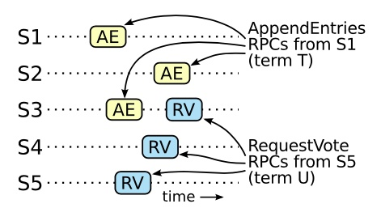

    这一假设的起点如上图，如果S1（任期 T 的领导者）提交了一条新的日志在它的任期里，然后S5在之后的任期U里被选举为领导人，然后由于日志提交需要半数以上的副本接受日志，而成为Leader也需要半数以上的副本投票给S5，所以至少会有一个机器，如S3，既拥有来自S1的日志，也给S5投票了

    证明过程：
    1. 在领导人U选举的时候一定没有那条被提交的日志条目，因为这个证明过程假设了大于T的最小任期U的领导人U没有这条日志条目，并且Raft中领导人从不会删除或者覆盖任何条目
    2. 领导人T复制这条日志条目给集群中的大多数节点，同时，领导人U从集群中的大多数节点赢得了选票。因此，至少有一个节点同时接受了来自领导人T的日志条目，并且给领导人U投票了，如上图的S3
    3. 这个投票者必须在给领导人U投票之前先接受了从领导人T发来的已经被提交的日志条目；否则他就会拒绝来自领导人T的附加日志请求，因为他的任期号U会比T大
    4. 这个投票者在给领导人U投票时依然保存有这条日志条目，因为跟随者只有在和领导人冲突的时候才会删除条目
    5. 投票者把自己选票投给领导人U时，领导人U的最后一条日志必须和投票者一样新，或比投票者新，但是这是矛盾的，因为假设是一样新，则领导人U的日志里一定那条有被提交的日志条目，这与证明过程开始的假设矛盾，
    6. 另一种情况是领导人U的最后一条日志的term比投票者的大，那么领导人U的最后一条日志的term一定比T大，因为投票人的最后一条日志的任期号至少和T一样大（投票者接受过领导人T的日志），而根据题目一开始的假设，领导人U是任期T之后的领导人中不含被提交日志的任期最小的领导人，所以创建领导人U的最后一条日志的之前的领导人（假设叫做领导人X，任期也是X）的日志记录中有被提交的那条日志，但是根据日志的同步规则，跟随者必须先接受领导者某条日志之前的所有日志后（包括之前任期的日志），才能接受某条日志，所以由于领导者X有被提交的那条日志，而领导者U在X任期作为跟随者时接受了比任期T还要大的日志，那么领导者U作为跟随者时一定已经接受了任期T的日志，这个开始的假设矛盾
    7. 因此，所有比T大的领导人一定包含了所有来自T的已经被提交的日志
    8. 日志同步规则保证了未来的领导人也同时会包含被间接提交的条目

    安全性保证了，如果服务器已经在某个给定的索引值应用了日志条目到自己的状态机里（提交该日志），那么其他的服务器不会应用一个不一样的日志到同一个索引值上。在一个服务器应用一条日志条目到他自己的状态机中时，他的日志必须和领导人的日志，在该条目和之前的条目上相同，并且已经被提交

    最后，Raft要求服务器按照日志中索引位置顺序应用日志条目。和状态机安全特性结合起来看，这就意味着所有的服务器会应用相同的日志序列集到自己的状态机中，并且是按照相同的顺序

    到目前为止，只关注了领导人崩溃的情况。对于跟随者和候选人崩溃后的处理方式比领导人要简单的多，并且他们的处理方式是相同的。如果跟随者或者候选人崩溃了，那么后续发送给他们的RPC都会失败。Raft中处理这种失败就是简单的通过无限的重试；如果崩溃的机器重启了，那么这些RPC就能够成功执行。如果一个服务器在完成了一个RPC，但是还没有响应的时候崩溃了，那么在他重新启动之后就会再次收到同样的请求。Raft的RPC都是幂等的，所以这样重试不会造成任何问题。例如一个跟随者如果收到附加日志请求但是他已经包含了这一日志，那么他就会直接忽略这个新的请求

    #### 时间和可用性
    Raft的要求之一就是安全性不能依赖时间：整个系统不能因为某些事件运行的比预期快一点或者慢一点就产生了错误的结果。但是，可用性（系统可以及时的响应客户端）不可避免的要依赖于时间。例如，如果消息交换（消息传输）比服务器故障间隔时间长，候选人将没有足够长的时间来赢得选举（每次发送消息的时间超过选举超时时间的话，选举永远都不会成功）；没有一个稳定的领导人，Raft将无法工作

    领导人选举是Raft中对时间要求最为关键的方面。Raft可以选举并维持一个稳定的领导人,只要系统满足下面的时间要求：
    ```
    广播时间（broadcastTime） << 选举超时时间（electionTimeout） << 平均故障间隔时间（MTBF）
    ```
    在这个不等式中，广播时间指的是从一个服务器并行的发送RPC给集群中的其他服务器并接收响应的平均时间；平均故障间隔时间就是对于一台服务器而言，两次故障之间的平均时间。广播时间必须比选举超时时间小一个量级，这样领导人才能够发送稳定的心跳消息来阻止跟随者开始进入选举状态；选举超时时间应该要比平均故障间隔时间小上几个数量级，这样整个系统才能稳定的运行。当领导人崩溃后，整个系统会大约相当于选举超时的时间里不可用。

    广播时间和平均故障间隔时间是由系统决定的，但是选举超时时间是我们自己选择的。Raft的RPC需要接收方将信息持久化的保存到稳定存储中去（保存日志和任期），所以广播时间大约是0.5毫秒到20毫秒，取决于存储的技术。因此，选举超时时间可能需要在10毫秒到500毫秒之间。大多数的服务器的平均故障间隔时间都在几个月甚至更长，很容易满足时间的需求

    #### 集群成员变化
    Raft考虑了集群成员变化的情况，即一致性集群的副本数量会发生变化，如替换某个宕机或新增副本，Raft将自动化配置改变纳入了其一致性算法中

    为了让配置修改机制能够安全，那么在转换的过程中不能够存在任何时间点使得两个领导人同时被选举成功在同一个任期里。不幸的是，任何服务器直接从旧的配置直接转换到新的配置的方案都是不安全的。一次性自动的转换所有服务器是不可能的，在转换期间整个集群存在划分成两个独立的大多数群体的可能性
    

    上图中，集群配额从3台机器变成了5台。如果将成员变更当成一般的一致性问题，直接向Leader发送成员变更请求，Leader复制成员变更日志，达成多数派之后提交，各服务器提交成员变更日志后从旧成员配置（Cold）切换到新成员配置（Cnew），因为各个服务器提交成员变更日志的时刻可能不同，造成各个服务器从旧成员配置（Cold）切换到新成员配置（Cnew）的时刻不同，如上图箭头所指的时刻，会存在这样一个可能性，原Leader发送成员变更通知后等待Follower接受，上图的Server3先接受了新成员配置（Cnew），Server2还没有，此时Server3、新增的Server4和Server5如果发生选举超时进行选举，他们采用新成员配置（Cnew）进行选举过程，这个选举的term是原term + 1，对于他们来说，有5个副本，但是他们3个已经足够投出一个Leader，而对于Server 1和Server 2，如果Server 1发送心跳失败，Server 2也超时进行选举，这个选举的term也是原term + 1，由于Server 1和Server 2持有的还是旧成员配置（Cold），只要Server 2拿到Server 1的投票，他就可以忽略Server 3的投票称为Leader，这就导致了原term + 1的新term出现两个Leader

    之所以会出现上面的问题，是因为新的Leader可能会从接受了新成员配置（Cnew）的副本中被选出来，而还处于旧成员配置（Cold）的副本也可能在不知道新成员存在的情况下选出一个新Leader，也就是说，可能会存在Cold和Cnew各自形成不相交的多数派选出两个Leader。为了解决上述问题，Raft提出了两阶段的成员变更方法，集群先切换到一个过渡的配置，称之为共同一致；一旦共同一致已经被提交了，那么系统就切换到新的配置上。共同一致是老配置和新配置的结合，共同一致：
    1. 日志条目被复制给集群中新、老配置的所有服务器
    2. 新、旧配置的服务器都可以成为领导人
    3. 达成一致（针对选举和提交）需要分别在两种配置上获得大多数的支持

    共同一致允许独立的服务器在不影响安全性的前提下，在不同的时间进行配置转换过程。此外，共同一致可以让集群在配置转换的过程人依然响应客户端的请求
    
    采用共同一致后配置转换的过程：当一个领导人接收到一个改变配置从Cold到Cnew的请求，他会为共同一致配置（Cold&Cnew）以日志的形式增加到本地日志。一旦一个服务器将新的配置日志条目增加到它的日志中，他就会用这个配置来做出未来所有的决定（服务器总是使用最新的配置，无论他是否已经被提交）。这意味着领导人要使用Cold&Cnew的规则来决定日志条目Cold&Cnew什么时候需要被提交。如果领导人崩溃了，被选出来的新领导人可能是使用Cold配置也可能是Cold&Cnew配置，这取决于赢得选举的候选人是否已经接收到了Cold&Cnew配置。在任何情况下，Cnew配置在这一时期都不会单方面的做出决定（下面有针对这一结论的说明）。

    Raft两阶段成员变更过程如下：
    1. Leader收到成员变更请求从Cold切成Cnew
    2. Leader在本地生成一个新的日志，其内容是Cold&Cnew，代表当前时刻新旧成员配置共存，写入本地日志，同时将该日志发送给至Cold&Cnew中的所有副本。在此之后新的日志同步需要保证得到Cold和Cnew两个多数派的确认
    3. Follower收到Cold&Cnew的日志后更新本地日志，并且此时就以该配置作为自己的成员配置（服务器总是使用最新的配置，无论他是否已经被提交）
    4. 如果Cold和Cnew中的两个多数派确认了Cold&Cnew这条日志，Leader就提交这条日志
    5. 接下来Leader生成一条新的日志，其内容是新成员配置Cnew，同样将该日志写入本地日志，同时复制到Follower上
    6. Follower收到新成员配置Cnew后，将其写入日志，并且从此刻起，就以该配置作为自己的成员配置，并且如果发现自己不在Cnew这个成员配置中会自动退出
    7. Leader收到Cnew的多数派确认后，表示成员变更成功，后续的日志只要得到Cnew多数派确认即可。Leader给客户端回复成员变更执行成功
   
    上述说明摘自网上，我存在一个疑问，新加的副本在共同一致时其配置是Cnew还是Cold&Cnew？如果是Cnew，那么还是有可能出现两个Leader，如上图的情景。这里做点改变，原集群为S1、S2、S3，假设Cnew是S3、S4、S5（Cnew是有可能不包括当前Leader的，这一点下面会说明），S1收到成员变更请求，创建成员变更日志，写入日志到本地并发送日志给所有副本后挂了，S2和S3还没接受到这个日志，那么S2、S3在Cold配置下会形成多数派，S4、S5在持有Cnew配置下也会形成多数派，所以新加的副本在共同一致时其配置看来就是Cold&Cnew（不可能是Cold吧，没有意义），而如果新加的副本在共同一致时其配置是Cold&Cnew，还是有可能出现两个多数派，模仿刚才的假设再做点改变，如果Cnew是S1、S2、S3、S4、S5，S1发送成员变更日志后，会以Cold&Cnew作为其配置，此时S2、S3持有Cold配置形成一个多数派，S1、S4、S5也能形成一个多数派，那看来新加的副本在共同一致时其配置是Cold&Cnew也不行，针对这个疑问，先提出三个Raft论文中说到的问题和解决方案：
    1. 第一个问题是，新的服务器可能初始化没有存储任何的日志条目。当这些服务器以这种状态加入到集群中，那么他们需要一段时间来更新追赶，这时还不能提交新的日志条目。为了避免这种可用性的间隔时间，Raft在配置更新的时候使用了一种额外的阶段，在这个阶段，新的服务器以没有投票权身份加入到集群中来（领导人复制日志给他们，但是不考虑他们是大多数，也就是这个阶段发生在成员变更之前）。一旦新的服务器追赶上了集群中的其他机器，重新配置可以像上面描述的一样处理
    2. 第二个问题是，集群的领导人可能不是新配置的一员。在这种情况下，领导人就会在提交了Cnew日志之后退位（回到跟随者状态）。这意味着有这样的一段时间，领导人管理着集群，但是不包括他自己；他复制日志但是不把他自己算作是大多数之一。当Cnew被提交后，会发生领导人过渡，Cnew会在选举超时后选出新的领导人，在此之前，可能只能从Cold中选出领导人（关于这一点，下面会有说明）
    3. 第三个问题是，移除不在Cnew中的服务器可能会扰乱集群。这些服务器将不会再接收到心跳，所以当选举超时，他们就会进行新的选举过程。他们会发送拥有新的任期号的请求投票RPC，这样会导致当前的领导人回退成跟随者状态。即使不在Cnew中的服务器成为候选者发送投票请求后由于没有足够的支持者无法成为Leader。如假设Cold为S1、S2、S3、S4、S5，Cnew为S1、S3、S4、S5，S6，S2不在Cnew中所以不会收到Cnew的Leader的心跳，则他在选举超时后会发起投票，S1、S3、S4、S5都可能会收到投票请求，此时S2的term可能大于他们的term导致投票请求成功，假设只有S1成功收到投票，并且S1刚好是Cnew的Leader，则他会变成跟随者并投票给S2，而S2由于只有S1的投票，所以会再次等待，此时Cnew的其他副本都收不到S1的心跳，那么他们会选举超时并最终在Cnew中再选出一个Leader，但是S2将会再次超时，然后这个过程会再次重复，导致整体可用性大幅降低。为了避免这个问题，当服务器确认当前领导人存在时，服务器会忽略请求投票RPC。这句话的意思是，每个副本都有自己的选举超时时间，尽管每个副本自己随机的决定选举超时时间，但是也是在一个范围内随机，这也就意味着选举超时时间是存在最小值的，假设最小值为minT，那么如果某个副本在时间点a收到了Leader的心跳，在a + minT的时间点之前他收到了一个投票请求，他会拒绝这个请求，这就使得如果领导人能够发送心跳给集群，那么他就不会被更大的任期号废黜，因为旧副本在发送投票请求之前需要等待选举超时，这个等待时间至少是minT，那这就使得新领导人能够在旧副本在发送投票请求之前发送心跳给Cnew。尽管这种策略下会存在拒绝任期号大的投票请求，但是这种策略也不会影响正常的选举，因为所有的副本都是在至少等待minT的时间后发出投票请求，那么这个请求肯定不会被其他Follower拒绝（在Leader已经挂掉的情况下，所有的Follower至少要minT的时间没有收到心跳才可能出现候选者，所以按照拒绝策略不会拒绝这个投票请求，Leader没挂的话收到心跳的Follower还是会拒绝这个投票请求，不过Leader没挂的情况下被拒绝也没事，不影响集群的运行），另外对于不在Cnew中的服务器，也要尽快将其关机移除，没必要再继续运行影响集群了

    再回到刚才提出的疑问，个人理解，针对这个疑问Raft的解决方案是：
    1. 新加入的副本由于没有日志，所以需要等待其日志追赶上了集群中的其他机器，他才具备拥有投票权的副本，这也就意味着，在追赶期间，Leader不会关心也不会要求这些新加入的副本投票，所以在副本的日志追赶上了集群中的其他机器之前，Cold不会变化，也就是在追赶期间，Leader不会考虑发出Cold&Cnew配置日志
    2. 当副本的日志追赶上了集群中的其他机器，就意味着他的日志和Leader的日志是一样的，此时Leader发出Cold&Cnew配置日志给Cold和Cnew，这里存在的可能：
       1. Leader的Cold&Cnew配置尚未推送到Follower，Leader就挂了，此时选出的新Leader的配置还是Cold，而新加入的那些副本个人认为在收到Cold&Cnew配置之前还不具备投票权，也不会选举超时，此时只要给新Leader再发一次成员变更请求即可
       2. Leader的Cold&Cnew配置推送给了少数Follower后Leader挂了，那么那些收到Cold&Cnew配置的Follower的日志是最新的，Leader可能会在他们中间产生，如果是这种情况，则新Leader会把Cold&Cnew配置同步到所有Follower，但是新Leader也可能是那些没有收到Cold&Cnew配置的Follower中间产生的，那么新Leader的配置为Cold，此时只要给新Leader再发一次成员变更请求即可
       3. Leader的Cold&Cnew配置推送给了大多数Follower后Leader挂了，此时持有Cold配置的副本由于日志太旧且副本数量少于大多数，所以配置为Cold的副本不可能赢得选举，新Leader的配置一定是Cold&Cnew，在新Leader被选出来后，会把Cold&Cnew配置同步到所有Follower
    3. 当Leader提交了Cold&Cnew配置，一位了集群的大多数副本都接受了Cold&Cnew配置，此时Leader创建Cnew配置，并发送给Cnew的成员，这里存在的可能：
       1. Leader的Cnew配置尚未推送到Follower，Leader就挂了，此时选出的新Leader的配置一定是Cold&Cnew，这个新Leader再进行Cnew的发送即可
       2. Leader的Cnew配置推送给了少数Follower后Leader挂了，那么那些收到Cnew配置的Follower的日志是最新的，Leader可能会在他们中间产生，如果是这种情况，则新Leader会把Cnew配置同步到所有Cnew的Follower，但是新Leader也可能是那些没有收到Cnew配置的Follower中间产生的，那么新Leader的配置为Cold&Cnew，此时只要新Leader再进行Cnew的发送即可
       3. Leader的Cnew配置推送给了大多数Follower后Leader挂了，此时持有Cold&Cnew配置的副本由于日志太旧且副本数量少于大多数，所以配置为Cold&Cnew的副本不可能赢得选举，新Leader的配置一定是Cnew中的，在新Leader被选出来后，会把Cnew配置同步到所有Cnew的Follower

    上面的个人理解解决了Cnew和Cold的副本不可能单独做出决策，Cnew中的副本想要参与投票和Leader选举就必须日志已经追赶上集群的副本并且收到了Cold&Cnew配置，否则新Leader只会在Cold中产生，Cnew中的副本成为Leader说明他得到了Cold&Cnew的多数派的支持（这里的支持说的是得到了Cold和Cnew两个多数派的支持，而不是只考虑Cold&Cnew副本数量的支持），这使得最终的Leader要么是Cold中的，要么是Cnew中得到Cold和Cnew两个多数派支持的副本，解决了成员变更的安全性问题

    两阶段成员变更比较通用且容易理解，但是实现比较复杂，同时两阶段的变更协议也会在一定程度上影响变更过程中的服务可用性，因此期望增强成员变更的限制，以简化操作流程。

    两阶段成员变更，之所以分为两个阶段，是因为对Cold与Cnew的关系没有做任何假设，为了避免Cold和Cnew各自形成不相交的多数派选出两个Leader，才引入了两阶段方案。

    如果增强成员变更的限制，假设Cold与Cnew任意的多数派交集不为空，这两个成员配置就无法各自形成多数派，那么成员变更方案就可能简化为一阶段。

    那么如何限制Cold与Cnew，使之任意的多数派交集不为空呢？方法就是每次成员变更只允许增加或删除一个成员，假设Cold的成员数为N，分析如下：
    1. Cnew成员数为N+1
      1. 假设选出的leader持有Cnew，那么一定是Cnew中有多数派，即至少(N+1)/2+1的成员给leader投票，那么持有Cold且未给leader投票的成员最多为(N+1)-((N+1)/2+1)=(N-1)/2，这个值小于Cold的多数派值N/2+1，无法选出leader
      2. 假设选出的leader持有Cold，那么一定是Cold中有多数派，即N/2+1的成员给leader投票，那么持有Cnew且未给leader投票的成员最多为(N+1)-(N/2+1)=N/2，这个值小于Cnew的多数派值(N+1)/2+1，无法选出leader

    2. Cnew成员数为N-1
      1. 假设选出的leader持有Cnew，那么一定是Cnew中有多数派，即(N-1)/2+1的成员给leader投票，那么持有Cold且未给leader投票的成员最多为N-((N-1)/2+1)=(N-1)/2，这个值小于Cold的多数派值N/2+1，无法选出leader
      2. 假设选出的leader持有Cold，那么一定是Cold中有多数派，即N/2+1的成员给leader投票，那么持有Cnew且未给leader投票的成员最多为N-(N/2+1)=(N-2)/2，这个值小于Cnew的多数派值(N-1)/2+1，无法选出leader

    一阶段成员变更：
    1. 成员变更限制每次只能增加或删除一个成员（如果要变更多个成员，连续变更多次）
    2. 成员变更由Leader发起，Cnew得到多数派确认后，返回客户端成员变更成功
    3. 一次成员变更成功前不允许开始下一次成员变更，因此新任Leader在开始提供服务前要将自己本地保存的最新成员配置重新投票形成多数派确认
    4. Leader只要开始同步新成员配置，即可开始使用新的成员配置进行日志同步

    #### 日志压缩
    Raft的日志在正常操作中不断的增长，但是在实际的系统中，日志不能无限制的增长。随着日志不断增长，他会占用越来越多的空间，花费越来越多的时间来重置。如果没有一定的机制去清除日志里积累的陈旧的信息，那么会带来可用性问题

    Raft的日志压缩策略是使用快照，每个副本独立的对自己的系统状态进行snapshot，并且只能对已经提交的日志记录进行snapshot，snapshot中包含以下内容：
    1. 日志元数据，包括最后一条已提交的日志的索引和term。这两个值在snapshot之后的第一条日志的附加日志RPC的完整性检查的时候会被用上（日志同步时会用上）。
    2. 系统当前状态，如副本的这次快照的多条日志对变量x进行更新，则会记录最后x的值

    

    上图中一个副本用新的快照替换了从1到5的条目，快照值存储了当前的状态。快照中包含了最后的索引位置和任期号

    为了支持集群成员更新，快照中也将最后的一次集群成员配置作为最后一个条目存下来。
    
    一旦服务器完成一次快照，他就可以删除最后索引位置之前的所有日志和快照了，尽管通常副本都是独立的创建快照，但是领导人必须偶尔的发送快照给一些落后的跟随者。这通常发生在当领导人已经丢弃了下一条需要发送给跟随者的日志条目的时候（意思是某条日志被提交了，并且领导人将这条日志做到了快照中，然后删除了这条日志，此时需要发送快照给没有同步到这条日志的跟随者）。幸运的是这种情况不是常规操作：一个与领导人保持同步的跟随者通常都会有这个条目。然而一个运行非常缓慢的跟随者或者新加入集群的服务器将不会有这个条目。这时让这个跟随者更新到最新的状态的方式就是通过网络把快照发送给他们

    </details>

- 消息队列
  - <details><summary>Kafka</summary>
   
    - <details><summary>Kafka为什么那么快</summary>

      - Kafka的设计：
      Kafka采用分区的设计将消息的写入操作分散到了多个Broker，同时消息也是通过多个Broker进行读取的。
      - 日志的存储：
      Kafka利用分段、追加日志的方式，在很大程度上将读写限制为顺序I/O，而顺序I/O的性能要比随机I/O快3到4个数量级。
      - 零拷贝：
      Kafka使用了Zero Copy技术提升了消费的效率。Kafka将消息先写入页缓存，如果消费者在读取消息的时候如果在页缓存中可以命中，那么可以直接从页缓存中读取，这样又节省了一次从磁盘到页缓存的copy开销。
      - 记录的批处理：
      Kafka的客户端和服务端会在一个批处理中积累多个记录，包括读写记录，然后再通过网络发送出去。记录的批处理可以缓解网络往返的开销，使用更大的数据包，提高带宽的效率。客户端发送数据前还可以对批处理中的数据进行压缩，进一步提高带宽效率。
      - 未刷新的缓冲写操作：
      Kafka在确认写操作之前并没有调用fsync，提高了消息的写入速度，同时通过副本保证消息的持久性。
      - 避免垃圾回收：
      大量使用通道、缓冲区和页面缓存还有一个额外的好处：减少垃圾收集器的工作负载。例如，在32 GB RAM的机器上运行Kafka将产生28-30 GB的页面缓存可用空间，这部分内存不由JVM管理。通过避免垃圾回收，服务端不太可能遇到因垃圾回收引起的程序暂停，从而影响客户端，加大记录的通信延迟。

      </details>  
      
    </details>  

- 其他
  - <details><summary>IO相关</summary>

    - <details><summary>IO/NIO</summary>

      ## 传统 I/O 跟 NIO 的区别
      所有 I/O 都被视为单个的字节的移动，通过一个称为 Stream 的对象一次移动一个字节。 传统流 IO 的好处是使用简单，将底层的机制都抽象成流，但缺点就是性能不足，当一个线程调用 read() 或 write()时，该线程被阻 塞，直到有一些数据被读取，或数据完全写入。该线程在此期间不能再干任何事情了。传统 I/O 以流的方式处理数据，而 NIO 以块的方式处理数据，不管是读或者写都需要以块的形式写入到缓冲区中。。
      
      NIO 作为非阻塞式的 IO，它的优点就在于：
      - 1、它由一个专门的线程去处理所有的 IO 事件，并负责分发;
      - 2、事件驱动，只有事件到了才会触发，而不是同步的监听这个事件; 
      - 3、线程之间通过 wait,notify 等方式通讯。保证每次上下文切换都是有意义的。减少无谓的线程切换。

      ## 阻塞 IO 模型
      最传统的一种 IO 模型，即在读写数据过程中会发生阻塞现象。当用户线程发出 IO 请求之后，内核会去查看数据是否就绪，如果没有就绪就会等待数据就绪，而用户线程就会处于阻塞状态，用户线程交出CPU。当数据就绪之后，内核会将数据拷贝到用户线程，并返回结果给用户线程，用户线程才解除 block 状态。

      ## 非阻塞 IO 模型
      当用户线程发起一个 read 操作后，并不需要等待，而是马上就得到了一个结果。如果结果是一个 error 时，它就知道数据还没有准备好，于是它可以再次发送 read 操作。一旦内核中的数据准备好了，并且又再次收到了用户线程的请求，那么它马上就将数据拷贝到了用户线程，然后返回。所以事实上，在非阻塞 IO 模型中，用户线程需要不断地询问内核数据是否就绪，也就说非阻塞 IO 不会交出 CPU，而会一直占用 CPU。

      ## 多路复用 IO 模型
      Java NIO 实际上就是多路复用 IO。在多路复用 IO 模型中，会有一个线程不断去轮询多个 socket 的状态，只有当 socket 真正有读写事件时，才真 正调用实际的 IO 读写操作。因为在多路复用 IO 模型中，只需要使用一个线程就可以管理多个 socket，系统不需要建立新的进程或者线程，也不必维护这些线程和进程，并且只有在真正有 socket 读写事件进行时，才会使用 IO 资源，所以它大大减少了资源占用。在 Java NIO 中，是通过 selector.select()去查询每个通道是否有到达事件，如果没有事件，则一直阻塞在那里，因此这种方式会导致用户线程的阻塞。多路复用 IO 模式，通过一个线程就可以管理多个 socket，只有当 socket 真正有读写事件发生才会占用资源来进行实际的读写操作。因此，多路复用 IO 比较适合连接数比较多的情况。

      不过要注意的是，多路复用 IO 模型是通过轮询的方式来检测是否有事件到达，并且对到达的事件逐一进行响应。因此对于多路复用 IO 模型来说，一旦事件响应体很大，那么就会导致后续的事件迟迟得不到处理，并且会影响新的事件轮询。

      ## 信号驱动 IO 模型
      在信号驱动 IO 模型中，当用户线程发起一个 IO 请求操作，会给对应的 socket 注册一个信号函数，然后用户线程会继续执行，当内核数据就绪时会发送一个信号给用户线程，用户线程接收到信号之后，便在信号函数中调用 IO 读写操作来进行实际的 IO 请求操作。

      ## 异步 IO 模型
      异步 IO 模型才是最理想的 IO 模型，在异步 IO 模型中，当用户线程发起 read 操作之后，立刻就可以开始去做其它的事。而另一方面，从内核的角度，当它收到一个 asynchronous read 之后， 它会立刻返回，说明 read 请求已经成功发起了，因此不会对用户线程产生任何 block。然后，内 核会等待数据准备完成，然后将数据拷贝到用户线程，当这一切都完成之后，内核会给用户线程 发送一个信号，告诉它 read 操作完成了。也就说用户线程完全不需要实际的整个 IO 操作是如何进行的，只需要先发起一个请求，当接收内核返回的成功信号时表示 IO 操作已经完成，可以直接取使用数据了。

      在异步 IO 模型中，IO 操作的两个阶段都不会阻塞用户线程，这两个阶段都是由内核自动完成，然后发送一个信号告知用户线程操作已完成。用户线程中不需要再次调用 IO 函数进行具体的 读写。这点是和信号驱动模型有所不同的，在信号驱动模型中，当用户线程接收到信号表示数据已经就绪，然后需要用户线程调用 IO 函数进行实际的读写操作。而在异步 IO 模型中，收到信号表示 IO 操作已经完成，不需要再在用户线程中调用 IO 函数进行实际的读写操作。

      </details>

    - <details><summary>select、poll、epoll</summary>

      ## 简单介绍
      实现nio需要操作系统的支持，linux中一般有3中实现方式：select、poll、epoll

      select、poll和epoll都能完成1个线程处理所有连接的“等待消息准备好”事件，但是select的实现存在缺陷：
      1. 每次调用select方法，都需要把fd集合从用户态拷贝到内核态，这个开销在fd很多时会很大
      2. 每次调用select方法，都需要在内核遍历传递进来的所有fd寻找准备好的fd，这个开销在fd很多时也很大。select仅仅是知道了有I/O事件发生了，却并不知道是哪那几个流(可能有一个或者多个，甚至全部)，只能无差别轮询所有流，找出能读出数据，或者写入数据的流，对他们进行操作。所以select具有O(n)的无差别轮询复杂度，同时处理的流越多，无差别轮询时间就越长。
      3. linux中select的实现方式限制了fd个数，最多1024个。

      poll的实现和select区别不大，只是poll基于链表来存储fd，取消了1024的限制。

      epoll既然是对select和poll的改进，就应该能避免上述的三个缺点。那epoll都是怎么解决的呢？select和poll都只提供了一个函数：select或者poll函数。而epoll提供了三个函数，epoll_create、epoll_ctl和epoll_wait，epoll_create是创建一个epoll句柄；epoll_ctl是注册要监听的事件类型；epoll_wait则是等待事件的产生
      - 对于第一个缺点，epoll的解决方案在epoll_ctl函数中。每次注册新的事件到epoll句柄中时（如在epoll_ctl中指定EPOLL_CTL_ADD），会把fd拷贝进内核，而不是在epoll_wait的时候重复拷贝。epoll保证了每个fd在整个过程中只会拷贝一次
      - 对于第二个缺点，epoll的解决方案是为每个fd指定一个回调函数，当设备就绪，唤醒等待队列上的等待者时，就会调用这个回调函数，而这个回调函数会把就绪的fd加入一个就绪链表。epoll_wait的工作实际上就是在这个就绪链表中查看有没有就绪的fd（利用schedule_timeout()实现睡一会，判断一会的效果）
      - 对于第三个缺点，epoll没有这个限制，它所支持的FD上限是最大可以打开文件的数目

      epoll有两种工作模式：：LT（水平触发）模式和ET（边缘触发）模式。默认情况下，epoll采用LT模式工作，这时可以处理阻塞和非阻塞套接字。ET模式的效率要比LT模式高，它只支持非阻塞套接字。使用LT模式意味着只要连接的fd处于可读或者可写状态（数据还没有被读完），每次epoll_wait都会返回该fd，这样的话会带来很大的系统开销，因为每次调用epoll_wait时返回的fd列表数量都比较多，无论fd是否发生了新的事件。在ET模式下，当有事件发生时，系统只会通知你一次，即在调用epoll_wait返回fd后，不管这个事件处理还是没处理完，当再次调用epoll_wait时，都不会再返回该fd（除非又有新的事件来了），这样的话程序员要自己保证在事件发生时要及时有效的处理完该事件。ET模式下效率非常高，在并发，大流量的情况下，会比LT少很多epoll的系统调用，但是对编程要求高，需要细致的处理每个请求，否则容易发生丢失事件的情况。

      总结：
      - select，poll实现需要不断轮询所有fd集合，直到设备就绪，期间可能要睡眠和唤醒多次交替。而epoll其实也需要调用epoll_wait不断轮询就绪链表，期间也可能多次睡眠和唤醒交替，但是它是设备就绪时，调用回调函数，把就绪fd放入就绪链表中，并唤醒在epoll_wait中进入睡眠的进程。虽然都要睡眠和交替，但是select和poll在“醒着”的时候要遍历整个fd集合，而epoll在“醒着”的时候只要判断一下就绪链表是否为空就行了，这节省了大量的CPU时间。这就是回调机制带来的性能提升。
      - select，poll每次调用都要把fd集合从用户态往内核态拷贝一次，而epoll只要一次拷贝，这也能节省不少的开销。

      </details>
    
    - <details><summary>mmap内存映射</summary>

      mmap内存映射直接将磁盘文件数据映射到内核缓冲区，这个映射的过程是基于DMA引擎拷贝的，同时用户缓冲区是跟内核缓冲区共享一块映射数据的，建立共享映射之后，就不需要从内核缓冲区拷贝到用户缓冲区了。用户空间和内核空间共享一块相同的内存，这样做的直观效果显而易见：
      - 正常的read()或write()需要两次传输：一次是在文件和内核高速缓冲区之间，另一次是在高速缓冲区和用户空间缓冲区之间。使用mmap()就不需要第二次传输了。对于输入来讲，一旦内核将相应的文件块映射进内存之后，用户进程就能够使用这些数据了；对于输出来讲，用户进程仅仅需要修改内核中的内容，然后可以依靠内核内存管理器来自动更新底层的文件。
      - 除了节省内核空间和用户空间之间的一次传输之外，mmap()还能够通过减少所需使用的内存来提升性能。当使用read()或write()时，数据将被保存在两个缓冲区中：一个位于用户空间，另个一位于内核空间。当使用mmap()时，内核空间和用户空间会共享同一个缓冲区。此外，如果多个进程正在同一个文件上执行I/O，那么它们通过使用mmap()就能够共享同一个内核缓冲区，从而又能够节省内存的消耗。

      </details>

    </details>

  - <details><summary>Linux</summary>

    #### 为什么要分内核态和用户态
    如果没有内核态和用户态之分，程序可以访问硬件资源，比如分配内存，程序能随意的读写所有的内存空间，如果程序员一不小心将不适当的内容写到了不该写的地方，很可能导致系统崩溃。用户程序是不可信的，不管程序员是有意的还是无意的，都很容易将系统干到崩溃。
    正因为如此，Intel就发明了ring0-ring3这些访问控制级别来保护硬件资源，ring0的就是我们所说的内核级别，要想使用硬件资源就必须获取相应的权限。操作系统对内核级别的指令进行封装，统一管理硬件资源，然后向用户程序提供系统服务，用户程序进行系统调用后，操作系统执行一系列的检查验证，确保这次调用是安全的，再进行相应的资源访问操作。内核态能有效保护硬件资源的安全。
    
    </details>  

  - <details><summary>如何实现接口幂等</summary>

    #### 全局唯一ID
    ```
    根据业务的操作和内容生成一个全局ID，在执行操作前先根据这个全局唯一ID是否存在，来判断这个操作是否已经执行。如果不存在则把全局ID，存储到存储系统中，比如数据库、redis等。如果存在则表示该方法已经执行，注意全局ID需要有超时时间，防止应用写入全局ID后挂了
    ``` 

    #### 去重表
    ```
    表中设置唯一索引，比如支付场景中，如果一个订单只会支付一次，所以订单ID可以作为唯一标识
    ```

    #### 多版本控制
    ```
    比如要更新商品的名字，增加一个版本号列，更新请求中带有发出请求时的版本号，更新时带上版本号的where条件，更新时版本号 + 1，如果是消息队列作为请求来源，则将版本号保存到消息本身，更新时比较当前数据的版本号是否和消息中的版本号一致
    ```

    #### 状态机控制
    ```
    这种方法适合在有状态机流转的情况下，比如就会订单的创建和付款，可以通过在设计状态字段时，使用int类型，并且通过值类型的大小来做幂等，比如订单的创建为0，付款成功为100。付款失败为99

    update `order` set status=#{status} where id=#{id} and status<#{status}
    ```
    </details>  

  - <details><summary>常见的加密算法</summary>

      #### MD5算法
      ```
      MD5用的是哈希函数，它的典型应用是对一段信息产生信息摘要，以防止被篡改。严格来说，MD5不是一种加密算法而是摘要算法。无论是多长的输入，MD5都会输出长度为128bits的一个串，MD5加密后的串不可逆
      ```

      #### SHA1算法
      ```
      SHA1是和MD5一样流行的消息摘要算法，然而SHA1比MD5的安全性更强。对于长度小于2 ^ 64位的消息，SHA1会产生一个160位的消息摘要。基于MD5、SHA1的信息摘要特性以及不可逆 (一般而言)，可以被应用在检查文件完整性以及数字签名 等场景
      ```

      #### HMAC算法
      ```
      HMAC是密钥相关的哈希运算消息认证码（Hash-based Message Authentication Code），HMAC运算利用哈希算法 (MD5、SHA1 等)，以一个密钥和一个消息为输入，生成一个消息摘要作为输出。
      HMAC发送方和接收方都有的key进行计算，而没有这把key的第三方，则是无法计算出正确的散列值的，这样就可以防止数据被篡改
      ```

      #### AES/DES/3DES算法
      ```
      AES、DES、3DES都是对称的块加密算法，加解密的过程是可逆的。常用的有AES128、AES192、AES256

      DES加密算法是一种分组密码，以64位为分组对数据加密，它的密钥长度是56位，加密解密用同一算法。
      DES加密算法是对密钥进行保密，而公开算法，包括加密和解密算法。这样，只有掌握了和发送方 相同密钥的人才能解读由 DES加密算法加密的密文数据。因此，破译DES加密算法实际上就是搜索密钥的编码。对于56位长度的 密钥来说，如果用 穷举法来进行搜索的话，其运算次数为 2 ^ 56 次

      AES为分组密码，分组密码也就是把明文分成一组一组的，每组长度相等，每次加密一组数据，直到加密完整个明文。在AES标准规范中，分组长度只能是128位，也就是说，每个分组为16个字节（每个字节8位）。密钥的长度可以使用128位、192位或256位
      ```

      #### RSA算法
      ```
      RSA加密算法是目前最有影响力的公钥加密算法，并且被普遍认为是目前最优秀的公钥方案之一。RSA是第一个能同时用于加密和数字签名的算法，它能够抵抗到目前为止已知的所有密码攻击，已被ISO推荐为公钥数据加密标准

      RSA加密算法基于一个十分简单的数论事实：将两个大素数相乘十分容易，但想要对其乘积进行因式分解却极其困难，因此可以将乘积公开作为加密密钥
      ```

      </details>

  - <details><summary>高并发场景</summary>
   
    - <details><summary>秒杀系统设计</summary>

      #### 系统隔离
      为了不影响现有的业务系统的正常运行，把秒杀系统和现有的系统做隔离。即使秒杀活动出现问题也不会影响现有的系统。隔离的设计思路可以从三个维度来思考：
      1. 业务隔离：可以把秒杀当成一个单独的项目来看，在活动开始之前，最好设计一个“热场”，“热场”的形式多种多样，例如：分享活动领优惠券，领秒杀名额等等。“热场”的形式不重要，重要的是通过它获取一些准备信息，例如：有可能参与的用户数，他们的地域分布，他们感兴趣的商品。为后面的技术架构提供数据支持
      2. 技术隔离：
         1. 客户端，前端秒杀页面使用专门的页面，这些页面包括静态的HTML和动态的JS，他们都需要在CDN上缓存，秒杀开始时，前端访问后台获取具体的秒杀url，后台校验通过之后才返回秒杀url，秒杀的url需要实现动态化，如通过md5加密一串随机字符作为秒杀的url，使得秒杀url无法被提前计算出来
         2. 接入层，加入过滤器专门处理秒杀请求，即使扩展再多的应用，使用再多的应用服务器，部署再多的负载均衡器，都会遇到支撑不住海量请求的时候，所以，在这一层要考虑的是如何做好限流，当超过系统承受范围的时候，需要果断阻止请求的涌入
         3. 应用层，瞬时的海量请求好比请求的“高峰”，架构系统的目的就是“削峰”。需要使用服务集群和水平扩展，让“高峰”请求分流到不同的服务器进行处理。同时，还会利用缓存和队列技术减轻应用处理的压力，通过异步请求的方式做到最终一致性。由于是多线程操作，而且商品的额度有限，为了解决超卖的问题，需要考虑进程锁的问题
      3. 数据库隔离：秒杀活动持续时间短，瞬时数据量大。为了不影响现有数据库的正常业务，可以建立新的库或者表来处理，在秒杀结束以后，需要把这部分数据同步到主业务系统中

      #### 前端动静分离
      ```
      整个页面Cache在用户浏览器
      如果强制刷新整个页面，也会请求到CDN
      实际有效请求只是“刷新抢宝”按钮

      同时可以限制用户刷新频率，后台限制单一用户请求次数
      ```

      #### 基于时间分片削峰
      ```
      按下抢宝按钮后先到答题或验证码页面，将峰值请求拉长
      ```

      #### 限流
      限制系统的输入和输出流量，一旦达到的需要限制的阈值，就采取一些措施对流量进行限制，如延迟处理，拒绝处理，或者部分拒绝处理等等

      #### 降级
      1. 延迟服务：比如发表了评论，评论是个重要服务，所以在文章要中显示正常，但是延迟给用户增加积分，只是放到一个缓存中，等服务平稳之后再执行
      2. 在粒度范围内关闭服务（片段降级或服务功能降级）：比如关闭相关文章的推荐，直接关闭推荐区
      3. 页面异步请求降级：比如商品详情页上有推荐信息/配送至等异步加载的请求，如果这些信息响应慢或者后端服务有问题，可以进行降级
      4. 写降级：比如秒杀抢购，可以只进行Cache的更新，然后异步同步扣减库存到DB，保证最终一致性即可，此时可以将DB降级为Cache
      5. 读降级：比如多级缓存模式，如果后端服务有问题，可以降级为只读缓存，这种方式适用于对读一致性要求不高的场景

      ##### 降级分类
      1. 降级按照是否自动化可分为：自动开关降级（超时、失败次数、故障、限流）和人工开关降级（秒杀、电商大促等）
      2. 降级按照功能可分为：读服务降级、写服务降级
      3. 降级按照处于的系统层次可分为：多级降级

      ##### 自动降级分类
      1. 超时降级：主要配置好超时时间和超时重试次数和机制，并使用异步机制探测恢复情况
      2. 失败次数降级：主要是一些不稳定的api，当失败调用次数达到一定阀值自动降级，同样要使用异步机制探测恢复情况
      3. 故障降级：比如要调用的远程服务挂掉了（网络故障、DNS故障、http服务返回错误的状态码、rpc服务抛出异常），则可以直接降级。降级后的处理方案有：默认值（比如库存服务挂了，返回默认现货）、兜底数据（比如广告挂了，返回提前准备好的一些静态页面）、缓存（之前暂存的一些缓存数据）
      4. 限流降级：当秒杀或者抢购一些限购商品时，此时可能会因为访问量太大而导致系统崩溃，此时开发者会使用限流来进行限制访问量，当达到限流阀值，后续请求会被降级；降级后的处理方案可以是：排队页面（将用户导流到排队页面等一会重试）、无货（直接告知用户没货了）、错误页（如活动太火爆了，稍后重试）

      #### 服务熔断
      服务熔断也被称为服务过载保护，可以认为：服务熔断是服务降级的措施

      服务熔断与服务降级比较：
      1. 服务熔断对服务提供了proxy，防止服务不可能时，出现串联故障（cascading failure），导致雪崩效应
      2. 服务熔断一般是某个服务（下游服务）故障引起，而服务降级一般是从整体负荷考虑


      </details>
    </details>

  - <details><summary>分布式限流</summary>
       
      常见的限流的算法：
      ##### 计数器
      计数器是最简单粗暴的算法，比如某个服务最多只能每秒钟处理100个请求。可以设置一个1秒钟的滑动窗口，窗口中有10个格子，每个格子100毫秒，每100毫秒移动一次，每次移动都需要记录当前服务请求的次数，当滑动窗口的格子划分的越多，那么滑动窗口的滚动就越平滑，限流的统计就会越精确
      ```
      // 服务访问次数，可以放在Redis中，实现分布式系统的访问计数，每当系统收到一个请求就将该值 + 1
      Long counter = 0L;
      // 使用LinkedList来模拟滑动窗口的10个格子
      LinkedList<Long> ll = new LinkedList<Long>();

      public static void main(String[] args) {
          Counter counter = new Counter();
          counter.doCheck();
      }

      private void doCheck() {
        while (true)
          {
            // 每次检查是否需要限流时将系统当前的访问次数保存到窗口
            ll.addLast(counter);

            // 超出窗口大小时移除最老的窗口
            if (ll.size() > 10){
                ll.removeFirst();
            }

            // 滑动窗口的最后一个和第一个创建分别记录了1秒的最开始系统的访问次数和当前系统的访问次数，这里比较最后一个和第一个窗口的差值，当差值大于阈值时执行限流逻辑
            if ((ll.peekLast() - ll.peekFirst()) > 100) {
                //To limit rate
            }

            // 每0.1秒检查一次，针对这个例子，0.1 * 窗口数量 = 1秒，阈值是100，所以限制的是1秒内不能超过100个请求，所以计数器算法缺点很明显，限流限的不是很精确，因为每0.1秒检查一次，两次检查之间系统可能会收到大量请求，需要等待下一次检查才能发现，可以将0.1调小，窗口数量调大，使得限制更精确，但是这也会增加系统负担
            Thread.sleep(100);
          }
      }
      ```

      ##### 漏桶算法
      漏桶(Leaky Bucket)算法思路很简单，水（请求）先进入到漏桶里，漏桶以一定的速度出水（接口有响应速率），当水流入速度过大会直接溢出（访问频率超过接口响应速率），然后就拒绝请求，可以看出漏桶算法能强行限制数据的传输速率
      ```
      double rate; // 模拟水流出的速率，相当于请求处理的速率
      double burst; // 模拟桶的大小
      long refreshTime; // 记录上次执行漏桶计算的时间
      double water; // 记录当前桶中的水量，也就是允许的请求量

      refreshWater() {
        // 每次计算时先获取当前时间
        long now = getTimeOfDay();
        // 将当前时间减去上次计算时间再乘以水流出的速率，就能得出这段时间内能够处理多数请求，water减去这个值就能得出
        // 桶里还有多少水，也就是多少请求没有被处理
        water = max(0, water - (now - refreshTime) * rate);
        refreshTime = now;
      }

      bool permissionGranted() {
        // 每次调用请求前先刷新桶的状态
        refreshWater();
        // 如果桶中剩余的水未到阈值，则能够执行请求处理
        if (water < burst) { // 水桶还没满，继续加1
          water++;
          return true;
        } else {
          // 否则拒绝处理
          return false;
        }
      }
      ```

      漏桶算法的缺点也很明显，rate表示接口响应速率，但是rate值很难确定，或者接口的响应速率很难确定，如果速率小了，则会限制系统处理能力，如果速率大了，则可能达不到限流的效果

      ##### 令牌桶算法
      令牌桶算法是一个存放固定容量令牌（token）的桶，按照固定速率往桶里添加令牌。令牌桶算法基本可以用下面的几个概念来描述：
      1. 牌将按照固定的速率被放入令牌桶中，比如每秒放10个
      2. 桶中最多存放b个令牌，当桶满时，新添加的令牌被丢弃或拒绝
      3. 当一个n个字节大小的数据包到达，将从桶中删除n个令牌，接着数据包被发送到网络上
      4. 如果桶中的令牌不足n个，则不会删除令牌，且该数据包将被限流（要么丢弃，要么缓冲区等待）

      令牌桶算法和漏桶算法效果一样但方向相反的算法，更加容易理解。随着时间流逝，系统会按恒定1/QPS时间间隔（如果QPS=100，则间隔是10ms）往桶里加入Token（想象和漏桶漏水相反，有个水龙头在不断的加水），如果桶已经满了就不再加了。新请求来临时，会各自拿走一个Token，如果没有Token可拿了就阻塞或者拒绝服务

      令牌桶可以在运行时控制和调整数据处理的速率，处理某时的突发流量。放令牌的频率增加可以提升整体数据处理的速度，而通过每次获取令牌的个数增加或者放慢令牌的发放速度和降低整体数据处理速度。而漏桶不行，因为它的流出速率是固定的，程序处理速度也是固定的
      ```python
      import time

      class TokenBucket(object):

        # rate是令牌发放速度，capacity是桶的大小
        def __init__(self, rate, capacity):
          self._rate = rate
          self._capacity = capacity
          self._current_amount = 0
          self._last_consume_time = int(time.time())

        # token_amount是发送数据需要的令牌数
        def consume(self, token_amount):
          increment = (int(time.time()) - self._last_consume_time) * self._rate  # 计算从上次发送到这次发送，新发放的令牌数量
          self._current_amount = min(increment + self._current_amount, self._capacity)  # 令牌数量不能超过桶的容量

          if token_amount > self._current_amount:  # 如果没有足够的令牌，则不能发送数据
            return False

          self._last_consume_time = int(time.time())

          self._current_amount -= token_amount
            return True

      ```

      分布式限流可以使用Redis + 令牌桶算法实现，将限流逻辑写到lua脚本并在Redis执行，减少网络交互的次数，首先是客户端调用的代码：
      ```java
      // 执行lua脚本的实现类
      public class RedisReteLimitScript implements RedisScript<String> {
        private static final String SCRIPT =
            "local ratelimit_info = redis.pcall('HMGET',KEYS[1],'last_time','current_token') local last_time = ratelimit_info[1] local current_token = tonumber(ratelimit_info[2]) local max_token = tonumber(ARGV[1]) local token_rate = tonumber(ARGV[2]) local current_time = tonumber(ARGV[3]) local reverse_time = 1000/token_rate if current_token == nil then current_token = max_token last_time = current_time else local past_time = current_time-last_time; local reverse_token = math.floor(past_time/reverse_time) current_token = current_token+reverse_token; last_time = reverse_time*reverse_token+last_time if current_token>max_token then current_token = max_token end end local result = '0' if(current_token>0) then result = '1' current_token = current_token-1 end redis.call('HMSET',KEYS[1],'last_time',last_time,'current_token',current_toke  redis.call('pexpire',KEYS[1],math.ceil(reverse_time*(max_tokencurrent_token)+(current_time-last_time))) return result";
 
        @Override 
        public String getSha1() {
          return DigestUtils.sha1Hex(SCRIPT);
        }
 
        @Override 
        public Class<String> getResultType() { return String.class; }
 
        @Override 
        public String getScriptAsString() { return SCRIPT; }
      }
      
      // 客户端限流方法，key为限流接口的ID，max为令牌桶的最大大小，rate为每秒钟恢复的令牌数量，返回的boolean即为此次请求是否通过了限流
      public boolean rateLimit(String key, int max, int rate) {
        List<String> keyList = new ArrayList<>(1);
        keyList.add(key);
        return "1".equals(stringRedisTemplate
            .execute(new RedisReteLimitScript(), keyList, Integer.toString(max), Integer.toString(rate),
                Long.toString(System.currentTimeMillis())));
      }
      ```

      下面是上面用到的lua脚本：
      ```lua
      local ratelimit_info = redis.pcall('HMGET',KEYS[1],'last_time','current_token') // 获取当前接口的限流信息
      local last_time = ratelimit_info[1]
      local current_token = tonumber(ratelimit_info[2])
      local max_token = tonumber(ARGV[1]) // 获取最大令牌数量
      local token_rate = tonumber(ARGV[2]) // 获取每秒令牌生成的数量
      local current_time = tonumber(ARGV[3]) // 获取客户端调用lua脚本的时间
      local reverse_time = 1000/token_rate // 计算每产生一个令牌需要多少毫秒
      if current_token == nil then // 初始情况下桶是满的
        current_token = max_token
        last_time = current_time
      else
        local past_time = current_time-last_time // 计算上次执行限流逻辑到现在经过的毫秒数
        local reverse_token = math.floor(past_time/reverse_time) // 计算上次执行限流逻辑到现在产生的令牌数
        current_token = current_token+reverse_token // 更新令牌数量
        last_time = reverse_time*reverse_token+last_time // 更新计算时间
        if current_token>max_token then
          current_token = max_token
        end
      end
      local result = 0
      if(current_token>0) then
        result = 1
        current_token = current_token-1 // 每次调用减少一个令牌
      end
      // 更新令牌信息
      redis.call('HMSET',KEYS[1],'last_time',last_time,'current_token',current_token)
      redis.call('pexpire',KEYS[1],math.ceil(reverse_time*(max_token-current_token)+(current_time-last_time)))
      return result
      ```

      以上就是基于Redis的分布式限流实现，客户端调用就是：
      ```java
      boolean isAllow = redisManager.rateLimit("test_rateLimit_key", 10, 10)
      ```

    </details>
    
  - <details><summary>MVVM</summary>
       
    #### MVVM介绍
    MVVM模式没有了Presenter，取而代之的是ViewModel（Model of View），MVVM中的Model只负责保存数据，View只负责展示数据，ViewModel负责将View的变化更新到Model，同时负责将Model的变化更新到View，也就是实现了双向绑定，类似AngularJs，使得开发人员只需要关注Model的变化，让MVVM框架去自动更新View（对于前端页面来说就是DOM）状态，从而把开发者从操作View更新的繁琐步骤中解脱出来
    </details>
  
  - <details><summary>MVC、MVP和MVVM</summary>
   
    - <details><summary>MVC</summary>
       
      #### MVC介绍
      MVC分别是：
      1. 视图（View）：完成数据到视图的渲染显示逻辑。
      2. 控制器（Controller）：连接View和Model，用于控制应用程序的流程，响应用户对View的操作，调用Model的接口对数据进行操作并在Model变化后通知视图进行更新
      3. 模型（Model）：封装业务逻辑相关的数据及这些数据的处理方法

      通信方式：
      1. View传送指令到Controller
      2. Controller要求Model改变状态，并在Model改变之后通知视图进行更新
      3. Model将新的数据发送到View，用户得到反馈，获取可以理解为View从Model获取新的数据再进行展示

      MVC优点：
      1. 耦合性低

      MVC的缺点：
      1. View和Controller一般是一一对应的，捆绑起来表示一个组件，视图与控制器间的过于紧密的连接让Controller的复用性成了问题
      2. View的数据完全来自Model，Model难以符合复杂多变的View端变化，也就是Model也是难以复用的

      MVC中的数据通常用一个POJO表示，如果UserEntity、UserBo、UserVo等，这些对象只包含数据不包含操作，对于这种编程方式，在设计模式中称为“贫血模式”，这种贫血模型将数据与操作分离，破坏了面向对象的封装特性（面向对象中的封装通常指将类的数据和操作封装在类中，而不要分散在多个类），是一种典型的面向过程的编程风格，如：
      ```java
      ////////// Controller+VO(View Object) //////////
      public class UserController {
        private UserService userService; //通过构造函数或者IOC框架注入

        public UserVo getUserById(Long userId) {
          UserBo userBo = userService.getUserById(userId);
          UserVo userVo = [...convert userBo to userVo...];
          return userVo;
        }
      }

      public class UserVo {//省略其他属性、get/set/construct方法
        private Long id;
        private String name;
        private String cellphone;
      }

      ////////// Service+BO(Business Object) //////////
      public class UserService {
        private UserRepository userRepository; //通过构造函数或者IOC框架注入

        public UserBo getUserById(Long userId) {
          UserEntity userEntity = userRepository.getUserById(userId);
          UserBo userBo = [...convert userEntity to userBo...];
          return userBo;
        }
      }

      public class UserBo {//省略其他属性、get/set/construct方法
        private Long id;
        private String name;
        private String cellphone;
      }

      ////////// Repository+Entity //////////
      public class UserRepository {
        public UserEntity getUserById(Long userId) { //... }
      }

      public class UserEntity {//省略其他属性、get/set/construct方法
        private Long id;
        private String name;
        private String cellphone;
      }
      ```

      相对应的，有一种“充血模式”的编程方式，基于充血模型的MVC架构中，Controller层还是负责暴露接口，Repository层还是负责数据存取，Service层负责核心业务逻辑。它跟基于贫血模型的传统开发模式的区别主要在Service层。

      在基于贫血模型的传统开发模式中，Service层包含Service类和BO类两部分，BO是贫血模型，只包含数据，不包含具体的业务逻辑。业务逻辑集中在Service类中。在充血模型中，Service层包含Service类和Domain类两部分。Domain就相当于贫血模型中的BO。不过，Domain与BO的区别在于它是基于充血模型开发的，既包含数据，也包含业务逻辑。而Service类变得非常单薄。总结一下的话就是，基于贫血模型的传统的开发模式，重Service轻BO；基于充血模型的DDD开发模式，轻Service重Domain。

      但是贫血模式已经深入人心，而且正常情况下MVC架构中的Service逻辑并不复杂，并且充血模式开发起来需要考虑到很多的设计，所以大部分情况下用贫血模式就够了。
      </details>

    - <details><summary>MVP</summary>
       
      #### MVP介绍
      MVP模式将MVC的Controller改名为Presenter，Presenter持有Model和View，Model和View不直接交互，主要的程序逻辑在Presenter里实现。Presenter与具体的View是没有直接关联的，而是通过定义好的接口进行交互，也就是Presenter持有的是View的接口，从而使得在变更View的时候可以保持Presenter的不变，即重用，同时Presenter持有Model的接口，Model的变更也不影响Presenter和View

      MVP的优点：
      1. Model与View完全分离，修改View不会影响Model。
      2. 由于Presenter使用的是View和Model的接口，所以View和Model的改变也不会影响Presenter的逻辑
      </details>
    
    - <details><summary>MVVM</summary>
       
      #### MVVM介绍
      MVVM模式没有了Presenter，取而代之的是ViewModel（Model of View），MVVM中的Model只负责保存数据，View只负责展示数据，ViewModel负责将View的变化更新到Model，同时负责将Model的变化更新到View，也就是实现了双向绑定，类似AngularJs，使得开发人员只需要关注Model的变化，让MVVM框架去自动更新View（对于前端页面来说就是DOM）状态，从而把开发者从操作View更新的繁琐步骤中解脱出来
      </details>
    </details>
