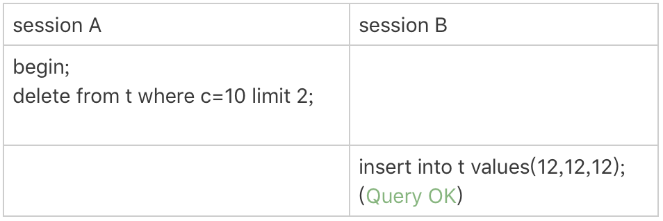
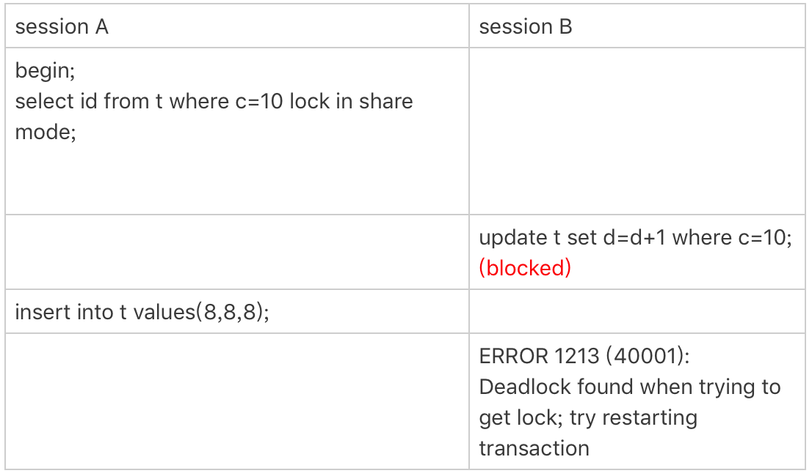

- 源码相关
  - JDK常用类源码分析
    - 集合类
      - <details><summary>HashMap-JDK7</summary>
  
          #### 介绍
          ```
          实现原理是维护一个数组，存放元素时根据key的hash值获取数组位置并添加到该位置，如果发生冲突则用单链表解决
          默认大小为16，默认负载因子为0.75，发送扩容时容量扩大两倍
          ```
          
          #### 为什么HashMap-JDK7在并发下可能会死循环？
          ```
          由于rehash时是直接将元素放到新数组的元素头，这会使得rehash后链表元素顺序颠倒，并且如果两个线程同时rehash
          ，可能会导致某个数组元素的链表存在环，使得get该位置的元素导致死循环
          ```
  
          源码分析：[HashMap-JDK7](Java/Java源码阅读/集合类/HashMap-JDK7.md)
        </details>
  
      - <details><summary>HashMap-JDK8</summary>
  
          #### 介绍
          ```
          和JDK7的HashMap不同之处是引入了红黑树，默认情况下，当Map的key数量超过64时，如果某个数组的链表元素大于等
          于8，则将该链表转为红黑树。红黑树的结点也是双向链表的结点，红黑树的根结点总是双向链表的头结点，用双向链表的
          目的是在每次将单链表转换为红黑树后，数组的链表头可能不是红黑树的根结点，而每次需要访问该红黑树的时候都找一次
          root效率很低，所以在每次单链表转换完红黑树后会运行moveRootToFront方法，该方法将红黑树的root移动到数组的
          链表头，以便直接就能访问到。注意双向链表的顺序和红黑树的结点大小没有关系，唯一的关系是双向链表头等于红黑树的
          root，可以看treeifyBin方法的实现。
          ```
  
          源码分析：[HashMap-JDK8](Java/Java源码阅读/集合类/HashMap-JDK8.md)
        </details>
  - 并发类

- JVM相关
  - 垃圾回收算法
    - <details><summary>标记-清除</summary>

      #### 介绍
      ```
      算法分为“标记”和“清除“两个阶段：首先标记出所有需要回收的对象，在标记完成后统一回收所有被标记的对象。它的主要不足
      有两个：一个是效率问题，标记和清除两个过程的效率都不高；另一个是空间问题，标记清除之后会产生大量不连续的内存碎片，
      空间碎片太多可能会导致以后在程序运行过程中需要分配较大对象时，无法找到足够的连续内存而不得不提前触发另一次垃圾收集动作。 
      ```

      ![img](resources/标记-清除.png）
    </details>

    - <details><summary>复制</summary>

      #### 介绍
      ```
      它将可用内存按容量划分为大小相等的两块，每次只使用其中的一块。当这一块的内存用完了，就将还存活着的对象复制到另外一
      块上面，然后再把已使用过的内存空间一次清理掉。这样使得每次都是对整个半区进行内存回收，内存分配时也就不用考虑内存碎
      片等复杂情况，只要移动堆顶指针，按顺序分配内存即可，实现简单，运行高效。只是这种算法的代价是将内存缩小为了原来的一半。 

      现在的商业虚拟机都采用这种收集算法来回收新生代，IBM公司的专门研究表明，新生代中的对象98%是“朝生夕死”的，所以并不需要
      按照1:1的比例来划分内存空间，而是将内存分为一块较大的Eden空间和两块较小的Survivor空间，每次使用Eden和其中一块Survivor。
      当回收时，将Eden和Survivor中还存活着的对象一次性地复制到另外一块Survivor空间上，最后清理掉Eden和刚才用过的Survivor空间。
      HotSpot虚拟机默认Eden和Survivor的大小比例是8:1，也就是每次新生代中可用内存空间为整个新生代容量的90%（80%+10%），
      只有10%的内存会被“浪费”。当然，98%的对象可回收只是一般场景下的数据，没有办法保证每次回收都只有不多于10%的对象存活，
      当Survivor空间不够用时，需要依赖其他内存（这里指老年代）进行分配担保（HandlePromotion）。如果另外一块Survivor空间没有足
      够空间存放上一次新生代收集下来的存活对象时，这些对象将直接通过分配担保机制进入老年代。
      ```

      ![img](resources/复制.png）
    </details>

    - <details><summary>标记-整理</summary>

      #### 介绍
      ```
      标记过程仍然与“标记-清除”算法一样，但后续步骤不是直接对可回收对象进行清理，而是让所有存活的对象都向一端移动，然后直接清理掉端边界以外的内存。 
      ```

      ![img](resources/标记-整理.png）
    </details>

  - 安全点（SafePoint）
    - <details><summary>介绍</summary>

      程序并不是在所有的位置上都可以进行GC的，只有在达到这样的安全点才能暂停下来进行GC。
      一般会在如下几个位置选择安全点：
      - 循环的末尾 
      - 方法临返回前 / 调用方法的call指令后 
      - 可能抛异常的位置

      另外一个问题就是GC前需要让线程在安全点停下来，有两种方案：
      - 抢断式中断
      抢断式中断就是在GC的时候，让所有的线程都中断，如果这些线程中发现中断地方不在安全点上的，就恢复线程，让他们重新跑起来，直到跑到安全点上（现在几乎没有虚拟机采用这种方式）

      - 主动式中断
      主动式中断在GC的时候，不会主动去中断线程，仅仅是设置一个标志，当线程运行到安全点时就去轮训该位置，发现该位置被设置为真时就自己中断挂起。另外创建对象需要分配内存的地方也需要轮询该位置。
      安全点的使用似乎解决了OopMap计算的效率的问题，但是这里还有一个问题。安全点需要程序自己跑过去，那么对于那些已经停在路边休息或者看风景的程序（比如那些处在Sleep或者Blocked状态的线程），他们可能并不会在很短的时间内跑到安全点去。所以这里为了解决这个问题，又引入了安全区域的概念
      
      ### 安全区域（Safe Region）

      在程序的一段代码片段中并不会导致引用关系发生变化，也就不用去更新OopMap表了，那么在这段代码区域内任何地方进行GC都是没有问题的。这段区域就称之为安全区域。线程执行的过程中，如果进入到安全区域内，就会标志自己已经进行到安全区域了。那么虚拟机要进行GC的时候，发现该线程已经运行到安全区域，就不会管该线程的死活了。所以，该线程在脱离安全区域的时候，要自己检查系统是否已经完成了GC或者根节点枚举（这个跟GC的算法有关系），如果完成了就继续执行，如果未完成，它就必须等待收到可以安全离开安全区域的Safe Region的信号为止。
      </details>

  - 垃圾回收器
    - <details><summary>垃圾回收器之间的搭配</summary>

      ```
      下面展示了7种作用于不同分代的收集器，如果两个收集器之间存在连线，就说明它们可以搭配使用。虚拟机所处的区域，则表示它是属于新生代收集器还是老年代收集器。
      ```

      ![img](resources/垃圾回收器搭配.png）
      </details>

    - <details><summary>垃圾回收器</summary>
      
      - <details><summary>Serial收集器</summary>

        ```
        Serial收集器是最基本、发展历史最悠久的收集器，曾经（在JDK1.3.1之前）是虚拟机新生代收集的唯一选择。这个收集器是一个单线程的收集器，但它的“单线程”的意义并不仅仅说明它只会使用一个CPU或一条收集线程去完成垃圾收集工作，更重要的是在它进行垃圾收集时，必须暂停其他所有的工作线程，直到它收集结束。"Stop The World"这个名字也许听起来很酷，但这项工作实际上是由虚拟机在后台自动发起和自动完成的，在用户不可见的情况下把用户正常工作的线程全部停掉，这对很多应用来说都是难以接受的。

        虽然Serial收集器看上去很原始，但是Serial收集器是虚拟机运行在Client模式下的默认新生代收集器。它也有着优于其他收集器的地方：简单而高效（与其他收集器的单线程比），对于限定单个CPU的环境来说，Serial收集器由于没有线程交互的开销，专心做垃圾收集自然可以获得最高的单线程收集效率。在用户的桌面应用场景中，分配给虚拟机管理的内存一般来说不会很大，收集几十兆甚至一两百兆的新生代（仅仅是新生代使用的内存，桌面应用基本上不会再大了），停顿时间完全可以控制在几十毫秒最多一百多毫秒以内，只要不是频繁发生，这点停顿是可以接受的。所以，Serial收集器对于运行在Client模式下的虚拟机来说是一个很好的选择。

        新生代使用复制算法
        老年代使用标记-整理算法
        ```

        ![Serial收集器](resources/Serial收集器.png）
        </details>

      - <details><summary>ParNew收集器</summary>

        ```
        ParNew收集器其实就是Serial收集器的多线程版本（默认开启的收集线程数与CPU的数量相同，可以使用-XX:ParallelGCThreads参数来限制垃圾收集的线程数），除了使用多条线程进行垃圾收集之外，其余行为包括Serial收集器可用的所有控制参数（例如：-XX:SurvivorRatio、-XX:PretenureSizeThreshold、-XX:HandlePromotionFailure等）、收集算法、StopTheWorld、对象分配规则、回收策略等都与Serial收集器完全一样，它是许多运行在Server模式下的虚拟机中首选的新生代收集器，其中有一个与性能无关但很重要的原因是，除了Serial收集器外，目前只有它能与CMS收集器（老年代收集器，也是第一款真正意义上并发的收集器）配合工作。在JDK1.5中使用CMS来收集老年代的时候，新生代只能选择ParNew或者Serial收集器中的一个。

        ParNew收集器是并行的，但不是并发的，也就是说ParNew收集器GC时是多线程的，但是用户线程是暂停运行的

        新生代使用复制算法
        老年代使用标记-整理算法
        ```

        ![Serial收集器](resources/ParNew收集器.png）
        </details>

      - <details><summary>Parallel Scavenge收集器</summary>

        ```
        Parallel Scavenge收集器是一个新生代收集器，它也是使用复制算法的收集器，又是并行的多线程收集器，Parallel Scavenge收集器不同之处在于，CMS等收集器的关注点是尽可能地缩短垃圾收集时用户线程的停顿时间，而Parallel Scavenge收集器的目标则是达到一个可控制的吞吐量（Throughput）。所谓吞吐量就是CPU用于运行用户代码的时间与CPU总消耗时间的比值，即吞吐量=运行用户代码时间/（运行用户代码时间+垃圾收集时间），虚拟机总共运行了100分钟，其中垃圾收集花掉1分钟，那吞吐量就是99%。

        Parallel Scavenge收集器提供了两个参数用于精确控制吞吐量，分别是控制最大垃圾收集停顿时间的-XX:MaxGCPauseMillis参数以及直接设置吞吐量大小的-XX:GCTimeRatio参数。

        MaxGCPauseMillis参数允许的值是一个大于0的毫秒数，收集器将尽可能地保证内存回收花费的时间不超过设定值。把这个参数的值设置得稍小一点就能使得系统的垃圾收集速度变得更快，GC停顿时间缩短是以牺牲吞吐量和新生代空间来换取的：系统把新生代调小一些，收集300MB新生代肯定比收集500MB快吧。

        GCTimeRatio参数的值应当是一个大于0且小于100的整数，也就是垃圾收集时间占总时间的比率，相当于是吞吐量的倒数。如果把此参数设置为19，那允许的最大GC时间就占总时间的5%（即1/（1+19）），默认值为99，就是允许最大1%（即1/（1+99））的垃圾收集时间。

        除上述两个参数之外，Parallel Scavenge收集器还有一个参数-XX:+UseAdaptiveSizePolicy值得关注。这是一个开关参数，当这个参数打开之后，就不需要手工指定新生代的大小（-Xmn）、Eden与Survivor区的比例（-XX:SurvivorRatio）、晋升老年代对象年龄（-XX:PretenureSizeThreshold）等细节参数了，虚拟机会根据当前系统的运行情况收集性能监控信息，动态调整这些参数以提供最合适的停顿时间或者最大的吞吐量，这种调节方式称为GC自适应的调节策略（GCErgonomics），手工优化存在困难的时候，使用Parallel Scavenge收集器配合自适应调节策略，把内存管理的调优任务交给虚拟机去完成将是一个不错的选择。只需要把基本的内存数据设置好（如-Xmx设置最大堆），然后使用MaxGCPauseMillis参数（更关注最大停顿时间）或GCTimeRatio（更关注吞吐量）参数给虚拟机设立一个优化目标，那具体细节参数的调节工作就由虚拟机完成了。

        新生代复制算法
        ```
        </details>

      - <details><summary>Serial Old收集器</summary>

        ```
        Serial Old是Serial收集器的老年代版本，它同样是一个单线程收集器，使用“标记-整理”算法。这个收集器的主要意义也是在于给Client模式下的虚拟机使用。如果在Server模式下，那么它主要还有两大用途：一种用途是在JDK1.5以及之前的版本中与ParallelScavenge收集器搭配使用，另一种用途就是作为CMS收集器和G1收集器的后备预案，在并发收集发生ConcurrentModeFailure时使用。

        老年代标记-整理算法
        ```
        </details>

      - <details><summary>Parallel Old收集器</summary>

        ```
        Parallel Old是Parallel Scavenge收集器的老年代版本，使用多线程和“标记-整理”算法。这个收集器是在JDK1.6中才开始提供的，在此之前，新生代的Parallel Scavenge收集器一直处于比较尴尬的状态。原因是，如果新生代选择了Parallel Scavenge收集器，老年代除了Serial Old收集器外别无选择（Parallel Scavenge收集器无法与CMS收集器配合工作）。由于老年代Serial Old收集器在服务端应用性能上的“拖累”，使用了Parallel Scavenge收集器也未必能在整体应用上获得吞吐量最大化的效果，由于单线程的老年代收集中无法充分利用服务器多CPU的处理能力，在老年代很大而且硬件比较高级的环境中，这种组合的吞吐量甚至还不一定有ParNew加CMS的组合“给力”。直到Parallel Old收集器出现后，“吞吐量优先”收集器终于有了比较名副其实的应用组合，在注重吞吐量以及CPU资源敏感的场合，都可以优先考虑Parallel Scavenge加Parallel Old收集器。

        老年代标记-整理算法
        ```
        </details>

      - <details><summary>CMS收集器</summary>

        ```
        CMS（Concurrent Mark Sweep）收集器是一种以获取最短回收停顿时间为目标的收集器。从名字（包含"Mark Sweep"）上就可以看出，CMS收集器是基于“标记—清除”算法实现的，它的运作过程相对于前面几种收集器来说更复杂一些，整个过程分为4个步骤，包括：
        1. 初始标记（STW initial mark），在这个阶段，需要虚拟机停顿正在执行的任务，官方的叫法STW（Stop The Word）。这个过程从垃圾回收的”根对象”开始，只扫描到能够和”根对象”直接关联的对象，并作标记。所以这个过程虽然暂停了整个JVM，但是很快就完成了。
        2. 并发标记（Concurrent marking），这个阶段紧随初始标记阶段，在初始标记的基础上继续向下追溯标记。并发标记阶段，应用程序的线程和并发标记的线程并发执行，所以用户不会感受到停顿。
        3. 并发预清理（Concurrent precleaning），并发预清理阶段仍然是并发的。在这个阶段，虚拟机查找在执行并发标记阶段新进入老年代的对象（可能会有一些对象从新生代晋升到老年代， 或者有一些对象被分配到老年代）。通过重新扫描，减少下一个阶段”重新标记”的工作，因为下一个阶段会Stop The World。
        4. 重新标记（STW remark），这个阶段会暂停虚拟机，收集器线程扫描在CMS堆中剩余的对象。扫描从”跟对象”开始向下追溯，并处理对象关联。
        5. 并发清理（Concurrent sweeping），清理垃圾对象，这个阶段收集器线程和应用程序线程并发执行。
        6. 并发重置（Concurrent reset），这个阶段，重置CMS收集器的数据结构，等待下一次垃圾回收。

        CMS缺点:
        1. CMS回收器采用的基础算法是Mark-Sweep，这样就会有一个问题：经过CMS收集的堆会产生空间碎片，CMS回收器不再采用简单的指针指向一块可用堆空间来为下次对象分配使用。而是把一些未分配的空间汇总成一个列表，当JVM分配对象空间的时候，会搜索这个列表找到足够大的空间来hold住这个对象。
        2. 需要更多的CPU资源。为了让应用程序不停顿，CMS线程和应用程序线程并发执行，这样就需要有更多的CPU，单纯靠线程切换是不靠谱的。并且，重新标记阶段，为空保证STW快速完成，也要用到更多的甚至所有的CPU资源。当然，多核多CPU也是未来的趋势！
        3. 需要更大的堆空间。因为CMS标记阶段应用程序的线程还是在执行的，那么就会有堆空间继续分配的情况，为了保证在CMS回收完堆之前还有空间分配给正在运行的应用程序，必须预留一部分空间。也就是说，CMS不会在老年代满的时候才开始收集。相反，它会尝试更早的开始收集，已避免上面提到的情况：在回收完成之前，堆没有足够空间分配！默认当老年代使用68%（JDK6调整到了92%）的时候，CMS就开始行动了。 – XX:CMSInitiatingOccupancyFraction =n 来设置这个阀值。要是CMS运行期间预留的内存无法满足程序需要，就会出现一次"Concurrent Mode Failure"失败，这时虚拟机将启动后备预案：临时启用Serial Old收集器来重新进行老年代的垃圾收集，这样停顿时间就很长了。所以说参数-XX:CMSInitiatingOccupancyFraction设置得太高很容易导致大量"Concurrent Mode Failure"失败，性能反而降低。

        由于CMS采用标记-清除算法，所以会产生很多空间碎片，为了解决这个问题，CMS收集器提供了一个-XX:+UseCMSCompactAtFullCollection开关参数（默认就是开启的），用于在CMS收集器顶不住要进行Full GC时开启内存碎片的合并整理过程，内存整理的过程是无法并发的，空间碎片问题没有了，但停顿时间不得不变长。虚拟机设计者还提供了另外一个参数-XX:CMSFullGCsBeforeCompaction，这个参数是用于设置执行多少次不压缩的Full GC后，跟着来一次带压缩的（默认值为0，表示每次进入Full GC时都进行碎片整理）。
        假设你的堆小于4G，而你又希望分配更多的CPU资源给垃圾回收器以避免应用暂停，那么这就是你要选择的回收器，如果堆大于4G的话，应该使用G1回收器
         
        老年代标记-清除算法
        ```
        </details>

      - <details><summary>G1收集器</summary>

        ```
        为解决CMS算法产生空间碎片和其它一系列的问题缺陷，HotSpot提供了另外一种垃圾回收策略，G1（Garbage First）算法，通过参数-XX:+UseG1GC来启用，该算法在JDK 7u4版本被正式推出，

        G1垃圾收集算法主要应用在多CPU大内存的服务中，在满足高吞吐量的同时，竟可能的满足垃圾回收时的暂停时间，该设计主要针对如下应用场景：
        - 垃圾收集线程和应用线程并发执行，和CMS一样
        - 空闲内存压缩时避免冗长的暂停时间
        - 应用需要更多可预测的GC暂停时间
        - 不希望牺牲太多的吞吐性能
        - 不需要很大的Java堆 

        以往的垃圾回收算法，如CMS，使用的堆内存结构如下：
        ```

        ![G1-image1](resources/G1-image1.png）

        ```
        新生代：eden space + 2个survivor
        老年代：old space
        持久代：1.8之前的perm space
        元空间：1.8之后的metaspace

        这些space必须是地址连续的空间
        在G1算法中，采用了另外一种完全不同的方式组织堆内存，堆内存被划分为多个大小相等的内存块（Region），每个Region是逻辑连续的一段内存，结构如下：
        ```

        ![G1-image2](resources/G1-image2.png）

        ```
        每个Region被标记了E、S、O和H，说明每个Region在运行时都充当了一种角色，其中H是以往算法中没有的，它代表Humongous，这表示这些Region存储的是巨型对象（humongous object，H-obj），当新建对象大小超过Region大小一半时，直接在新的一个或多个连续Region中分配，并标记为H。

        堆内存中一个Region的大小可以通过-XX:G1HeapRegionSize参数指定，大小区间只能是1M、2M、4M、8M、16M和32M，总之是2的幂次方
        G1中提供了三种模式垃圾回收模式，young gc、mixed gc 和 full gc，在不同的条件下被触发：
        ```

        #### young gc
        ```
        发生在年轻代的GC算法，一般对象（除了巨型对象）都是在eden region中分配内存，当所有eden region被耗尽无法申请内存时，就会触发一次young gc，这种触发机制和之前的young gc差不多，执行完一次young gc，活跃对象会被拷贝到survivor region或者晋升到old region中，空闲的region会被放入空闲列表中，等待下次被使用
        ```
        |参数|含义|
        |-|-|
        |-XX:MaxGCPauseMillis|设置G1收集过程目标时间，默认值200ms|
        |-XX:G1NewSizePercent|新生代最小值，默认值5%|
        |-XX:G1MaxNewSizePercent|新生代最大值，默认值60%|
        
        #### mixed gc
        ```
        当越来越多的对象晋升到老年代old region时，为了避免堆内存被耗尽，虚拟机会触发一个混合的垃圾收集器，即mixed gc，该算法并不是一个old gc，除了回收整个young region，还会回收一部分的old region，这里需要注意：是一部分老年代，而不是全部老年代，可以选择哪些old region进行收集（G1会跟踪各个Region回收所需的空间大小和时间维护一个优先列表，在GC时先按列表优先顺序回收），从而可以对垃圾回收的耗时时间进行控制
        那么mixed gc什么时候被触发？
        先回顾一下cms的触发机制，如果添加了以下参数：

        -XX:CMSInitiatingOccupancyFraction=80 -XX:+UseCMSInitiatingOccupancyOnly

        当老年代的使用率达到80%时，就会触发一次cms gc。相对的，mixed gc中也有一个阈值参数 -XX:InitiatingHeapOccupancyPercent，当老年代大小占整个堆大小百分比达到该阈值时，会触发一次mixed gc.

        mixed gc的执行过程有点类似cms，主要分为以下几个步骤：
        - initial mark: 初始标记过程，整个过程STW，标记了从GC Root可达的对象
        - concurrent marking: 并发标记过程，整个过程gc collector线程与应用线程可以并行执行，标记出GC - Root可达对象衍生出去的存活对象，并收集各个Region的存活对象信息
        - remark: 最终标记过程，整个过程STW，标记出那些在并发标记过程中遗漏的，或者内部引用发生变化的对象
        - clean up: 垃圾清除过程，如果发现一个Region中没有存活对象，则把该Region加入到空闲列表中
        ``` 

        #### full gc
        如果对象内存分配速度过快，mixed gc来不及回收，导致老年代被填满，就会触发一次full gc，G1的full gc算法就是单线程执行的serial old gc，会导致异常长时间的暂停时间，需要进行不断的调优，尽可能的避免full gc
        </details>
      </details>

  - 调优与故障排查
    - <details><summary>JVM的故障排查相关JVM选项</summary>

      ```
      可以使用以下参数打印GC日志：
      -XX:+PrintGCTimeStamps（打印GC停顿时间）
      -XX:+PrintGCDateStamps（输出GC的时间戳（以日期的形式，如2013-05-04T21:53:59.234+0800）
      -XX:+PrintGCDetails（打印GC详细信息）
      -verbose:gc（打印GC信息，输出内容已被前一个参数包括，可以不写）
      -Xloggc:gc.log（GC日志路径）
      -XX:+HeapDumpOnOutOfMemoryError（内存溢出时导出堆信息hprof文件）
      -XX:HeapDumpPath=路径（DUMP文件的路径，也可以指定文件名称，例如：XX:HeapDumpPath=${目录}/java_heapdump.hprof。如果不指定文件名，默认为：java_<pid>_<date>_<time>_heapDump.hprof）
      ```
      </details>

    - <details><summary>查看正在运行的Java进程GC状态</summary>

      ```
      通过top命令找到CPU消耗最高的Java进程，并记住进程ID
      运行jstat -gcutil [进程ID] 5，即每5秒打印一次指定Java进程的GC情况，显示的信息为：
      S0  — Heap上的 Survivor space 0 区已使用空间的百分比
      S1  — Heap上的 Survivor space 1 区已使用空间的百分比
      E   — Heap上的 Eden space 区已使用空间的百分比
      O   — Heap上的 Old space 区已使用空间的百分比
      P   — Perm space 区已使用空间的百分比
      YGC — 从应用程序启动到采样时发生 Young GC 的次数
      YGCT– 从应用程序启动到采样时 Young GC 所用的时间(单位秒)
      FGC — 从应用程序启动到采样时发生 Full GC 的次数
      FGCT– 从应用程序启动到采样时 Full GC 所用的时间(单位秒)
      GCT — 从应用程序启动到采样时用于垃圾回收的总时间(单位秒)

      或者用jstat -gc [进程ID] 5显示更多的列：
      S0C：年轻代中第一个survivor（幸存区）的容量（字节） 
      S1C：年轻代中第二个survivor（幸存区）的容量（字节） 
      S0U：年轻代中第一个survivor（幸存区）目前已使用空间（字节）
      S1U：年轻代中第二个survivor（幸存区）目前已使用空间（字节）
      EC：年轻代中Eden的容量（字节） 
      EU：年轻代中Eden目前已使用空间（字节） 
      OC：Old代的容量（字节）
      OU：Old代目前已使用空间（字节）
      PC：Perm（持久代）的容量（字节） 
      PU：Perm（持久代）目前已使用空间（字节） 
      YGC：从应用程序启动到采样时年轻代中gc次数 
      YGCT：从应用程序启动到采样时年轻代中gc所用时间（s） 
      FGC：从应用程序启动到采样时old代（全gc）gc次数 
      FGCT：从应用程序启动到采样时old代（全gc）gc所用时间（s） 
      GCT：从应用程序启动到采样时gc用的总时间（s） 
      NGCMN：年轻代（young）中初始化（最小）的大小（字节） 
      NGCMX：年轻代（young）的最大容量（字节） 
      NGC：年轻代（young）中当前的容量（字节） 
      OGCMN：old代中初始化（最小）的大小（字节） 
      OGCMX：old代的最大容量（字节） 
      OGC：old代当前新生成的容量（字节） 
      PGCMN：perm代中初始化（最小）的大小（字节） 
      PGCMX：perm代的最大容量（字节）  
      PGC：perm代当前新生成的容量（字节） 
      S0：年轻代中第一个survivor（幸存区）已使用的占当前容量百分比 
      S1：年轻代中第二个survivor（幸存区）已使用的占当前容量百分比 
      E：年轻代中Eden（伊甸园）已使用的占当前容量百分比 
      O：old代已使用的占当前容量百分比 
      P：perm代已使用的占当前容量百分比 
      S0CMX：年轻代中第一个survivor（幸存区）的最大容量（字节） 
      S1CMX ：年轻代中第二个survivor（幸存区）的最大容量（字节） 
      ECMX：年轻代中Eden（伊甸园）的最大容量（字节） 
      DSS：当前需要survivor（幸存区）的容量（字节）（Eden区已满） 
      TT： 持有次数限制 
      MTT ： 最大持有次数限制
      ```
      </details>
  
    - <details><summary>CPU飙高的基本操作</summary>

      ```
      通过top命令找到CPU消耗最高的Java进程，并记住进程ID
      再次通过top -Hp [进程 ID]找到CPU消耗最高的线程ID，并记住线程ID
      通过JDK提供的jstack工具打印出线程堆栈信息到指定文件中，具体命令：jstack -l [进程 ID] > jstack.log
      由于刚刚的线程ID是十进制的，而堆栈信息中的线程ID是16进制的，因此我们需要将10进制的转换成16进制的，并用这个线程ID在堆栈中查找。使用printf "%x\n" [十进制数字]，可以将10进制转换成16进制
      通过刚刚转换的16进制数字从堆栈信息里找到对应的线程堆栈，就可以从该堆栈中看出端倪。
      ```
      </details>

    - <details><summary>内存问题排查</summary>

      ```
      内存溢出的情况可以通过加上启动选项-XX:+HeapDumpOnOutOfMemoryError，在程序内存溢出时输出dump文件，有了dump文件，就可以通过dump分析工具进行分析了，比如常用的MAT，JProfile，JVisualVM等工具都可以分析，这些工具都能够看出到底是哪里溢出，哪里创建了大量的对象等等信息

      其他选项还有：
      -XX:+HeapDumpBeforeFullGC 当JVM执行FullGC前执行dump
      -XX:+HeapDumpAfterFullGC 当JVM执行FullGC后执行dump
      -XX:HeapDumpPath=path/to/heap.hprof 指定dump文件存储路径

      也可以用jmap -dump:live,format=b,file=path/to/heap.hprof [进程ID]打印正在运行的Java进程的Dump文件

      JVM生成Heap Dump的时候，虚拟机是暂停一切服务的。如果是线上系统执行Heap Dump时需要注意
      ```
      </details>
  - 如何实现方法调用
    - <details><summary>方法调用字节码指令</summary>

      - invokestatic 调用静态方法，解析时方法即可确定
      - invokespecial 调用实例构造器<init>方法、私有方法和父类方法，解析时方法即可确定
      - invokevirtual 调用所有虚方法（final修饰的方法也用该指令调用，但是final方法不是虚方法）
      - invokeinterface 调用接口方法，在运行时确定一个实现此接口的对象
      - invokedynamic 运行时解析限定符所引用的方法，再调用

      解析调用是一个静态过程，编译期就能完全确定，在类装载的解析阶段就会把涉及的符号引用全部转为可确定的直接引用
      </details>

    - <details><summary>分派</summary>

      代码：
      ```
      Human man = new Man（）;
      Human woman = new Woman（）;
      ```

      上面代码的Human称为变量的静态类型，后面的Man和Woman为实际类型，静态类型和实际类型在程序中都有可能发生一些变化，
      区别是，静态类型的变化仅在使用时发生，变量本身的静态类型不会，并且最终的静态类型是编译期可知的，而实际类型在运行期
      才能确定，编译器在编译期间并不知道一个对象的实际类型是什么，如：
      ```
      // 实际类型变化
      Human man = new Man（）;
      man = new Woman（）;
      // 静态类型变化
      sr.sayHello（（Man）man）;
      sr.sayHello（（Woman）man）;
      ```
      - <details><summary>静态分派</summary>

        重载时是通过参数的静态类型作为绑定依据，并且静态类型时编译期可知的。编译器根据参数的静态类型决定使用哪个重载版本，并
        将方法的符号引用写到invokevirtual指令中。

        依赖静态类型来定位方法的执行版本的分派动作称为静态分派
        </details>
      
      - <details><summary>动态分派</summary>

        动态分派和重写有很密切的关联。虚拟机通过对象的实际类型分派重写方法的执行版本，使用的是invokevirtual指令实现多态，
        invokevirtual指令的多态查找过程是：
        1. 找到操作数栈顶的第一个元素所指向的对象的实际类型，记做C
        2. 如果在类型C中找到了invokevirtual指令的参数描述符相符的方法，则进行权限校验，通过则返回方法引用，否则返回IllegalAccessError
        3. 否则按照继承关系从下往上依次对C的各个父类进行第2步的搜索的验证过程
        4. 如果始终没找到，则抛出AbstractMethodError

        第一步在运行期间确定对象的实例类型，从而实现了多态。动态分派是非常频繁的动作，而动态分派的方法版本选择过程需要运行时在类的
        方法元数据中搜索合适的方法，为了性能考虑，通常会使用虚方法表（于此对应，invokeinterface指令也用到了接口方法表）来提高性
        能。虚方法表中存放了各个方法的实际入口，如果子类没有重写父类方法，那么子类的虚方法表中地址入口和父类相同方法的地址入口是
        一致的，都指向父类的实现入口，如果子类重写了父类方法，子类方法表中的地址会被替换为子类的实现版本入口。

        方法表一般在类加载的连接阶段初始化。
        </details>
      </details>

- 网络
  - HTTPS和HTTP
    - <details><summary>HTTPS</summary>

      HTTPS相比HTTP多了一层SSL/TLS（安全套接字层/传输层安全）

      #### HTTPS的连接过程
      - 客户端发出握手请求（Client Hello），包含以下信息：
        - 支持的协议版本，比如TLS 1.0版。
        - 一个客户端生成的随机数（random_1），这个随机数既需要客户端保存又需要发送给服务器。
        - 支持的加密方法，比如RSA公钥加密。
        - 支持的压缩方法。
      - 服务器回复（Server Hello），包含以下信息：
        - 确认使用的加密通信协议版本，比如TLS 1.0版本。如果浏览器与服务器支持的版本不一致，服务器关闭加密通信。
        - 一个服务器生成的随机数（random_2）。
        - 确认使用的加密方法，比如RSA公钥加密。
        - 服务器证书。
        - 如果服务器需要确认客户端的身份，就会再包含一项请求，要求客户端提供”客户端证书”。比如，金融机构往往只允许认证客户连入自己的网络，就会向正式客户提供USB密钥，里面就包含了一张客户端证书。
      - 客户端回应，包含以下步骤：
        - 验证服务器证书的合法性，证书合法性包括：证书是否过期，发行服务器证书的 CA 是否可靠，发行者证书的公钥能否正确解开服务器证书的“发行者的数字签名”，服务器证书上的域名是否和服务器的实际域名相匹配。如果合法性验证没有通过，通讯将断开；
        - 客户端使用一些加密算法（例如：RSA、Diffie-Hellman）产生一个48个字节的Key，这个Key叫PreMaster Secret。该PreMaster Secret用服务器公钥加密传送，防止被窃听。
        - 编码改变通知，表示随后的信息都将用双方商定的加密方法和密钥发送。
        - 客户端握手结束通知，表示客户端的握手阶段已经结束。这一项同时也是前面发送的所有内容的hash值，用来供服务器校验。
        - 如果前一步，服务器要求客户端证书，客户端会在这一步发送证书及相关信息。
      - 服务器回应，服务器通过上面的三个随机数（random_1、random_2、PreMaster Secret），计算出本次会话的会话密钥（session secret），然后向客户端发送下面信息
        - 编码改变通知，表示随后的信息都将用双方商定的加密方法和密钥发送。
        - 服务器握手结束通知，表示服务器的握手阶段已经结束。这一项同时也是前面发送的所有内容的hash值，用来供客户端校验。

      至此，服务器和客户端的握手阶段全部结束，接下来，客户端与服务器进入加密通信，就完全是使用普通的HTTP协议，只不过用会话密钥（session secret）对内容做对称加密

      PreMaster secret是在客户端使用RSA或者Diffie-Hellman等加密算法生成的。它将用来跟服务端和客户端在Hello阶段产生的随机数结合在一起生成Master secret。在客户端使用服务端的公钥对PreMaster secret进行加密之后传送给服务端，服务端将使用私钥进行解密得到PreMaster secret。也就是说服务端和客户端都有一份相同的PreMaster secret和随机数。

      #### 为什么需要三个随机数？
      ```
      不管是客户端还是服务器，都需要随机数，这样生成的密钥才不会每次都一样。由于SSL协议中证书是静态的，因此十分有必要引入一种随机因素来保证协商出来的密钥的随机性。对于RSA密钥交换算法来说，pre-master-key本身就是一个随机数，再加上hello消息中的随机，三个随机数通过一个密钥导出器（Master Secret）最终导出一个对称密钥。premaster的存在在于SSL协议不信任每个主机都能产生完全随机的随机数（被认为是伪随机），如果随机数不随机，那么premaster secret就有可能被猜出来，那么仅适用pre master secret作为密钥就不合适了，因此必须引入新的随机因素，那么客户端和服务器加上premaster secret三个随机数一同生成的密钥就不容易被猜出了，一个伪随机可能完全不随机，可是是三个伪随机就十分接近随机了，每增加一个自由度，随机性增加的可不是一。
      ```
      </details>

  - TCP协议
    - <details><summary>三次握手，四次挥手的过程</summary>

      #### 三次握手
      1. 客户端发送连接请求，SYN标志位为1，seq = x
      2. 服务器回复，SYN，ACK标识位为1，seq = y，ack = x + 1
      3. 客户端回复，ACK标志位为1，seq = x + 1，ack = y + 1

      此后的数据传输过程ACK标志位都为1

      #### 数据传输
      1. 客户端发送数据包，seq = x + 1，ack = y + 1，len = m（数据长度）
      2. 服务器回复，seq = y + 1，ack = x + m + 1，len = n（数据长度）
      3. 客户端回复，seq = x + m + 1，ack = y + n + 1

      所以数据传输过程中，seq为x相当于表示这次发送的数据包最小序号是x，ack为y相等于表示已经确定序号y - 1及之前的包都以收到

      #### 四次挥手
      1. 客户端发送终止连接请求，FIN，ACK标志位为1，seq = x + m + 1， ack = y + n + 1，客户端发出后进入FIN_WAIT_1状态，服务器收到后进入CLOSE_WAIT状态
      2. 服务器回复，ACK标识位为1，seq = y + n + 1，ack = x + m + 1，客户端进收到后入FIN_WAIT_2状态
         1. 此时客户端到服务器方向的连接已断开，服务器还可以发送数据，服务器发送数据包，seq = y + n + 1，ack = x + m + 1，len = k
         2. 客户端回复，seq = x + m + 1，ack = y + n + 1 + k
      3. 服务器发送终止连接请求，FIN，ACK标志位为1，seq = y + n + 1 + k，ack = x + m + 1，服务器发出后进入LAST_ACK状态，客户端收到后进入TIME_WAIT状态
      4. 客户端回复，ACK标志位为1，seq = x + m + 1，ack = y + n + 1 + k，服务器收到后进入CLOSED状态
      5. 客户端发送最后一个ACK后等待2MSL后进入CLOSED状态，MSL是一个报文段最大生存时间，他是报文段被丢弃前在网络内的最长时间，RFC 793指出MSL为2分钟，但是一般实现中该时间为30秒或1分钟或2分钟
      </details>

    - <details><summary>为什么TIME_WAIT要等待2MSL才能结束</summary>

      1. 为了保证客户端发送的最后一个ACK报文段能够到达服务器。因为这个ACK有可能丢失，从而导致处在LAST-ACK状态的服务器收不到对FIN-ACK的确认报文。服务器会超时重传这个FIN-ACK，接着客户端再重传一次确认，重新启动时间等待计时器。最后客户端和服务器都能正常的关闭。假设客户端不等待2MSL，而是在发送完ACK之后直接释放关闭，一但这个ACK丢失的话，服务器就无法正常的进入关闭连接状态。

      2. 可以防止已失效的报文段。客户端在发送最后一个ACK之后，再经过经过2MSL，就可以使本链接持续时间内所产生的所有报文段都从网络中消失。从保证在关闭连接后不会有还在网络中滞留的报文段去骚扰服务器。
      </details>

    - <details><summary>如何尽量处理TIMEWAIT过多</summary>

      服务器尽量不主动关闭连接

      #### 编辑内核文件/etc/sysctl.conf，加入以下内容：
      ```
      net.ipv4.tcp_syncookies = 1 表示开启SYN Cookies。当出现SYN等待队列溢出时，启用cookies来处理，可防范少量SYN攻击，默认为0，表示关闭；
      net.ipv4.tcp_tw_reuse = 1 表示开启重用。允许将TIME-WAIT sockets重新用于新的TCP连接，默认为0，表示关闭；
      net.ipv4.tcp_tw_recycle = 1 表示开启TCP连接中TIME-WAIT sockets的快速回收，默认为0，表示关闭。
      net.ipv4.tcp_fin_timeout 修改系默认的 TIMEOUT 时间

      执行 /sbin/sysctl -p 让参数生效
      ```
      </details>

    - <details><summary>为什么需要三次握手</summary>

      #### 三次握手的目的：消除旧有连接请求的SYN消息对新连接的干扰，同步连接双方的序列号和确认号并交换TCP窗口大小信息
      ```
      设想：如果只有两次握手，那么第二次握手后服务器只向客户端发送ACK包，此时客户端与服务器端建立连接。在这种握手规则下：
      假设：如果发送网络阻塞，由于TCP/IP协议定时重传机制，C向S发送了两次SYN请求，分别是x1和x2，且因为阻塞原因，导致x1连接请求和x2连接请求的TCP窗口大小和报文段长度不一致，如果最终x1达到S，x2丢失，此时S同C建立了x1的连接，这个时候，因为C和S已经连接，C无法知道是请求x1还是请求x2同S连接（因为是由重传机制发送的x2，所以x1和x2的序号是一样的），如果C默认是最近的请求x2同S建立了连接，此时C开始向S发送数据，报文段长度为x2定义的长度，窗口大小为x2定义的大小，而S建立的连接是x1，其数据包长度大小为x1，TCP窗口大小为x1定义，这就会导致S处理数据时出错。
      很显然，如果S接收到C的请求后，S向C发送SYN请求y3（y3的窗口大小和报文段长度等信息为x1所定义），确认了连接建立的窗口大小和报文段长度为x1所定义，然后开始相互传送数据，那么就不会导致数据处理出错了。
      ```
      </details>

    - <details><summary>为什么需要四次挥手</summary>

      #### 需四次挥手原因：
      ```
      由于TCP的半关闭特性，TCP连接时双全工（即数据在两个方向上能同时传递），因此，每个方向必须单独的进行关闭。这个原则就是：当一方完成它的数据发送任务后就能发送一个FIN来终止这个方向上的连接。当一端收到一个FIN后，它必须通知应用层另一端已经终止了那个方向的数据传送。即收到一个FIN意味着不会再接收到对端的数据了（不是说对端不会再发送数据了，当对端主动断开连接后，本端继续发送数据，对端还是可以发送ACK），但是还是可以发送数据。
      ```
      </details>

    - <details><summary>滑动窗口、流量控制、慢启动和拥塞避免</summary>

      #### 滑动窗口与流量控制
      ```
      TCP通过滑动窗口的概念来进行流量控制。滑动窗口本质上是描述接受方的TCP报文段缓冲区大小的数据，发送方根据这个数据来计算自己最多能发送多长的数据。如果发送方收到接受方的窗口大小为0的TCP报文段，那么发送方将停止发送数据，等到接受方发送窗口大小不为0的报文段的到来（如果一直没有到来发送方也会定时发送询问包）。

      ACK包除了包含希望收到的下一个报文段的序号，还指定了接收方的窗口大小。发送方根据这两个信息结合自己的发送窗口，计算出还可以发送的字节数。

      对于TCP会话的发送方，任何时候在其发送缓存内的数据都可以分为4类，“已经发送并得到对端ACK的”，“已经发送但还未收到对端ACK的”，“未发送但对端允许发送的”，“未发送且对端不允许发送”。其中“已经发送但还未收到对端ACK的”和“未发送但对端允许发送的”这两部分数据称之为发送窗口。
      当收到接收方新的ACK对于发送窗口中后续字节的确认是，窗口向右滑动，如：
      ```
      ![滑动窗口](resources/滑动窗口.jpg）
      ```
      对于TCP的接收方，在某一时刻在它的接收缓存内存在3种。“已接收”，“未接收准备接收”，“未接收并未准备接收”（由于ACK直接由TCP协议栈回复，默认无应用延迟，不存在“已接收未回复ACK”）。其中“未接收准备接收”称之为接收窗口。

      滑动窗口实现面向流的可靠性：
      1. 最基本的传输可靠性来源于“确认重传”机制。
      2. TCP的滑动窗口的可靠性也是建立在“确认重传”基础上的。
      3. 发送窗口只有收到对端对于本段发送窗口内字节的ACK确认，才会移动发送窗口的左边界。
      4. 接收窗口只有在前面所有的段都确认的情况下才会移动左边界。当在前面还有字节未接收但收到后面字节的情况下，窗口不会移动，并不对后续字节确认。以此确保对端会对这些数据重传。业转载请联系作者获得授权，非商业转载请注明出处。
      ```

      #### 慢启动
      ```
      滑动窗口能够让协议栈同时发送多个报文段，这样可以提高网络通信的效率，对于一些处理能力不佳的中间路由器，很可能会导致存储被耗尽的状况，从而严重降低了TCP连接的吞吐量，不断的重传. 非常的可怕， 介于此，引入了慢启动这个算法。

      慢启动为发送方的TCP增加了一个窗口：拥塞窗口，记为cwnd，，初始化之后慢慢增加这个cwnd的值来提升速度。同时也引入了ssthresh阈值（默认为65535字节），如果cwnd达到这个值会让cwnd的增长变得平滑，算法如下：
      1. 连接建好的开始先初始化cwnd = 1，表明可以传一个MSS大小的数据，发送方发出的报文段长度不能超过cwnd和发送窗口
      2. 每当收到一个ACK，cwnd++，呈线性上升，这使得每当过了一个RTT，cwnd = cwnd * 2; 呈指数上升，因为不考虑窗口大小的情况下，一个RTT理论上发送cwnd个字节，每个字节的ACK使cwnd + 1，所以一个RTT后cwnd翻倍
      3. 当cwnd >= ssthresh或发送超时或收到重复的ACK时，就会进入“拥塞避免算法”
      ```

      #### 拥塞避免
      ```
      从慢启动可以看到，cwnd可以比较快的增长，但是不能一直无限增长，需要某个限制，TCP使用了ssthresh的变量，当cwnd超过这个值或超时后，慢启动过程结束，进入拥塞避免阶段。拥塞避免的主要思想是加法增大，也就是让cwnd的值线性增加，此时当窗口中所有的报文段都被确认是，cwnd的大小才加1，cwnd的值随着RTT线性增加，这样就可以避免增长过快导致网络拥塞，慢慢的增加到网络的最佳值。算法：
      1. 收到一个ACK时，cwnd = cwnd + 1/cwnd，这相当于每过一个RTT时，cwnd = cwnd + 1，因为不考虑窗口大小的情况下，一个RTT理论上发送cwnd个字节，每个字节的ACK使cwnd + 1/cwnd，所以一个RTT后cwnd + 1
      ```
      </details>

    - <details><summary>快速恢复和快速重传</summary>

      当收到3个或3个以上重复的ACK后，不等待超时直接发送丢失的报文段，这就是快速重传算法。发送丢失的报文段后，执行的是拥塞避免算法而不是慢启动算法，这就是快速恢复

      #### 过程：
      1. 收到3个重复的ACK时，将ssthresh设置为当前拥塞窗口cwnd的一半，重传丢失的报文段，设置cwnd = ssthresh + 3 * 报文段大小
      2. 每收到另一个重复的ACK，cwnd + 1并发送1个分组（如果新的cwnd允许发送）
      3. 当收到下一个确认数据的ACK时，设置cwnd = ssthresh，这个ACK应该是在进行重传之后的一个往返时间内对步骤1中重传的确认，同时也是对多是的分组和收到的第一个重复的ACK之间的所有中间报文段的确认
      4. 设置cwnd = ssthresh，
      </details>

- MySQL
  - 基础知识
    - 隔离级别
      - <details><summary>有哪些隔离级别</summary>

        ```
        读未提交：一个事务还没提交时，它做的变更就能被别的事务看到，这会带来脏读、幻读、不可重复读问题
        读已提交：一个事务提交之后，它做的变更才会被其他事务看到，其避免了脏读，但仍然存在不可重复读和幻读问题
        可重复读：一个事务执行过程中看到的数据，总是跟这个事务在启动时看到的数据是一致的。可重复读隔离级别下，未提交变更对其他事务也是不可见的，其避免了脏读和不可重复读问题，但幻读依然存在
        串行化：顾名思义是对于同一行记录，“写”会加“写锁”，“读”会加“读锁”。当出现读写锁冲突的时候，后访问的事务必须等前一个事务执行完成，才能继续执行。

        可重复读保证了事务期间的查询结果是一致的，但是存在幻读问题，即可能会读到其他事务提交的新增数据，InnoDB用间隙锁一定程度上解决了幻读的问题
        ```
        </details>

      - <details><summary>隔离级别的实现</summary>

        ```
        使用MVCC（多版本并发控制）实现隔离级别，在多版本存储上，MySQL采用从新到旧（Newest To Oldest）的版本链。B+Tree叶结点上，始终存储的是最新的数据（可能是还未提交的数据）。而旧版本数据，通过UNDO记录存储在回滚段（Rollback Segment）里。每一条记录都会维护一个ROW HEADER元信息，存储有创建这条记录的事务ID，一个指向UNDO记录的指针。通过最新记录和UNDO信息，可以还原出旧版本的记录。

        这样相当于每个数据上存在其多个快照版本，每个版本其实对应一个事务对其的修改，在一个事务中只要之前的查询和之后的查询使用一个版本的快照，作为事务视图，就实现了可重复读，这也是为什么尽量不要使用长事务的原因，长事务意味着系统里面会存在很老的事务视图。由于这些事务随时可能访问数据库里面的任何数据，所以这个事务提交之前，数据库里面它可能用到的回滚记录都必须保留，这就会导致大量占用存储空间。

        读已提交的时间就是读取已经提交的数据
        可重复读的实现是在事务开启的时候，以其事务ID为准备来判断某条数据是否对其可见，一直持续到事务提交。也就是说，如果一个数据版本是在当前事务启动之前生成的，就可见，如果是启动以后才生成的，就不可见，必须要找到它的上一个版本再次判断，一直到事务ID等于自己或比自己小才行。但是因为事务ID是递增的，启动事务的时候已经存在了一些还未提交的事务，这些事务的ID比当前事务小，所以InnoDB为每个事务构造了一个数组，用来保存这个事务启动瞬间，当前正在“活跃”的所有事务 ID。“活跃”指的就是，启动了但还没提交。数组里面事务ID的最小值记为低水位，当前系统里面已经创建过的事务 ID的最大值加1记为高水位。这个视图数组和高水位，就组成了当前事务的一致性视图（read-view），如：
        ```

        

        ```
        对于当前事务的启动瞬间来说，一个数据版本的 row trx_id，有以下几种可能：
        如果落在绿色部分，表示这个版本是已提交的事务或者是当前事务自己生成的，这个数据是可见的
        如果落在红色部分，表示这个版本是由将来启动的事务生成的，是肯定不可见的
        如果落在黄色部分，那就包括两种情况
          a. 若row trx_id在数组中，表示这个版本是由还没提交的事务生成的，不可见
          b. 若row trx_id不在数组中，表示这个版本是已经提交了的事务生成的，可见
        
        但是对于更新操作，不能使用一致性读，否则其他事务的更新就丢了，所以对于更新操作都是先读后写的，而这个读只能读当前的值，称为“当前读”（current read）。
        
        除了update语句外，select语句如果加锁（加上lock in share mode或for update），也是当前读。
        ```
        </details>

      - <details><summary>什么是幻读，如何解决</summary>

        #### 什么是幻读
        ```
        幻读，并不是说两次读取获取的结果集不同，幻读侧重的方面是某一次的select操作得到的结果所表征的数据状态无法支撑后续的业务操作。更为具体一些：select某记录是否存在，不存在，准备插入此记录，但执行insert时发现此记录已存在，无法插入，此时就发生了幻读
        ```

        #### 如何解决幻读
        ```
        产生幻读的原因是，即使使用行锁，行锁也只能锁住存在的行，新插入记录这个动作，加行锁时该行还不存在，更新操作更新的是记录之间的“间隙”。因此，为了解决幻读问题，InnoDB引入新的锁，也就是间隙锁（Gap Lock）。

        顾名思义，间隙锁，锁的就是两个值之间的空隙，假设存在下面的数据：
        CREATE TABLE `t` ( 
          `id` int(11) NOT NULL, 
          `c` int(11) DEFAULT NULL, 
          `d` int(11) DEFAULT NULL, 
          PRIMARY KEY (`id`), 
          KEY `c` (`c`)
        ) ENGINE=InnoDB;
        insert into t values(0,0,0),(5,5,5),(10,10,10),(15,15,15),(20,20,20),(25,25,25);
        ```
        [主键间隙](resources/主键间隙.png)
        ```
        执行select * from t where d=5 for update的时候，就不止是给数据库中已有的记录加上了行锁，还同时加了间隙锁（相当于锁的是索引值和索引值之间，如锁住(5, 10)，不包括5和10这两条记录），这样就确保了无法再插入新的记录。而间隙锁之间不冲突，只和插入操作有冲突

        间隙锁和行锁合称next-key lock，每个next-key lock是前开后闭区间。也就是说，表t初始化以后，如果用select * from t for update要把整个表所有记录锁起来，就形成了7个 next-key lock，分别是(-∞,0]、(0,5]、(5,10]、(10,15]、(15,20]、(20, 25]、(25, +supremum]。
        ```
        </details>

      - <details><summary>加锁规则</summary>
       
        ```
        加锁还遵循一些规则，包含了两个“原则”、两个“优化”和一个bug：
        原则 1：加锁的基本单位是next-key lock。next-key lock是前开后闭区间
        原则 2：查找过程中访问到的对象才会加锁
        优化 1：索引上的等值查询，给唯一索引加锁的时候，next-key lock退化为行锁
        优化 2：索引上的等值查询，向右遍历时且最后一个值不满足等值条件的时候，next-key lock退化为间隙锁
        一个bug：唯一索引上的范围查询会访问到不满足条件的第一个值为止
        
        这里初始化一个表并用案例分析这些规则
        CREATE TABLE `t` (
          `id` int(11) NOT NULL,
          `c` int(11) DEFAULT NULL,
          `d` int(11) DEFAULT NULL,
          PRIMARY KEY (`id`),
          KEY `c` (`c`)
        ) ENGINE=InnoDB;

        insert into t values(0,0,0),(5,5,5),
        (10,10,10),(15,15,15),(20,20,20),(25,25,25);
        
        案例如下：
        ```

        #### 等值查询间隙锁
        
        ```
        由于表t中没有id=7的记录，所以用我们上面提到的加锁规则判断一下的话：
        根据原则 1，加锁单位是next-key lock，session A加锁范围就是 (5,10]
        根据优化 2，这是一个等值查询(id=7)，而id=10不满足查询条件，next-key lock退化成间隙锁，因此最终加锁的范围是(5,10)

        所以，session B要往这个间隙里面插入id=8的记录会被锁住，但是session C修改 id=10这行是可以的
        ```

        #### 非唯一索引等值锁
        
        ```
        这里session A要给索引c上c=5的这一行加上读锁。
        根据原则 1，加锁单位是next-key lock，因此会给(0,5]加上next-key lock，要注意c是普通索引，因此仅访问c=5这一条记录是不能马上停下来的，需要向右遍历，查到c=10才放弃
        根据原则 2，访问到的都要加锁，因此要给 (5,10]加next-key lock
        但是同时这个符合优化 2：等值判断，向右遍历，最后一个值不满足c=5这个等值条件，因此退化成间隙锁(5,10)
        根据原则 2 ，只有访问到的对象才会加锁，这个查询使用覆盖索引，并不需要访问主键索引，所以主键索引上没有加任何锁，这就是为什么session B的update语句可以执行完成

        在这个例子中，lock in share mode只锁覆盖索引，但是如果是for update就不一样了。执行for update时，系统会认为接下来要更新数据，因此会顺便给主键索引上满足条件的行加上行锁

        这个例子说明，锁是加在索引上的；同时，如果要用lock in share mode来给行加读锁避免数据被更新的话，就必须得绕过覆盖索引的优化，在查询字段中加入索引中不存在的字段。比如，将session A的查询语句改成select d from t where c=5 lock in share mode，这样会导致查询时进行一次回表，也就是查询主键索引上的行记录获取d值，使得主键索引也被锁了
        ```

        #### 主键索引范围锁
        ```
        下面两个语句
        mysql> select * from t where id=10 for update;
        mysql> select * from t where id>=10 and id<11 for update;

        在逻辑上，这两条查语句肯定是等价的，但是它们的加锁规则不太一样。现在，session A执行第二个查询语句，加锁效果：
        ```
        
        ```
        开始执行的时候，要找到第一个id=10的行，因此本该是next-key lock(5,10]。根据优化 1，主键id上的等值条件，退化成行锁，只加了id=10这一行的行锁
        范围查找就往后继续找，找到id=15这一行停下来，因此需要加next-key lock(10,15]。所以，session A这时候锁的范围就是主键索引上，行锁id=10和next-key lock(10,15]。这样，session B和session C就出现了上面的结果，而对于第一个语句，只锁住了id=10这一行
        ```

        #### 非唯一索引范围锁
        
        ```
        需要注意的是，与主键索引范围锁案例不同的是，这里查询语句的where部分用的是字段c，非唯一索引

        这次session A用字段c来判断，在第一次用c=10定位记录的时候，索引c上加了(5,10]这个next-key lock后，由于索引c是非唯一索引，没有优化规则，也就是说不会蜕变为行锁，因此最终sesion A加的锁是，索引c上的(5,10]和(10,15]这两个next-key lock

        这里需要扫描到c=15才停止扫描，是合理的，因为InnoDB要扫到c=15，才知道不需要继续往后找了
        ```

        #### 唯一索引范围锁bug
        ```
        接下来再看一个关于加锁规则中bug的案例
        ```
        
        ```
        session A是一个范围查询，按照原则 1 的话，应该是索引id上只加 (10,15]这个next-key lock，并且因为id是唯一键，所以循环判断到id=15这一行就应该停止了。但是实现上，InnoDB会往前扫描到第一个不满足条件的行为止，也就是id=20。而且由于这是个范围扫描，因此索引id上的(15,20]这个next-key lock也会被锁上。所以你看到了，session B要更新id=20这一行，是会被锁住的。同样地，session C要插入id=16的一行，也会被锁住。照理说，这里锁住 id=20这一行的行为，其实是没有必要的。因为扫描到id=15，就可以确定不用往后再找了。但实现上还是这么做了，官方bug系统上也有提到，但是并未被verified。
        ```

        #### 非唯一索引上存在"等值"的例子
        ```
        假设执行下面的语句
        mysql> insert into t values(30,10,30)

        新插入的这一行c=10，也就是说现在表里有两个c=10的行。由于非唯一索引上包含主键的值，所以索引结构如下：
        ```
        
        ```
        虽然有两个c=10，但是它们的主键值id是不同的（分别是10和30），因此这两个c=10的记录之间，也是有间隙的。图中画出了索引c上的主键id。为了跟间隙锁的开区间形式进行区别，用 (c=10,id=30) 这样的形式，来表示索引上的一行。现在，来看一下非唯一索引上存在"等值"的例子。这次用delete语句来验证。注意，delete语句加锁的逻辑，其实跟select ... for update是类似的，也就是开始总结的两个“原则”、两个“优化”和一个“bug”。
        ```
        
        ```
        这时，session A在遍历的时候，先访问第一个c=10的记录。同样地，根据原则 1，这里加的是(c=5,id=5)到(c=10,id=10)这个 next-key lock。然后，session A向右查找，直到碰到(c=15,id=15)这一行，循环才结束。
        根据优化 2，这是一个等值查询，向右查找到了不满足条件的行，所以会退化成(c=10,id=10)到(c=15,id=15)的间隙锁。也就是说，这个delete语句在索引c上的加锁范围，就是下图中蓝色区域覆盖的部分。
        ```
        
        ```
        这个蓝色区域左右两边都是虚线，表示开区间，即(c=5,id=5)和(c=15,id=15)这两行上都没有锁
        ```

        #### limit语句加锁
        
        ```
        这个例子里，session A的delete语句加了limit 2。表t里c=10的记录其实只有两条，因此加不加limit 2，删除的效果都是一样的，但是加锁的效果却不同。可以看到，session B的insert语句执行通过了，跟非唯一索引上存在"等值"的结果不同。这是因为，这里的delete语句明确加了limit 2的限制，因此在遍历到(c=10, id=30)这一行之后，满足条件的语句已经有两条，循环就结束了。因此，索引c上的加锁范围就变成了从（c=5,id=5) 到（c=10,id=30) 这个前开后闭区间，如下图所示：
        ```
        
        ```
        可以看到，(c=10,id=30)之后的这个间隙并没有在加锁范围里，因此insert语句插入c=12是可以执行成功的。这个例子的指导意义就是，在删除数据的时候尽量加limit。这样不仅可以控制删除数据的条数，让操作更安全，还可以减小加锁的范围。
        ```

        #### 一个关于间隙锁的死锁例子
        
        ```
        session A启动事务后执行查询语句加lock in share mode，在索引c上加了next-key lock(5,10]和间隙锁(10,15)；
        session B的update语句也要在索引c上加next-key lock(5,10]，进入锁等待；
        然后session A要再插入(8,8,8)这一行，被session B的间隙锁锁住。

        由于出现了死锁，InnoDB让session B回滚。这里出现死锁是因为，session B的加next-key lock(5,10]操作，实际上分成了两步，先是加(5,10)的间隙锁，加锁成功；然后加c=10的行锁，这时候才被锁住的。也就是说，在分析加锁规则的时候可以用next-key lock来分析。但是具体执行的时候，是要分成间隙锁和行锁两段来执行的。
        ```
        </details>


