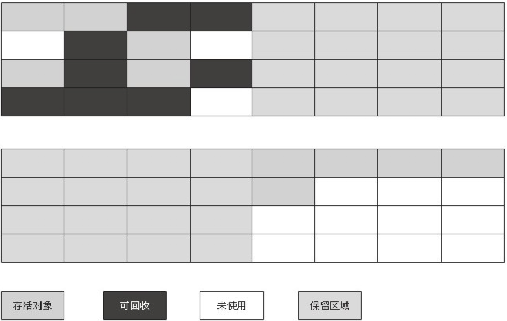

# 源码相关

- JDK常用类源码分析
  - 集合类
    - <details><summary>HashMap-JDK7</summary>

        #### 介绍
        ```
        实现原理是维护一个数组，存放元素时根据key的hash值获取数组位置并添加到该位置，如果发生冲突则用单链表解决
        默认大小为16，默认负载因子为0.75，发送扩容时容量扩大两倍
        ```
        
        #### 为什么HashMap-JDK7在并发下可能会死循环？
        ```
        由于rehash时是直接将元素放到新数组的元素头，这会使得rehash后链表元素顺序颠倒，并且如果两个线程同时rehash
        ，可能会导致某个数组元素的链表存在环，使得get该位置的元素导致死循环
        ```

        源码分析：[HashMap-JDK7](Java/Java源码阅读/集合类/HashMap-JDK7.md)
      </details>

    - <details><summary>HashMap-JDK8</summary>

        #### 介绍
        ```
        和JDK7的HashMap不同之处是引入了红黑树，默认情况下，当Map的key数量超过64时，如果某个数组的链表元素大于等
        于8，则将该链表转为红黑树。红黑树的结点也是双向链表的结点，红黑树的根结点总是双向链表的头结点，用双向链表的
        目的是在每次将单链表转换为红黑树后，数组的链表头可能不是红黑树的根结点，而每次需要访问该红黑树的时候都找一次
        root效率很低，所以在每次单链表转换完红黑树后会运行moveRootToFront方法，该方法将红黑树的root移动到数组的
        链表头，以便直接就能访问到。注意双向链表的顺序和红黑树的结点大小没有关系，唯一的关系是双向链表头等于红黑树的
        root，可以看treeifyBin方法的实现。
        ```

        源码分析：[HashMap-JDK8](Java/Java源码阅读/集合类/HashMap-JDK8.md)
      </details>
  - 并发类

- JVM相关
  - 垃圾回收算法
    - <details><summary>标记-清除</summary>

      #### 介绍
      ```
      算法分为“标记”和“清除“两个阶段：首先标记出所有需要回收的对象，在标记完成后统一回收所有被标记的对象。它的主要不足
      有两个：一个是效率问题，标记和清除两个过程的效率都不高；另一个是空间问题，标记清除之后会产生大量不连续的内存碎片，
      空间碎片太多可能会导致以后在程序运行过程中需要分配较大对象时，无法找到足够的连续内存而不得不提前触发另一次垃圾收集动作。 
      ```

      
    </details>

    - <details><summary>复制</summary>

      #### 介绍
      ```
      它将可用内存按容量划分为大小相等的两块，每次只使用其中的一块。当这一块的内存用完了，就将还存活着的对象复制到另外一
      块上面，然后再把已使用过的内存空间一次清理掉。这样使得每次都是对整个半区进行内存回收，内存分配时也就不用考虑内存碎
      片等复杂情况，只要移动堆顶指针，按顺序分配内存即可，实现简单，运行高效。只是这种算法的代价是将内存缩小为了原来的一半。 

      现在的商业虚拟机都采用这种收集算法来回收新生代，IBM公司的专门研究表明，新生代中的对象98%是“朝生夕死”的，所以并不需要
      按照1:1的比例来划分内存空间，而是将内存分为一块较大的Eden空间和两块较小的Survivor空间，每次使用Eden和其中一块Survivor。
      当回收时，将Eden和Survivor中还存活着的对象一次性地复制到另外一块Survivor空间上，最后清理掉Eden和刚才用过的Survivor空间。
      HotSpot虚拟机默认Eden和Survivor的大小比例是8:1，也就是每次新生代中可用内存空间为整个新生代容量的90%（80%+10%），
      只有10%的内存会被“浪费”。当然，98%的对象可回收只是一般场景下的数据，没有办法保证每次回收都只有不多于10%的对象存活，
      当Survivor空间不够用时，需要依赖其他内存(这里指老年代)进行分配担保(HandlePromotion)。如果另外一块Survivor空间没有足
      够空间存放上一次新生代收集下来的存活对象时，这些对象将直接通过分配担保机制进入老年代。
      ```

      
    </details>

    - <details><summary>标记-整理</summary>

      #### 介绍
      ```
      标记过程仍然与“标记-清除”算法一样，但后续步骤不是直接对可回收对象进行清理，而是让所有存活的对象都向一端移动，然后直接清理掉端边界以外的内存。 
      ```

      
    </details>

  - 安全点（SafePoint）
    - <details><summary>介绍</summary>

      程序并不是在所有的位置上都可以进行GC的，只有在达到这样的安全点才能暂停下来进行GC。
      一般会在如下几个位置选择安全点：
      - 循环的末尾 
      - 方法临返回前 / 调用方法的call指令后 
      - 可能抛异常的位置

      另外一个问题就是GC前需要让线程在安全点停下来，有两种方案：
      - 抢断式中断
      抢断式中断就是在GC的时候，让所有的线程都中断，如果这些线程中发现中断地方不在安全点上的，就恢复线程，让他们重新跑起来，直到跑到安全点上(现在几乎没有虚拟机采用这种方式)

      - 主动式中断
      主动式中断在GC的时候，不会主动去中断线程，仅仅是设置一个标志，当线程运行到安全点时就去轮训该位置，发现该位置被设置为真时就自己中断挂起。另外创建对象需要分配内存的地方也需要轮询该位置。
      安全点的使用似乎解决了OopMap计算的效率的问题，但是这里还有一个问题。安全点需要程序自己跑过去，那么对于那些已经停在路边休息或者看风景的程序（比如那些处在Sleep或者Blocked状态的线程），他们可能并不会在很短的时间内跑到安全点去。所以这里为了解决这个问题，又引入了安全区域的概念
      
      ### 安全区域（Safe Region）

      在程序的一段代码片段中并不会导致引用关系发生变化，也就不用去更新OopMap表了，那么在这段代码区域内任何地方进行GC都是没有问题的。这段区域就称之为安全区域。线程执行的过程中，如果进入到安全区域内，就会标志自己已经进行到安全区域了。那么虚拟机要进行GC的时候，发现该线程已经运行到安全区域，就不会管该线程的死活了。所以，该线程在脱离安全区域的时候，要自己检查系统是否已经完成了GC或者根节点枚举（这个跟GC的算法有关系），如果完成了就继续执行，如果未完成，它就必须等待收到可以安全离开安全区域的Safe Region的信号为止。
      </details>

  - 垃圾回收器
    - <details><summary>垃圾回收器之间的搭配</summary>

      ```
      下面展示了7种作用于不同分代的收集器，如果两个收集器之间存在连线，就说明它们可以搭配使用。虚拟机所处的区域，则表示它是属于新生代收集器还是老年代收集器。
      ```

      
      </details>

  - 调优与故障排查
    - <details><summary>打印GC日志</summary>

      ```
      可以使用以下参数打印GC日志：-XX:+PrintGCTimeStamps（打印GC停顿时间）、-XX:+PrintGCDetails（打印GC详细信息）、-verbose:gc（打印GC信息，输出内容已被前一个参数包括，可以不写）、-Xloggc:gc.log（GC日志路径）。
      ```
      </details>
  
  - 如何实现方法调用
    - <details><summary>方法调用字节码指令</summary>

      - invokestatic 调用静态方法，解析时方法即可确定
      - invokespecial 调用实例构造器<init>方法、私有方法和父类方法，解析时方法即可确定
      - invokevirtual 调用所有虚方法（final修饰的方法也用该指令调用，但是final方法不是虚方法）
      - invokeinterface 调用接口方法，在运行时确定一个实现此接口的对象
      - invokedynamic 运行时解析限定符所引用的方法，再调用

      解析调用是一个静态过程，编译期就能完全确定，在类装载的解析阶段就会把涉及的符号引用全部转为可确定的直接引用
      </details>

    - <details><summary>分派</summary>

      代码：
      ```
      Human man = new Man();
      Human woman = new Woman();
      ```

      上面代码的Human称为变量的静态类型，后面的Man和Woman为实际类型，静态类型和实际类型在程序中都有可能发生一些变化，
      区别是，静态类型的变化仅在使用时发生，变量本身的静态类型不会，并且最终的静态类型是编译期可知的，而实际类型在运行期
      才能确定，编译器在编译期间并不知道一个对象的实际类型是什么，如：
      ```
      // 实际类型变化
      Human man = new Man();
      man = new Woman();
      // 静态类型变化
      sr.sayHello((Man) man);
      sr.sayHello((Woman) man);
      ```
      - <details><summary>静态分派</summary>

        重载时是通过参数的静态类型作为绑定依据，并且静态类型时编译期可知的。编译器根据参数的静态类型决定使用哪个重载版本，并
        将方法的符号引用写到invokevirtual指令中。

        依赖静态类型来定位方法的执行版本的分派动作称为静态分派
        </details>
      
      - <details><summary>动态分派</summary>

        动态分派和重写有很密切的关联。虚拟机通过对象的实际类型分派重写方法的执行版本，使用的是invokevirtual指令实现多态，
        invokevirtual指令的多态查找过程是：
        1. 找到操作数栈顶的第一个元素所指向的对象的实际类型，记做C
        2. 如果在类型C中找到了invokevirtual指令的参数描述符相符的方法，则进行权限校验，通过则返回方法引用，否则返回IllegalAccessError
        3. 否则按照继承关系从下往上依次对C的各个父类进行第2步的搜索的验证过程
        4. 如果始终没找到，则抛出AbstractMethodError

        第一步在运行期间确定对象的实例类型，从而实现了多态。动态分派是非常频繁的动作，而动态分派的方法版本选择过程需要运行时在类的
        方法元数据中搜索合适的方法，为了性能考虑，通常会使用虚方法表（于此对应，invokeinterface指令也用到了接口方法表）来提高性
        能。虚方法表中存放了各个方法的实际入口，如果子类没有重写父类方法，那么子类的虚方法表中地址入口和父类相同方法的地址入口是
        一致的，都指向父类的实现入口，如果子类重写了父类方法，子类方法表中的地址会被替换为子类的实现版本入口。

        方法表一般在类加载的连接阶段初始化。
        </details>
      </details>

- 网络
  - TCP协议
    - <details><summary>三次握手，四次挥手的过程</summary>

      #### 三次握手
      1. 客户端发送连接请求，SYN标志位为1，seq = x
      2. 服务器回复，SYN，ACK标识位为1，seq = y，ack = x + 1
      3. 客户端回复，ACK标志位为1，seq = x + 1，ack = y + 1

      此后的数据传输过程ACK标志位都为1

      #### 数据传输
      1. 客户端发送数据包，seq = x + 1，ack = y + 1，len = m（数据长度）
      2. 服务器回复，seq = y + 1，ack = x + m + 1，len = n（数据长度）
      3. 客户端回复，seq = x + m + 1，ack = y + n + 1

      所以数据传输过程中，seq为x相当于表示这次发送的数据包最小序号是x，ack为y相等于表示已经确定序号y - 1及之前的包都以收到

      #### 四次挥手
      1. 客户端发送终止连接请求，FIN，ACK标志位为1，seq = x + m + 1， ack = y + n + 1，客户端发出后进入FIN_WAIT_1状态，服务器收到后进入CLOSE_WAIT状态
      2. 服务器回复，ACK标识位为1，seq = y + n + 1，ack = x + m + 1，客户端进收到后入FIN_WAIT_2状态
         1. 此时客户端到服务器方向的连接已断开，服务器还可以发送数据，服务器发送数据包，seq = y + n + 1，ack = x + m + 1，len = k
         2. 客户端回复，seq = x + m + 1，ack = y + n + 1 + k
      3. 服务器发送终止连接请求，FIN，ACK标志位为1，seq = y + n + 1 + k，ack = x + m + 1，服务器发出后进入LAST_ACK状态，客户端收到后进入TIME_WAIT状态
      4. 客户端回复，ACK标志位为1，seq = x + m + 1，ack = y + n + 1 + k，服务器收到后进入CLOSED状态
      5. 客户端发送最后一个ACK后等待2MSL后进入CLOSED状态，MSL是一个报文段最大生存时间，他是报文段被丢弃前在网络内的最长时间，RFC 793指出MSL为2分钟，但是一般实现中该时间为30秒或1分钟或2分钟
      </details>

    - <details><summary>为什么TIME_WAIT要等待2MSL才能结束</summary>

      1. 为了保证客户端发送的最后一个ACK报文段能够到达服务器。因为这个ACK有可能丢失，从而导致处在LAST-ACK状态的服务器收不到对FIN-ACK的确认报文。服务器会超时重传这个FIN-ACK，接着客户端再重传一次确认，重新启动时间等待计时器。最后客户端和服务器都能正常的关闭。假设客户端不等待2MSL，而是在发送完ACK之后直接释放关闭，一但这个ACK丢失的话，服务器就无法正常的进入关闭连接状态。

      2. 可以防止已失效的报文段。客户端在发送最后一个ACK之后，再经过经过2MSL，就可以使本链接持续时间内所产生的所有报文段都从网络中消失。从保证在关闭连接后不会有还在网络中滞留的报文段去骚扰服务器。
      </details>

    - <details><summary>如何尽量处理TIMEWAIT过多</summary>

      服务器尽量不主动关闭连接

      #### 编辑内核文件/etc/sysctl.conf，加入以下内容：
      ```
      net.ipv4.tcp_syncookies = 1 表示开启SYN Cookies。当出现SYN等待队列溢出时，启用cookies来处理，可防范少量SYN攻击，默认为0，表示关闭；
      net.ipv4.tcp_tw_reuse = 1 表示开启重用。允许将TIME-WAIT sockets重新用于新的TCP连接，默认为0，表示关闭；
      net.ipv4.tcp_tw_recycle = 1 表示开启TCP连接中TIME-WAIT sockets的快速回收，默认为0，表示关闭。
      net.ipv4.tcp_fin_timeout 修改系默认的 TIMEOUT 时间

      执行 /sbin/sysctl -p 让参数生效
      ```
      </details>

    - <details><summary>为什么需要三次握手</summary>

      #### 三次握手的目的：消除旧有连接请求的SYN消息对新连接的干扰，同步连接双方的序列号和确认号并交换TCP窗口大小信息
      ```
      设想：如果只有两次握手，那么第二次握手后服务器只向客户端发送ACK包，此时客户端与服务器端建立连接。在这种握手规则下：
      假设：如果发送网络阻塞，由于TCP/IP协议定时重传机制，C向S发送了两次SYN请求，分别是x1和x2，且因为阻塞原因，导致x1连接请求和x2连接请求的TCP窗口大小和报文段长度不一致，如果最终x1达到S，x2丢失，此时S同C建立了x1的连接，这个时候，因为C和S已经连接，C无法知道是请求x1还是请求x2同S连接（因为是由重传机制发送的x2，所以x1和x2的序号是一样的），如果C默认是最近的请求x2同S建立了连接，此时C开始向S发送数据，报文段长度为x2定义的长度，窗口大小为x2定义的大小，而S建立的连接是x1，其数据包长度大小为x1，TCP窗口大小为x1定义，这就会导致S处理数据时出错。
      很显然，如果S接收到C的请求后，S向C发送SYN请求y3（y3的窗口大小和报文段长度等信息为x1所定义），确认了连接建立的窗口大小和报文段长度为x1所定义，然后开始相互传送数据，那么就不会导致数据处理出错了。
      ```
      </details>

    - <details><summary>为什么需要四次挥手</summary>

      #### 需四次挥手原因：
      ```
      由于TCP的半关闭特性，TCP连接时双全工（即数据在两个方向上能同时传递），因此，每个方向必须单独的进行关闭。这个原则就是：当一方完成它的数据发送任务后就能发送一个FIN来终止这个方向上的连接。当一端收到一个FIN后，它必须通知应用层另一端已经终止了那个方向的数据传送。即收到一个FIN意味着不会再接收到对端的数据了（不是说对端不会再发送数据了，当对端主动断开连接后，本端继续发送数据，对端还是可以发送ACK），但是还是可以发送数据。
      ```
      </details>

    - <details><summary>滑动窗口、流量控制、慢启动和拥塞避免</summary>

      #### 滑动窗口与流量控制
      ```
      TCP通过滑动窗口的概念来进行流量控制。滑动窗口本质上是描述接受方的TCP报文段缓冲区大小的数据，发送方根据这个数据来计算自己最多能发送多长的数据。如果发送方收到接受方的窗口大小为0的TCP报文段，那么发送方将停止发送数据，等到接受方发送窗口大小不为0的报文段的到来（如果一直没有到来发送方也会定时发送询问包）。

      ACK包除了包含希望收到的下一个报文段的序号，还指定了接收方的窗口大小。发送方根据这两个信息结合自己的发送窗口，计算出还可以发送的字节数。

      对于TCP会话的发送方，任何时候在其发送缓存内的数据都可以分为4类，“已经发送并得到对端ACK的”，“已经发送但还未收到对端ACK的”，“未发送但对端允许发送的”，“未发送且对端不允许发送”。其中“已经发送但还未收到对端ACK的”和“未发送但对端允许发送的”这两部分数据称之为发送窗口。
      当收到接收方新的ACK对于发送窗口中后续字节的确认是，窗口向右滑动，如：
      ```
      
      ```
      对于TCP的接收方，在某一时刻在它的接收缓存内存在3种。“已接收”，“未接收准备接收”，“未接收并未准备接收”（由于ACK直接由TCP协议栈回复，默认无应用延迟，不存在“已接收未回复ACK”）。其中“未接收准备接收”称之为接收窗口。

      滑动窗口实现面向流的可靠性：
      1. 最基本的传输可靠性来源于“确认重传”机制。
      2. TCP的滑动窗口的可靠性也是建立在“确认重传”基础上的。
      3. 发送窗口只有收到对端对于本段发送窗口内字节的ACK确认，才会移动发送窗口的左边界。
      4. 接收窗口只有在前面所有的段都确认的情况下才会移动左边界。当在前面还有字节未接收但收到后面字节的情况下，窗口不会移动，并不对后续字节确认。以此确保对端会对这些数据重传。业转载请联系作者获得授权，非商业转载请注明出处。
      ```

      #### 慢启动
      ```
      滑动窗口能够让协议栈同时发送多个报文段，这样可以提高网络通信的效率，对于一些处理能力不佳的中间路由器，很可能会导致存储被耗尽的状况，从而严重降低了TCP连接的吞吐量，不断的重传. 非常的可怕， 介于此，引入了慢启动这个算法。

      慢启动为发送方的TCP增加了一个窗口：拥塞窗口，记为cwnd，，初始化之后慢慢增加这个cwnd的值来提升速度。同时也引入了ssthresh阈值（默认为65535字节），如果cwnd达到这个值会让cwnd的增长变得平滑，算法如下：
      1. 连接建好的开始先初始化cwnd = 1，表明可以传一个MSS大小的数据，发送方发出的报文段长度不能超过cwnd和发送窗口
      2. 每当收到一个ACK，cwnd++，呈线性上升，这使得每当过了一个RTT，cwnd = cwnd * 2; 呈指数上升，因为不考虑窗口大小的情况下，一个RTT理论上发送cwnd个字节，每个字节的ACK使cwnd + 1，所以一个RTT后cwnd翻倍
      3. 当cwnd >= ssthresh或发送超时或收到重复的ACK时，就会进入“拥塞避免算法”
      ```
      
      #### 拥塞避免
      ```
      从慢启动可以看到，cwnd可以比较快的增长，但是不能一直无限增长，需要某个限制，TCP使用了ssthresh的变量，当cwnd超过这个值或超时后，慢启动过程结束，进入拥塞避免阶段。拥塞避免的主要思想是加法增大，也就是让cwnd的值线性增加，此时当窗口中所有的报文段都被确认是，cwnd的大小才加1，cwnd的值随着RTT线性增加，这样就可以避免增长过快导致网络拥塞，慢慢的增加到网络的最佳值。算法：
      1. 收到一个ACK时，cwnd = cwnd + 1/cwnd，这相当于每过一个RTT时，cwnd = cwnd + 1，因为不考虑窗口大小的情况下，一个RTT理论上发送cwnd个字节，每个字节的ACK使cwnd + 1/cwnd，所以一个RTT后cwnd + 1
      ```
      </details>

    - <details><summary>快速恢复和快速重传</summary>

      当收到3个或3个以上重复的ACK后，不等待超时直接发送丢失的报文段，这就是快速重传算法。发送丢失的报文段后，执行的是拥塞避免算法而不是慢启动算法，这就是快速恢复

      #### 过程：
      1. 收到3个重复的ACK时，将ssthresh设置为当前拥塞窗口cwnd的一半，重传丢失的报文段，设置cwnd = ssthresh + 3 * 报文段大小
      2. 每收到另一个重复的ACK，cwnd + 1并发送1个分组（如果新的cwnd允许发送）
      3. 当收到下一个确认数据的ACK时，设置cwnd = ssthresh，这个ACK应该是在进行重传之后的一个往返时间内对步骤1中重传的确认，同时也是对多是的分组和收到的第一个重复的ACK之间的所有中间报文段的确认
      4. 设置cwnd = ssthresh，
      </details>