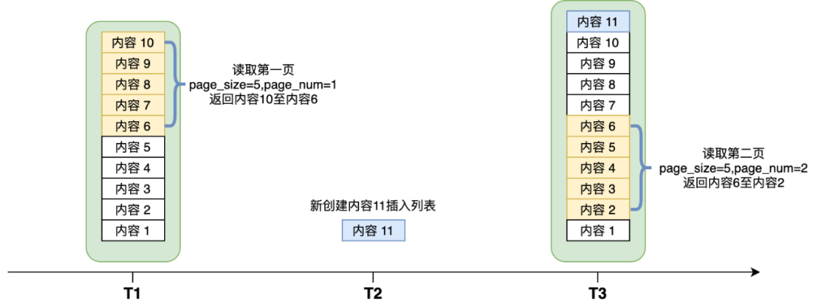

### 从关注页聊视频feed流推拉策略
你可以有很多的粉丝（followers），当你发布了一个视频，所有粉丝都会在一定的时间内收到你的视频，这一点有点像群发邮件，所有抄送者都会在一定时间内收到。同时你也可以关注其他用户，成为别他人的follower，那么别人发布新视频就可以在自己的关注feed里面看到，类似于把自己加到其他人的邮件抄送列表。

feed是一种信息格式，平台通过它将资讯传递给用户。feed是信息聚合的最小单元,每一条状态或者消息都是Feed，比如朋友圈中的一个动态就是一个Feed，一条短视频就是一个Feed。

feed流即持续更新并呈现给用户内容的信息流。每个人的朋友圈，微博关注页，快手的关注页等等都是一个Feed流。

#### 拉模式
最简单的方案：每个用户维护一个自己发布过的视频列表（redis zset），发布视频的时候添加到这个列表里。刷关注feed流的时候，首先获取用户所有关注的人，再去获取所有关注的人里最近发布的作品。作品id列表可以使用Redis存储，按照时间排序，查询的时候按照时间从timeline cache（视频列表）中，返回最多N个结果，下次读取的时候使用上次返回的timeline再返回[N+1, 2N]的结果。

拉模式存在比较严重的读放大的现象，因为要获取所有关注的人最近发布的视频，因此造成严重的性能问题和接口延迟。

拉模式的优势在于：
- 上传作品速度很快，每个用户的作品只需要存储一份，节省资源。
- 每个用户只需要写入自身feed数据，没有并发问题。

相对应的，拉模式的弊端在于：
- 读扩散，一个用户请求，需要获取所有关注的人的作品，例如，某个用户刷新关注页，需要读取用户关注的所有用户的视频列表，并且根据时间戳排序返回内容。读取效率比较底下。
- 访问热点问题，对于大V来说，存在所有粉丝的关注页列表里，对于大V作品的访问qps会非常高，对于key的访问流量非常不均匀。
- 拉取关注页feed流列表的业务流程非常复杂。
- 有多次数据访问，并且要进行大量的内存计算，网络传输，性能较低。

我们首先分析这种模式的重点在于，每个用户，需要获取所有关注的用户发布的作品，造成读请求被放大。那么我们是否可以在用户拉取关注feed之前，就将数据处理好呢？类似于一种空间换时间的思想，对于每个用户，都冗余一份关注视频数据。推模式，就是应用的这种思想。

#### 推模式
推模式（push）的方案是，每个用户维护一个关注视频列表（value为视频id），被关注者每发布一个视频，就将这个视频id插入该列表。

推模式在视频发布时，预先构建每个用户的关注视频列表，解决了feed流读取时的性能问题。用户刷新feed时，只需要读取自身的视频feed列表，速度非常快。但是这对于粉丝的视频列表存储压力非常大，并且，作品发布存在时间集中的特点，在发布视频的热门时段特别容易产生洪峰。虽然我们可以选择redis，memcache等性能较好的缓存，视频读取和写入的速度很快，但是如果推送量非常大，再好的存储系统也扛不住。同时推模式非常消耗存储资源，feed流数据会存储很多份。

推模式的优点在于：
- 通过冗余数据，用户读取feed流的时间非常快，利用空间换取了时间

相对应的，推模式的缺点也显而易见：
- 需要把每一个视频分发到所有粉丝的关注视频列表中，浪费资源，需要每个用户维护一份数据，
- 容易写扩散问题，视频分发性能压力大，延迟长，实时性不好。

#### 推拉结合
推模式的缺点在于写扩散问题，视频发布的时候，需要分发给所有的粉丝，用来保证读取feed流的性能，那么这里其实有个问题：是否真的需要把所有视频分发给所有的粉丝？分发给一部分粉丝是否也可以？

设想一下，是否可以对于大V用户选择特殊处理，而对于普通用户来说，因为粉丝数量比较小，不会产生太严重的写扩散和资源浪费问题。

feed存储分为两部分：
- 关注页面视频列表
- 个人发布视频列表

视频发布流程：
- 视频发布先进入一个消息队列
- 如果是普通用户发布视频，拉取视频作者的粉丝列表，逐个插入粉丝的关注视频列表里
- 如果是大V用户，结束流程

feed拉取流程：
- 先读取自身关注的大V列表
- 如果用户关注了20个大V，并发取获取这些大V最近发布的作品，需要20次访问。（时间戳为游标）
- 读取自身关注视频列表
- 和大V视频merge之后，按时间序返回

这种设计的优势是，将【推】模式屏蔽大V用户，降低了推模式产生的流量，节省了数据存储。然而这种模式，也有天然的缺陷，那就是热点问题，有可能导致所有的feed读取都出问题。原来该大V的视频feed只有活跃的粉丝会拉取，由于互联网的传播特性，有可能会发生超出几倍甚至几十倍的突发流量（参考微博的结婚梗），导致大V所在的节点迅速被打挂，节点不可用，进而导致该大V所有粉丝的关注页feed流都无法刷新。甚至读取大V视频模块服务cpu被打满，导致所有用户的读取请求都被卡死在读取大V视频服务中，导致整个feed读取不可用。

这里的设计需要关心以下几点：
- 单个大V节点的不可用，不应该影响其他节点的服务，单个模块的不可用，大V视频无法读取的时候，不应该影响非大V视频feed，也就是普通用户feed的读取。
- 当超过模块最大可用流量的时候，模块不应该不可用，应该使用限速限流等措施，使该模块提供最大能力的服务，超过部分的流量丢弃掉就好了。

当然，热点问题也有一些解决方案，例如：
- 对于热点内容实现预取，放到本机缓存中，读取的时候直接读本地内存，可以大大提升效率。
- 热点内容资源冗余，使用多活模式，均摊流量。

但是这种设计的feed读取流程异常复杂，需要解决大V用户和普通用户的热点问题，普通用户和大V用户的状态转换问题等，系统复杂性很高。另外，相比单纯的推模式，feed读取的分为自身关注视频列表和大V视频列表。关注了多少大V就需要多少次额外的访问。在关注数非常多的情况下，读取性能也会差一些。上述方案设计中，核心点在于使用大V和普通用户来划分推拉策略，其实业内比较成熟的做法是，使用活跃用户和非活跃用户的推拉方案。

即使是混合模式，每个阅读者所能关注的人数也要设置上限，例如新浪微博限制每个账号最多可以关注2000人。如果不设上限，设想一下有一位用户把微博所有账号全部关注了，那他打开关注列表会读取到微博全站所有帖子，一旦出现读扩散，系统必然崩溃；即使是写扩散，他的收件箱也无法容纳这么多的微博。

#### 推拉结合 - 活跃用户方案
在这个方案中，我们使用活跃用户/非活跃用户来区分使用推或者拉模式，对于活跃用户，使用推的模式，对于非活跃用户，使用拉的模式。活跃用户的判定是X天内，没有登陆即为非活跃用户。

视频发布流程：
- 每个用户维护一份关注视频列表（Redis存储）。
- 发布视频之后，获取粉丝列表，判断粉丝是否活跃，如果是活跃用户，添加视频id到粉丝关注视频列表中（每个用户最多500条）
- 如果是不活跃用户，标记该用户为不活跃（使用redis或者memcached存储），不再维护关注视频列表。

读取feed：
- 判断用户是否是活跃用户，如果是活跃用户，直接请求用户自身关注视频列表，返回结果即可。
- 如果是非活跃用户（走【拉】策略），首先获取该用户的关注列表，获取所有关注用户的最近发布的作品，
- （每个用户根据时间序，最多获取500条），并且构建该用户的关注视频列表（最多也是500条）。

只有非活跃用户才会使用【拉】策略，不活跃用户拉取视频feed的请求量比较小，仅首次刷新会执行构建流程，影响可控。

这种使用活跃用户-推拉结合的方案有哪些好处呢？
- 对比单纯【推】模式，省去了大量非活跃用户的视频推送，推送了也没人看，不仅节省了资源，而且加快了视频分发速度。
- 对比单纯【拉】模式，由于绝大部分用户访问都是活跃用户，而对于活跃用户的feed拉取，仅需要读取自身关注视频列表，性能极高。
- 对比大V普通用户-推拉结合方案，第一，每个用户存储了一份视频资源，解决了视频热点问题。第二，省去了大V用户的多次访问，提高了性能。

活跃用户方案的唯一缺点在于，非活跃用户首次拉取feed时候，需要一次耗时较长的视频列表构建过程，对于这个问题，我们可以合理设置非活跃用户的判定条件，将这部分用户比例尽可能缩小，或者使用客户端预先触发构建过程等方案。

#### Feed流中的分页问题
不管是读扩散还是写扩散，Feed流本质上是一个动态列表，列表内容会随着时间不断变化。传统的前端分页参数使用page_size和page_num，分表表示每页几条，以及当前是第几页。对于一个动态列表会有如下问题：在T1时刻读取了第一页，T2时刻有人新发表了“内容11”，在T3时刻如果来拉取第二页，会导致错位出现，“内容6”在第一页和第二页都被返回了。事实上，但凡两页之间出现内容的添加或删除，都会导致错位问题。

为了解决这一问题，通常Feed流的分页入参不会使用page_size和page_num，而是使用last_id来记录上一页最后一条内容的id。前端读取下一页的时候，必须将last_id作为入参，后台直接找到last_id对应数据，再往后偏移page_size条数据，返回给前端，这样就避免了错位问题。

采用last_id的方案有一个重要条件，就是last_id本身这条数据不可以被硬删除。设想一下上图中T1时刻返回5条数据，last_id为内容6；T2时刻内容6被发布者删除；那么T3时刻再来请求第二页，我们根本找不到last_id对应的数据了，也就无法确认分页偏移量。通常碰到删除的场景，我们采用软删除方式，只是在内容上置一个标志位，表示内容已删除。由于已经删除的内容不应该再返回给前端，因此软删除模式下，找到last_id并往后偏移page_size条，如果其中有被删除的数据会导致获得不到足够的数据条数给前端。这里一个解决方案是找不够继续再往下找，另一种方案是与前端协商，允许返回条数少于page_size条，page_size只是个建议值。甚至大家约定好了以后，可以不要page_size参数。

